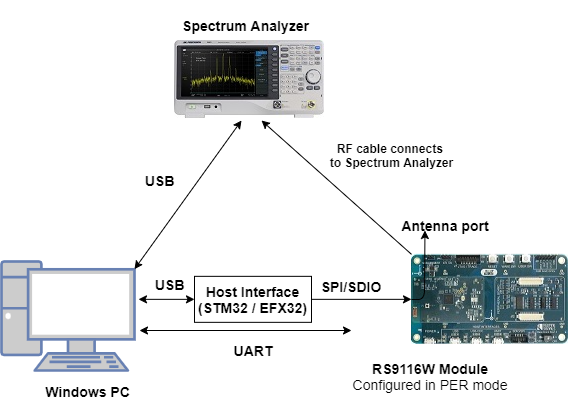
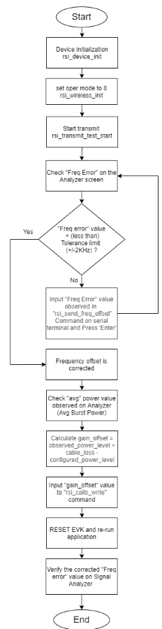
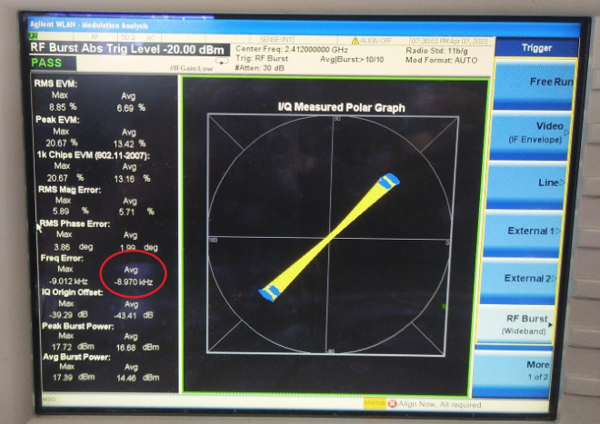
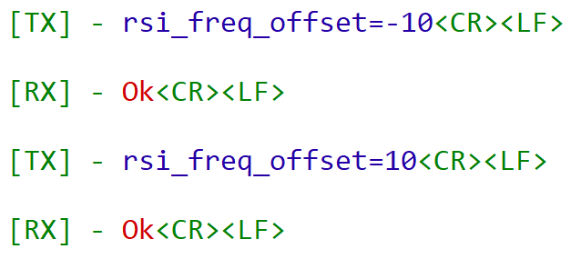
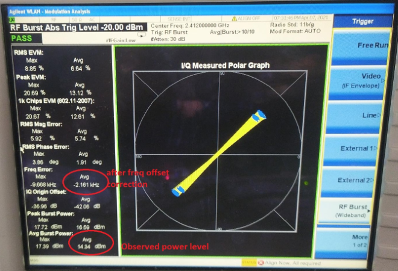

# Calibration

## 1. Purpose / Scope

This application demonstrates the procedure to calibrate the carrier frequency offset, Tx gain offset and few more parameters and update them to the Flash/Efuse. Customers need to calibrate these two parameters on their platforms after chip integration.

## 2. Prerequisites / Setup Requirements

Before running the application, the user will need the following things to setup.

### 2.1 Hardware Requirements

* Windows PC with Host interface (UART/ SPI/ SDIO).
* Silicon Labs [RS9116 Wi-Fi Evaluation Kit](https://www.silabs.com/development-tools/wireless/wi-fi/rs9116x-sb-evk-development-kit)
* Host MCU Eval Kit. This example has been tested with:
  - Silicon Labs [WSTK + EFR32MG21](https://www.silabs.com/development-tools/wireless/efr32xg21-bluetooth-starter-kit)
  - Silicon Labs [WSTK + EFM32GG11](https://www.silabs.com/development-tools/mcu/32-bit/efm32gg11-starter-kit)
  - [STM32F411 Nucleo](https://st.com/)
*  Spectrum Analyzer
*  RF Cable connects between EVK and Spectrum Analyzer.



### 2.2 Software Requirements

- [WiSeConnect SDK](https://github.com/SiliconLabs/wiseconnect-wifi-bt-sdk/)

- Embedded Development Environment.

   - For STM32, use licensed [Keil IDE](https://www.keil.com/demo/eval/arm.htm)
 
   - For Silicon Labs EFx32, use the latest version of [Simplicity Studio](https://www.silabs.com/developers/simplicity-studio).

- Python 3 installation

### 2.3 Flowchart for Calibration Process



## 3. Application Build Environment

### 3.1 Platform

The Application can be built and executed on below Host platforms
* [STM32F411 Nucleo](https://st.com/)
* [WSTK + EFR32MG21](https://www.silabs.com/development-tools/wireless/efr32xg21-bluetooth-starter-kit) 
* [WSTK + EFM32GG11](https://www.silabs.com/development-tools/mcu/32-bit/efm32gg11-starter-kit)

### 3.2 Host Interface

* By default, the application is configured to use the SPI bus for interfacing between Host platforms(STM32F411 Nucleo / EFR32MG21) and the RS9116W EVK.
* This application is also configured to use the SDIO bus for interfacing between Host platforms(EFM32GG11) and the RS9116W EVK.

### 3.3 Project Configuration

The Application is provided with the project folder containing Keil and Simplicity Studio project files.

* Keil Project
  - The Keil project is used to evaluate the application on STM32.
  - Project path: `<SDK>/examples/snippets/wlan/calibration_app/projects/calibration_app-nucleo-f411re.uvprojx`

* Simplicity Studio
  - The Simplicity Studio project is used to evaluate the application on EFR32MG21.
  - Project path: 
    - If the Radio Board is **BRD4180A** or **BRD4181A**, then access the path `<SDK>/examples/snippets/wlan/calibration_app/projects/calibration_app-brd4180a-mg21.slsproj`
    - If the Radio Board is **BRD4180B** or **BRD4181B**, then access the path `<SDK>/examples/snippets/wlan/calibration_app/projects/calibration_app-brd4180b-mg21.slsproj`
    - User can find the Radio Board version as given below 

 

  - EFM32GG11 platform
    - The Simplicity Studio project is used to evaluate the application on EFM32GG11.
      - Project path:`<SDK>/examples/snippets/wlan/calibration_app/projects/calibration_app-brd2204a-gg11.slsproj`

### 3.4 Bare Metal/RTOS Support

This application supports bare metal and RTOS environment. By default, the application project files (Keil and Simplicity studio) are provided with bare metal configuration in the SDK.

## 4. Application Configuration Parameters

The application can be configured to suit user requirements and development environment. Read through the following sections and make any changes needed.

### 4.1 Open rsi_calib_app.c file. The desired parameters are provided below. User can also modify the parameters as per their needs and requirements.

To set TX power in dBm. The valid values are from 2dbm to 18dbm for WiSeConnectTM module.

```c
#define RSI_TX_TEST_POWER                         18
```
  
To set transmit data rate.

```c
#define RSI_TX_TEST_RATE                          RSI_RATE_1
```
   
To configure length of the TX packet. Valid values are in the range of 24 to 1500 bytes in the burst mode and range of 24 to 260 bytes in the continuous mode.

```c
#define RSI_TX_TEST_LENGTH                        1000 
```
   
To configure Burst mode or Continuous mode

```c
#define RSI_TX_TEST_MODE                           RSI_BURST_MODE
```
   
To configure the channel number in 2.4 GHz or 5GHz. Here mention the channel number. For example user wants to given channel 1 in 2.4 GHz

```c
#define RSI_TX_TEST_CHANNEL                       1
```
   
To select internal antenna or UFL connector

```c
#define RSI_ANTENNA                               0
```

> **Note:** RSI_ANTENNA value should be set to 0 for Single Band module and 1 for Dual Band module

To select antenna gain in db for 2.4GHz band. Valid values are from 0 to 10.

```c
#define RSI_ANTENNA_GAIN_2G                       0
```

To select antenna gain in db for 5GHz band. Valid values are from 0 to 10.

```c
#define RSI_ANTENNA_GAIN_5G                       0
```

### 4.2 Open rsi_wlan_config.h file. User can also modify the below parameters as per their needs and requirements.

```c
#define CONCURRENT_MODE                           RSI_DISABLE
#define RSI_FEATURE_BIT_MAP                       FEAT_SECURITY_OPEN
#define RSI_TCP_IP_BYPASS                         RSI_DISABLE
#define RSI_TCP_IP_FEATURE_BIT_MAP                TCP_IP_FEAT_DHCPV4_CLIENT
#define RSI_CUSTOM_FEATURE_BIT_MAP                0
#define RSI_BAND                                  RSI_BAND_2P4GHZ
```

## 5. Testing the Application

Follow the steps below for the successful execution of the application. 

### 5.1 Loading the RS9116W Firmware

Refer [Getting started with a PC](https://docs.silabs.com/rs9116/latest/wiseconnect-getting-started) to load the firmware into RS9116W EVK. The firmware file is located in `<SDK>/firmware/`


### 5.2 Building the Application on Host Platform

#### 5.2.1 Using STM32

Refer [Getting started with STM32](https://docs.silabs.com/rs9116-wiseconnect/latest/wifibt-wc-getting-started-with-stm32/)

- Open the project `<SDK>/examples/snippets/wlan/calibration_app/projects/calibration_app-nucleo-f411re.uvprojx`
- Build and Debug the project
- Check for the RESET pin:
  - If RESET pin is connected from STM32 to RS9116W EVK, then user need not press the RESET button on RS9116W EVK before free run.
  - If RESET pin is not connected from STM32 to RS9116W EVK, then user need to press the RESET button on RS9116W EVK before free run.
- Free run the project
- Then continue the common steps from **5.3**

#### 5.2.2 Using EFX32

Refer [Getting started with EFX32](https://docs.silabs.com/rs9116-wiseconnect/latest/wifibt-wc-getting-started-with-efx32/), for settin-up EFR & EFM host platforms

- Open Simplicity Studio and import theEFR32/EFM32 project from `<SDK>/examples/snippets/wlan/calibration_app/projects`
    - Select the appropriate .slsproj as per Radio Board type mentioned in **Section 3.3** for EFR32 board.
   (or)
    - Select the *.brd2204a-gg11.slsproj  for EFM32GG11 board.
- Compile and flash the project in to Host MCU
- Debug the project
- Check for the RESET pin:
  - If RESET pin is connected from STM32 to RS9116W EVK, then user need not press the RESET button on RS9116W EVK before free run
  - If RESET pin is not connected from STM32 to RS9116W EVK, then user need to press the RESET button on RS9116W EVK before free run
- Free run the project
- Then continue the common steps from **5.3**

### 5.3 Common Steps

1. Make connections as per setup diagram (above) and set the appropriate settings on the Spectrum Analyzer by using the steps mentioned in below **Spectrum Analyzer Settings**.

2. After the program gets executed, the RS9116W device will start the transmit test with the given configuration.

3. Refer the below image which shows when RS9116W device transmits packets in Burst mode with different Tx power and different transmission rates in channel 1 with length 1000bytes.

   ```sh 
   RSI_TX_TEST_POWER    - 18dBm
   RSI_TX_TEST_RATE     - 1Mbps
   RSI_TX_TEST_LENGTH   - 1000
   RSI_TX_TEST_MODE     - BURST mode
   RSI_TX_TEST_CHANNEL  - 1 
   ```

4. Observe the Avg Freq Error (highlighted) on the screen and now try to adjust the frequency offset by using CLI commands with serial terminal (Docklight or Teraterm)
   



### Frequency Offset Correction

Frequency offset correction will be done by using the rsi_freq_offset command. This command is used during the RF calibration process and requires PER mode transmissions to be initiated prior. This command sends freq_offset (deviation) as observed on the signal analyzer against the expected channel frequency.

   
Prototype :  
> `rsi_freq_offset = freq_offset_in_khz <CR><LF>`  
> 
> Here freq_offset_in_khz means Frequency deviation in KHz or ppm
   
   
Examples :
> `rsi_freq_offset=10<CR><LF>`
>
> `rsi_freq_offset=-10<CR><LF>` 



> **Note:** User can use the above command for any number of times till it gets tuned to desired frequency offset.

Open the serial terminal (Docklight/TeraTerm tool) and enter the following commands. User can provide input to correct frequency offset by sending the commands on console. This should lead towards a correction in the frequency offset as observed earlier and repeat till the error is within the tolerance limits (+/- 2 KHz tolerance limits).

See the below picture after frequency offset correction.



> **Note:** freq_offset_in_khz can be either +ve or -ve. When user enters the freq offset as observed on signal analyzer (+ve/-ve), a small freq offset correction is done. User needs to iterate this till the freq offset is within tolerance limits.


### Gain Offset Correction:

#### Update XO Ctune and Gain Offset

Using rsi_calib_write command the calibrated XO Ctune and calculated gain offset can be updated to target memory (Flash/Efuse).

   ```sh
   Prototype :
   rsi_calib_write=<target>,<flags>,<gain_offset>,<xo_ctune>
   ```

Gain offset can be calculated using the following equation :

   gain_offset = observed_power_level + cable_loss - configured_power_level

Example :

   gain_offset = 14.3 + 1.7 (assuming) - 18 = -2 dBm

This command writes to Flash, gain offset as -2 dBm and XO Ctune value as it reads from hardware.
 
To update gain offset as -2 dBm and xo ctune as per the value in hardware register into flash use the command below.

   `rsi_calib_write=1,3,-2 <CR><LF>`

> NOTE : 
> The gain_offset can be negative but not a floating value.
> Once the frequency offset is corrected after multiple tries, rsi_calib_write commands has to be given once for all to write the values to flash.

**Parameters**

   | Parameter  | Description |                 |          |
   | :---       | :---        | :---            | :---     |
   | target     | Value       | Macro         | Description |
   |            |   0       | BURN_INTO_EFUSE | Burns calibration data to EFuse |
   |            | 1       | BURN_INTO_FLASH | Burns calibration data to Flash |
   | flags      |  BIT        | Macro         | Description |
   |            | 0       | BURN_GAIN_OFFSET| 1 - Update gain offset to calibration data |
   |            |             |                 | 0 - Skip gain offset update |
   |            | 1       | BURN_FREQ_OFFSET| 1 - Update XO Ctune to calibration data |
   |            |             |                 | 0 - Skip XO Ctune update |
   |            | 2       | SW_XO_CTUNE_VALID | 1- Use XO Ctune provided as argument to update calibration data |
   |            |             |                  | 0 -Use XO Ctune value as read from hardware register. |
   |            | 7 -3      |                |   Reserved |
   |gain_offset | gain offset as observed in dBm |    |     |  
   | xo_ctune   | This field allows user to directly update xo_ctune \n value to calibration data bypassing the freq \n offset loop, valid only when \n BURN_FREQ_OFFSET & SW_XO_CTUNE_VALID \n of flags is set. |   |   |

**Precondition:**
rsi_freq_offset command needs to be called before this command when xo ctune value from hardware register is to be used.


### Spectrum Analyzer Settings
**Below are setting necessary to see Polar Graph Spectrum Analyzer settings**
1. Frequency channel → center frequency→ 2412MHz for channel1.

2. SpanX scale → span→ 50MHz

3. Mode → WLAN → Mode setup → Radio Std → 802.11a/b/g → 802.11 b/g

4. Trigger → RF Burst

The frequency error section shows the amount of error that needs to be adjusted. Using freq_offset API and Calib_write API user should be able to adjust the frequency error.


### Acronyms and Abbreviations

| Acronym   | Description |
| :----  | :----  | 
| TX      | Transmit       |
|RX | Receive |
|RF | Radio Frequency |
|WLAN | Wireless Local Area Network |
|XO | Crystal Oscillator |
|Ctune| Captune |
|Q7 | Single band RS9116 EVK |
|A7 | Dual band RS9116 EVK |

## Compressed Debug Logging

To enable the compressed debug logging feature please refer to [Logging User Guide](https://docs.silabs.com/rs9116-wiseconnect/latest/wifibt-wc-sapi-reference/logging-user-guide)