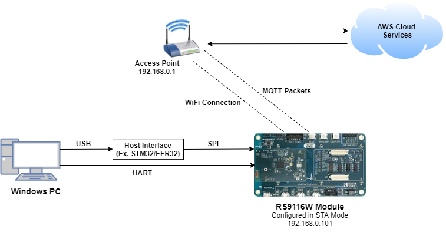
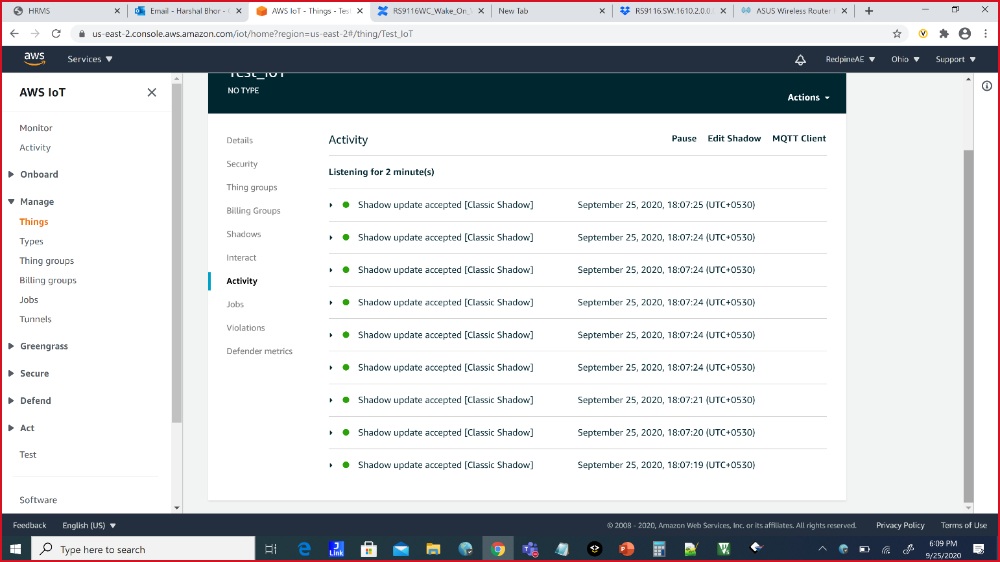
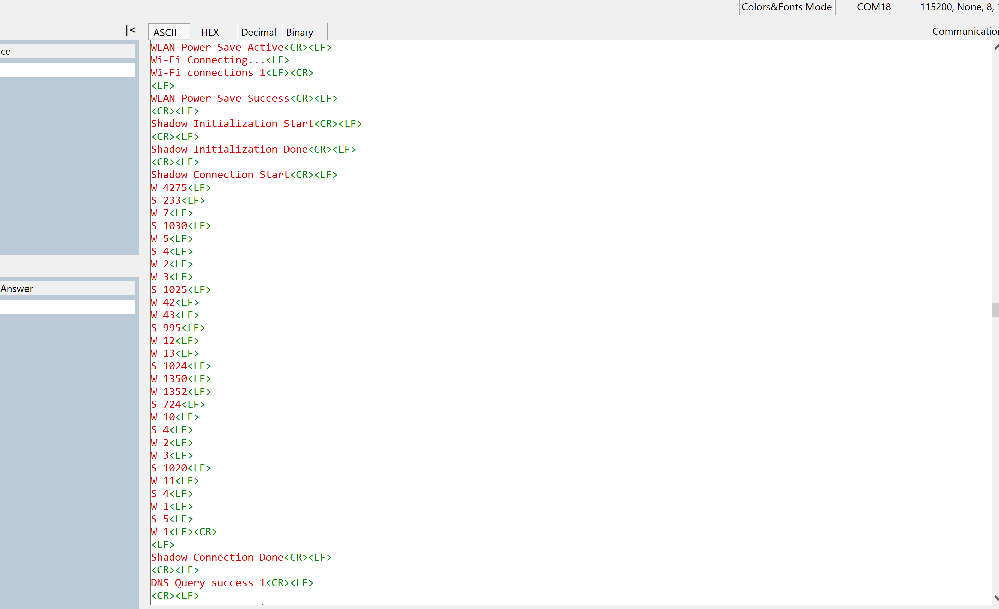
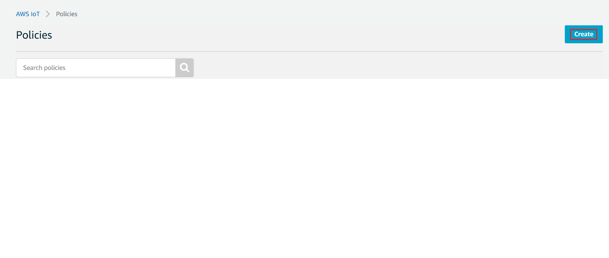
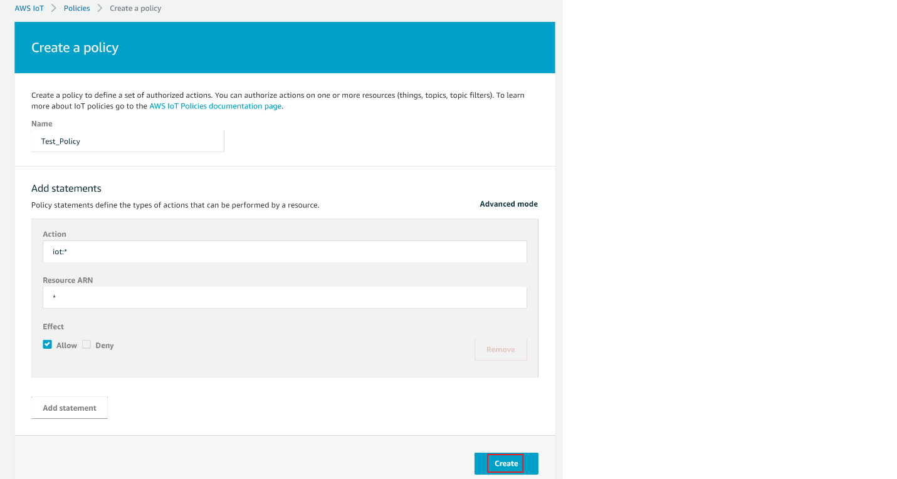

# AWS Device Shadow Logging Stats

## 1. Purpose / Scope

This application demonstrates how to configure RS9116 as an IoT device and securely connect to AWS IoT Core to subscribe and publish to a topic.

A device’s shadow is a persistent, virtual representation of the device that can be interacted with from AWS IoT Core even if the device is offline.
The device state is captured in its "shadow" is represented as a JSON document.
The device can send commands over MQTT to get, update and delete its latest state as well as receive notifications over MQTT about changes in its state.

Application will subscribe to shadow update topics :
$aws/things/thingName/shadow/name/shadowName/update/accepted
$aws/things/thingName/shadow/name/shadowName/update/rejected
$aws/things/thingName/shadow/name/shadowName/update/delta

Application publishes data on topic $aws/things/thingname/shadow/update, with new room temperature and the same will be reflected in AWS cloud.

Application calculates the powersave statistics of Wakeup and Sleep times and this data will be displayed in the communication port.

## Overview of AWS SDK

AWS IoT Core is a cloud platform which connects devices across AWS cloud services. AWS IoT provides a interface which allows the devices to communicate securely and reliably in bi-directional ways to the AWS touch-points, even when the devices are offline.

The AWS IoT Device SDK allow applications to securely connect to the AWS IoT platform.

   

## 2. Prerequisities / Setup Requirements

Before running the application, the user will need the following things to setup.

### 2.1 Hardware Requirements 
  
* Windows PC with Host interface (UART/ SPI). 
* Silicon Labs [RS9116 Wi-Fi Evaluation Kit](https://www.silabs.com/development-tools/wireless/wi-fi/rs9116x-sb-evk-development-kit)
* Host MCU Eval Kit. This example has been tested with:
  - Silicon Labs [WSTK + EFR32MG21](https://www.silabs.com/development-tools/wireless/efr32xg21-bluetooth-starter-kit)
  - [STM32F411 Nucleo](https://st.com/)
* Wireless Access point



### 2.2 Software Requirements

- [WiSeConnect SDK](https://github.com/SiliconLabs/wiseconnect-wifi-bt-sdk/)

- Embedded Development Environment
  
   - For STM32, use licensed [Keil IDE](https://www.keil.com/demo/eval/arm.htm) 
   - For Silicon Labs EFx32, use the latest version of [Simplicity Studio](https://www.silabs.com/developers/simplicity-studio).

- [Amazon AWS](https://aws.amazon.com/) account

- Python 3 installation

## 3. Application Build Environment

### 3.1 Platform

The Application can be built and executed on below Host platforms
* [STM32F411 Nucleo](https://st.com/)
* [WSTK + EFR32MG21](https://www.silabs.com/development-tools/wireless/efr32xg21-bluetooth-starter-kit) 

### 3.2 Host Interface

- By default, the application is configured to use the SPI bus for interfacing between Host platforms and the RS9116W EVK.
- The SAPI driver provides APIs to enable other host interfaces if SPI is not suitable for your needs.

### 3.3 Project Configuration

The Application is provided with the project folder consists of Keil and Simplicity studio (ssl) project files.

*  Keil project :

   - The Keil can be executed on STM32 platform.

   - Project Path : `<SDK>\examples\snippets\wlan\cloud_apps\aws_iot\device_shadow_logging_stats\projects\device_shadow_logging_stats-nucleo-f411re.uvprojx`

* Simplicity Studio :

   - The Simplicity Studio project can be executed on EFR32MG21.

   - Project Path : 
    - If the Radio Board is **BRD4180A** or **BRD4181A**, then access the path `<SDK>\examples\snippets\wlan\cloud_apps\aws_iot\device_shadow_logging_stats\projects\device_shadow_logging_stats-brd4180a-mg21.slsproj`
    - If the Radio Board is **BRD4180B** or **BRD4181B**, then access the path `<SDK>\examples\snippets\wlan\cloud_apps\aws_iot\device_shadow_logging_stats\projects\device_shadow_logging_stats-brd4180b-mg21.slsproj`

  - EFM32GG11 platform
    - The Simplicity Studio project is used to evaluate the application on EFM32GG11.
      - Project path:`<SDK>/examples/snippets/wlan/cloud_apps\aws_iot\mqtt/projects/aws_iot_mqtt-brd2204a-gg11.slsproj`
### 3.4 Bare Metal/RTOS Support

This application supports bare metal and RTOS environment. By default, the application project files (Keil and Simplicity studio) are provided with bare metal configuration in the SDK. 


## 4. Application Configuration Parameters

The application can be configured to suit user requirements and development environment. Read through the following sections and make any changes needed.

### 4.1 Open device_shadow_logging_stats.c file

#### 4.1.1 User must update the below parameters  

SSID refers to the name of the Access point.

```c
#define SSID                           "SILABS_AP"
```

SECURITY_TYPE refers to the type of security. In this application STA supports Open, WPA-PSK, WPA2-PSK securities.

   Valid configuration is:

   - RSI_OPEN - For OPEN security mode

   - RSI_WPA - For WPA security mode

   - RSI_WPA2 - For WPA2 security mode

```c
#define SECURITY_TYPE                   RSI_WPA2
```

PSK refers to the secret key if the Access point configured in WPA-PSK/WPA2-PSK security modes.

```c
#define PSK                             "1234567890"
```

To configure IP address

   DHCP_MODE refers whether IP address configured through DHCP or STATIC

```c
#define DHCP_MODE                        1
```
> Note:
> If user wants to configure STA IP address through DHCP then set DHCP_MODE to "1" and skip configuring the following DEVICE_IP, GATEWAY and NETMASK macros.
> (Or)
> If user wants to configure STA IP address through STATIC then set DHCP_MODE macro to "0" and configure following DEVICE_IP, GATEWAY and NETMASK macros.

The IP address needs to be configuring to the RS9116W EVk should be in long format and in little endian byte order.

   Example: To configure "192.168.10.10" as IP address, update the macro DEVICE_IP as 0x0A0AA8C0.

```c
#define DEVICE_IP                        0X0A0AA8C0
```

IP address of the gateway should also be in long format and in little endian byte order

   Example: To configure "192.168.10.1" as Gateway, update the macro GATEWAY as 0x010AA8C0

```c
#define GATEWAY                          0x010AA8C0
```

IP address of the network mask should also be in long format and in little endian byte order.

   Example: To configure "255.255.255.0" as network mask, update the macro NETMASK as 0x00FFFFFF

```c
#define NETMASK                          0x00FFFFFF
```

### 4.2 Open rsi_wlan_config.h file. User can also modify the below parameters as per their needs and requirements.


```c
#define CONCURRENT_MODE                  RSI_DISABLE
#define RSI_FEATURE_BIT_MAP              FEAT_SECURITY_OPEN
#define RSI_TCP_IP_BYPASS                RSI_DISABLE
#define RSI_TCP_IP_FEATURE_BIT_MAP       (TCP_IP_FEAT_DHCPV4_CLIENT|TCP_IP_FEAT_SSL |TCP_IP_FEAT_DNS_CLIENT)
#define RSI_CUSTOM_FEATURE_BIT_MAP       FEAT_CUSTOM_FEAT_EXTENTION_VALID
#define RSI_EXT_CUSTOM_FEATURE_BIT_MAP   (EXT_FEAT_256K_MODE | BIT(1) | BIT(3) | BIT(27))
#define RSI_BAND                         RSI_BAND_2P4GHZ
```

### 4.3 Configure Below Parameters in aws_iot_config.h File
   
   ```c
   //AWS Host name 
   #define AWS_IOT_MQTT_HOST          "xxxxxxxxxxxxx-ats.iot.us-east-2.amazonaws.com"  

   //default port for MQTT
   #define AWS_IOT_MQTT_PORT          "8883"

   // MQTT client ID should be unique for every device  
   #define AWS_IOT_MQTT_CLIENT_ID     "Test_IoT"

   // Thing Name of the Shadow this device is associated with 
   #define AWS_IOT_MY_THING_NAME      "Test_IoT"  
   ```
 
### 4.4 Setting up Security Certificates

To authenticate and securely connect with AWS, your Wi-Fi device requires a unique x.509 security certificate and private key, as well as a CA certificate which is used to verify the AWS server. Security credentials need to be converted into a C-array rather than [PEM format](https://en.wikipedia.org/wiki/Privacy-Enhanced_Mail) provided by AWS; they also need to be added to your project. 

The WiSeConnect SDK provides a conversion script (written in Python 3) to make the conversion straightforward. The script is provided in the SDK 'resources' directory and is called [certificate_to_array.py](https://github.com/SiliconLabs/wiseconnect-wifi-bt-sdk/tree/master/resources/certificates/).

To convert the device certificate and private key to C arrays, open a system command prompt and use the script as indicated in the following examples.

```sh
$> python3 certificate_to_array.py <input filename> <output arrayname>

For example:
$> python3 certificate_to_array.py d8f3a44d3f.cert.pem    aws_client_certificate
$> python3 certificate_to_array.py d8f3a44d3f.private.key aws_client_private_certificate
```

After running the script on the certificate and private key, two new files are created.

```sh
aws_client_certificate.pem.crt.h
aws_client_private_key.pem.key.h
```

Before proceeding, copy both of the new files to the WiSeConnect directory: `<SDK>/resources/certificates`  
Go ahead and overwrite any existing files with the same name in that directory, the originals are not needed.

The Root CA certificate used by your Wi-Fi device to verify the AWS server is already included in the WiSeConnect SDK; no additional setup is required.
For reference, Amazon uses [Starfield Technologies](https://www.starfieldtech.com/) to secure the AWS website, the WiSeConnect SDK includes the [Starfield CA Certificate](https://github.com/SiliconLabs/wiseconnect-wifi-bt-sdk/tree/master/resources/certificates/aws_starfield_ca.pem.h).


> NOTE :
> For AWS connectivity, StarField Root CA Class 2 certificate has the highest authority being at the top of the signing hierarchy.
>
> The StarField Root CA Class 2 certificate is an expected/required certificate which usually comes pre-installed in the operating systems and it plays a key part in certificate chain verification when a device is performing TLS authentication with the IoT endpoint.
>
> On RS9116 device, we do not maintain root CA trust repository due to memory constraints, so it is mandatory to load StarField Root CA Class 2 certificate for successful mutual authentication to AWS server.
>
> The certificate chain sent by AWS server is as below:
> id-at-commonName=Amazon,id-at-organizationalUnitName=Server CA 1B,id-at-organizationName=Amazon,id-at-countryName=US
> id-at-commonName=Amazon Root CA 1,id-at-organizationName=Amazon,id-at-countryName=US
> id-at-commonName=Starfield Services Root Certificate Authority ,id-at-organizationName=Starfield Technologies, Inc.,id-at-localityName=Scottsdale,id-at-  stateOrProvinceName=Arizona,id-at-countryName=US)
>
> On RS9116 to authenticate the AWS server, firstly Root CA is validated (validate the Root CA received with the Root CA loaded on the device). Once the Root CA is validation is successful , other certificates sent from the AWS server are validated.
> RS9116 don't authenticate to AWS server if intermediate CA certificates are loaded instead of StarField Root CA Class 2 certificate and would result in Handshake error.
> StarField Root CA Class 2 certificate is at https://certs.secureserver.net/repository/sf-class2-root.crt
>
> Reference links :
> https://aws.amazon.com/blogs/security/how-to-prepare-for-aws-move-to-its-own-certificate-authority/

## 5. Testing the Application

Follow the steps below for the successful execution of the application.

### 5.1 Loading the RS9116W Firmware

Refer [Getting started with a PC](https://docs.silabs.com/rs9116/latest/wiseconnect-getting-started) to load the firmware into RS9116W EVK.

The firmware file is located in `<SDK>/firmware/`


### 5.2 Building the Application on Host Platform

#### 5.2.1 Using STM32

Refer [Getting started with STM32](https://docs.silabs.com/rs9116-wiseconnect/latest/wifibt-wc-getting-started-with-stm32/)

- Configure STM32 CN10 header pin-30(PB13) should connect to UULP_GPIO_0 and STM32 pin-2 should connect to UULP_GPIO_2.
- Open the project `<SDK>\examples\snippets\wlan\cloud_apps\aws_iot\device_shadow_logging_stats\projects\device_shadow_logging_stats-nucleo-f411re.uvprojx` 
- Build and debug the project.
- Check for the RESET pin:
  - If RESET pin is connected from STM32 to RS9116W EVK, then user need not press the RESET button on RS9116W EVK before Free run.
  - If RESET pin is not connected from STM32 to RS9116W EVK, then user need to press the RESET button on RS9116W EVK before Free run.
- Free run the project.
- Then continue the common steps from **Section 5.3**


#### 5.2.2 Using EFX

Refer [Getting started with EFX32](https://docs.silabs.com/rs9116-wiseconnect/latest/wifibt-wc-getting-started-with-efx32/), for settin-up EFR & EFM host platforms


- Configure EFX32 pin-9(PD03/PB01 GPIO) should connect to UULP_GPIO_0 and EVFX32 pin-7(PD02/PB00 GPIO) should connect to UULP_GPIO_2.
- Open Simplicity Studio and import the project `<SDK>\examples\snippets\wlan\cloud_apps\aws_iot\device_shadow_logging_stats\project`
-  Select the appropriate .slsproj as per the Radio Board type mentioned in **Section 3.3**
- Compile and flash the project in to Host MCU
- Debug the project
- Check for the RESET pin:
  - If RESET pin is connected from EFX32 to RS9116W EVK, then user need not press the RESET button on RS9116W EVK before free run
  - If RESET pin is not connected from EFX32 to RS9116W EVK, then user need to press the RESET button on RS9116W EVK before free run
- Free run the project
- Then continue the common steps from **Section 5.3**

### 5.3 Common Steps

1. Configure the Access point with Internet connection in OPEN/WPA-PSK/WPA2-PSK mode to connect module in STA mode.

2. Configure the application with the configurations mentioned in **Section 4**. Log in to AWS console and open the THING created in console [ Refer to Appendix on how to create a Thing ]

3. Application will Subscribe to Shadow topics

  $aws/things/thingName/shadow/name/shadowName/update/accepted

  $aws/things/thingName/shadow/name/shadowName/update/rejected

  $aws/things/thingName/shadow/name/shadowName/update/delta

  Application is simulated to modify the room temperature in each iteration and Publish the data on topic $aws/things/thingname/shadow/update , the same can be viewed in AWS console

4. After successful execution, updates can be observed in thing shadow present in AWS cloud.



5. Following debug prints will be displayed for successful execution :




## Appendix

### Create an AWS Thing

Create a thing in the AWS IoT registry to represent your IoT Device.

* In the [AWS IoT console](https://console.aws.amazon.com/iot/home), in the navigation pane, choose Manage, and then choose Things.


* If a **You don't have any things yet** dialog box is displayed, choose **Register a thing**. Otherwise, choose **Create**.
* Click on **Create**.


* On the **Creating AWS IoT things** page, choose **Create a single thing**.


* On the **Add your device to the device registry** page, enter a name for your IoT thing (for example, **Test_IoT**), and then choose **Next**. You can't change the name of a thing after you create it. To change a thing's name, you must create a new thing, give it the new name, and then delete the old thing.


* On the **Add a certificate for your thing page**, choose **Create certificate**.


* Choose the **Download** links to download the certificate, private key, and root CA certificate.
    > **Warning:** This is the only instance you can download your certificate and private key. Make sure to save them safely. 
* Choose **Activate**.
* Choose **Attach a policy**.


* Choose the Policy created and then choose **Register Thing**.
  > **Note :** If you don't have any policy created, follow the steps in **Create Policy** section in the below and then choose the created Policy

* View list of devices as shown


### Create Policy

1.  Navigate to **AWS IoT console**
2.  Choose **Policies** under **Secure**

 

3.  Click on **Create**
   


4.  Give the **Name** to your Policy, Fill **Action** and **Resource ARN** as shown in below image, Click on **Allow** under **Effect** and click **Create**
   


## Compressed Debug Logging

To enable the compressed debug logging feature please refer to [Logging User Guide](https://docs.silabs.com/rs9116-wiseconnect/latest/wifibt-wc-sapi-reference/logging-user-guide)