# Enterprise client

## 1. Purpose / Scope

This application demonstrates how to configure RS9116W EVK in Enterprise client and connects with Enterprise secured Access point and data traffic in Enterprise security mode.

In this application, RS9116W EVK connects to Enterprise secured AP using EAP-TLS/TTLS/PEAP/FAST method. After successful connection, application opens TCP client socket and connects with TCP server opened on remote peer and sends TCP data on opened socket.

## 2. Prerequisites / Setup Requirements

Before running the application, the user will need the following things to setup.

### 2.1 Hardware Requirements

* Windows PC with Host interface (UART/ SPI/ SDIO).
* Silicon Labs [RS9116 Wi-Fi Evaluation Kit](https://www.silabs.com/development-tools/wireless/wi-fi/rs9116x-sb-evk-development-kit)
* Host MCU Eval Kit. This example has been tested with:
  - Silicon Labs [WSTK + EFR32MG21](https://www.silabs.com/development-tools/wireless/efr32xg21-bluetooth-starter-kit)
  - Silicon Labs [WSTK + EFM32GG11](https://www.silabs.com/development-tools/mcu/32-bit/efm32gg11-starter-kit)
  - [STM32F411 Nucleo](https://st.com/)
* Wireless Access point
*  Windows PC with AAA Radius Server or Free Radius server
*  Wifi router connected to Windows PC.
   
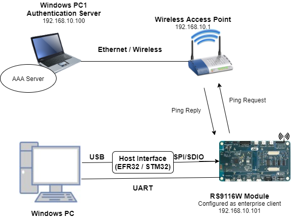
   
### 2.2 Software Requirements

- [WiSeConnect SDK](https://github.com/SiliconLabs/wiseconnect-wifi-bt-sdk/) 
- Embedded Development Environment
  
   - For STM32, use licensed [Keil IDE](https://www.keil.com/demo/eval/arm.htm)

   - For Silicon Labs EFx32, use the latest version of [Simplicity Studio](https://www.silabs.com/developers/simplicity-studio)

- [Iperf Application](https://iperf.fr/iperf-download.php)
- [Free Radius Server](https://freeradius.org/) in Windows PC1(Remote PC)

## 3. Application Build Environment

### 3.1 Platform

The Application can be built and executed on below Host platforms
* [STM32F411 Nucleo](https://st.com/)
* [WSTK + EFR32MG21](https://www.silabs.com/development-tools/wireless/efr32xg21-bluetooth-starter-kit) 
* [WSTK + EFM32GG11](https://www.silabs.com/development-tools/mcu/32-bit/efm32gg11-starter-kit)

### 3.2 Host Interface

* By default, the application is configured to use the SPI bus for interfacing between Host platforms(STM32F411 Nucleo / EFR32MG21) and the RS9116W EVK.
* This application is also configured to use the SDIO bus for interfacing between Host platforms(EFM32GG11) and the RS9116W EVK.

### 3.3 Project Configuration

The Application is provided with the project folder containing Keil and Simplicity Studio project files.

* Keil Project
  - The Keil project is used to evaluate the application on STM32.
  - Project path: `<SDK>/examples/featured/enterprise_client/projects/enterprise_client-nucleo-f411re.uvprojx`

* Simplicity Studio
  - The Simplicity Studio project is used to evaluate the application on EFR32MG21.
  - Project path: 
    - If the Radio Board is **BRD4180A** or **BRD4181A**, then access the path `<SDK>/examples/featured/enterprise_client/projects/enterprise_client-brd4180a-mg21.slsproj`
    - If the Radio Board is **BRD4180B** or **BRD4181B**, then access the path `<SDK>/examples/featured/enterprise_client/projects/enterprise_client-brd4180b-mg21.slsproj` 
    - User can find the Radio Board version as given below 

 

  - EFM32GG11 platform
    - The Simplicity Studio project is used to evaluate the application on EFM32GG11.
      - Project path:`<SDK>/examples/snippets/wlan/enterprise_client/projects/enterprise_client-brd2204a-gg11.slsproj`

### 3.4 Bare Metal/RTOS Support

This application supports bare metal and RTOS environment. By default, the application project files (Keil and Simplicity studio) are provided with bare metal configuration in the SDK. 

## 4. Application Configuration Parameters

The application can be configured to suit user requirements and development environment. Read through the following sections and make any changes needed.

### 4.1 Open rsi_eap_connectivity.c file

#### 4.1.1 User must update the below parameters

SSID refers to the name of the Access point.

```c
#define SSID                                                  "SILABS_AP"
```
  
SECURITY_TYPE refers to the type of security. In In this application STA supports WPA-EAP, WPA2-EAP securities.
    
   Valid configuration is:
    
   - RSI_WPA_EAP - For WPA-EAP security mode
    
   - RSI_WPA2_EAP - For WPA2-EAP security mode
    
```c
#define SECURITY_TYPE                                         RSI_WPA2_EAP
```
   
LOAD_CERTIFICATE refers whether certificate to load into module or not.
   
```c
#define LOAD_CERTIFICATE                                      1
```      
      
If LOAD_CERTIFICATE set to 1, application will load certificate which is included using rsi_wlan_set_certificate API.
   
By default, application is loading "wifiuser.pem" certificate when LOAD_CERTIFICATE enabled. In order to load different certificate, user has to do the following steps:
   
rsi_wlan_set_certificate API expects the certificate in the form of linear array. So convert the pem certificate into linear array form using python script provided in the SDK "resources/certificates/certificate_to_array.py"

  Example: If the certificate is wifi-user.pem, give the command like the following way: 

  `python certificate_to_array.py wifi-user.pem`
   
  The script will generate `wifiuser.pem` in which one linear array named wifiuser contains the certificate.
     
After conversion of certificate, update rsi_eap_connectivity.c source file by including the certificate file and by providing the required parameters to rsi_wlan_set_certificate API.
   
Once the certificate loads into the device, it will write into the device flash. So, user need not load certificate for every boot up unless certificate change.

   So define LOAD_CERTIFICATE as 0, if certificate is already present in the device.
   
USER_IDENTITY refers to user ID which is configured in the user configuration file of the radius server. In this example, user identity is "user1".
   
```c
#define USER_IDENTITY                                         "\"user1\""
```

PASSWORD refers to the password which is configured in the user configuration file of the Radius Server for that User Identity.
   
   In this example, password is "test123"
   
```c
#define PASSWORD                                              "\"test123\""
```
DEVICE_PORT port refers TCP client port number
   
```c
#define DEVICE_PORT                                           5001
```

SERVER_PORT port refers remote TCP server port number which is opened in Windows PC2.
   
```c
#define SERVER_PORT                                           5001
```

SERVER_IP_ADDRESS refers remote peer IP address to connect with TCP server socket.
   
   IP address should be in long format and in little endian byte order.
   
   Example: To configure "192.168.0.100" as remote IP address, update the macro SERVER_IP_ADDRESS as 0x6400A8C0.
   
```c
#define SERVER_IP_ADDRESS                                     0x640AA8C0
```

#### 4.1.2 The desired parameters are provided below. User can also modify the parameters as per their needs and requirements.

GLOBAL_BUFF_LEN memory length which is required by the driver

```c
#define GLOBAL_BUFF_LEN                            15000
```

NUMEBR_OF_PACKETS refers how many packets to receive from TCP client
   
```c
#define NUMBER_OF_PACKETS                                     1000
```
   
DHCP_MODE refers whether IP address configured through DHCP or STATIC in STA mode
   
```c
#define DHCP_MODE                                             1
```

> Note:
> If the user wants to configure STA IP address through DHCP then skip configuring the DEVICE_IP, GATEWAY and NETMASK macros.
> (Or)
> If the user wants to configure STA IP address through STATIC then set DHCP_MODE macro to "0" and configure DEVICE_IP, GATEWAY and NETMASK macros.

IP address to be configured to the device in STA mode should be in long format and in little endian byte order.
  
   Example: To configure "192.168.0.10" as IP address, update the macro DEVICE_IP as 0x010AA8C0.
  
```c
#define DEVICE_IP                                             0X0A00A8C0
```
IP address of the gateway should also be in long format and in little endian byte order.
   Example: To configure "192.168.0.1" as Gateway, update the macro GATEWAY as 0x0100A8C0
  
```c
#define GATEWAY                                               0x0100A8C0
```

IP address of the network mask should also be in long format and in little endian byte order.

   Example: To configure "255.255.255.0" as network mask, update the macro NETMASK as **0x00FFFFFF**
  
```c
#define NETMASK                                               0x00FFFFFF
```

Configure the following macro to initiate ping with the remote peer IP address (AP IP address).

   Example: To configure "192.168.10.1" as remote IP, update the macro REMOTE_IP as 0x6B01A8C0
   
```c
#define REMOTE_IP                                             0x010AA8C0
```

PING_SIZE refers to the size of the ping packet
   
```c
#define PING_SIZE                                             100
```

### 4.2 Open rsi_wlan_config.h file 


```c
#define CONCURRENT_MODE                                       RSI_DISABLE
#define RSI_FEATURE_BIT_MAP                                   FEAT_SECURITY_PSK
#define RSI_TCP_IP_BYPASS                                     RSI_DISABLE
#define RSI_TCP_IP_FEATURE_BIT_MAP                            (TCP_IP_FEAT_DHCPV4_CLIENT | TCP_IP_FEAT_ICMP)
#define RSI_CUSTOM_FEATURE_BIT_MAP                            0
#define RSI_BAND                                              RSI_BAND_2P4GHZ
```
    
> Note:
> For TLS version selection, use `rsi_wlan_common_config.h` at `<SDK>\sapis\include` instead of `rsi_wlan_config.h` and enable respective bits as shown below.
> To select TLS 1.0 version, enable `RSI_FEAT_EAP_TLS_V1P0` (BIT(14)) in `RSI_CONFIG_FEATURE_BITMAP`
> To select TLS 1.2 version, enable `RSI_FEAT_EAP_TLS_V1P2` (BIT(15)) in `RSI_CONFIG_FEATURE_BITMAP`

## 5. Testing the Application

User has to follow the below steps for the successful execution of the application.

### 5.1 Loading the RS9116W Firmware

Refer [Getting started with a PC](https://docs.silabs.com/rs9116/latest/wiseconnect-getting-started) to load the firmware into RS9116W EVK. The firmware file is located in `<SDK>/firmware/`

### 5.2 Access Point Setup

When working with the EAP-Ping example, LAN cable is connected between the Access point modem and CPU.

   - After the connection, using the command prompt give "ipconfig" command to know the IP and gateway1. address of the Radius server. The below image is for reference purpose.
   
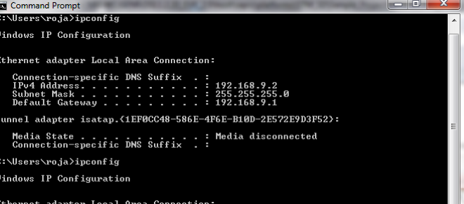

   - Connect the Access Point to PC over Ethernet and open the Access Point page in browser by typing the IP address of the AP's Default Gateway address and configure it.
   
   - Navigate to the Wireless Security section and enable the "WPA/WPA2 - Enterprise" option, as shown in the figure below. The image below is for a TP-Link Access Point.
   
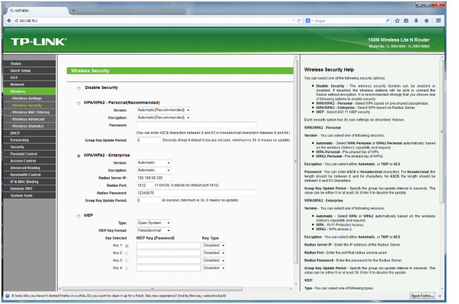
    
   - Enter the IP address of the Radius Server in the field labeled, "Radius Server IP". In the above figure, it is 192.168.50.100.
   
   - Enter the Radius Password as "12345678". This is the same as that entered in the 'clients.conf' file of the Radius Server.
   
### 5.3 Radius Server Setup

**Description :**

The figure below shows the setup for Wi-Fi Client in Enterprise Security Mode.

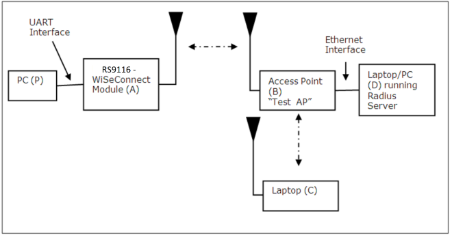

**Radius server Set-up guide :**

The WiSeConnect module supports four Enterprise Security modes:
   1. EAP-TLS
   2. EAP-TTLS
   3. EAP-PEAP
   4. EAP-FAST

**Radius Server Configuration**

The configuration explained below is for Windows OS, similar process may be followed for other OS.

- Free Radius Server installation link:

   [https://freeradius.org/](https://freeradius.org/)
   
   [http://xperiencetech.com/download/radius-free-download.asp](http://xperiencetech.com/download/radius-free-download.asp)
   
   **Note**
   Application was tested in FreeRADIUS-server-2.2.3-x86.

- Once installed, go to the C:\FreeRADIUS\etc\raddb folder and make the following modifications.

- Open the 'clients.conf' file and add the following lines at the end of the file. 
      
```sh      
   client 192.168.50.1/24 {
   secret = 12345678
   shortname = private-network-1
   }
```      

- The IP address in the above lines (192.168.50.1) is the IP address of the Access Point in this example setup. The "12345678" input is the key to be entered in the Access Point's radius server configuration page to authenticate it with the Radius Server.
   
- Open the 'eap.conf' file and make the following changes:
   - Change the input for the "default_eap_type" field under the "eap" section to  "tls", as shown in the figure below.
    
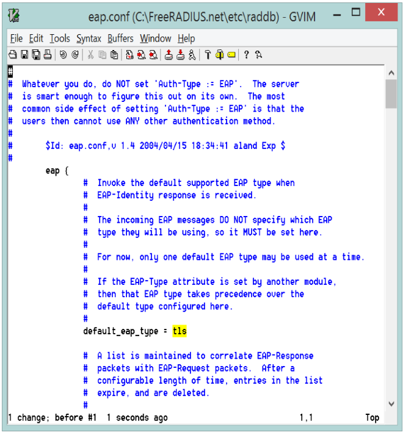
    
   - Change the inputs for "private_key_file", "certificate_file" and "CA_file" fields under the "tls" section to "${certdir}/wifi-user.pem", as shown in the figure below.
    
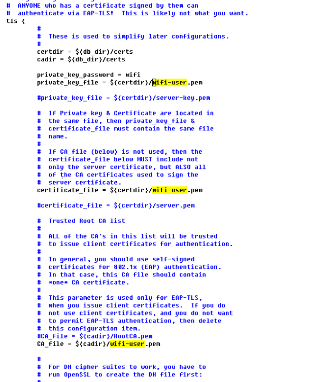
  
   - Uncomment the "fragment_size" and "include_length" lines under the "tls" section, as shown in the figure below.

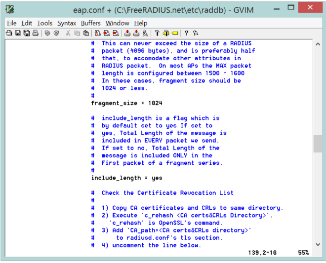
  
- Open the users file and add the lines shown in the figure below starting with "user1". This adds a user with username "user1" and password "test123".

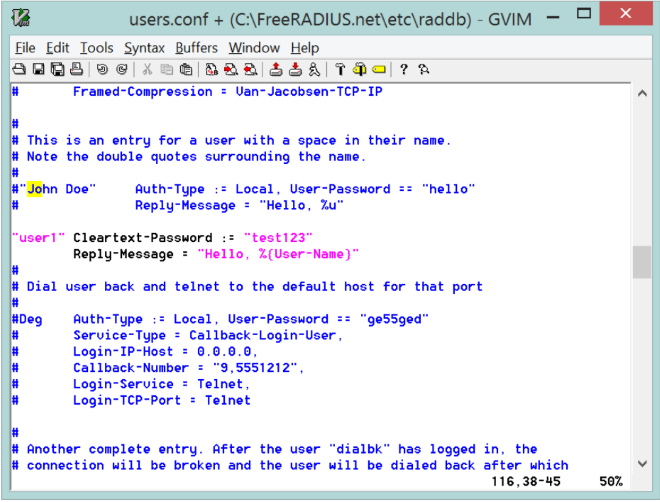
   
- Copy the 'wifi-user.pem; file from `<SDK>\resources\certificates` folder to **C:\FreeRADIUS\etc\raddb\certs** folder.
   
- Click on the windows key and just search for Start RADIUS Server and click on it. 
   
- Then Radius server has started successfully you will see a print at the end which says, "Ready to process requests".
   
> Note:
> 
> The radius server has to run before the application is executed. You will observe some transactions when the module is trying to connect to the radius server. Restart the Radius server when you execute the application every time.

### 5.4 Building the Application on Host Platform

#### 5.4.1 Using STM32

Refer [Getting started with STM32](https://docs.silabs.com/rs9116-wiseconnect/latest/wifibt-wc-getting-started-with-stm32/)

- Open the project `<SDK>/examples/snippets/wlan/enterprise_client/projects/enterprise_client-nucleo-f411re.uvprojx`
- Build and Debug the project
- Check for the RESET pin:
  - If RESET pin is connected from STM32 to RS9116W EVK, then user need not press the RESET button on RS9116W EVK before free run.
  - If RESET pin is not connected from STM32 to RS9116W EVK, then user need to press the RESET button on RS9116W EVK before free run.
- Free run the project
- Then continue the common steps from **5.5**


#### 5.4.2 Using EFX32

Refer [Getting started with EFX32](https://docs.silabs.com/rs9116-wiseconnect/latest/wifibt-wc-getting-started-with-efx32/)

- Open Simplicity Studio and import the EFR32/EFM32 project from `<SDK>/examples/snippets/wlan/enterprise_client/projects`
    - Select the appropriate .slsproj as per Radio Board type mentioned in **Section 3.3** for EFR32 board.
   (or)
    - Select the *.brd2204a-gg11.slsproj  for EFM32GG11 board.
- Compile and flash the project in to Host MCU
- Debug the project
- Check for the RESET pin:
  - If RESET pin is connected from STM32 to RS9116W EVK, then user need not press the RESET button on RS9116W EVK before free run
  - If RESET pin is not connected from STM32 to RS9116W EVK, then user need to press the RESET button on RS9116W EVK before free run
- Free run the project
- Then continue the common steps from **5.5**

### 5.5 Common Steps
   
1. Connect the RS9116W EVK (Silicon Labs module) to the Windows PC running Keil IDE.
   
2. Configure the Access point in WPA-EAP/WPA2-EAP mode to connect the RS9116W EVK (Silicon Labs module) in ent erprise secured mode.
   
3. Run Radius server in Windows PC2 which is connected to AP by providing required certificate and credentials.
   
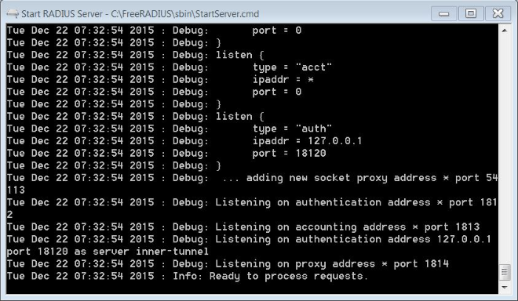
   
4. After the program gets executed, RS9116W EVK (Silicon Labs module) will get connected to access point which is in enterprise security having the configuration provide in **Section 4** and gets IP.
   
5. After a successful connection with the Access Point, the starts sending ping requests to the given REMOTE_IP with configured PING_SIZE to check the availability of the target device.
   
6. The RS9116W EVK sends the number of ping packets configured in NUMBER_OF_PACKETS.
   
7. In the rsi_eap_connectivity.c file, rsi_wlan_ping_async API returns success status, which means that the ping request packet is successfully sent into the medium. When the actual ping response comes from the remote node, it is known from the status parameter of the callback function (rsi_ping_response_handler) registered in the Ping API.
   
8. The following figures shows the Packet_count is continuously incremented, which means the ping request packet is successfully sent into the medium. Place a breakpoint at rsi_delay_ms(1000) and add the packet_count variable to watch the window and monitor the packet count.
   
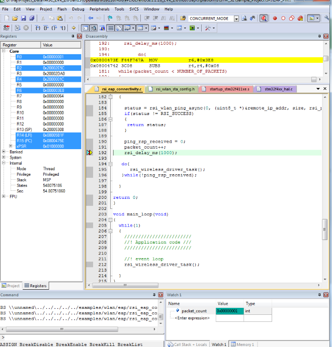
   
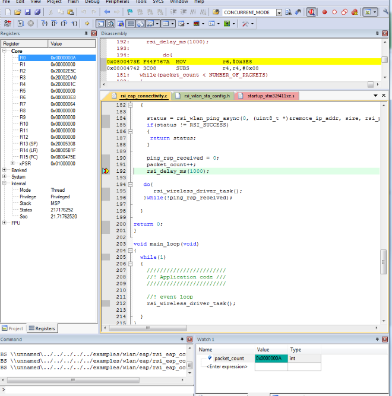

## Compressed Debug Logging

To enable the compressed debug logging feature please refer to [Logging User Guide](https://docs.silabs.com/rs9116-wiseconnect/latest/wifibt-wc-sapi-reference/logging-user-guide)