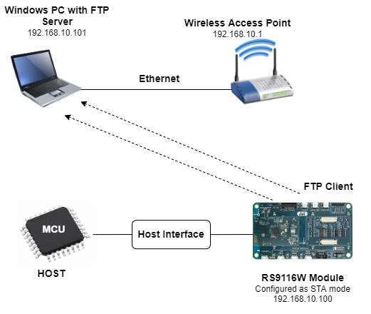
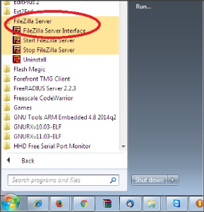
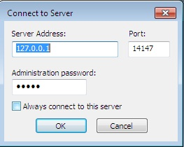
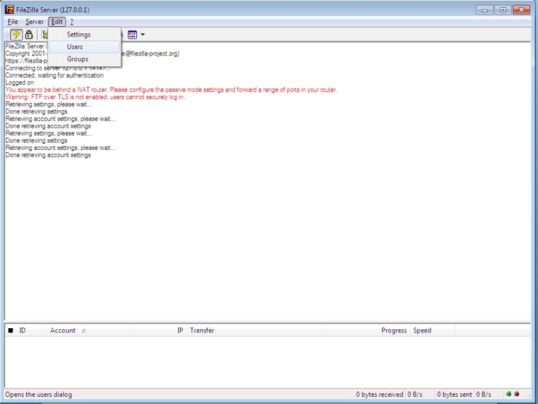
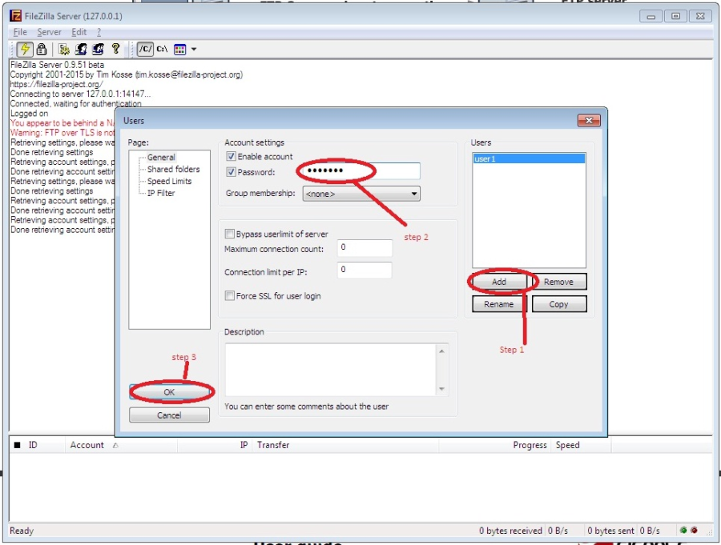
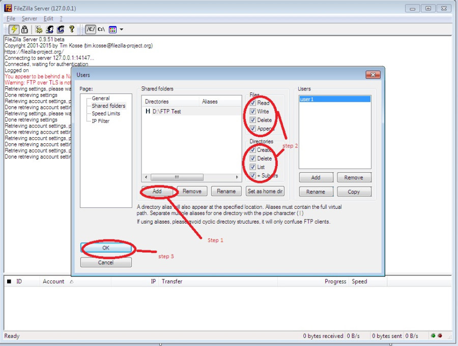
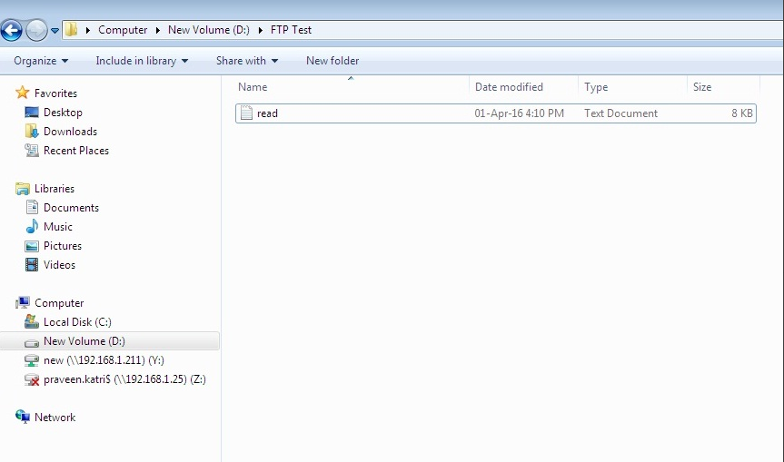
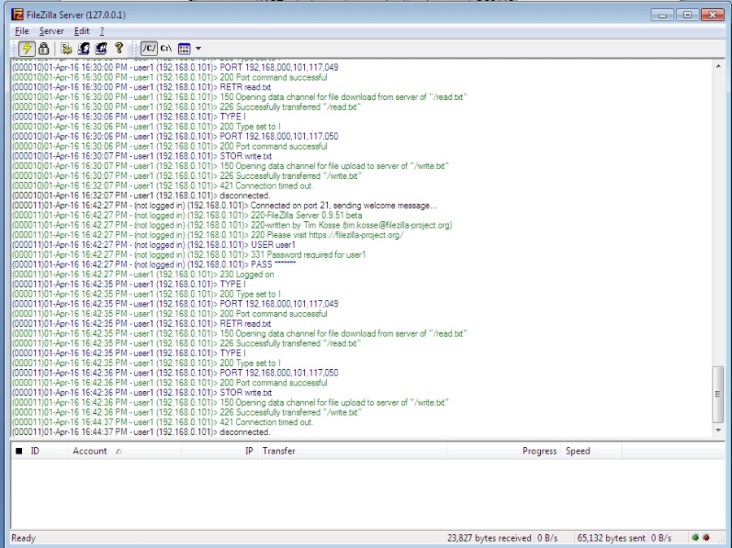
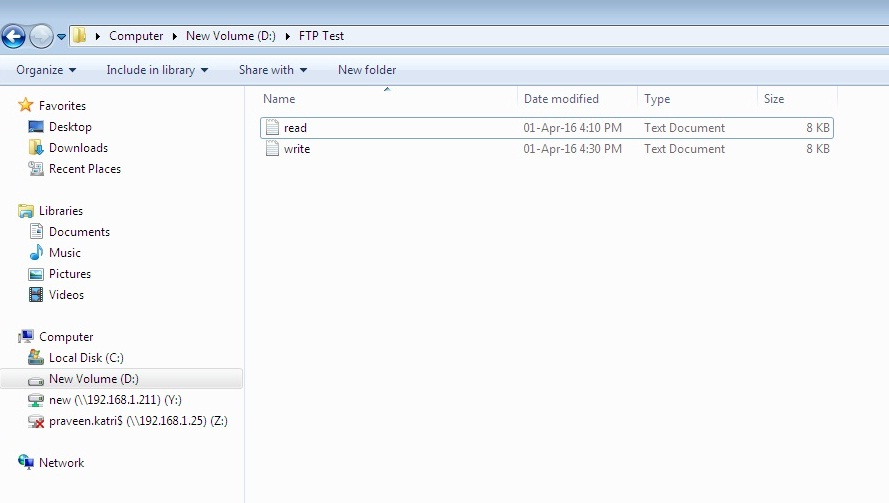

# FTP CLIENT

## 1. Purpose / Scope 

This application demonstrates how to connect to a FTP server opened on remote peer using FTP client, read a file from FTP server and write the file on to the FTP server.
In this application, the Silicon Labs device connects to Access Point and establishes FTP client connection with FTP server opened on remote peer. After successful connection, the application reads the data from a file present in FTP server and writes back same data read from the file by replacing first few bytes with the string "SILABS FTP CLIENT DEMO" to the FTP server by creating a new file

File Transfer Protocol (FTP) is a protocol through which internet users can upload files from their computers to a website or download files from a website to their PCs.
FTP is a client-server protocol that relies on two TCP communications channels between client and server and a command channel for controlling the conversation (command port) and a data channel for transmitting file content(data port). 

## 2. Prerequisites / Setup Requirements 

Before running the application, set up the following.

### 2.1 Hardware Requirements 

- Windows PC with Host interface (UART / SPI/ SDIO).
- Silicon Labs [RS9116 Wi-Fi Evaluation Kit](https://www.silabs.com/development-tools/wireless/wi-fi/rs9116x-sb-evk-development-kit) 
- Host MCU Eval Kit. This example has been tested with:
    - Silicon Labs [WSTK + EFR32MG21](https://www.silabs.com/development-tools/wireless/efr32xg21-bluetooth-starter-kit)
	- Silicon Labs [WSTK + EFM32GG11](https://www.silabs.com/development-tools/mcu/32-bit/efm32gg11-starter-kit)
    - [STM32F411 Nucleo](https://st.com/) 
- Wireless Access point
- Windows PC2 with FTP server installed in it



### 2.2 Software Requirements 

- [WiSeConnect SDK](https://github.com/SiliconLabs/wiseconnect-wifi-bt-sdk/) 
- Embedded Development Environment
  
   - For STM32, use licensed [Keil IDE](https://www.keil.com/demo/eval/arm.htm)

   - For Silicon Labs EFx32, use the latest version of [Simplicity Studio](https://www.silabs.com/developers/simplicity-studio)

- Install and configure FTP Server demo application.
- FTP Server demo application can be downloaded from [Filezilla](https://filezilla-project.org/download.php?type=server)
> Note: FTP client functionality verified with FileZilla server version 0.9.51.

## 3. Application Build Environment 

### 3.1 Platform 

The Application can be built and executed on below Host platforms
* [STM32F411 Nucleo](https://st.com/)
* [WSTK + EFR32MG21](https://www.silabs.com/development-tools/wireless/efr32xg21-bluetooth-starter-kit) 
* [WSTK + EFM32GG11](https://www.silabs.com/development-tools/mcu/32-bit/efm32gg11-starter-kit)

### 3.2 Host Interface 

* By default, the application is configured to use the SPI bus for interfacing between Host platforms(STM32F411 Nucleo / EFR32MG21) and the RS9116W EVK.
* This application is also configured to use the SDIO bus for interfacing between Host platforms(EFM32GG11) and the RS9116W EVK.

### 3.3 Project Configuration 

The Application is provided with the project folder containing Keil and Simplicity Studio project files.

* Keil Project
  - The Keil project is used to evaluate the application on STM32.
  - Project path: `<SDK>/examples/snippets/wlan/ftp_client/projects/ftp_client-nucleo-f411re.uvprojx`

* Simplicity Studio
  - The Simplicity Studio project is used to evaluate the application on EFR32MG21.
  - Project path: 
    - If the Radio Board is **BRD4180A** or **BRD4181A**, then access the path `<SDK>/examples/snippets/wlan/ftp_client/projects/ftp_client-brd4180a-mg21.slsproj`
    - If the Radio Board is **BRD4180B** or **BRD4181B**, then access the path `<SDK>/examples/snippets/wlan/ftp_client/projects/ftp_client-brd4180b-mg21.slsproj`
    - User can find the Radio Board version as given below 


  - EFM32GG11 platform
    - The Simplicity Studio project is used to evaluate the application on EFM32GG11.
      - Project path:`<SDK>/examples/snippets/wlan/ftp_client/projects/ftp_client-brd2204a-gg11.slsproj`
	  
### 3.4 Bare Metal/RTOS Support 

This application supports bare metal environment. The application project files (Keil and Simplicity studio) are provided with bare metal configuration in the SDK. 


## 4. Application Configuration Parameters 

The application can be configured to suit user requirements and development environment. Read through the following sections and make any changes needed. 

### 4.1 Open rsi_ftp_client.c file

#### 4.1.1 User must update the below common parameters  

   **SSID** refers to the name of the Access point.
   
```c
	 #define SSID                                 "<SILABS_AP>"
```

   **SECURITY_TYPE** refers to the type of security. In this application STA supports Open, WPA-PSK, WPA2-PSK securities.
   Valid configuration is:
   **RSI_OPEN** - For OPEN security mode
   **RSI_WPA** - For WPA security mode
   **RSI_WPA2** - For WPA2 security mode  
   
```c
#define SECURITY_TYPE                         RSI_OPEN
```

   **PSK** refers to the secret key if the Access point configured in WPA-PSK/WPA2-PSK security modes.
   
```c
#define PSK                                  "<psk>"
```

   **FTP_SERVER_PORT** port refers remote FTP server port number.
   By default FileZilla Server runs on port number 21.
	 
```c
#define FTP_SERVER_PORT                      21
```

   **SERVER_IP_ADDRESS** refers remote peer IP address to connect with TCP server socket.
   IP address should be in long format and in little endian byte order.
   Example: To configure "192.168.0.100" as remote IP address, update the macro **SERVER_IP_ADDRESS** as **0x6400A8C0**.
	 
```c
#define SERVER_IP_ADDRESS                    0x6400A8C0
```

   FTP Server login username
	 
```c
#define FTP_SERVER_LOGIN_USERNAME            "username"
```

   FTP Server login password
	 
```c
#define FTP_SERVER_LOGIN_PASSWORD            "password"
```
	 
   File to read which is on FTP server
   Create a file on FTP server with the file name along with the path with data given below
	 
```c
#define FTP_FILE_TO_READ                     "read.txt"
	 (or)
#define FTP_FILE_TO_READ                     "D:\FTP Test\read.txt"
```

   **FILE_CONTENT_LENGTH** refers content length of the read file from FTP server (Ex: configure **FILE_CONTENT_LENGTH** >= Sizeof ("read.txt"))
	 
```c
#define FILE_CONTENT_LENGTH                   10000
``` 
	 
   File name to create on FTP server and write the same content which is read from "read.txt"
	 
```c
#define FTP_FILE_TO_WRITE                   "write.txt"
	 (or)
#define FTP_FILE_TO_WRITE                   "D:\FTP Test\write.txt"
```

   To rename a file on FTP server
	 
```c
#define FTP_FILE_TO_RENAME                  "example.txt"
```

   To set the directory on FTP server
	 
```c
#define FTP_DIRECTORY_SET                   "/work/FTP_EXAMPLE/FTP"
```

   To create directory on FTP server
	 
```c
#define FTP_DIRECTORY_CREATE                "FTP"
```
	 
   To list the directories on FTP server
	 
```c
#define FTP_DIRECTORY_LIST                  "/work/FTP_EXAMPLE"
```

   **To configure IP address**
    
   **DHCP_MODE** refers whether IP address configured through DHCP or STATIC
   
```c
#define DHCP_MODE                            1
```

---
**Note!**
    If user wants to configure STA IP address through DHCP then set DHCP_MODE to 1 and skip configuring the following DEVICE_IP,GATEWAY and NETMASK macros.
    (Or)
   If user wants to configure STA IP address through STATIC then set DHCP_MODE macro to "0" and configure following DEVICE_IP, GATEWAY and NETMASK macros.
   IP address to be configured to the device in STA mode, it should be in long format and in little endian byte order.
   Example: To configure "192.168.10.10" as IP address, update the macro DEVICE_IP as 0x0A0AA8C0.

---

```c
#define DEVICE_IP                           0X0A0AA8C0
```

   IP address of the gateway should also be in long format and in little endian byte order
   Example: To configure "192.168.10.1" as Gateway, update the macro GATEWAY as 0x010AA8C0
	 
```c
#define GATEWAY                             0x010AA8C0
```

   IP address of the network mask should also be in long format and in little endian byte order
   Example: To configure "255.255.255.0" as network mask, update the macro NETMASK as 0x00FFFFFF
	 
```c
#define NETMASK                             0x00FFFFFF
```

   The following parameters need to be configure if OS is used.
   WLAN task priority is given and this should be of low priority
	 
```c
#define RSI_WLAN_TASK_PRIORITY             1
```

   Driver task priority is given and this should be of highest priority
	 
```c
#define RSI_DRIVER_TASK_PRIORITY           1
```

   WLAN Task stack size is configured by this macro
	 
```c
#define RSI_WLAN_TASK_STACK_SIZE           500
```

   Driver Task stack size is configured by this macro
	 
```c
#define RSI_DRIVER_TASK_STACK_SIZE         500
```  
   
#### 4.1.2 User must update the below server configuration parameters
	
  Open **rsi_wlan_config.h** file and update/modify following macros 	
	 
```c
#define CONCURRENT_MODE                   RSI_DISABLE
#define RSI_FEATURE_BIT_MAP               FEAT_SECURITY_OPEN
#define RSI_TCP_IP_BYPASS                 RSI_DISABLE
#define RSI_TCP_IP_FEATURE_BIT_MAP        TCP_IP_FEAT_DHCPV4_CLIENT| TCP_IP_FEAT_FTP_CLIENT)
#define RSI_CUSTOM_FEATURE_BIT_MAP        FEAT_CUSTOM_FEAT_EXTENTION_VALID
#define RSI_EXT_CUSTOM_FEAT_BIT_MAP       EXT_FEAT_256k_MODE
#define RSI_BAND                          RSI_BAND_2P4GHZ
```

---
**Note!**
`rsi_wlan_config.h` file is already set with desired configuration in respective example folders user need not change for each example.
	
---

**Installation of FTP server**

  1. Download the FileZilla FTP server from below link - https://filezilla-project.org/download.php?type=server
  2. Install downloaded FileZilla FTP server in Windows PC2 which is connected to AP through LAN.
  3. Configure and run FTP server. Please refer the below images for configuring and running FileZilla FTP server.
  4. After installation, open FileZilla Server interface.
 
    
  
  5. After opening FileZilla server interface, connect to server admin interface.
   
   
  
   6. After connection with server, configure the user settings.
    
   
   
   
   
  
  7. Place "read.txt" file in FTP directory (Ex: "D:\FTP Test\read.txt")

## 5. Testing the Application

User has to follow the below steps for the successful execution of the application. 

### 5.1 Loading the RS9116W Firmware

Refer [Getting started with a PC](https://docs.silabs.com/rs9116/latest/wiseconnect-getting-started) to load the firmware into RS9116W EVK. The firmware file is located in `<SDK>/firmware/`

### 5.2 Building the Application on the Host Platform

#### 5.2.1 Using STM32

Refer [Getting started with STM32](https://docs.silabs.com/rs9116-wiseconnect/latest/wifibt-wc-getting-started-with-stm32/) 

- Open the project `<SDK>/examples/snippets/wlan/ftp_client/projects/ftp_client-nucleo-f411re.uvprojx`
- Build and Debug the project
- Check for the RESET pin:
  - If RESET pin is connected from STM32 to RS9116W EVK, then user need not press the RESET button on RS9116W EVK before free run.
  - If RESET pin is not connected from STM32 to RS9116W EVK, then user need to press the RESET button on RS9116W EVK before free run.
- Free run the project
- Then continue the common steps from **Section 5.3**

#### 5.2.2 Using EFX32

Refer [Getting started with EFX32](https://docs.silabs.com/rs9116-wiseconnect/latest/wifibt-wc-getting-started-with-efx32/), for settin-up EFR & EFM host platforms

- Open Simplicity Studio and import the project from `<SDK>/examples/snippets/wlan/ftp_client/projects`
- Select the appropriate .slsproj as per the Radio Board type mentioned in **Section 3.3**
- Compile and flash the project in to Host MCU
- Debug the project
- Check for the RESET pin:
  - If RESET pin is connected from STM32 to RS9116W EVK, then user need not press the RESET button on RS9116W EVK before free run
  - If RESET pin is not connected STM32 to RS9116W EVK, then user need to press the RESET button on RS9116W EVK before free run
- Free run the project
- Then continue the common steps from **Section 5.3**


### 5.3 Common Steps 

  1. Configure the Access point in **OPEN/WPA-PSK/WPA2-PSK** mode to connect the Silicon Labs device in STA mode.
  2. Run FTP server on Windows PC2 and place "read.txt" file in the FTP directory.
  3. After the program gets executed, the Silicon Labs device will be connected to same access point having the configuration same as that of in the application and get IP.
  4. After successful connection with the Access Point, the device connects to FTP server and reads the file content of given file ("read.txt") and creates a file name "write.txt" in FTP directory and writes the same content which is read from "read.txt" by replacing first few bytes with "FTP CLIENT DEMO". After successful file write WiSeConnect device disconnects from FTP server.
  5. Refer below images for message exchanges with FTP server and for read and write files,






## Compressed Debug Logging

To enable the compressed debug logging feature please refer to [Logging User Guide](https://docs.silabs.com/rs9116-wiseconnect/latest/wifibt-wc-sapi-reference/logging-user-guide)