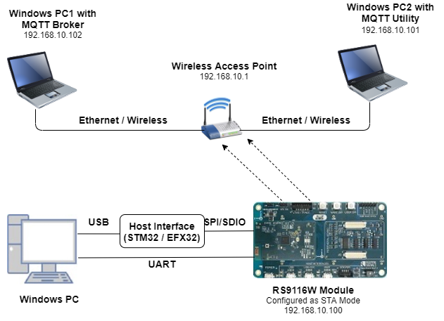
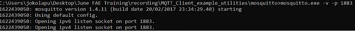
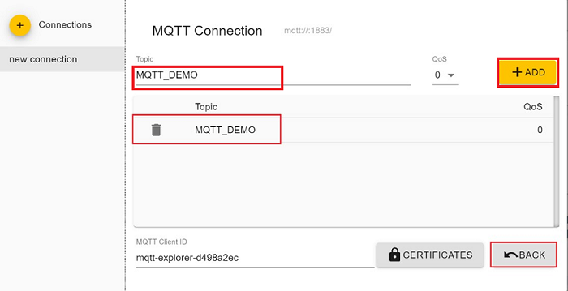
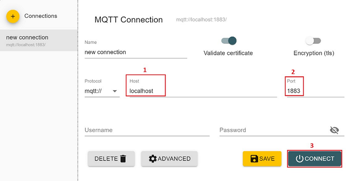
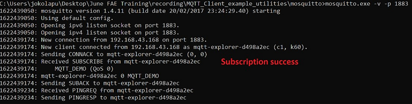
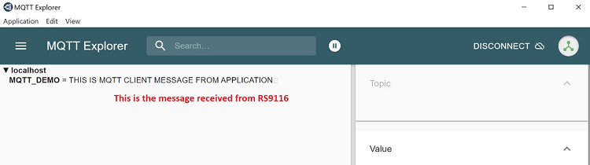
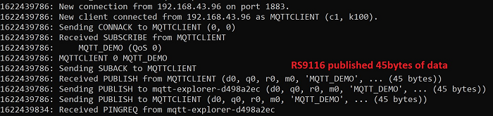
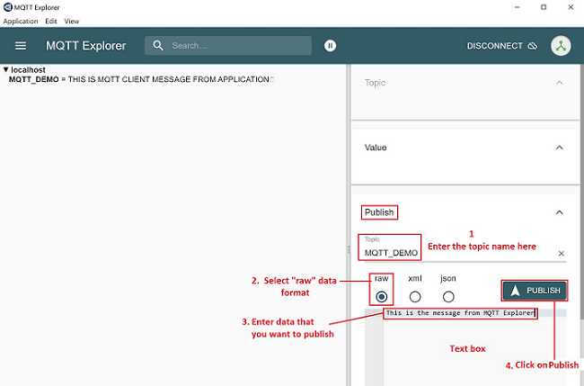
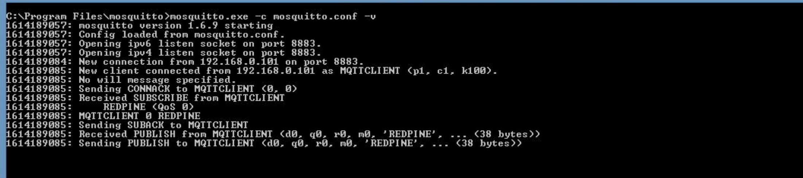

# MQTT Client

## 1. Purpose / Scope 

This application demonstrates how to configure RS9116W EVK as MQTT client and how to establish connection with MQTT broker and how to subscribe, publish and receive the MQTT messages from MQTT broker. In this application, RS9116W EVK is configured as WiFi station and connects to Access Point. After successful WiFi connection, application connects to MQTT broker and subscribes to the topic ***"MQTT_DEMO"*** and publishes a message ***"THIS IS MQTT CLIENT DEMO FROM APPLICATION"*** on that subscribed topic. The application waits to receive the data published on subscribed topic by other clients.


## 2. Prerequisites / Setup Requirements 

Before running the application, the user will need the following things to setup.

### 2.1 Hardware Requirements 

- Windows PC with Host interface (UART / SPI/ SDIO).
- Silicon Labs [RS9116 Wi-Fi Evaluation Kit](https://www.silabs.com/development-tools/wireless/wi-fi/rs9116x-sb-evk-development-kit) 
- Host MCU Eval Kit. This example has been tested with:
    - Silicon Labs [WSTK + EFR32MG21](https://www.silabs.com/development-tools/wireless/efr32xg21-bluetooth-starter-kit)
	- Silicon Labs [WSTK + EFM32GG11](https://www.silabs.com/development-tools/mcu/32-bit/efm32gg11-starter-kit)
    - [STM32F411 Nucleo](https://st.com/) 
- Wireless Access Point
- Windows PC1 with with MQTT broker installed in it
- Windows PC2 with with MQTT client utility installed in it

 


### 2.2 Software Requirements 

- [WiSeConnect SDK](https://github.com/SiliconLabs/wiseconnect-wifi-bt-sdk/) 
- Embedded Development Environment
  
   - For STM32, use licensed [Keil IDE](https://www.keil.com/demo/eval/arm.htm)

   - For Silicon Labs EFx32, use the latest version of [Simplicity Studio](https://www.silabs.com/developers/simplicity-studio)

- [MQTT Broker](http://mosquitto.org/download/) in Windows PC1.
- [MQTT Utility (MQTT Explorer)](http://mqtt-explorer.com/) in Windows PC2.


## 3. Application Build Environment 

### 3.1 Platform 

The Application can be built and executed on below Host platforms
* [STM32F411 Nucleo](https://st.com/)
* [WSTK + EFR32MG21](https://www.silabs.com/development-tools/wireless/efr32xg21-bluetooth-starter-kit) 
* [WSTK + EFM32GG11](https://www.silabs.com/development-tools/mcu/32-bit/efm32gg11-starter-kit)

### 3.2 Host Interface 

* By default, the application is configured to use the SPI bus for interfacing between Host platforms(STM32F411 Nucleo / EFR32MG21) and the RS9116W EVK.
* This application is also configured to use the SDIO bus for interfacing between Host platforms(EFM32GG11) and the RS9116W EVK.

### 3.3 Project Configuration 

The application is provided with the project folder containing Keil and Simplicity Studio project files.

* Keil Project
  - The Keil project is used to evaluate the application on STM32.
  - Project path: `<SDK>/examples/snippets/wlan/mqtt_client/projects/mqtt_client-nucleo-f411re.uvprojx`

* Simplicity Studio
  - The Simplicity Studio project is used to evaluate the application on EFR32MG21.
  - Project path: 
    - If the Radio Board is **BRD4180A** or **BRD4181A**, then access the path `<SDK>/examples/snippets/wlan/mqtt_client/projects/mqtt_client-brd4180a-mg21.slsproj`
    - If the Radio Board is **BRD4180B** or **BRD4181B**, then access the path `<SDK>/examples/snippets/wlan/mqtt_client/projects/mqtt_client-brd4180b-mg21.slsproj` 
    - User can find the Radio Board version as given below 

 

  - EFM32GG11 platform
    - The Simplicity Studio project is used to evaluate the application on EFM32GG11.
      - Project path:`<SDK>/examples/snippets/wlan/mqtt_client/projects/mqtt_client-brd2204a-gg11.slsproj`


### 3.4 Bare Metal/RTOS Support 

This application supports bare metal and RTOS environment. By default, the application project files (Keil and Simplicity Studio) are provided with bare metal configuration in the SDK. 


## 4. Application Configuration Parameters 

> Note :
> If the user wants to use MQTT library(in Host), then user can opt for this mqtt application. 

The application can be configured to suit user requirements and development environment. Read through the following sections and make any changes needed. 

### 4.1 Open rsi_mqtt.c file 

#### 4.1.1 User must update the below parameters  

SSID refers to the name of the Access point.

```c
#define SSID                                       "SILABS_AP"
```

SECURITY_TYPE refers to the type of security. In this application, STA supports Open, WPA-PSK, WPA2-PSK securities.

   The valid configuration is:

   - RSI_OPEN - For OPEN security mode

   - RSI_WPA    - For WPA security mode

   - RSI_WPA2 - For WPA2 security mode

```c
#define SECURITY_TYPE                              RSI_OPEN
```

PSK refers to the secret key if the Access point configured in WPA-PSK/WPA2-PSK security modes.

```c
#define PSK                                        "<psk>"
```

CLIENT_PORT port refers to device MQTT client port number

```c
#define CLIENT_PORT                                5001
```

SERVER_PORT port refers remote MQTT broker/server port number

```c
#define SERVER_PORT                                1883
```

SERVER_IP_ADDRESS refers remote peer IP address (Windows PC2) to connect with MQTT broker/server socket.

```c
#define SERVER_IP_ADDRESS                          192.168.10.1
```

MQTT client keep alive period

```c
#define RSI_KEEP_ALIVE_PERIOD                      100
```

Memory to initialize MQTT client Info structure

```c
#define MQTT_CLIENT_INIT_BUFF_LEN                  3500
```

Global buffer or memory which is used for MQTT client initialization. This buffer is used for the MQTT client information storage.

```c
uint8_t mqqt_client_buffer[MQTT_CLIENT_INIT_BUFF_LEN]
```

QOS indicates the level of assurance for delivery of an Application Message.

   QoS levels are:

   0 - At most once delivery

   1 - At least once delivery

   2 - Exactly once delivery

```c
#define QOS                                        0
```

RSI_MQTT_TOPIC refers to which topic WiSeConnect MQTT client is supposed to subscribe.

```c
#define RSI_MQTT_TOPIC                             "MQTT_DEMO"
```
   
MQTT Message to publish on the topic subscribed

```c
uint8_t publish_message[] ="THIS IS MQTT CLIENT DEMO FROM APPLICATION"
```

MQTT Client ID with which MQTT client connects to MQTT broker/server

```c
uint8_t clientID[] = "MQTTCLIENT"
```

User name for login credentials

```c
int8_t username[] = "username"
```

Password for login credentials

```c
int8_t password[] = "password"
```

#### 4.1.2 The desired parameters are provided below. User can also modify the parameters as per their needs and requirements.

Application memory length which is required by the driver

```c
#define GLOBAL_BUFF_LEN                            15000
```

To configure IP address

   DHCP_MODE refers whether IP address configured through DHCP or STATIC

```c
#define DHCP_MODE                                  1
```
   
> Note:
> If user wants to configure STA IP address through DHCP then set DHCP_MODE to "1" and skip configuring the following DEVICE_IP, GATEWAY and NETMASK macros.
> (Or)
> If user wants to configure STA IP address through STATIC then set DHCP_MODE macro to "0" and configure following DEVICE_IP, GATEWAY and NETMASK macros.

IP address to be configured to the device in STA mode should be in long format and in little endian byte order.
  
   Example: To configure "192.168.10.10" as IP address, update the macro DEVICE_IP as 0x0A0AA8C0.

```c
#define DEVICE_IP                                  0X0A0AA8C0
```

IP address of the gateway should also be in long format and in little endian byte order

   Example: To configure "192.168.10.1" as Gateway, update the macro GATEWAY as 0x010AA8C0.

```c
#define GATEWAY                                    0x010AA8C0
```

IP address of the network mask should also be in long format and in little endian byte order.

   Example: To configure "255.255.255.0" as network mask, update the macro NETMASK as 0x00FFFFFF.

```c
#define NETMASK                                    0x00FFFFFF
```

### 4.2 Open rsi_wlan_config.h file. User can also modify the below parameters as per their needs and requirements. 


```c
#define CONCURRENT_MODE                            RSI_DISABLE
#define RSI_FEATURE_BIT_MAP                        FEAT_SECURITY_OPEN
#define RSI_TCP_IP_BYPASS                          RSI_DISABLE
#define RSI_TCP_IP_FEATURE_BIT_MAP                 TCP_IP_FEAT_DHCPV4_CLIENT
#define RSI_CUSTOM_FEATURE_BIT_MAP                 0
#define RSI_BAND                                   RSI_BAND_2P4GHZ
```

 For running **MQTT** with **SSL**, please enable **TCP_IP_FEAT_SSL** in **rsi_wlan_config.h** file, as shown below. Also load the related **SSL Certificates** in the module using rsi_wlan_set_certificate() API and Need to enable **SSL** flag **RSI_SSL_ENABLE** in rsi_mqtt_connect() API. 


```c
#define CONCURRENT_MODE                            RSI_DISABLE
#define RSI_FEATURE_BIT_MAP                        FEAT_SECURITY_OPEN
#define RSI_TCP_IP_BYPASS                          RSI_DISABLE
#define RSI_TCP_IP_FEATURE_BIT_MAP                 (TCP_IP_FEAT_DHCPV4_CLIENT |  TCP_IP_FEAT_SSL  |  TCP_IP_FEAT_DNS_CLIENT | TCP_IP_FEAT_EXTENSION_VALID)
#define RSI_CUSTOM_FEATURE_BIT_MAP                 EXT_FEAT_CUSTOM_FEAT_EXTENTION_VALID
#define RSI_EXT_CUSTOM_FEATURE_BIT_MAP             EXT_FEAT_256k_MODE
#define RSI_EXT_TCPIP_FEATURE_BITMAP               CONFIG_FEAT_EXTENTION_VALID
#define RSI_BAND                                   RSI_BAND_2P4GHZ
```

> Note:
> In rsi_mqtt_client.h change 'MQTT_VERSION' macro to either 3 or 4 based on the MQTT broker support version (Supported versions are 3 and 4).

## 5. Testing the Application 

User has to follow the below steps for the successful execution of the application.

### 5.1 Loading the RS9116W Firmware 

Refer [Getting started with a PC](https://docs.silabs.com/rs9116/latest/wiseconnect-getting-started) to load the firmware into RS9116W EVK. The firmware file is located in `<SDK>/firmware/`


### 5.2 Building the Application on the Host Platform 

#### 5.2.1 Using STM32 

Refer [Getting started with STM32](https://docs.silabs.com/rs9116-wiseconnect/latest/wifibt-wc-getting-started-with-stm32/)

- Open the project `<SDK>/examples/snippets/wlan/mqtt_client/projects/mqtt_client-nucleo-f411re.uvprojx` in Keil IDE.
- Build and Debug the project
- Check for the RESET pin:
  - If RESET pin is connected from STM32 to RS9116W EVK, then user need not press the RESET button on RS9116W EVK before free run.
  - If RESET pin is not connected from STM32 to RS9116W EVK, then user need to press the RESET button on RS9116W EVK before free run.
- Free run the project
- Then continue the common steps from **Section 5.3**


#### 5.2.2 Using EFX32 

Refer [Getting started with EFX32](https://docs.silabs.com/rs9116-wiseconnect/latest/wifibt-wc-getting-started-with-efx32/), for settin-up EFR & EFM host platforms

- Open Simplicity Studio and import the EFR32/EFM32 project from `<SDK>/examples/snippets/wlan/mqtt_client/projects`
    - Select the appropriate .slsproj as per Radio Board type mentioned in **Section 3.3** for EFR32 board.
   (or)
    - Select the *.brd2204a-gg11.slsproj  for EFM32GG11 board.
- Compile and flash the project in to Host MCU
- Debug the project
- Check for the RESET pin:
  - If RESET pin is connected from STM32 to RS9116W EVK, then user need not press the RESET button on RS9116W EVK before free run
  - If RESET pin is not connected from STM32 to RS9116W EVK, then user need to press the RESET button on RS9116W EVK before free run
- Free run the project
- Then continue the common steps from **Section 5.3**


#### 5.3 Common Steps 

1. Configure the Access point in OPEN / WPA-PSK / WPA2-PSK mode to connect RS9116W EVK in STA mode.

2. To run MQTT broker in Windows PC1, open command prompt and go to MQTT installed folder (Ex: C:\Program Files\mosquitto) and run the following command: 

```sh
mosquitto.exe –p 1883 –v
```



3. Open MQTT Explorer in Windows PC2 and delete the existing connections if any and click on "Advanced" as shown in the below image.


4. Delete the existing topic names if any. Enter the desired "TOPIC_NAME" in topic field and click on "ADD". Then the desired topic name can be observed in the topic list and click on "BACK" as shown in below image.



5. Connect to MQTT broker by giving IP address and port number of Windows PC1 in HOST and PORT fields in MQTT Explorer respectively and click on "CONNECT" to connect to the MQTT broker. If you are running your MQTT broker on the same PC then the following configuration is made as shown in the below image. 



6. After the program gets executed, the RS9116W EVK will be connected to the same access point having the configuration same as that of in the application and get IP.

7. Once the RS9116W EVK gets connected to the MQTT broker, it will subscribe to the topic **RSI_MQTT_TOPIC (Ex: "MQTT_DEMO")**. The user can see the client connected and subscription success information in the MQTT broker.



8. After successful subscription to the topic **RSI_MQTT_TOPIC (Ex: "MQTT_DEMO")**, the RS9116W EVK publishes a message which is given in **publish_message** array
  (Ex: "THIS IS MQTT CLIENT DEMO FROM APPLICATION") on the subscribed topic.

9. MQTT Explorer which is running on Windows PC2 will receive the message published by the RS9116W EVK as it subscribed to the same topic.



10. In the MQTT broker, user can observe the published message as the MQTT client is subscribed topic to that topic. 



11. Now to publish a message using MQTT Explorer, enter the topic name under "Publish" tab, select "raw" data format, type the data that user wishes to send and then click on "publish". This message will be received by the RS9116W EVK.

 

### 5.4 Procedure For exexcuting the Application when enabled with SSL

1. Configure the Access point in OPEN/WPA-PSK/WPA2-PSK mode to connect Silicon Labs device in STA mode.

2. Install MQTT broker in Windows PC2 which is connected to Access Point through LAN.

3. User needs to update the mosquitto.conf file with the proper file paths, in which the certificates are available in the mosquitto.conf file.

4. Also, add "certs" folder to the mosquitto broker folder.

5. Execute the following command in MQTT server installed folder. (Ex:  C:\Program Files\mosquitto>mosquitto.exe -c mosquitto.conf -v) (Port can be 1883/8883)
   
   `mosquitto.exe -c mosquitto.conf -v`  
  
    

6. If you see any error - Unsupported tls_version "tlsv1", just comment the "tls_version tlsv1" in mosquitto.conf file

7. From here, repeat the steps from step 4 to step 9 of **5.3** to complete the execution.

> Note:
> Multiple MQTT client instances can be created.
> If mosquitto isn't allowing external connections to broker, add the below lines in mosquitto.conf file:
  listener 1883
  allow_anonymous true
> For using a different config file for mosquitto broker, use command:
  "mosquitto -v -p 1883 -c config/mosquitto.conf"
  where config is the sub folder and mosquitto.conf is the different config file than default.
> Limitations: 
> MQTT client application keeps on polling for the data to receive on the subscribed topic irrespective of receive timeout mentioned in the rsi_mqtt_poll_for_recv_data API.

## Compressed Debug Logging

To enable the compressed debug logging feature please refer to [Logging User Guide](https://docs.silabs.com/rs9116-wiseconnect/latest/wifibt-wc-sapi-reference/logging-user-guide)