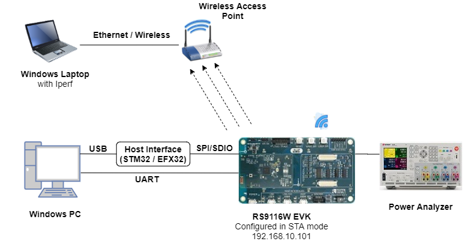
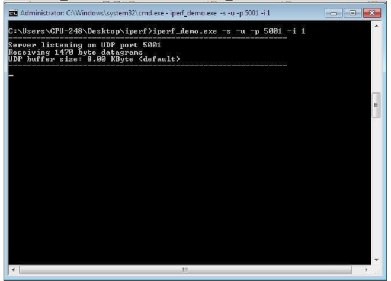
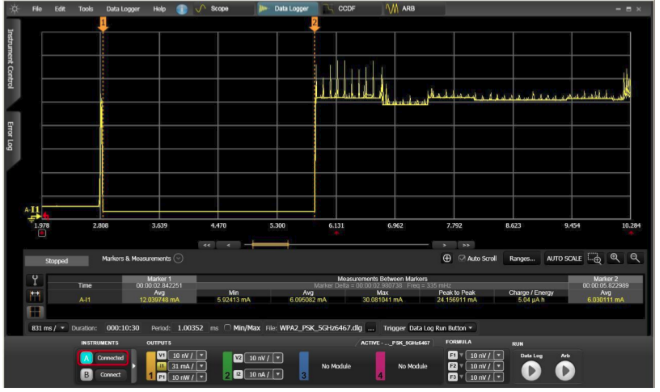
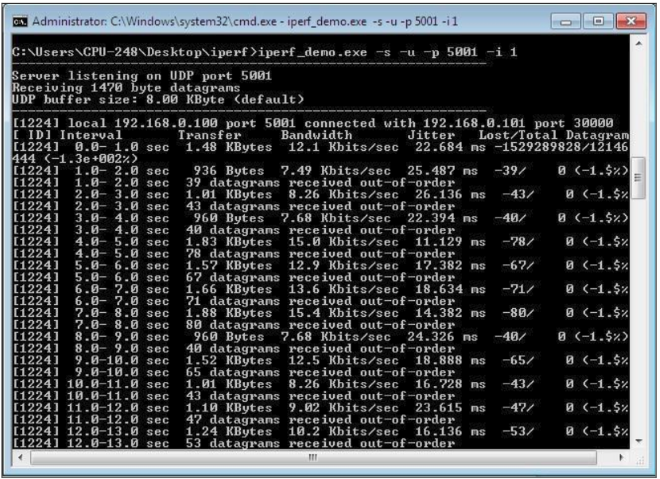

# Power Save Deep Sleep

## 1. Purpose / Scope 

This application demonstrates how to enable power save deep sleep profile with RS9116W EVK. This application enables power save profile mode 8 and then wait in a scheduler for some time. Once it will come out of delay, it will connect to the configured AP and open udp client socket. It sends some packets to the udp server, disconnects from AP and goes back to deep sleep.

## 2. Prerequisites / Setup Requirements 

Before running the application, the user will need the following things to setup.

### 2.1 Hardware Requirements 

- Windows PC with Host interface (UART / SPI/ SDIO).
- Silicon Labs [RS9116 Wi-Fi Evaluation Kit](https://www.silabs.com/development-tools/wireless/wi-fi/rs9116x-sb-evk-development-kit) 
- Host MCU Eval Kit. This example has been tested with:
    - Silicon Labs [WSTK + EFR32MG21](https://www.silabs.com/development-tools/wireless/efr32xg21-bluetooth-starter-kit)
	- Silicon Labs [WSTK + EFM32GG11](https://www.silabs.com/development-tools/mcu/32-bit/efm32gg11-starter-kit)
    - [STM32F411 Nucleo](https://st.com/) 
- Wireless Access point
- Windows PC2 (Remote PC) with UDP server application (Iperf Application)
- Agilent power analyzer




### 2.2 Software Requirements 

- [WiSeConnect SDK](https://github.com/SiliconLabs/wiseconnect-wifi-bt-sdk/) 
- Embedded Development Environment
  
   - For STM32, use licensed [Keil IDE](https://www.keil.com/demo/eval/arm.htm)

   - For Silicon Labs EFx32, use the latest version of [Simplicity Studio](https://www.silabs.com/developers/simplicity-studio)

   - [Iperf Application](https://iperf.fr/iperf-download.php) in the remote PC.


## 3. Application Build Environment 

### 3.1 Platform 

The Application can be built and executed on below Host platforms
* [STM32F411 Nucleo](https://st.com/)
* [WSTK + EFR32MG21](https://www.silabs.com/development-tools/wireless/efr32xg21-bluetooth-starter-kit) 
* [WSTK + EFM32GG11](https://www.silabs.com/development-tools/mcu/32-bit/efm32gg11-starter-kit)

### 3.2 Host Interface 

* By default, the application is configured to use the SPI bus for interfacing between Host platforms(STM32F411 Nucleo / EFR32MG21) and the RS9116W EVK.
* This application is also configured to use the SDIO bus for interfacing between Host platforms(EFM32GG11) and the RS9116W EVK.

### 3.3 Project Configuration 

The Application is provided with the project folder containing Keil and Simplicity Studio project files.

* Keil Project
  - The Keil project is used to evaluate the application on STM32.
  - Project path: `<SDK>/examples/snippets/wlan/power_save_deep_sleep/projects/power_save_deep_sleep-nucleo-f411re.uvprojx`

* Simplicity Studio
  - The Simplicity Studio project is used to evaluate the application on EFR32MG21.
  - Project path: 
    - If the Radio Board is **BRD4180A** or **BRD4181A**, then access the path `<SDK>/examples/snippets/wlan/power_save_deep_sleep/projects/power_save_deep_sleep-brd4180a-mg21.slsproj`
    - If the Radio Board is **BRD4180B** or **BRD4181B**, then access the path `<SDK>/examples/snippets/wlan/power_save_deep_sleep/projects/power_save_deep_sleep-brd4180b-mg21.slsproj`
    - User can find the Radio Board version as given below 

 

  - EFM32GG11 platform
    - The Simplicity Studio project is used to evaluate the application on EFM32GG11.
      - Project path:`<SDK>/examples/snippets/wlan/power_save_deep_sleep/projects/power_save_deep_sleep-brd2204a-gg11.slsproj`

### 3.4 Bare Metal/RTOS Support 

This application supports bare metal and RTOS environment. By default, the application project files (Keil and Simplicity studio) are provided with bare metal configuration in the SDK. 


## 4. Application Configuration Parameters 

The application can be configured to suit user requirements and development environment. Read through the following sections and make any changes needed. 

### 4.1 Open rsi_wlan_power_save_profile.c file

#### 4.1.1 User must update the below parameters

SSID refers to the name of the Access point.

```c
#define SSID                               "SILABS_AP" 
```

SECURITY_TYPE refers to the type of security. In this application STA supports Open, WPA-PSK, WPA2-PSK securities.

   Valid configuration is: 
   
   - RSI_OPEN - For OPEN security mode
   - RSI_WPA  - For WPA security mode 
   - RSI_WPA2 - For WPA2 security mode

```c
#define SECURITY_TYPE                      RSI_WPA2
```

PSK refers to the secret key if the Access point configured in WPA-PSK/WPA2-PSK security modes.
 
```c
#define PSK                                "1234567890" 
```

SERVER_PORT port refers remote UDP server port number which is opened in Windows PC2.

```c
#define  SERVER_PORT                       5001
```

SERVER_IP_ADDRESS refers remote peer IP address to connect with TCP server socket. IP address should be in long format and in little endian byte order.

   Example: To configure “192.168.10.100” as IP address, update the macro DEVICE_IP as 0x640AA8C0.

```c
#define  SERVER_IP_ADDRESS                 0x640AA8C0
```

NUMEBR_OF_PACKETS refers how many packets to send from device to remote UDP server.

```c
#define   NUMBER_OF_PACKETS                <no of packets>
```

#### 4.1.2 The desired parameter are provided below. User can also modify the parameters as per their needs and requirements

Application memory length which is required by the driver.

```c
#define   GLOBAL_BUFF_LEN                  10000
```

To configure IP address DHCP_MODE refers whether IP address configured through DHCP or STATIC

```c
#define   DHCP_MODE                        1 
```
> Note:
> If user wants to configure STA IP address through DHCP then set DHCP_MODE to "1" and skip configuring the following DEVICE_IP, GATEWAY and NETMASK macros.
> (Or)
> If user wants to configure STA IP address through STATIC then set DHCP_MODE macro to “0” and configure following DEVICE_IP, GATEWAY and NETMASK macros.

IP address to be configured to the device in STA mode should be in long format and in little endian byte order.

   Example: To configure “192.168.10.10” as IP address, update the macro DEVICE_IP as 0x0A0AA8C0.

```c
#define   DEVICE_IP                        0X0A0AA8C0
```

IP address of the gateway should also be in long format and in little endian byte order

   Example: To configure “192.168.10.1” as Gateway, update the macro GATEWAY as 0x010AA8C0

```c
#define   GATEWAY                          0x010AA8C0
```

IP address of the network mask should also be in long format and in little endian byte order.

   Example: To configure “255.255.255.0” as network mask, update the macro NETMASK as 0x00FFFFFF

```c
#define   NETMASK                          0x00FFFFFF
```

In this application, default power save mode configuration is set to low power mode 8 (RSI_SLEEP_MODE_8) with maximum power save (RSI_MAX_PSP) with message based hand shake.

```c
#define   PSP_MODE                         RSI_SLEEP_MODE_8
#define   PSP_TYPE                         RSI_MAX_PSP 
```

#### 4.1.3 If the user wants different power save modes, update/modify the below macros

PSP_MODE refers to the power save profile mode. RS9116W EVK supports the following power modes:

   - RSI_ACTIVE (0)   : In this mode, module is active and power save is disabled.

   - RSI_SLEEP_MODE_1 (1): In this power mode, module goes to power save after association with the Access Point. In this sleep mode, SoC will never turn off, therefore no handshake is required before sending data to the module.

   - RSI_SLEEP_MODE_2 (2): In this power mode, module goes to power save after association with the Access Point. In this sleep mode, SoC will go to sleep based on GPIO hand shake or Message exchange, therefore handshake is required before sending data to the module.

   - RSI_SLEEP_MODE_8 (8): In this power mode, module goes to power save when it is in unassociated state with the Access Point. In this sleep mode, SoC will go to sleep based on GPIO hand shake or Message exchange, therefore handshake is required before sending the command to the module.

```c
#define   PSP_MODE                         RSI_SLEEP_MODE_8
```

WiSeConnect device supports following power save modes:

   - RSI_CONNECTED_GPIO_BASED_PS = 2

   - RSI_CONNECTED_MSG_BASED_PS = 3

   - RSI_GPIO_BASED_DEEP_SLEEP = 8

   - RSI_MSG_BASED_DEEP_SLEEP = 9

Among the above mentioned four power save modes, which power save mode must be selected will depend upon the two macros i.e., PSP_MODE and RSI_HAND_SHAKE_TYPE selection.

   | RSI_HAND_SHAKE_TYPE     | PSP_MODE                              |                               |
   | :----                     | :----                                 | :----                         |
   |                           | RSI_SLEEP_MODE_2 (Connected_SLEEP)    | RSI_SLEEP_MODE_8 (Deep_SLEEP) |
   | GPIO_BASED                | RSI_CONNECTED_GPIO_BASED_PS = 2       | RSI_GPIO_BASED_DEEP_SLEEP = 8 |
   | MSG_BASED                 | RSI_CONNECTED_MSG_BASED_PS = 3        | RSI_MSG_BASED_DEEP_SLEEP = 9  |

 
> Note:
> For RSI_SLEEP_MODE_2 and RSI_SLEEP_MODE_8 modes, GPIO or Message based hand shake can be selected using RSI_HAND_SHAKE_TYPE macro which is define in rsi_wlan_config.h
> In this example user can verify RSI_SLEEP_MODE_2 with Message based hand shake. If user wants to verify other power modes, user has to change the application as well as GPIO hand shake signals.

PSP_TYPE refers power save profile type. WiSeConnect device supports following power save profile types :

   - RSI_MAX_PSP (0)  : In this mode, WiSeConnect device will be in Maximum power save mode. i.e Device will wake up for every DTIM beacon and do data Tx and Rx. 
  
   - RSI_FAST_PSP (1): In this mode, WiSeConnect device will disable power save for any Tx/Rx packet for monitor interval of time (monitor interval can be set through macro in release/examples/snippets/wlan/power_save_deep_sleep/rsi_wlan_config.h file, default value is 50 ms).If there is no data for monitor interval of time then module will again enable power save.
  
   - RSI_UAPSD (2)  : This PSP_TYPE is used to enable WMM power save.

```c
#define   PSP_TYPE                         RSI_MAX_PSP
```

> Note: 
> PSP_TYPE is valid only when PSP_MODE set to RSI_SLEEP_MODE_1 or RSI_SLEEP_MODE_2 mode.
> RSI_UAPSD power profile type in PSP_TYPE is valid only when RSI_WMM_PS_ENABLE is enabled in rsi_wlan_config.h file.


### 4.2 Open rsi_wlan_config.h file

#### 4.2.1 The desired parameters are provided below. User can also modify the parameters as per their needs and requirements 


```c
#define   CONCURRENT_MODE                  RSI_DISABLE
#define   RSI_FEATURE_BIT_MAP              (FEAT_SECURITY_OPEN | FEAT_ULP_GPIO_BASED_HANDSHAKE)
#define   RSI_TCP_IP_BYPASS                RSI_DISABLE
#define   RSI_TCP_IP_FEATURE_BIT_MAP       TCP_IP_FEAT_DHCPV4_CLIENT
#define   RSI_CUSTOM_FEATURE_BIT_MAP       FEAT_CUSTOM_FEAT_EXTENTION_VALID
#define   RSI_EXT_CUSTOM_FEATURE_BIT_MAP   (EXT_FEAT_LOW_POWER_MODE | EXT_FEAT_XTAL_CLK_ENABLE)
#define   RSI_BAND                         RSI_BAND_2P4GHZ
```

Default configuration of low power save mode 2

```c
#define   RSI_HAND_SHAKE_TYPE              GPIO_BASED
#define   RSI_SELECT_LP_OR_ULP_MODE        RSI_LP_MODE
#define   RSI_DTIM_ALIGNED_TYPE            0
#define   RSI_MONITOR_INTERVAL             50
#define   RSI_WMM_PS_ENABLE                RSI_DISABLE
#define   RSI_WMM_PS_TYPE                  0    
#define   RSI_WMM_PS_WAKE_INTERVAL         20
#define   RSI_WMM_PS_UAPSD_BITMAP          15
```

#### 4.2.2 The application is provided with RSI_SLEEP_MODE_8 configurtion. If the user wants to modify different power save modes, update/modify the below macros

RSI_HAND_SHAKE_TYPE is used to select GPIO or Message based hand shake in RSI_SLEEP_MODE_2 and RSI_SLEEP_MODE_8 modes.

```c
#define   RSI_HAND_SHAKE_TYPE              GPIO_BASED 
```

RSI_SELECT_LP_OR_ULP_MODE is used to select low power mode or ultra low power mode. 

   Valid configurations are:

   - RSI_LP_MODE        : In this module will be in Low power mode.

   - RSI_ULP_WITH_RAM_RET : In this module will be in Ultra low power mode and it will remember the previous state after issuing power save mode command.

   - RSI_ULP_WITHOUT_RAM_RET : In this module will be in Ultra low power mode and it will not remember the previous state after issuing power save mode command. After wakeup, module will give CARD READY indication and user has to issue commands from wireless initialization.  

```c
#define   RSI_SELECT_LP_OR_ULP_MODE        RSI_LP_MODE 
```

RSI_DTIM_ALIGNED_TYPE refers whether module has to wake up at normal beacon or DTIM beacon which is just before listen interval. 

   If RSI_DTIM_ALIGNED_TYPE is set to 0 i.e module will wake up at normal beacon which is just before listen interval

   If RSI_DTIM_ALIGNED_TYPE is set to 1 i.e module will wake up at DTIM beacon which is just before listen interval

```c
#define    RSI_DTIM_ALIGNED_TYPE           0 
```
RSI_MONITOR_INTERVAL refers amount of time (in ms) to wait for Tx or Rx before giving power save indication to connected Access Point.

```c
#define     RSI_MONITOR_INTERVAL           50
```
> Note:
> RSI_MONITOR_INTERVAL is applicable only when PSP_TYPE selected as RSI_FAST_PSP

RSI_WMM_PS_ENABLE is used to enable or disable WMM power save.

```c
#define     RSI_WMM_PS_ENABLE              0 
 ```
  
RSI_WMM_PS_TYPE is used to set Tx based or Periodic based WMM power save.Update RSI_WMM_PS_TYPE macro with 0 for Tx Based or 1 for periodic based WMM power save.

```c
#define     RSI_WMM_PS_TYPE                0 
```
RSI_WMM_PS_WAKE_INTERVAL refers at periodic time (in ms) module has to wake up module when RSI_WMM_PS_TYPE selected as Periodic.

```c
#define     RSI_WMM_PS_WAKE_INTERVAL       20
```

RSI_WMM_PS_UAPSD_BITMAP refers UAPSD bitmap

```c
#define     RSI_WMM_PS_UAPSD_BITMAP        15 
```     
> Note:
> If RSI_WMM_PS_ENABLE is enabled then user has to set PSP_TYPE to RSI_UAPSD in order to work with WMM power save mode. 


## 5. Testing the Application 

User has to follow the below steps for the successful execution of the application.

### 5.1 Loading the RS9116W Firmware 

Refer [Getting started with a PC](https://docs.silabs.com/rs9116/latest/wiseconnect-getting-started) to load the firmware into RS9116W EVK. The firmware file is located in `<SDK>/firmware/`

### 5.2 Building the Application on the Host Platform 

#### 5.2.1 Using STM32 

Refer [Getting started with STM32](https://docs.silabs.com/rs9116-wiseconnect/latest/wifibt-wc-getting-started-with-stm32/)

- Open the project `<SDK>/examples/snippets/wlan/power_save_deep_sleep/projects/power_save_deep_sleep-nucleo-f411re.uvprojx`
- Build and Debug the project
- Check for the RESET pin:
    - If RESET pin is connected from STM32 to RS9116W EVK, then user need not press the RESET button on RS9116W EVK before Free run.
    - If RESET pin is not connected from STM32 to RS9116W EVK, then user need to press the RESET button on RS9116W EVK before free run.
- Free run the project.
- Then continue the common steps from **5.3**

#### 5.2.2 Using EFX32 

Refer [Getting started with EFX32](https://docs.silabs.com/rs9116-wiseconnect/latest/wifibt-wc-getting-started-with-efx32/), for settin-up EFR & EFM host platforms

- Open Simplicity Studio and import the EFR32/EFM32 project from `<SDK>/examples/snippets/wlan/power_save_deep_sleep/projects`
    - Select the appropriate .slsproj as per Radio Board type mentioned in **Section 3.3** for EFR32 board.
   (or)
    - Select the *.brd2204a-gg11.slsproj  for EFM32GG11 board.
- Compile and flash the project in to Host MCU.
- Debug the project.
- Check for the RESET pin:
    - If RESET pin is connected from EFX32 to RS9116W EVK, then user need not press the RESET button on RS9116W EVK before Free run.
    - If RESET pin is not connected from STM32 to RS9116W EVK, then user need to press the RESET button on RS9116W EVK before the Free run.
- Free run the project.
- Then continue the common steps from **5.3**

#### 5.3 Common Steps 

1. Configure the Access point in OPEN / WPA-PSK / WPA2-PSK mode to connect RS9116W EVK in STA mode.

2. Open UDP server application using iperf application in Windows PC2 (Remote PC) which is connected to access point.

    `iperf_demo.exe –s -u -p <SERVER_PORT> -i 1`



3. After program gets executed, RS9116W EVK will go to sleep based on the selected power mode and wakes up after deep sleep timeout (Default deep sleep time is 3sec in RSI_SLEEP_MODE_8 with message based hand shake). Refer the given below image for power save cycle for default deep sleep time.



4. After successful wake up from deep sleep, RS9116W EVK connects to AP and sends configured number of (NUMBER_OF_PACKETS) UDP packets to remote peer which is connected to Access point. Refer the given below image for reception of UDP data on UDP server.



5. After sending configured number of packets, RS9116W EVK disconnects from connected AP and again repeat the above steps (It will again go to sleep and wakes up after time out, connects to AP and sends configured number of packets). Find below image for power save profile cycle.


## Compressed Debug Logging

To enable the compressed debug logging feature please refer to [Logging User Guide](https://docs.silabs.com/rs9116-wiseconnect/latest/wifibt-wc-sapi-reference/logging-user-guide)