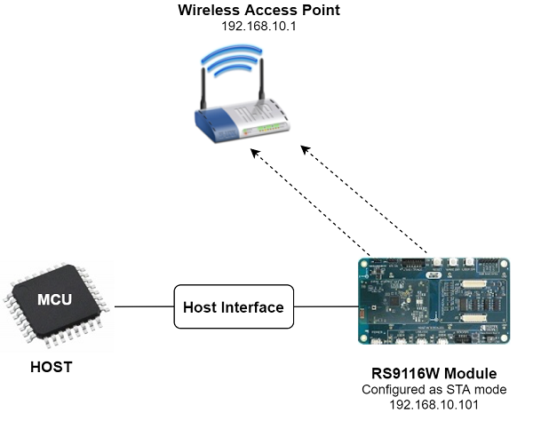

# Station Ping 

## 1. Purpose / Scope

Ping is used diagnostically to ensure that a host computer the user is trying to reach is actually operating. Ping works by sending an Internet Control Message Protocol (ICMP) Echo Request to a specified interface on the network and waiting for a reply. Ping can be used for troubleshooting to test connectivity and determine response time.
The application demonstrates how to configure Silicon Labs device in client mode to send ping request to target IP address .

## 2. Prerequisites / Setup Requirements

Before running the application, the user will need the following things to setup.

### 2.1 Hardware Requirements
- Windows PC with Host interface (UART / SPI/ SDIO).
- Silicon Labs [RS9116 Wi-Fi Evaluation Kit](https://www.silabs.com/development-tools/wireless/wi-fi/rs9116x-sb-evk-development-kit) 
- Host MCU Eval Kit. This example has been tested with:
  - Silicon Labs [WSTK + EFR32MG21](https://www.silabs.com/development-tools/wireless/efr32xg21-bluetooth-starter-kit)
  - Silicon Labs [WSTK + EFM32GG11](https://www.silabs.com/development-tools/mcu/32-bit/efm32gg11-starter-kit)
  - [STM32F411 Nucleo](https://st.com/) 
- Wireless Access Point
- Silicon Labs module
- A TCP server application running on the Windows PC2 (This example uses iperf for windows )



### 2.2 Software Requirements

- [WiSeConnect SDK](https://github.com/SiliconLabs/wiseconnect-wifi-bt-sdk/) 
- Embedded Development Environment
  
   - For STM32, use licensed [Keil IDE](https://www.keil.com/demo/eval/arm.htm)

   - For Silicon Labs EFx32, use the latest version of [Simplicity Studio](https://www.silabs.com/developers/simplicity-studio)

   - A TCP server application running on the Windows PC2 (This example uses iperf for windows )


## 3. Application Build Environment

### 3.1 Platform

The Application can be built and executed on below Host platforms
* [STM32F411 Nucleo](https://st.com/)
* [WSTK + EFR32MG21](https://www.silabs.com/development-tools/wireless/efr32xg21-bluetooth-starter-kit) 
* [WSTK + EFM32GG11](https://www.silabs.com/development-tools/mcu/32-bit/efm32gg11-starter-kit)

### 3.2 Host Interface

* By default, the application is configured to use the SPI bus for interfacing between Host platforms(STM32F411 Nucleo / EFR32MG21) and the RS9116W EVK.
* This application is also configured to use the SDIO bus for interfacing between Host platforms(EFM32GG11) and the RS9116W EVK.

### 3.3 Project Configuration

The Application is provided with the project folder containing Keil and Simplicity Studio project files.

* Keil Project
  - The Keil project is used to evaluate the application on STM32.
  - Project path: `<SDK>/examples/snippets/wlan/station_ping/projects/station_ping-nucleo-f411re.uvprojx`

* Simplicity Studio
  - The Simplicity Studio project is used to evaluate the application on EFR32MG21.
  - Project path: 
    - If the Radio Board is **BRD4180A** or **BRD4181A**, then access the path `<SDK>/examples/snippets/wlan/station_ping/projects/station_ping-brd4180a-mg21.slsproj`
    - If the Radio Board is **BRD4180B** or **BRD4181B**, then access the path `<SDK>/examples/snippets/wlan/station_ping/projects/station_ping-brd4180b-mg21.slsproj`
        - User can find the Radio Board version as given below 

 

  - EFM32GG11 platform
    - The Simplicity Studio project is used to evaluate the application on EFM32GG11.
      - Project path:`<SDK>/examples/snippets/wlan/station_ping/projects/station_ping-brd2204a-gg11.slsproj`
    
### 3.4 Bare Metal/RTOS Support

This application supports bare metal and RTOS environment. By default, the application project files (Keil and Simplicity Studio) are provided with bare metal configuration. 


## 4. Application Configuration Parameters

User has to configure the below parameters for executing the application.

## 4.1 Open rsi_station_ping.c file and update/modify following macros,

   
SSID refers to the name of the Access point.
    
```c
#define SSID                                    "SILABS_AP"
```
    
   CHANNEL_NO refers to the channel in which device should scan. If it is 0,device will scan all channels.
    
```c
#define CHANNEL_NO                              0
```

   SECURITY_TYPE refers to the type of security. In this application STA supports Open, WPA-PSK, WPA2-PSK securities.
   
   Valid configuration is:
   
   - RSI_OPEN - For OPEN security mode
   
   - RSI_WPA - For WPA security mode
   
   - RSI_WPA2 - For WPA2 security mode
   
```c
#define SECURITY_TYPE                           RSI_WPA2
```
  
   AP_BSSID  refer  to BSSID of AP, join based up on BSSID (Example : If two Access points had same SSID then at the time based on this BSSID,module will join to particular AP). This feature is valid only if  RSI_JOIN_FEAT_BIT_MAP set to RSI_JOIN_FEAT_BSSID_BASED in the rsi_wlan_config.h file.
   
```c
#define AP_BSSID                                    { }
```
  
   PSK refers to the secret key if the Access point configured in WPA-PSK/WPA2-PSK security modes.
   
```c
#define PSK "1234567890"
```    
    
   **To configure IP address**
   
   DHCP_MODE refers whether IP address configured through DHCP or STATIC
   
```c
#define DHCP_MODE                               1`
```   
> Note
> If user wants to configure STA IP address through DHCP then set DHCP_MODE to 1 and skip configuring the following DEVICE_IP,GATEWAY and NETMASK macros.
> (Or)
> If user wants to configure STA IP address through STATIC then set DHCP_MODE macro to "0" and configure following DEVICE_IP, GATEWAY and NETMASK macros.
     
   IP address to be configured to the device in STA mode should be in long format and in little endian byte order.
   
   Example: To configure "192.168.10.10" as IP address, update the macro **DEVICE_IP** as **0x0A0AA8C0**.
   
```c
#define DEVICE_IP                               0X0A0AA8C0
```
  
   IP address of the gateway should also be in long format and in little endian byte order
   
   Example: To configure "192.168.10.1" as Gateway, update the macro **GATEWAY** as **0x010AA8C0**  
   
```c
#define GATEWAY                                 0x010AA8C0
```

   IP address of the network mask should also be in long format and in little endian byte order
   
   Example: To configure "255.255.255.0" as network mask, update the macro **NETMASK** as **0x00FFFFFF**  
   
```c
#define NETMASK                                 0x00FFFFFF
```

   Configure following macro stoping initiate ping with the remote peer
   
   IP address of the remote peer (AP IP address).
   
   Example: To configure "192.168.10.1" as REMOTE_IP, update the macro **REMOTE_IP** as **0x0A0AA8C0**.
   
```c
#define REMOTE_IP                               0x010AA8C0
```
  
   PING_SIZE refers the size of ping packet.
   
```c
#define PING_SIZE                               100
```
  
   NUMBER_OF_PACKETS refers how many number of pings to send from device.
    
```c
#define NUMBER_OF_PACKETS                       1000
```  
   
   Application memory length which is required by the driver
   
```c
#define GLOBAL_BUFF_LEN                         15000
```
   
   User can connect to access point through PMK
   
   To Enable keep 1 else 0
    
```c
#define CONNECT_WITH_PMK                         0`
```
  
> **Note:** If `CONNECT_WITH_PMK` is enable ,`SECURITY_TYPE` is set to `RSI_WPA2_PMK`
   
## 4.2 Open ***rsi\_wlan\_config.h*** file and update/modify following macros,
   
```c
#define CONCURRENT_MODE                         RSI_DISABLE
#define RSI_FEATURE_BIT_MAP                     FEAT_SECURITY_OPEN
#define RSI_TCP_IP_BYPASS                       RSI_DISABLE
#define RSI_TCP_IP_FEATURE_BIT_MAP             (TCP_IP_FEAT_DHCPV4_CLIENT| TCP_IP_FEAT_ICMP)
#define RSI_CUSTOM_FEATURE_BIT_MAP              FEAT_CUSTOM_FEAT_EXTENTION_VALID
#define RSI_EXT_CUSTOM_FEAT_BIT_MAP             EXT_FEAT_256k_MODE
#define RSI_BAND                                RSI_BAND_2P4GHZ

/* ping response timeout in seconds */
    
#define RSI_PING_REQ_TIMEOUT      `              1
    
/* If want to join with BSSID of AP,then enable this feature and add BSSID of AP in the rsi_station_ping.c file*/
   
#define  RSI_JOIN_FEAT_BIT_MAP                  RSI_JOIN_FEAT_BSSID_BASED
```
   
> Note: `rsi_wlan_config.h` file is already set with desired configuration in respective example folders user need not change for each example.
  
## 5. Steps for Executing the Application

User has to follow the below steps for the successful execution of the application.

### 5.1 Loading the RS9116W Firmware

Refer [Getting started with a PC](https://docs.silabs.com/rs9116/latest/wiseconnect-getting-started) to load the firmware into RS9116W EVK. The firmware file is located in `<SDK>/firmware/`

### 5.2 Steps for Compiling and Building the Application on the Host Platform

### 5.2.1 Using STM32

Refer [Getting started with STM32](https://docs.silabs.com/rs9116-wiseconnect/latest/wifibt-wc-getting-started-with-stm32/) 

- Open the project `<SDK>/examples/snippets/wlan/station_ping/projects/station_ping-nucleo-f411re.uvprojx` in Keil IDE.
- Build the project
- Debug the project
- Check for the RESET pin:
  - If RESET pin is connected from STM32 to RS9116W EVK, then user need not press the RESET button on RS9116W EVK before free run.
  - If RESET pin is not connected from STM32 to RS9116W EVK, then user need to press the RESET button on RS9116W EVK before free run.
- Free run the project
- Then continue the common steps from **Section 5.3**


### 5.2.2 Using EFX32

Refer [Getting started with EFX32](https://docs.silabs.com/rs9116-wiseconnect/latest/wifibt-wc-getting-started-with-efx32/), for settin-up EFR & EFM host platforms

- Open Simplicity Studio and import the EFR32/EFM32 project from `<SDK>/examples/snippets/wlan/station_ping/projects`
    - Select the appropriate .slsproj as per Radio Board type mentioned in **Section 3.3** for EFR32 board.
   (or)
    - Select the *.brd2204a-gg11.slsproj  for EFM32GG11 board.
- Compile and flash the project in to Host MCU
- Debug the project
- Check for the RESET pin:
  - If RESET pin is connected from STM32 to RS9116W EVK, then user need not press the RESET button on RS9116W EVK before free run
  - If RESET pin is not connected from STM32 to RS9116W EVK, then user need to press the RESET button on RS9116W EVK before free run
- Free run the project
- Then continue the common steps from **Section 5.3**


### 5.3 Common Steps

   1. Configure the Access point in OPEN/WPA-PSK/WPA2-PSK mode to connect Silicon Labs device in STA mode.
   
   2. After the program gets executed, Silicon Labs module configured as client and connects to AP and gets IP.

   3. After successful connection with the Access Point, the device starts sending ping requests to the given **REMOTE_IP** with configured **PING_SIZE** to check availability of target Device.
   
   4. Device sends the number of ping packets configured in **NUMBER_OF_PACKETS**.
   
   5. In rsi_station_ping.c file, **rsi_wlan_ping_async** API returns success status, which means that the ping request packet is successfully sent in to the medium. When actual ping response
      comes from the remote node, it is known from the status parameter of the callback function (**rsi_ping_response_handler**) registered in the Ping API.

## Compressed Debug Logging

To enable the compressed debug logging feature please refer to [Logging User Guide](https://docs.silabs.com/rs9116-wiseconnect/latest/wifibt-wc-sapi-reference/logging-user-guide)