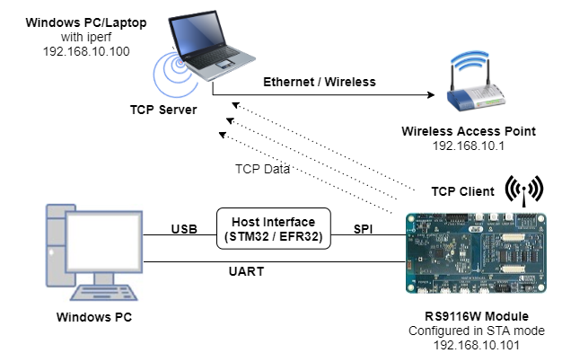
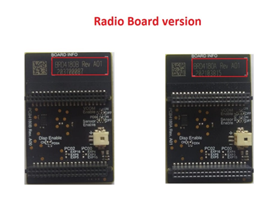
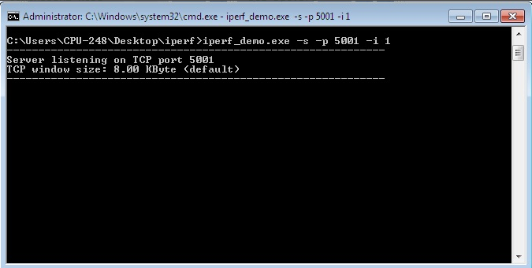
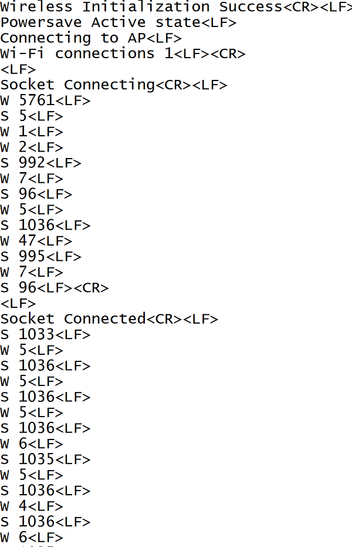

# TCP Logging Stats 

## 1. Purpose / Scope 

This application demonstrates how to open and use a standard TCP client socket in RS9116W EVK and sends data to TCP server socket when power save mode is enabled.

## 2. Prerequisites / Setup Requirements 

Before running the application, the user will need the following things to setup.

### 2.1 Hardware Requirements 
  
- Windows PC with Host interface (UART / SPI)
- Silicon Labs [RS9116 Wi-Fi Evaluation Kit](https://www.silabs.com/development-tools/wireless/wi-fi/rs9116x-sb-evk-development-kit) 
- Host MCU Eval Kit. This example has been tested with:
    - Silicon Labs [WSTK + EFR32MG21](https://www.silabs.com/development-tools/wireless/efr32xg21-bluetooth-starter-kit)
	- Silicon Labs [WSTK + EFM32GG11](https://www.silabs.com/development-tools/mcu/32-bit/efm32gg11-starter-kit)
    - [STM32F411 Nucleo](https://st.com/) 
- Windows PC (Remote PC) with iperf application.



### 2.2 Software Requirements 

- [WiSeConnect SDK](https://github.com/SiliconLabs/wiseconnect-wifi-bt-sdk/) 
- Embedded Development Environment
  
   - For STM32, use licensed [Keil IDE](https://www.keil.com/demo/eval/arm.htm)

   - For Silicon Labs EFx32, use the latest version of [Simplicity Studio](https://www.silabs.com/developers/simplicity-studio)

   - [Iperf Application](https://iperf.fr/iperf-download.php) in the remote PC.


## 3. Application Build Environment 

### 3.1 Platform 

The Application can be built and executed on below Host platforms
* [STM32F411 Nucleo](https://st.com/)
* [WSTK + EFR32MG21](https://www.silabs.com/development-tools/wireless/efr32xg21-bluetooth-starter-kit)
* [WSTK + EFM32GG11](https://www.silabs.com/development-tools/mcu/32-bit/efm32gg11-starter-kit)

### 3.2 Host Interface 

- By default, the application is configured to use the SPI bus for interfacing between Host platforms and the RS9116W EVK.
- The SAPI driver provides APIs to enable other host interfaces if SPI is not suitable for your needs.

### 3.3 Project Configuration 

The Application is provided with the project folder containing Keil and Simplicity Studio project files.

* Keil Project
  - The Keil project is used to evaluate the application on STM32.
  - Project path: `<SDK>/examples/snippets/wlan/tcp_logging_stats/projects/tcp_logging_stats-nucleo-f411re.uvprojx`

* Simplicity Studio
  - The Simplicity Studio project is used to evaluate the application on EFR32MG21.
  - Project path: 
    - If the Radio Board is **BRD4180A** or **BRD4181A**, then access the path `<SDK>/examples/snippets/wlan/tcp_logging_stats/projects/tcp_logging_stats-brd4180a-mg21.slsproj`
    - If the Radio Board is **BRD4180B** or **BRD4181B**, then access the path `<SDK>/examples/snippets/wlan/tcp_logging_stats/projects/tcp_logging_stats-brd4180b-mg21.slsproj`
    - User can find the Radio Board version as given below 



   - EFM32GG11 platform
    - The Simplicity Studio project is used to evaluate the application on EFM32GG11.
      - Project path:`<SDK>/examples/snippets/wlan/tcp_logging_stats/projects/tcp_logging_stats-brd2204a-gg11.slsproj`


### 3.4 Bare Metal/RTOS Support 

This application supports bare metal and RTOS environment. By default, the application project files (Keil and Simplicity studio) are provided with bare metal configuration in the SDK.

## 4. Application Configuration Parameters 

The application can be configured to suit user requirements and development environment. Read through the following sections and make any changes needed. 


### 4.1 Open rsi_wlan_tcp_logging_stats.c file.

#### 4.1.1 User must update the below parameters

SSID refers to the name of the Access point.

```c
#define SSID                                    "SILABS_AP"
```

CHANNEL_NO refers to the channel in which device should scan. If it is 0, device will scan all channels.

```c
#define CHANNEL_NO                              0
```

SECURITY_TYPE refers to the type of security. In this application STA supports Open, WPA-PSK, WPA2-PSK securities.
Valid configuration is:

   - RSI_OPEN - For OPEN security mode

   - RSI_WPA - For WPA security mode

   - RSI_WPA2 - For WPA2 security mode

```c
#define SECURITY_TYPE                           RSI_WPA2
```

PSK refers to the secret key if the Access point configured in WPA-PSK/WPA2-PSK security modes.

```c
#define PSK                                    "1234567890"
```

DEVICE_PORT port refers TCP client port number

```c
#define DEVICE_PORT                            5001
```

SERVER_PORT port refers remote TCP server port number which is opened in windows PC2.

```c
#define SERVER_PORT                            5001
```
  
SERVER_IP_ADDRESS refers remote peer IP address to connect with TCP server socket.

   IP address should be in long format and in little endian byte order.

   Example: To configure "192.168.10.100" as IP address, update the macro DEVICE_IP as 0x640AA8C0.

```c
#define SERVER_IP_ADDRESS                      0x640AA8C0
```


#### 4.1.2 The desired parameters are provided below. User can also modify the parameters as per their needs and requirements.

NUMEBR_OF_PACKETS refers how many packets to send from device to TCP server

```c
#define NUMBER_OF_PACKETS                      1000
```

Application memory length which is required by the driver

```c
#define GLOBAL_BUFF_LEN                        15000
```

DHCP_MODE refers whether IP address configured through DHCP or STATIC

```c
#define DHCP_MODE                              1
```

> Note:
> To configure, STA IP address through DHCP then set DHCP_MODE to "1" and skip configuring the following DEVICE_IP, GATEWAY and NETMASK macros.
> (Or)
> To configure, STA IP address through STATIC then set DHCP_MODE macro to "0" and configure following DEVICE_IP, GATEWAY and NETMASK macros.

IP address to be configured to the device in STA mode should be in long format and in little endian byte order.

   Example: To configure "192.168.10.10" as IP address, update the macro DEVICE_IP as 0x0A0AA8C0.

```c
#define DEVICE_IP                              0X0A0AA8C0 
```

IP address of the gateway should also be in long format and in little endian byte order
   
   Example: To configure "192.168.10.1" as Gateway, update the macro GATEWAY as 0x010AA8C0

```c
#define GATEWAY                                0x010AA8C0
```

IP address of the network mask should also be in long format and in little endian byte order

   Example: To configure "255.255.255.0" as network mask, update the macro NETMASK as 0x00FFFFFF

```c
#define NETMASK                                0x00FFFFFF
```
   
TCP Max retries

```c
#define RSI_MAX_TCP_RETRIES                     10
```

Packet send inetrval time

```c
#define PKT_SEND_INTERVAL                        55000
```

### 4.2 Open rsi_wlan_config.h file. User can also modify the below parameters as per their needs and requirements


```c
#define CONCURRENT_MODE                       RSI_DISABLE
#define RSI_FEATURE_BIT_MAP                   (FEAT_SECURITY_OPEN | FEAT_AGGREGATION | FEAT_ULP_GPIO_BASED_HANDSHAKE)
#define RSI_TCP_IP_BYPASS                     RSI_DISABLE
#define RSI_TCP_IP_FEATURE_BIT_MAP            (TCP_IP_FEAT_EXTENSION_VALID | TCP_IP_FEAT_DHCPV4_CLIENT)
#define RSI_CUSTOM_FEATURE_BIT_MAP            (CUSTOM_FEAT_ASYNC_CONNECTION_STATUS | FEAT_CUSTOM_FEAT_EXTENTION_VALID)
#define RSI_EXT_CUSTOM_FEAT_BIT_MAP           (EXT_FEAT_LOW_POWER_MODE | EXT_FEAT_XTAL_CLK_ENABLE)
#define RSI_EXT_TCPIP_FEATURE_BITMAP          CONFIG_FEAT_EXTENTION_VALID
#define RSI_CONFIG_FEATURE_BITMAP             (RSI_FEAT_SLEEP_GPIO_SEL_BITMAP | ENABLE_ENHANCED_MAX_PSP)
#define RSI_BAND                              RSI_BAND_2P4GHZ
#define RSI_LISTEN_INTERVAL                   1000
#define RSI_SOCKET_KEEPALIVE_TIMEOUT          300
#define RSI_TIMEOUT_SUPPORT                   RSI_DISABLE
#define RSI_TIMEOUT_VALUE                     1500
```   

## 5. Testing the Application 

User has to follow the below steps for the successful execution of the application.

### 5.1 Loading the RS9116W Firmware 

Refer [Getting started with a PC](https://docs.silabs.com/rs9116/latest/wiseconnect-getting-started) to load the firmware into RS9116W EVK. The firmware file is located in `<SDK>/firmware/`


### 5.2 Building the Application on the Host Platform 

#### 5.2.1 Using STM32 

Refer [Getting started with STM32](https://docs.silabs.com/rs9116-wiseconnect/latest/wifibt-wc-getting-started-with-stm32/) 

- Configure STM32 CN10 header pin-30(PB13) should connect to UULP_GPIO_0 and STM32 pin-2 should connect to UULP_GPIO_0.
- Open the project `<SDK>/examples/snippets/wlan/tcp_logging_stats/projects/tcp_logging_stats-nucleo-f411re.uvprojx` 
- Build and Debug the project
- Check for the RESET pin:
  - If RESET pin is connected from STM32 to RS9116W EVK, then user need not press the RESET button on RS9116W EVK before free run.
  - If RESET pin is not connected from STM32 to RS9116W EVK, then user need to press the RESET button on RS9116W EVK before free run.
- Free run the project
- Then continue the common steps from **5.3**


#### 5.2.2 Using EFX32 

Refer [Getting started with EFX32](https://docs.silabs.com/rs9116-wiseconnect/latest/wifibt-wc-getting-started-with-efx32/), for settin-up EFR & EFM host platforms

- Configure EFX32 pin-9(PD03/PB01 GPIO) should connect to UULP_GPIO_0 and EVFX32 pin-7(PD02/PB00 GPIO) should connect to UULP_GPIO_2.
- Open Simplicity Studio and import the project from `<SDK>/examples/snippets/wlan/tcp_logging_stats/projects`
- Select the appropriate .slsproj as per the Radio Board type mentioned in **Section 3.3**
- Compile and flash the project in to Host MCU
- Debug the project
- Check for the RESET pin:
  - If RESET pin is connected from STM32 to RS9116W EVK, then user need not press the RESET button on RS9116W EVK before free run
  - If RESET pin is not connected from STM32 to RS9116W EVK, then user need to press the RESET button on RS9116W EVK before free run
- Free run the project
- Then continue the common steps from **5.3**


### 5.3 Common Steps 

1. Configure the Access point in OPEN/WPA-PSK/WPA2-PSK mode to connect RS9116W EVK in STA mode.
2. Open iperf application in Windows PC2(Remote PC) which is connected to the access point
3. Open TCP server using the below command in command prompt.

  `iperf.exe –s -p <SERVER_PORT> -i 1 -t <Time_interval>`



4. After program gets executed, RS9116W EVK would scan and connect to Access point and get IP.

5. After successful connection, device STA connects to TCP server socket opened on Windows PC2 using TCP client socket and TCP socket will connect and disconnect continuously.

6. After successful connection, user can check below powersave statistics of Wakeup and Sleep times in communication port.

    - W indicates Wakeup time

    - S indicates sleep time



## Compressed Debug Logging

To enable the compressed debug logging feature please refer to [Logging User Guide](https://docs.silabs.com/rs9116-wiseconnect/latest/wifibt-wc-sapi-reference/logging-user-guide)