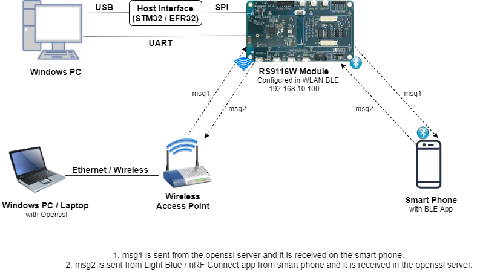
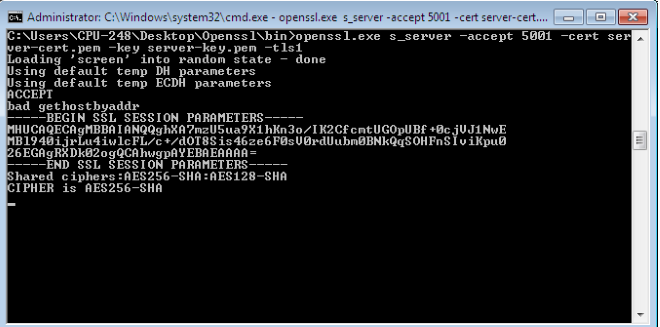
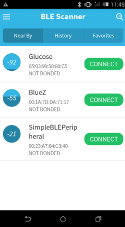
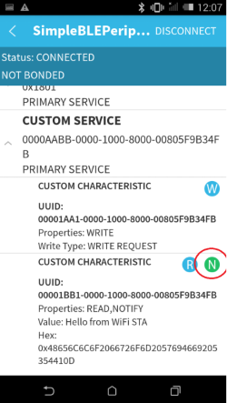
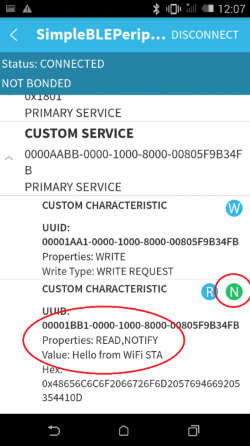
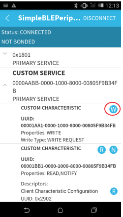
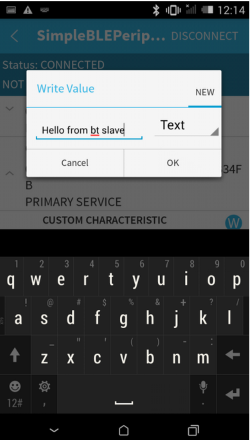
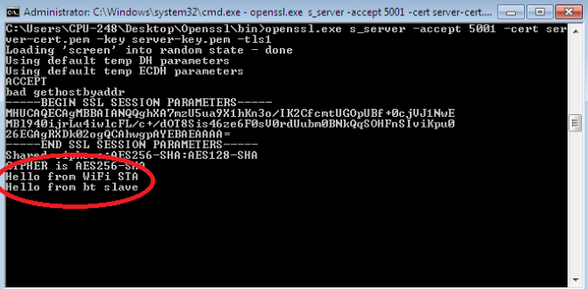

# WLAN Station BLE Bridge

## 1. Purpose / Scope

This example demonstrates how information can be exchanged seamlessly using coexwireless protocols (WLAN and BLE) running in the RS9116W EVK module.
In this coex application, The module connects with remote BTLE device (Smart Phone) and WiFi Access Point in station mode and do the data transfer on both interfaces.

The Application has WLAN and BLE tasks where as smart phone interacts with BLE task and remote PC interacts with WLAN task. When Smartphone connects and sends message to RS9116W EVK, BLE task accepts and sends to WLAN task, which in turn sends to remote PC which is connected to Access Point.
Similarly, when remote PC sends message to RS9116W EVK, the message will be sent to Smartphone via BLE task.Thus messages can be seamlessly transferred between PC and Smartphone.

## 2. Prerequisites / Setup Requirements

Before running the application, the user will need the following things to setup.

### 2.1 Hardware Requirements

- Windows PC with Host interface (UART/ SPI).
- Silicon Labs [RS9116 Wi-Fi Evaluation Kit](https://www.silabs.com/development-tools/wireless/wi-fi/rs9116x-sb-evk-development-kit)
- Host MCU Eval Kit. This example has been tested with:
   - Silicon Labs [WSTK + EFR32MG21](https://www.silabs.com/development-tools/wireless/efr32xg21-bluetooth-starter-kit)
   - [STM32F411 Nucleo](https://st.com/)
- Wireless Access point
- Windows PC2 (Remote PC) with SSL server application (Openssl)
- BTLE supported Smart phone with GATT client application.




### 2.2 Software Requirements

- [WiSeConnect SDK](https://github.com/SiliconLabs/wiseconnect-wifi-bt-sdk/)
    
- Embedded Development Environment

   - For STM32, use licensed [Keil IDE](https://www.keil.com/demo/eval/arm.htm)

   - For Silicon Labs EFx32, use the latest version of [Simplicity Studio](https://www.silabs.com/developers/simplicity-studio)
   
- Download and install OpenSSL from this link [OpenSSL](http://ufpr.dl.sourceforge.net/project/gnuwin32/openssl/0.9.8h-1/openssl-0.9.8h-1-bin.zip) to download openssl in remote PC.

- Download and install the Silicon Labs [EFR Connect App](https://www.silabs.com/developers/efr-connect-mobile-app) in the Android smart phones for testing BLE applications. Users can also use their choice of BLE apps available in Android/iOS smart phones.

### 3. Application Build Environment

### 3.1 Platform

The Application can be built and executed on below Host platforms
* [STM32F411 Nucleo](https://st.com/)
* [WSTK + EFR32MG21](https://www.silabs.com/development-tools/wireless/efr32xg21-bluetooth-starter-kit) 

### 3.2 Host Interface

* By default, the application is configured to use the SPI bus for interfacing between Host platforms and the RS9116W EVK.
* The SAPI driver provides APIs to enable other host interfaces if SPI is not suitable for your needs.

### 3.3 Project Configuration

The Application is provided with the project folder containing Keil and Simplicity Studio project files.

* Keil Project
  - The Keil project is used to evaluate the application on STM32.
  - Project path: `<SDK>/examples/snippets/wlan_ble/wlan_station_ble_bridge/projects/wlan_station_ble_bridge-nucleo-f411re.uvprojx`

* Simplicity Studio
  - The Simplicity Studio project is used to evaluate the application on EFR32MG21.
  - Project path: 
    - If the Radio Board is **BRD4180A** or **BRD4181A**, then access the path `<SDK>/examples/snippets/wlan_ble/wlan_station_ble_bridge/projects/wlan_station_ble_bridge-brd4180a-mg21.slsproj`
    - If the Radio Board is **BRD4180B** or **BRD4181B**, then access the path `<SDK>/examples/snippets/wlan_ble/wlan_station_ble_bridge/projects/wlan_station_ble_bridge-brd4180b-mg21.slsproj` 
    - User can find the Radio Board version as given below 

 


### Bare Metal Support

This application supports only bare metal environment. By default, the application project files (Keil and Simplicity Studio) are provided with bare metal configuration. 

## 4. Application Configuration Parameters

The application can be configured to suit your requirements and development environment. Read through the following sections and make any changes needed.

**4.1** Open `rsi_wlan_app.c` file 

**4.1.1** User must update the below parameters  

SSID refers to the name of the Access point.

```c
#define SSID                                         "SILABS_AP"
```

CHANNEL_NO refers to the channel in which device should scan. If it is 0, device will scan all channels. 

```c
#define CHANNEL_NO                                   0
```

SECURITY_TYPE refers to the type of security. In this application STA supports Open, WPA-PSK, WPA2-PSK securities.

   Valid configuration is: 

   - RSI_OPEN - For OPEN security mode
   - RSI_WPA  - For WPA security mode 
   - RSI_WPA2 - For WPA2 security mode

```c
#define SECURITY_TYPE                                RSI_WPA2
```

PSK refers to the secret key if the Access point configured in WPA-PSK/WPA2-PSK security modes.
 
```c
#define PSK                                          "1234567890"
```

DEVICE_PORT port refers SSL client port number

```c
#define DEVICE_PORT                                  5001
```

SERVER_PORT port refers remote SSL server port number

```c
#define SERVER_PORT                                  5001
```

SERVER_IP_ADDRESS refers remote peer IP address to connect with SSL server socket.

   IP address should be in long format and in little endian byte order.

   Example: To configure "192.168.10.100" as IP address, update the macro SERVER_IP_ADDRESS as 0x640AA8C0.

```c
#define SERVER_IP_ADDRESS                            0x640AA8C0
```

**4.1.2** The desired parameters are provided below. User can also modify the parameters as per their needs and requirements.

To Load certificate:

```c
#define LOAD_CERTIFICATE                             1
```
   If **LOAD_CERTIFICATE** set to 1, application will load certificate which is included using rsi_wlan_set_certificate API.

   By default, application loading "cacert.pem" certificate if **LOAD_CERTIFICATE** enable. In order to load different certificate, user has to follow the following steps:

rsi_wlan_set_certificate API expects the certificate in the form of linear array. So, convert the pem certificate into linear array form using python script provided in the SDK "certificate_to_array.py"

  Ex: If the certificate is wifi-user.pem. Give the command in the following way
  python certificate_to_array.py ca-cert.pem
  Script will generate wifiuser.pem in which one linear array named cacert contains the certificate.

After conversion of certificate, update `rsi_ssl_client.c` source file by including the certificate file and by providing the required parameters to rsi_wlan_set_certificate API.

> Note:
> Once certificate loads into the device, it will write into the device flash. So, user need not load certificate for every boot up unless certificate change.

So, define LOAD_CERTIFICATE as 0, if certificate is already present in the Device.

> Note:
> All the certificates are given in the path `<SDK>/certificates`

To configure IP address

   DHCP_MODE refers whether IP address configured through DHCP or STATIC

```c
#define DHCP_MODE                                    1
```
> Note:
> If user wants to configure STA IP address through DHCP then set DHCP_MODE to "1" and skip configuring the following DEVICE_IP, GATEWAY and NETMASK macros.
> (Or)
> If user wants to configure STA IP address through STATIC then set DHCP_MODE macro to "0" and configure following DEVICE_IP, GATEWAY and NETMASK macros. 

IP address to be configured to the device in STA mode should be in long format and in little endian byte order.

   Example: To configure "192.168.10.10" as IP address, update the macro DEVICE_IP as 0x0A0AA8C0.

```c
#define DEVICE_IP                                    0X0A0AA8C0
```

IP address of the gateway should also be in long format and in little endian byte order

   Example: To configure "192.168.10.1" as Gateway, update the macro GATEWAY as 0x010AA8C0. 

```c
#define GATEWAY                                      0x010AA8C0
```

IP address of the network mask should also be in long format and in little endian byte order

   Example: To configure "255.255.255.0" as network mask, update the macro NETMASK as 0x00FFFFFF.

```c
#define NETMASK                                      0x00FFFFFF
```

**4.2** Open `rsi_ble_app.c` file and update/modify following macros

RSI_BLE\NEW_SERVICE_UUID refers to the attribute value of the newly created service.

```c
#define RSI_BLE_NEW_SERVICE_UUID                     0xAABB
```

RSI_BLE_ATTRIBUTE_1_UUID refers to the attribute type of the first attribute under this service (RSI_BLE_NEW_SERVICE_UUID).

```c
#define RSI_BLE_ATTRIBUTE_1_UUID                      0x1AA1
```

RSI_BLE_ATTRIBUTE_2_UUID refers to the attribute type of the second attribute under this service (RSI_BLE_NEW_SERVICE_UUID).

```c
#define RSI_BLE_ATTRIBUTE_2_UUID                      0x1BB1
```

RSI_BLE_MAX_DATA_LEN refers to the Maximum length of the attribute data.

```c
#define RSI_BLE_MAX_DATA_LEN                          20
```

RSI_BLE_APP_DEVICE_NAME refers name of the RS9116W EVK to appear during scanning by remote devices.

```c
#define RSI_BLE_APP_DEVICE_NAME                       "WLAN_BLE_APP"
```   
   
Following are the **non-configurable** macros in the application.

RSI_BLE_CHAR_SERV_UUID refers to the attribute type of the characteristics to be added in a service.

```c
#define RSI_BLE_CHAR_SERV_UUID                        0x2803
```

RSI_BLE_CLIENT_CHAR_UUID refers to the attribute type of the client characteristics descriptor to be added in a service.

```c
#define RSI_BLE_CLIENT_CHAR _UUID                     0x2902
```
 
RSI_BLE_ATT_PROPERTY_READ is used to set the READ property to an attribute value.

```c
#define RSI_BLE_ATT_PROPERTY_READ                     0x02
```

RSI_BLE_ATT_PROPERTY_WRITE is used to set the WRITE property to an attribute value.

```c
#define RSI_BLE_ATT_PROPERTY_WRITE                    0x08
```

RSI_BLE_ATT_PROPERTY_NOTIFY is used to set the NOTIFY property to an attribute value.

```c
#define RSI_BLE_ATT_PROPERTY_NOTIFY                   0x10
```

BT_GLOBAL_BUFF_LEN refers Number of bytes required by the application and the driver.

```c
#define BT_GLOBAL_BUFF_LEN                            15000
```


**4.3** Open `rsi_wlan_config.h` file. User can also modify the below parameters as per their needs and requirements. 


```c
#define CONCURRENT_MODE                              RSI_DISABLE
#define RSI_FEATURE_BIT_MAP                          FEAT_SECURITY_OPEN
#define RSI_TCP_IP_BYPASS                            RSI_DISABLE
#define RSI_TCP_IP_FEATURE_BIT_MAP                   (TCP_IP_FEAT_DHCPV4_CLIENT | TCP_IP_FEAT_SSL | TCP_IP_TOTAL_SOCKETS_1 | TCP_IP_FEAT_EXTENSION_VALID)
#define RSI_CUSTOM_FEATURE_BIT_MAP                   FEAT_CUSTOM_FEAT_EXTENTION_VALID
#define RSI_EXT_CUSTOM_FEATURE_BIT_MAP               0
#define RSI_EXT_TCPIP_FEATURE_BIT_MAP                EXT_DYNAMIC_COEX_MEMORY
#define RSI_BT_FEATURE_BITMAP             (BT_RF_TYPE | ENABLE_BLE_PROTOCOL)
#define RSI_BAND                                     RSI_BAND_2P4GHZ 
```

## 5. Testing the Application

Follow the below steps for the successful execution of the application.

### 5.1 Loading the RS9116W Firmware

Refer [Getting started with PC ](https://docs.silabs.com/rs9116/latest/wiseconnect-getting-started) to load the firmware into RS9116W EVK. The firmware binary is located in `<SDK>/firmware/`

### 5.2 Building the Application on the Host Platform

#### 5.2.1 Using STM32

Refer [STM32 Getting Started](https://docs.silabs.com/rs9116-wiseconnect/latest/wifibt-wc-getting-started-with-efx32/)  

- Open the project `<SDK>/examples/snippets/wlan_ble/wlan_station_ble_bridge/projects/wlan_station_ble_bridge-f411re.uvprojx` in Keil IDE.
- Build and Debug the project
- Check for the RESET pin:
  - If RESET pin is connected from STM32 to RS9116W EVK, then user need not press the RESET button on RS9116W EVK before free run.
  - If RESET pin is not connected from STM32 to RS9116W EVK, then user need to press the RESET button on RS9116W EVK before free run.
- Free run the project
- Then continue the common steps from **Section 5.3**

### 5.2.2 Using EFX32

Refer [EFx32 Getting Started](https://docs.silabs.com/rs9116-wiseconnect/latest/wifibt-wc-getting-started-with-efx32/)

- Import the project from `<SDK>/examples/snippets/wlan_ble/wlan_station_ble_bridge/projects`
- Select the appropriate .slsproj as per Radio Board type mentioned in **Section 3.3**
- Compile and flash the project in to Host MCU
- Debug the project
- Check for the RESET pin:
  - If RESET pin is connected from STM32 to RS9116W EVK, then user need not press the RESET button on RS9116W EVK before free run
  - If RESET pin is not connected from STM32 to RS9116W EVK, then user need to press the RESET button on RS9116W EVK before free run
- Free run the project
- Then continue the common steps from **Section 5.3**

### 5.3 Common Steps

1. Configure the Access point in OPEN/WPA-PSK/WPA2-PSK mode to connect Silicon Labs device in STA mode.

2. In Windows PC2 which is connected to AP through LAN, Download the Openssl package from above mentioned link and run SSL server by giving following command:

```sh
Openssl.exe s_server -accept<SERVER_PORT> –cert <server_certificate_file_path> -key <server_key_file_path> -tls<tls_version>
Example: openssl.exe s_server –accept 5001 –cert server-cert.pem -key server-key.pem –tls1
```


3. After the program gets executed, Silicon Labs BLE is in Advertising state and WLAN connects to Access Point and establishes SSL connectivity with SSL server opened on Windows PC1. Refer the given below image for connection establishment at windows PC1,



4. Open a BLE scanner App in the Smartphone and do the Scan.

5. In the App, Silicon Labs module device will appear with the name configured in the macro **RSI_BLE_APP_SIMPLE_CHAT (Ex: "WLAN_BLE_SIMPLE_CHAT")** or sometimes observed as RS9116W EVK as internal name "**SimpleBLEPeripheral**".



6. Initiate BLE connection from the App.

7. After successful connection, LE scanner displays the supported services of Silicon Labs module.

8. Select the attribute service which is added **RSI_BLE_NEW_SERVICE_UUID**

  (Ex: 0xAABB) and enable Notification for attribute UUID **RSI_BLE_ATTRIBUTE_2_UUID** **(Ex: 0x1BB1)** to receive data sent by Wi-Fi STA.



9. Now from SSL server opened in Windows PC2 (Remote PC), send a message (Ex: "Hello from WiFi STA") to RS9116W EVK. RS9116W EVK forwards the received message from SSL server to remote BTLE device which is connected to Silicon Labs BTLE device over BTLE protocol. User can observe the message notification on attribute UUID **RSI_BLE_ATTRIBUTE_2_UUID** (Ex: 0x1BB1) in BTLE scanner app.




> Note: 
> rsi_wlan_app_send_to_btle() function is defined in rsi_ble_app.c to send message from WLAN task to BTLE task. 

10. Now send a message (Ex: "Hello from BT peripheral") from GATT client (from smart phone BLE scanner app) using attribute **RSI_BLE_ATTRIBUTE_1_UUID** 
    (Ex: 0x1AA1) to RS9116W EVK. RS9116W EVK forwards the received message from BTLE remote device to SSL server over WiFi protocol. User can observe the message on UDP socket application.


   

   


> Note:
> rsi_bt_app_send_to_wlan() function is defined in rsi_wlan_app.c to send message from BTLE task to WLAN task. 
 
## Compressed Debug Logging

To enable the compressed debug logging feature please refer to [Logging User Guide](https://docs.silabs.com/rs9116-wiseconnect/latest/wifibt-wc-sapi-reference/logging-user-guide)