# WLAN Station BLE Provisioning

##  1. Purpose / Scope

This example demonstrates how to configure/connects RS9116W EVK to get the WLAN connection functionality using BLE provisioning

RS9116W EVK starts advertising in BLE mode and Access Point details are fetched using BLE Provisioning.

RS9116W EVK is configured as a WiFi station and connects to an Access Point.

## 2. Prerequisites / Setup Requirements

Before running the application, the user will need the following things to setup.

### 2.1 Hardware Requirements

*  Windows PC with Host interface(UART/ SPI).
*  Silicon labs [RS9116 Wi-Fi Evaluation Kit](https://www.silabs.com/development-tools/wireless/wi-fi/rs9116x-sb-evk-development-kit)
*  Host MCU Eval Kit. This example has been tested with:
   - Silicon labs [WSTK + EFR32MG21](https://www.silabs.com/development-tools/wireless/efr32xg21-bluetooth-starter-kit)
   - [STM32F411 Nucleo](https://st.com/)
*  Wireless Access point
*  Android Mobile Phone with Silicon labs Connect App.
                     (or)
*  Windows PC with windows Silicon labs connect application.

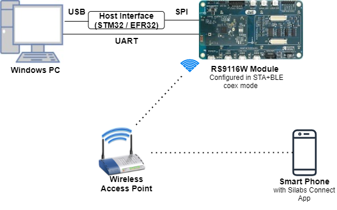
   
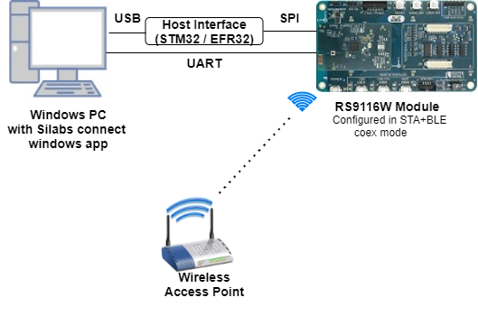

### 2.2 Software Requirements

- [WiSeConnect SDK](https://github.com/SiliconLabs/wiseconnect-wifi-bt-sdk/)
    
- Embedded Development Environment

   - For STM32, use licensed [Keil IDE](https://www.keil.com/demo/eval/arm.htm)

   - For Silicon Labs EFx32, use the latest version of [Simplicity Studio](https://www.silabs.com/developers/simplicity-studio)
   
- User can install any of the below apps to verify WLAN Station BLE Provisioning.

 1. Install Android based Silicon labs Connect APK:
   - Access the apk provided in the path:  `<SDK>/utilities/Silicon_lab_connectApp.apk`
    
 2. Install windows Silicon labs connect application in laptop.
   - Refer the application provided in the path: `<SDK>/utilities/windows_ble_provisioning_app`
   - Follow the instructions provided in the path: `<SDK>/utilities/windows_ble_provisioning_app/Installation_steps_to_run_silabs_connect_windows_application.docx`


## 3. Application Build Environment

### 3.1 Platform

The Application can be built and executed on below Host platforms
* [STM32F411 Nucleo](https://st.com/)
* [WSTK + EFR32MG21](https://www.silabs.com/development-tools/wireless/efr32xg21-bluetooth-starter-kit) 

### 3.2 Host Interface

* By default, the application is configured to use the SPI bus for interfacing between Host platforms and the RS9116W EVK.
* The SAPI driver provides APIs to enable other host interfaces if SPI is not suitable for your needs.

### 3.3 Project Configuration

The Application is provided with the project folder containing Keil and Simplicity Studio project files. 
* Keil Project: 
  - The Keil project can be executed on STM32 platform.
  - Project path: `<SDK>/examples/snippets/wlan_ble/wlan_station_ble_provisioning/projects/wlan_station_ble_provisioning-nucleo-f411re.uvprojx`

* Simplicity Studio:
  - The Simplicity Studio project can be executed on EFR32MG21.
  - Project path: 
    - If the Radio Board is **BRD4180A** or **BRD4181A**, then access the path `<SDK>/examples/snippets/wlan_ble/wlan_station_ble_provisioning/projects/wlan_station_ble_provisioning/projects-brd4180a-mg21.slsproj` 
    - If the Radio Board is **BRD4180B** or **BRD4181B**, then access the path `<SDK>/examples/snippets/wlan_ble/wlan_station_ble_provisioning/projects/wlan_station_ble_provisioning/projects-brd4180b-mg21.slsproj` 
    - User can find the Radio Board version as given below

 


### Bare Metal/RTOS Support

The Application supports both FreeRTOS and bare metal configurations.

- By default, the application project files (Keil and Simplicity Studio) are provided with RTOS enabled in the SDK, so the application can be tested/validated under OS environment. 
- Follow the below steps for changing the project configuration in Keil and Simplicity Studio  to test the application in the bare metal environment.
   - **Steps to configure project settings in Keil IDE**
    - Open project in Keil IDE and click on 'Options for Target'
    - Go to 'C/C++' tab and remove 'RSI_WITH_OS' macro present under Preprocessor Symbols
    - Click on 'OK' button to save the settings


   - **Steps to configure project settings in Simplicity Studio**
    - Open project in Simplicity Studio
    - Right click on the project and choose 'Properties'
    - GO to 'C/C++ Build' | 'Settings' | 'GNU ARM C Compiler' | 'Symbols' and remove macro 'RSI_WITH_OS=1'
    - Click on 'Apply' and 'OK' to save the settings

 

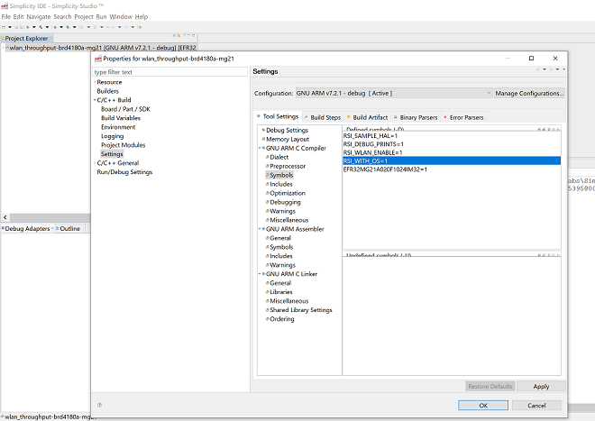 


## 4. Application Configuration Parameters

The application can be configured to suit your requirements and development environment. Read through the following sections and make any changes needed.

**4.1** Open `main.c` file

Memory length for driver

```c
#define GLOBAL_BUFF_LEN                            15000
```

The following parameters are configured if OS is used. 

Task Priotrities should be given as below. Application task priority should be given as low priority and Driver task priority should be given as highest priority

```c
#define RSI_APPLICATION_TASK_PRIORITY                 1
#define RSI_BLE_TASK_PRIORITY                         2
#define RSI_DRIVER_TASK_PRIORITY                      3
```
   
Application Task stack size is configured by this macro

```c
#define RSI_APPLICATION_TASK_STACK_SIZE             1000
```

BLE Task stack size is configured by this macro

```c
#define RSI_BLW_TASK_STACK_SIZE                     1000
```
   
Driver Task stack size is configured by this macro

```c
#define RSI_DRIVER_TASK_STACK_SIZE                  2000
```

**4.2** Open `rsi_wlan_app.c` file and update/modify following macro

Memory length for the send buffer

```c
#define BUF_SIZE                                    1600
```


**4.3** Open `rsi_wlan_config.h` file 


```c
#define CONCURRENT_MODE                          RSI_DISABLE
#define RSI_FEATURE_BIT_MAP                      (FEAT_SECURITY_OPEN | FEAT_AGGREGATION)
#define RSI_TCP_IP_BYPASS                        RSI_DISABLE
#define RSI_TCP_IP_FEATURE_BIT_MAP               (TCP_IP_FEAT_DHCPV4_CLIENT | TCP_IP_TOTAL_SOCKETS_1 | TCP_IP_FEAT_EXTENSION_VALID) 
#define RSI_CUSTOM_FEATURE_BIT_MAP               FEAT_CUSTOM_FEAT_EXTENTION_VALID
#define RSI_EXT_CUSTOM_FEATURE_BIT_MAP           0   
#define RSI_EXT_TCPIP_FEATURE_BIT_MAP            EXT_DYNAMIC_COEX_MEMORY
#define RSI_BAND                                 RSI_BAND_2P4GHZ
#define RSI_BT_FEATURE_BITMAP                    (BT_RF_TYPE | ENABLE_BLE_PROTOCOL)
```

> Note: 
> rsi_wlan_config.h, rsi_bt_config.h and rsi_ble_config.h files are already set with the above desired configuration for this example.


**4.4** Open `rsi_ble_app.c` file and update/modify following macros

RSI\_BLE\_CHAR\_SERV\_UUID refers to the attribute type of the characteristics to be added in a service.
   
```c
#define  RSI_BLE_CHAR_SERV_UUID                         0x2803
```

RSI\_BLE\_CLIENT\_CHAR\_UUID refers to the attribute type of the client characteristics descriptor to be added in a service.
    
```c
#define RSI_BLE_CLIENT_CHAR_UUID                        0x2902
```

RSI\_BLE\_NEW\_SERVICE\_UUID refers to the attribute value of the newly created service.

```c
#define  RSI_BLE_NEW_SERVICE_UUID                       0xAABB
```

RSI\_BLE\_ATTRIBUTE\_1\_UUID refers to the attribute type of the first attribute under this service (RSI_BLE_NEW_SERVICE_UUID).

```c
#define  RSI_BLE_ATTRIBUTE_1_UUID                        0x1AA1
```

RSI\_BLE\_ATTRIBUTE\_2\_UUID refers to the attribute type of the second attribute under this service (RSI_BLE_NEW_SERVICE_UUID).

```c
#define RSI_BLE_ATTRIBUTE_2_UUID                         0x1BB1
```

RSI\_BLE\_ATTRIBUTE\_3\_UUID refers to the attribute type of the third attribute under this service (RSI_BLE_NEW_SERVICE_UUID).

```c
#define RSI_BLE_ATTRIBUTE_3_UUID                         0x1CC1
```

RSI\_BLE\_MAX\_DATA\_LEN refers to the Maximum length of the attribute data.

```c
#define RSI_BLE_MAX_DATA_LEN                             66
```

RSI\_BLE\_APP\_DEVICE\_NAME refers to the name of the RS9116W EVK to appear during scanning by remote devices.

```c
#define  RSI_BLE_APP_DEVICE_NAME                         "BLE_CONFIGURATOR"
```

The following are the **non-configurable** macros in the application.

RSI_BLE_ATT_PROPERTY_READ is used to set the READ property to an attribute value.

```c
#define  RSI_BLE_ATT_PROPERTY_READ                       0x02
```

RSI\_BLE\_ATT\_PROPERTY\_WRITE is used to set the WRITE property to an attribute value.

```c
#define RSI_BLE_ATT_PROPERTY_WRITE                       0x08
```

RSI\_BLE_ATT\_PROPERTY\_NOTIFY is used to set the NOTIFY property to an attribute value.

```c
#define  RSI_BLE_ATT_PROPERTY_NOTIFY                     0x10
```

BT\_GLOBAL\_BUFF\_LEN refers to the number of bytes required by the application and the driver.

```c
#define  BT_GLOBAL_BUFF_LEN                              15000
```

## 5. Testing the Application

Follow the below steps for the successful execution of the application.

### 5.1 Loading the RS9116W Firmware

Refer [Getting started with PC ](https://docs.silabs.com/rs9116/latest/wiseconnect-getting-started) to load the firmware into RS9116W EVK. The firmware binary is located in `<SDK>/firmware/`

### 5.2 Building the Application on the Host Platform

### 5.2.1 Using STM32

Refer [STM32 Getting Started](https://docs.silabs.com/rs9116-wiseconnect/latest/wifibt-wc-getting-started-with-efx32/)  

- Open the project `<SDK>/examples/snippets/wlan_ble/wlan_station_ble_provisioning/projects/wlan_station_ble_provisioning-nucleo-f411re.uvprojx` in Keil IDE.
- Build and Debug the project
- Check for the RESET pin:
  - If RESET pin is connected from STM32 to RS9116W EVK, then user need not press the RESET button on RS9116W EVK before free run.
  - If RESET pin is not connected from STM32 to RS9116W EVK, then user need to press the RESET button on RS9116W EVK before free run.
- Free run the project
- Then continue the common steps from **Section 5.3**

### 5.2.2 Using EFX32

Refer [EFx32 Getting Started](https://docs.silabs.com/rs9116-wiseconnect/latest/wifibt-wc-getting-started-with-efx32/)

- Import the project from `<SDK>/examples/snippets/wlan_ble/wlan_station_ble_provisioning/projects`
- Select the appropriate .slsproj as per Radio Board type mentioned in **Section 3.3**
- Compile and flash the project in to Host MCU
- Debug the project
- Check for the RESET pin:
  - If RESET pin is connected from STM32 to RS9116W EVK, then user need not press the RESET button on RS9116W EVK before free run
  - If RESET pin is not connected from STM32 to RS9116W EVK, then user need to press the RESET button on RS9116W EVK before free run
- Free run the project
- Then continue the common steps from **Section 5.3**

### 5.3 Steps to verify the WLAN Station BLE Provisioning Example

#### 5.3.1 Steps to be followed to verify WLAN Station BLE Provisioning with Android Silicon Labs Connect App

1. Configure the Access point with internet connection in OPEN/WPA-PSK/WPA2-PSK mode to connect the RS9116W EVK in STA mode.
2. Connect any serial console for prints.
3. When RS9116W EVK enters BLE advertising mode, launch the Silicon Labs Connect App.


4. Click on BLE Provisioning.

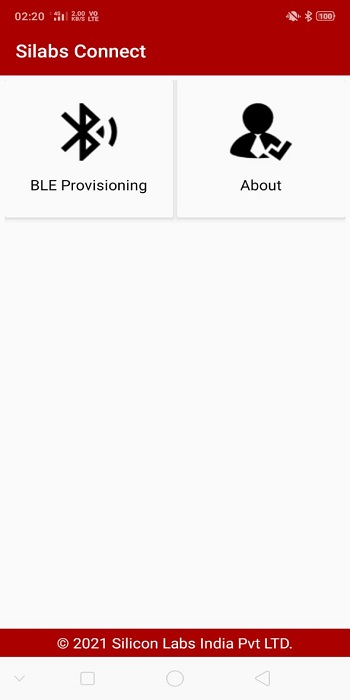

5. Click on BLE_CONFIGURATOR.

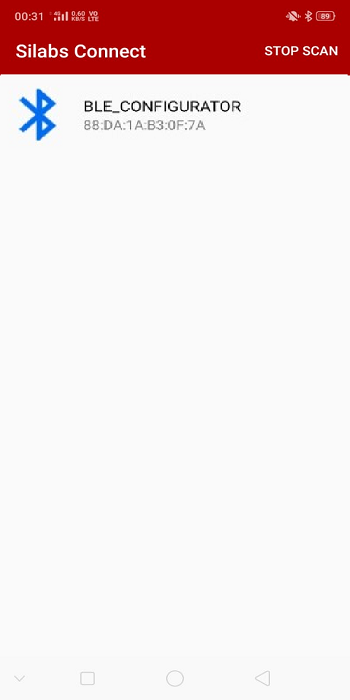

6. Once the BLE got the connected, list of available Access Points get displayed on the screen

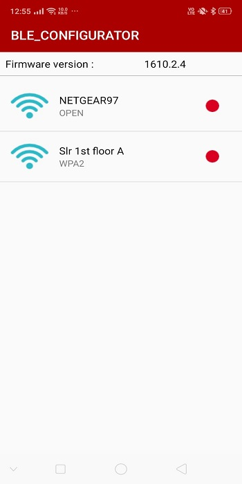

7. Connect to an Access Point, once the RS9116W EVK gets connected to AP, IP address of RS9116W EVK get displyed on the screen

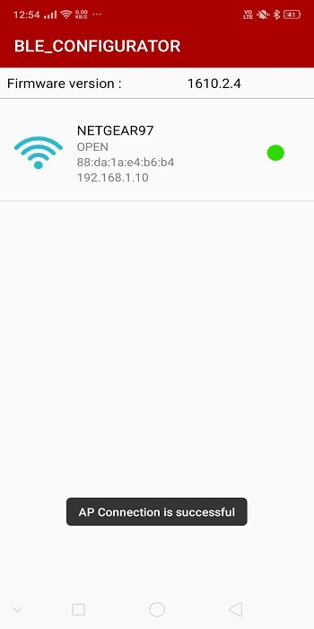

8. To disconnect from Access Point, click on connected AP and click on YES 

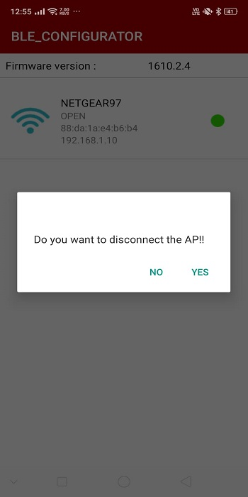

9. Refer the below figure for console prints

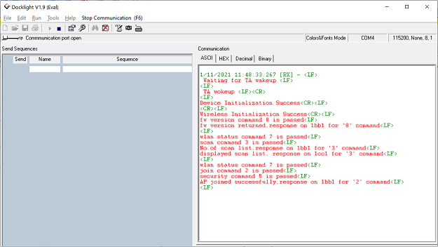
   
#### 5.3.2 Steps to be followed to verify WLAN Station BLE Provisioning with windows based Silicon Labs Connect App

1. Configure the Access point with internet connection in OPEN/WPA-PSK/WPA2-PSK mode to connect the RS9116W EVK in STA mode.
2. Connect any serial console for prints.

   **Note:** Turn on BT in the PC.

3. Go to folder  `<SDK>/utilities/windows_ble_provisioning_app` and Run **Silabs_Connect.py** in the command prompt. 
  
4. Executing the application in the command prompt as stated in the above point will open the GUI (with the “BLE SCAN ON� button.

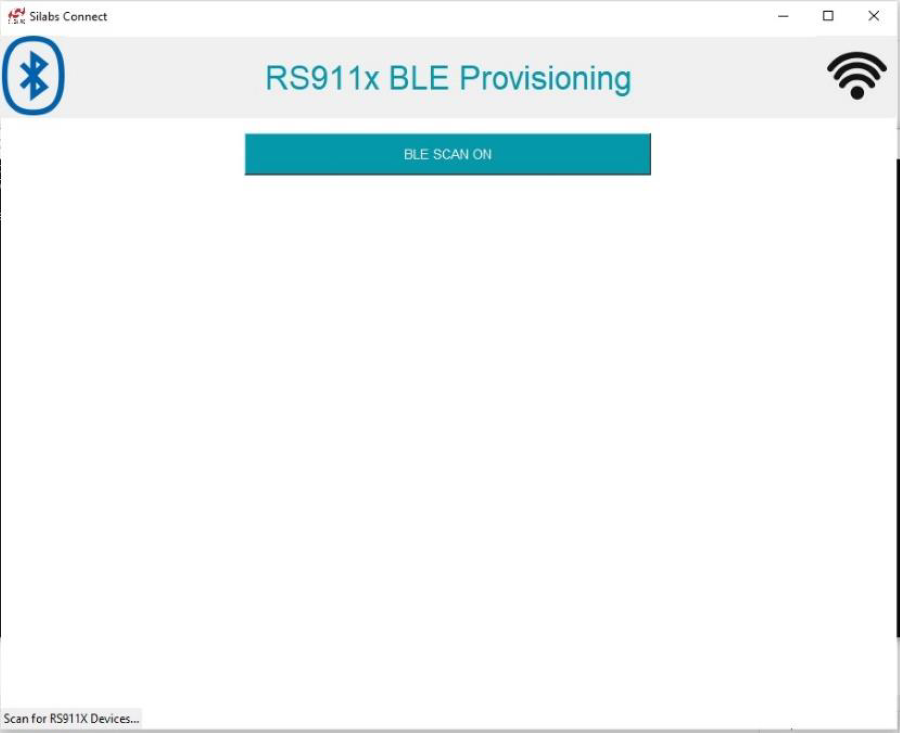
   
5. When click on the **BLE SCAN ON** button, all the RS9116 BLE Devices that are available nearby are displayed in the window.
   
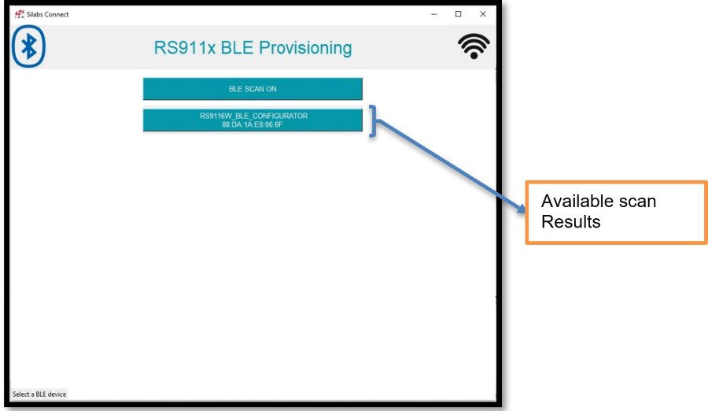
   
   **Note:** - RS9116 BLE device will advertise with different names based on the application configuration.
 
6. Once RS9116 BLE device displayed on the scanning list, initiate the connection by clicking a button on the available RS9116 BLE device.

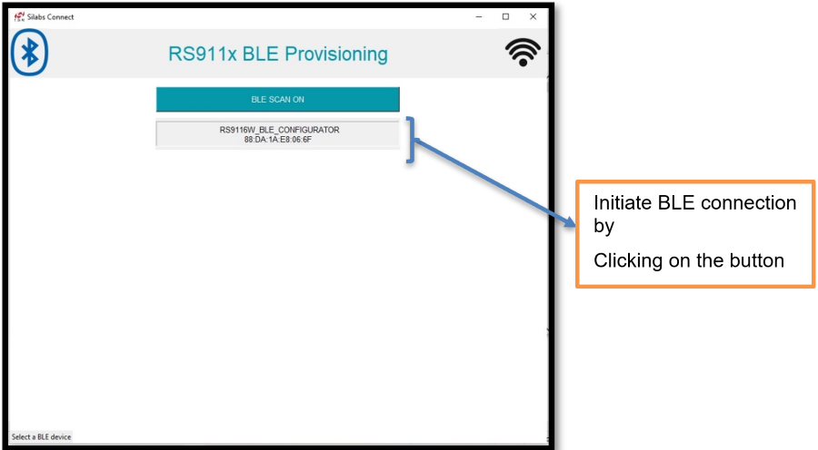
   
7. Once the BLE get connected, **Firmware version** and list of available Access Points get displayed on the screen.

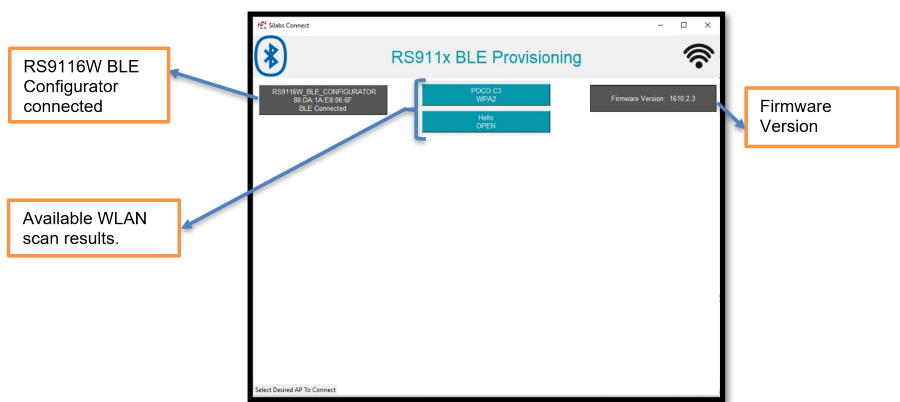
   
8. By clicking on one of the scanned AP’s, RS9116 will connect to that particular AP. If Access Point is secured it will ask the password as input but if that Access point as not secured, then directly connect to that Access Point.

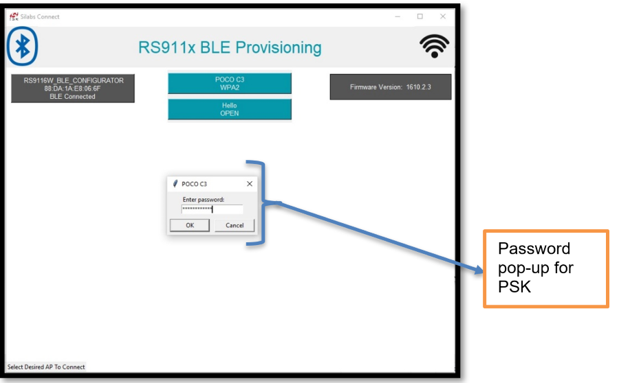
   
9. After successful connection, “IP & Mac address� of connected Access point get displayed.

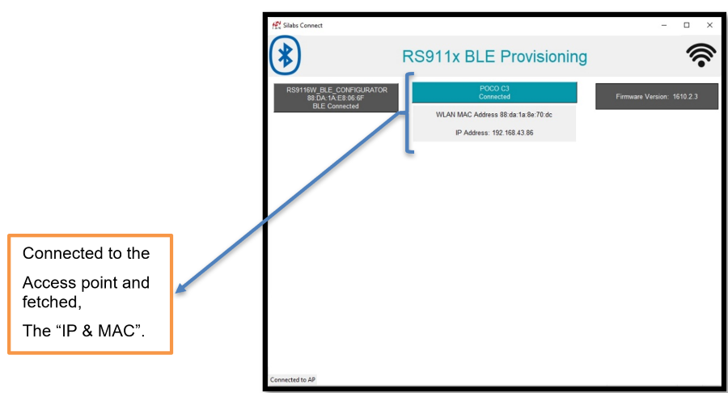
  
10. To disconnect from Access Point, click on connected AP.

11. After successful disconnection of WLAN, pop-up comes like **WLAN GOT DISCONNECTED**. Click on the “ok�.

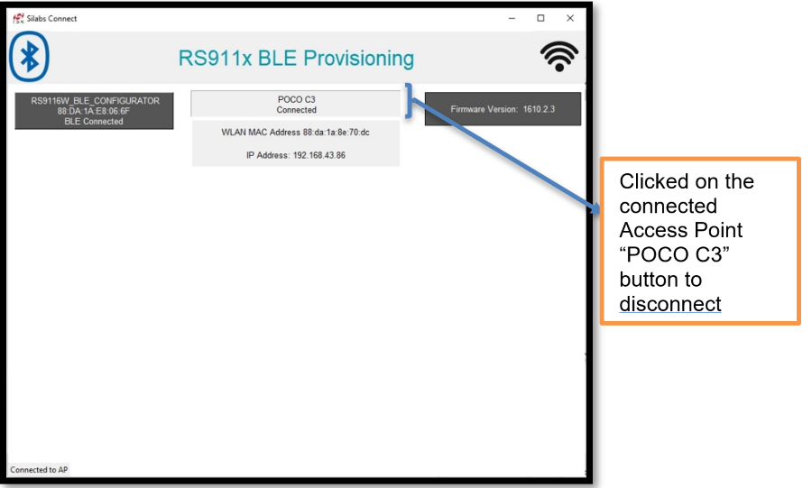
   


   **Note:**   For more information refer **Silabs_Connect_Windows_Application_User_Guide.pdf** in the path 
   `<SDK>/utilities/windows_ble_provisioning_app/`

## Compressed Debug Logging

To enable the compressed debug logging feature please refer to [Logging User Guide](https://docs.silabs.com/rs9116-wiseconnect/latest/wifibt-wc-sapi-reference/logging-user-guide)