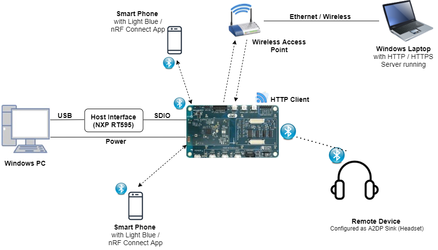
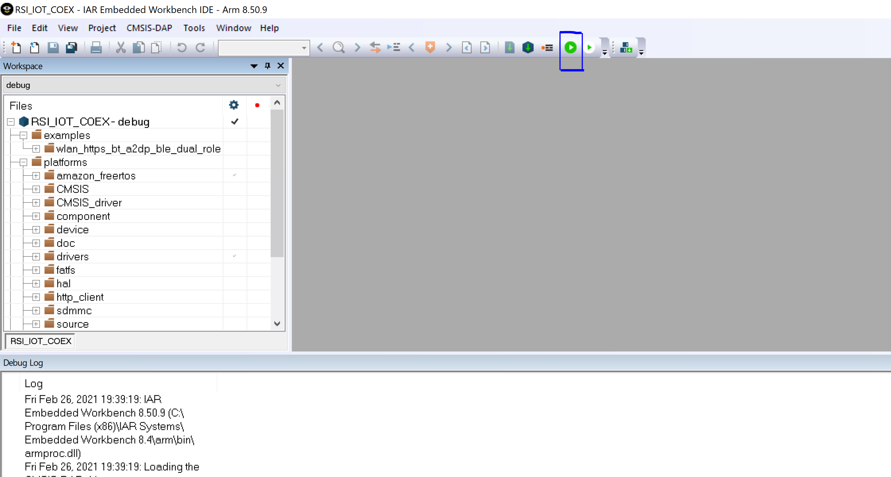

# WLAN HTTP/HTTPS BT A2DP BLE Dual Role

## 1. Purpose / Scope

The purpose of this example is to demonstrate the simultaneous data transfer from all the radios (BT/BLE/WIFI) of silabs module .

In this application, Silabs module will connect to remote server and downloads the text file from PC acting as Server.

In parallel to WLAN download, BT A2DP audio streaming and 5 BLE connections/data transfers are executed.

Here Silabs module will make A2DP and AVRCP level connections with remote device and transfer the PCM data to remote device in SBC encoded format.

This application provides the user with the ability to configure the individual/combined protocols.
   
## 2. Prerequisites / Setup Requirements

Before running the application, the user will need the following things to setup.

### 2.1 Hardware Requirements

- Windows PC with Host interface(UART/ SDIO).
- Silicon Labs [RS9116 Wi-Fi Evaluation Kit](https://www.silabs.com/development-tools/wireless/wi-fi/rs9116x-sb-evk-development-kit)
- Host Interface - NXP RT595
- BT Remote device(A2DP sink device)



### 2.2 Software Requirements

- [WiSeConnect SDK](https://github.com/SiliconLabs/wiseconnect-wifi-bt-sdk/)
    
- Embedded Development Environment

   - Download and install IAR IDE from this link [IAR IDE](https://www.iar.com/products/architectures/arm/iar-embedded-workbench-for-arm/).
  
   - Get the license  of the  IAR Embedded Workbench IDE  to execute NXP RT595 Reference projects in the package.


## 3. Application Build Environment

### 3.1 Platform

The Application can be built and executed on below Host platform
* NXP RT595.

### 3.2 Host Interface

* By default, the application is configured to use the SDIO bus for interfacing between Host platforms and the RS9116W EVK.

### 3.3 Project Configuration

The Application is provided with the project folder containing IAR project files.

* IAR Project
  - The IAR project is used to evaluate the application on NXP RT595.
  - Project path: `<SDK>/examples/snippets/wlan_bt_ble/wlan_https_bt_a2dp_ble_dual_role/projects/iar/wlan_https_bt_a2dp_ble_dual_role.eww`

### 3.4 RTOS Support

This application supports only RTOS environment. By default, the application project files **IAR IDE** are provided with OS configuration in the release package. 
    
## 4. Application Configuration Parameters

The application can be configured to suit your requirements and development environment. Read through the following sections and make any changes needed.

**4.1** Open `rsi_common_app.h` file and configure below macros.

To enable/disable individual protocols configure below macros in **rsi_common_app.h**

```c
#define RSI_ENABLE_BLE_TEST                          1 //Set this to 0 to disable BLE
```

```c
#define RSI_ENABLE_BT_TEST                          1 //Set this to 0 to disable BT
```

```c
#define RSI_ENABLE_WIFI_TEST                          1 //Set this to 0 to disable WLAN
```

> Note: 
> By default, all protocols are enabled.

Choose the required **operational mode** of RS9116W EVK.

```c
#define RSI_COEX_MODE                                9
```

   Valid Configurations are:

   - 0  - WLAN alone mode
   - 5  - BT alone mode
   - 9  - WLAN + BT + BLE  mode
   - 13 - BLE alone mode

> Note:
> By default, opermode is set to WLAN+BT+BLE 


**4.2** Select **BLE** configurations in `rsi_ble_config.h` file

To select number of BLE connections, configure below macros.

   Set below macro to required slave connections.

```c
#define RSI_BLE_MAX_NBR_SLAVES                       3      //! valid values : 0 to 3
```

   Set below macro to required master connections.

```c
#define RSI_BLE_MAX_NBR_MASTERS                      2       //! valid values : 0 to 2
```
   
> Note: 
> Maximum no. of  RSI_BLE_MAX_NBR_MASTERS can be configured to '2' and RSI_BLE_MAX_NBR_SLAVES to '3'.

If CONNECT_OPTION is set to CONN_BY_NAME, configure below macros.

```c
#define CONNECT_OPTION                               CONN_BY_NAME //CONN_BY_NAME or CONN_BY_ADDR
```

To identify remote device with BD Address/device name.

   Add the remote BLE device name to connect

```c
#define RSI_REMOTE_DEVICE_NAME1                      "slave1"
#define RSI_REMOTE_DEVICE_NAME2                      "slave2"
#define RSI_REMOTE_DEVICE_NAME3                      "slave3"
```
   
If CONNECT_OPTION is set to CONN_BY_ADDR, configure the below macros.

Configure the address type of remote device as either Public Address or Random Address

```c
#define RSI_BLE_DEV_ADDR_TYPE                        LE_PUBLIC_ADDRESS //!LE_PUBLIC_ADDRESS or LE_RANDOM_ADDRESS
```

Add the BD Address of remote BLE device to connect

```c
#define RSI_BLE_DEV_1_ADDR                           "88:DA:1A:FE:2A:2C"
#define RSI_BLE_DEV_2_ADDR                           "7E:E6:5E:30:77:6F"
#define RSI_BLE_DEV_3_ADDR                           "70:1A:69:32:7C:8E
```
   
Configure below macros to select the profile characteristics uuid for data transfer. 

```c
#define RSI_BLE_CLIENT_WRITE_SERVICE_UUID_M1             0x180D //! Heart Rate service uuid
#define RSI_BLE_CLIENT_WRITE_CHAR_UUID_M1                0x2A39 //! Heart Rate control Point
#define RSI_BLE_CLIENT_WRITE_NO_RESP_SERVICE_UUID_M1     0x1802 //! Immediate Alert service uuid
#define RSI_BLE_CLIENT_WRITE_NO_RESP_CHAR_UUID_M1        0x2A06 //! Alert level char uuid
#define RSI_BLE_CLIENT_INIDCATIONS_SERVICE_UUID_M1       0x1809 //! Health thermometer Alert service uuid
#define RSI_BLE_CLIENT_INIDCATIONS_CHAR_UUID_M1          0x2A1C //! Temperature measurement
#define RSI_BLE_CLIENT_NOTIFICATIONS_SERVICE_UUID_M1     0x180D //! Heart Rate service uuid
#define RSI_BLE_CLIENT_NOTIFICATIONS_CHAR_UUID_M1        0x2A37 //! Heart Rate measurement 
```
   
Configure below macros to select each connection configurations 

   `Master1 configurations: (where XX=M1)`

Set below macro to enable secure connection between Silicon Labs device(peripheral) and remote ble device(central)

```c
#define SMP_ENABLE_XX               0  //By default, this macro is set to '0' 
```

Set below macro to add remote device to whitelist

```c
#define ADD_TO_WHITELIST_XX         0  //By default, this macro is set to '0' 
```

Set below macro to discover remote profiles.
 
```c
#define PROFILE_QUERY_XX            1  //By default, this macro is set to '1'
```

Set below macro to enable data transfer between devices

```c
#define DATA_TRANSFER_XX            1  //By default, this macro is set to '1'
```

To select the type of data transfer configure below macros

   Set below macro to receive 'gatt notifications' from remote device.

```c
#define RX_NOTIFICATIONS_FROM_XX    0  //By default, this macro is set to '1'
```

> Note:
> Make sure to set below macros to 0.

Set below macro to receive 'gatt indications' from remote device.

```c
#define RX_INDICATIONS_FROM_XX      0  //By default, this macro is set to '0'
```

Set below macro to Transmit 'gatt notifications' to remote device.

```c
#define TX_NOTIFICATIONS_TO_XX      1  //By default, this macro is set to '1'
```

> Note:
> Make sure to set below macros to 0

```c
#define  TX_WRITES_TO_XX            0  //Set this to 0 
#define  TX_WRITES_NO_RESP_TO_XX    0  //Set this to 0 
#define  TX_INDICATIONS_TO_XX       0  //Set this to 0 
```

Set below macro to Transmit 'gatt write with response' to remote device.

```c
#define TX_WRITES_TO_XX             0  //By default, this macro is set to '0' 
```

Set below macro to Transmit 'gatt write without response' to remote device.

```c
#define TX_WRITES_NO_RESP_TO_XX     0  //By default, this macro is set to '0' 
```

Set below macro to Transmit 'gatt indications to remote device.

```c
#define TX_INDICATIONS_TO_XX        0  //By default, this macro is set to '0' 
```

To select data length extension for each connection configure below macro

   Set below macro to enable data length extension

```c
#define DLE_ON_XX                   0  //By default, this macro is set to '0' 
```

Configure below macros to set connection interval, connection latency and connection supervision timeout.

Below configuration is for connection interval of 45ms, latency 0 and timeout as 400ms

```c
#define CONN_INTERVAL_XX            36
#define CONN_LATENCY_XX             0
#define CONN_SUPERVISION_TIMEOUT_XX  400 
```
   
> Note: 
> Follow the above instructions to configure for remaining connections (slave1(XX = S1), slave2 (XX =S2), slave3(XX=S3) and master2(XX=M2)) 


**4.3** Select BT configurations in `rsi_bt_config.h` file 

Enter the remote BT device address as the value to RSI_BT_REMOTE_BD_ADDR

```c
#define   RSI_BT_REMOTE_BD_ADDR     "EA:D1:01:01:82:4C"
```

To select the role configure below macro

```c
#define     RSI_APP_AVDTP_ROLE                        INITIATOR_ROLE // ACCEPTOR_ROLE
// By default initiator role is selected 
```

Configure below macro for scan and connection

```c
#define 	INQUIRY_ENABLE		1 // 0- connect without scanning, 1- scan and connect
```

Configure below macro to check inquiry + connection

```c
#define     INQUIRY_CONNECTION_SIMULTANEOUS     0 //0 - initiate connection after scanned device found, 1 - initiate connection independent of scanning
```

**4.4** Select WLAN configurations in `rsi_wlan_config.h` file 

Enter the AP Connectivity essential configs as the value to SSID, SECURITY_TYPE and PSK

```c
#define     SSID                    "SILABS_AP"
#define     SECURITY_TYPE           RSI_WPA2 
#define     PSK                     "1234567890"
```

To select the ip, configure below macros


```c
#define     DHCP_MODE               1           // 0 enable or disable
#if !DHCP_MODE                                  // Need to configure manually if DHCP is disabled
#define     DEVICE_IP               0x6500A8C0  // 192.168.0.101
#define     GATEWAY                 0x0100A8C0  // 192.168.0.1
#define     NETMASK                 0x00FFFFFF  // 255.255.255.0
#endif 
```

Configure below macros to make Use of Local HTTP server to download the files.


```c
#define     RSI_DNS_CLIENT    0                 // set to '1' only if using server name instead of server ip address, by default it is set to '0'
#define     RX_DATA           1                 // set to '1' to RX data from remote server
#define     HTTPS_DOWNLOAD    0                 // set to '0' to choose HTTP download
#define     SERVER_IP_ADDRESS "192.168.0.10"    //Local server ip address
#define     DOWNLOAD_FILENAME   "dltestdata32.txt"  // File to download, by default this file is provided in the demo
#define     BYTES_TO_RECEIVE    1048576             // size of file configured under 'DOWNLOAD_FILENAME'
#define     CONTINUOUS_HTTP_DOWNLOAD    1           // set to '1' to download continuously, if reset download happens only once.
#define   CONTINUOUS_HTTP_DOWNLOAD  1           // set to '1' to download continuously, if reset download happens only once.
```

Configure below macros to make Use of Local HTTPS server to download the files.


```c
#define     RSI_DNS_CLIENT    0                 // set to '1' only if using server name instead of server ip address, by default it is set to '0'
#define     RX_DATA           1                 // set to '1' to RX data from remote server
#define     HTTPS_DOWNLOAD    1                 // set to '1' to choose HTTPs download
#define     SERVER_IP_ADDRESS "192.168.0.10"    //Local server ip address
#define     DOWNLOAD_FILENAME   "dltest.txt"    // File to download, by default this file is provided in the demo
#define     BYTES_TO_RECEIVE    6144                // size of file configured under 'DOWNLOAD_FILENAME'
#define     CONTINUOUS_HTTP_DOWNLOAD    1           // set to '1' to download continuously, if reset download happens only once.
```

> Note:
> BY default, when 'HTTPS_DOWNLOAD' is set, SSL and LOAD_CERTIFICATE will be set to '1' as it is required for HTTPS download.


## 5. Testing the Application

Follow the below steps for the successful execution of the application.

### 5.1 Loading the RS9116W Firmware

Refer [Getting started with PC ](https://docs.silabs.com/rs9116/latest/wiseconnect-getting-started) to load the firmware into RS9116W EVK. The firmware binary is located in `<Release_Package>/firmware/`

### 5.2 Building the Application on the NXP RT595 Host Platform


Refer getting started with IAR IDE, `<SDK>/examples/snippets/wlan_bt_ble/wlan_https_bt_a2dp_ble_dual_role/platforms/nxp/rt595RS9116W_with_NXP_RT595_User_Guide` 
- Open the project `<SDK>/examples/snippets/wlan_bt_ble/wlan_https_bt_a2dp_ble_dual_role/projects/iar/wlan_https_bt_a2dp_ble_dual_role.eww`
- Build the project in IAR IDE
- Debug the project
- Check for the RESET pin:
  - If RESET pin is connected from NXP RT595 to RS9116W EVK, then user need not press the RESET button on RS9116W EVK before free run.
  - If RESET pin is not connected as mentioned above, then user need to press the RESET button on RS9116W EVK before free run.
- Free run the project
- Then continue the application steps from **5.2**

### 5.3 Common Steps

1. Open project located in "<SDK>/examples/snippets/wlan_bt_ble/wlan_https_bt_a2dp_ble_dual_role/projects/iar/" and compile it using 'Make' command shown below

     
	 
2. Click on "Download and Debug" button to flash and run the application.

      
	  
      [File path: `/<Release_Package>/resources/scripts/`]

3. Copy the files 'dltestdata32.txt', 'dltest.txt' from below source path and paste in to the destination path.

   [source path: `/<Release_Package>/examples/snippets/wlan_bt_ble/wlan_https_bt_a2dp_ble_dual_role/`] 

   [destination path: `/<Release_Package>/resources/scripts/`] 
	

4. To download the files from local http server, navigate to below folder and run below command.

   [File path: `/<Release_Package>/resources/scripts/`] 

   python simple_http_server.py 80


5. To download the files from local https server, copy ssl certificates 'server-cert.pem' , 'server-key.pem' from below 'source path' and paste in to 'destination path'.

   [source path: `/<Release_Package>/resources/certificates/`] 

   [destination path: `/<Release_Package>/resources/scripts/`] 
   
     Open command prompt, navigate to above destination path and run below command.
   
   openssl s_server -accept 443 -cert server-cert.pem -key server-key.pem -tls1 -WWW

6. After the program gets executed, Module scans for the configured Accesspoint, connects to it and acquires the ip address

7. After acquiring ip address, initiates connection to remote server (ex: simple_http_server.py running in same network where Module is also connected)

8. If connection is successful, Module starts HTTP/HTTPS download along with below BT/BLE operations.

   a. BLE: Module starts advertising and scanning
   b. BT : Module starts BT inquiry
9. If connection is not successful, step5 is repeated untill connection is success

10. While download is happening, module initiates connection to configured headset if found and streams the a2dp audio.

11. To check BLE peripheral connection, scan and initiate connection from nRF connect/dongles.

12. Module accepts the BLE connections if initiated by remote BLE device(max 2 master connections are accepted) and starts data transfer based on the user configuration.

13. To check data transfer, enable Gatt notifications of Module on service characteristic "0x1AA1".

14. If enabled module continuously transmits 20 notifications per connection interval of size 20bytes.

15. To check BLE central connection, advertise the remote ble devices using phone/dongles.

16. Module scans for advertised devices, crosschecks the ble device names/ble device address as configured in application, if matches initiates connection.

17. If BLE connection is successful, Module enables the Gatt notifications of remote device for RSI_BLE_CLIENT_NOTIFICATIONS_CHAR_UUID_M1 (Heart Rate measurement) and receives notifications/connection interval.

> Note: 
> Steps 9 to 12 can be repeated for 2 peripheral connection and steps 13 to 15 can be repeated for 3 central connections based on the RSI_BLE_MAX_NBR_MASTERS and RSI_BLE_MAX_NBR_SLAVES.

18. Verify that all connections are stable, no glitches in audio and also simultaneous data transfer is happening from all the radios of Module

## Compressed Debug Logging

To enable the compressed debug logging feature please refer to [Logging User Guide](https://docs.silabs.com/rs9116-wiseconnect/latest/wifibt-wc-sapi-reference/logging-user-guide)