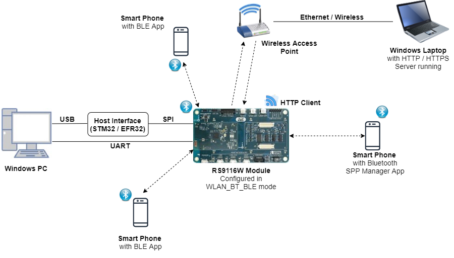

# WLAN HTTPS BT SP BLE Dual Role

## 1. Purpose / Scope

This example demonstrates the ability of RS9116W EVK connecting and transferring the data simultaneously in BT/BLE/WiFi wireless interfaces. 

In the Coex mode (WiFi+BT+BLE), the module will connect to AP and then download the fixed file from PC acting as Server and supports BT/BLE connection/data transfers simultaneously. 

The Application can be configured for the individual protocol execution as well the combination of protocols execution (WiFi+BT, WiFi+BLE, BT+BLE). Two BLE connections (Master and Slave) are supported.

> Note:
> This application is not supported on Silicon Labs EFR32MG21 host. Supported for next release.
   
## 2. Prerequisites / Setup Requirements

Before running the application, the user will need the following things to setup.

### 2.1 Hardware Requirements

- Windows PC with Host interface(UART/ SPI) in case of WiSeConnect.
- Silicon Labs [RS9116 Wi-Fi Evaluation Kit](https://www.silabs.com/development-tools/wireless/wi-fi/rs9116x-sb-evk-development-kit)
- Host MCU Eval Kit. This example has been tested with:
   - Silicon Labs [WSTK + EFR32MG21](https://www.silabs.com/development-tools/wireless/efr32xg21-bluetooth-starter-kit)
   - Silicon Labs [WSTK + EFM32GG11](https://www.silabs.com/development-tools/mcu/32-bit/efm32gg11-starter-kit)
   - [STM32F411 Nucleo](https://st.com/)    
- Wireless Access Point
- Smart phone/tablet with BT Application (Ex: Bluetooth SPP Manager App)
- Smart phone/tablet with BLE Application (Ex: )
- Windows PC2 (Remote PC) with HTTP/HTTPS server running.

   
  

### 2.2 Software Requirements

- [WiSeConnect SDK](https://github.com/SiliconLabs/wiseconnect-wifi-bt-sdk/)
    
- Embedded Development Environment

   - For STM32, use licensed [Keil IDE](https://www.keil.com/demo/eval/arm.htm)

   - For Silicon Labs EFx32, use the latest version of [Simplicity Studio](https://www.silabs.com/developers/simplicity-studio)
   
   - Download and install OpenSSL from this link [OpenSSL](http://ufpr.dl.sourceforge.net/project/gnuwin32/openssl/0.9.8h-1/openssl-0.9.8h-1-bin.zip) to download openssl in remote PC.

- Download and install the Silicon Labs [Bluetooth SPP manager](https://play.google.com/store/apps/details?id=at.rtcmanager&hl=en_IN) in the android smart phones for testing the BT applications.? 


## 3. Application Build Environment

### 3.1 Platform

TThe Application can be built and executed on below Host platforms
* [STM32F411 Nucleo](https://st.com/)
* Silicon Labs [WSTK + EFR32MG21](https://www.silabs.com/development-tools/wireless/efr32xg21-bluetooth-starter-kit)
* Silicon Labs [WSTK + EFM32GG11](https://www.silabs.com/development-tools/mcu/32-bit/efm32gg11-starter-kit)

### 3.2 Host Interface

* By default, the application is configured to use the SPI bus for interfacing between Host platforms(STM32F411 Nucleo / EFR32MG21) and the RS9116W EVK.
* This application is also configured to use the SDIO bus for interfacing between Host platforms(EFM32GG11) and the RS9116W EVK.

### 3.3 Project Configuration

The Application is provided with the project folder containing Keil project files.

* Keil Project
  - The Keil project is used to evaluate the application on STM32.
  - Project path: `<SDK>/examples/snippets/wlan_bt_ble/wlan_https_bt_spp_ble_dual_role/projects/wlan_https_bt_spp_ble_dual_role-nucleo-f411re.uvprojx`

* Simplicity Studio
  - The Simplicity Studio project is used to evaluate the application on EFR32MG21.
  - Project path: 
    - If the Radio Board is **BRD4180A** or **BRD4181A**, then access the path `<SDK>/examples/snippets/wlan_bt_ble/wlan_https_bt_spp_ble_dual_role/projects/wlan_https_bt_spp_ble_dual_role-brd4180a-mg21.slsproj`
    - If the Radio Board is **BRD4180B** or **BRD4181B**, then access the path `<SDK>/examples/snippets/wlan_bt_ble/wlan_https_bt_spp_ble_dual_role/projects/wlan_https_bt_spp_ble_dual_role-brd4180b-mg21.slsproj`
        - User can find the Radio Board version as given below 
		
   

 - EFM32GG11 platform
    - The Simplicity Studio project is used to evaluate the application on EFM32GG11.
      - Project path:`<SDK>/examples/snippets/wlan_bt_ble/wlan_https_bt_spp_ble_dual_role/projects/wlan_https_bt_spp_ble_dual_role-brd2204a-gg11.slsproj`
	  
### 3.4 RTOS Support

The Application supports both FreeRTOS. By default, the application project files (Keil) are provided with RTOS enabled in the SDK. So the application can be tested/validated under OS environment. 
    
## 4. Application Configuration Parameters

The application can be configured to suit your requirements and development environment. Read through the following sections and make any changes needed.

**4.1** Open `rsi_common_config.h` file and configure below macros.

Set below macro to 1 to run **BLE** application

```c
#define RSI_ENABLE_BLE_TEST                          1 //Set this to 0 to disable BLE
```

Set below macro to 1 to run **BT** application

```c
#define RSI_ENABLE_BT_TEST                           1 //Set this to 0 to disable BT
```

Set below macro to 1 to run **WLAN** application

```c
#define RSI_ENABLE_WLAN_TEST                         1 //Set this to 0 to disable WLAN
```

> Note: 
> By default, all protocols are enabled.

Choose the required **operational mode** of RS9116W EVK.

```c
#define RSI_COEX_MODE                                9
```

   Valid Configurations are:

   - 0  - WLAN alone mode
   - 5  - BT alone mode
   - 9  - WLAN + BT + BLE  mode
   - 13 - BLE alone mode

> Note:
> By default, opermode is set to WLAN+BT+BLE 


**4.2** Select **BLE** configurations in `rsi_ble_config.h` file

To select number of BLE connections, configure below macros.

   Set below macro to required slave connections.

```c
#define RSI_BLE_MAX_NBR_SLAVES                       1
```

   Set below macro to required master connections.

```c
#define RSI_BLE_MAX_NBR_MASTERS                      1
```
   
> Note: 
> Maximum no. of  RSI_BLE_MAX_NBR_MASTERS can be configured to '2' and RSI_BLE_MAX_NBR_SLAVES to '3'.

If CONNECT_OPTION is set to CONN_BY_NAME, configure below macros.

```c
#define CONNECT_OPTION                               CONN_BY_NAME //CONN_BY_NAME or CONN_BY_ADDR
```

To identify remote device with BD Address/device name.

   Add the remote BLE device name to connect

```c
#define RSI_REMOTE_DEVICE_NAME1                      "slave1"
#define RSI_REMOTE_DEVICE_NAME2                      "slave2"
#define RSI_REMOTE_DEVICE_NAME3                      "slave3"
```
   
If CONNECT_OPTION is set to CONN_BY_ADDR, configure the below macros.

Configure the address type of remote device as either Public Address or Random Address

```c
#define RSI_BLE_DEV_ADDR_TYPE                        LE_PUBLIC_ADDRESS //!LE_PUBLIC_ADDRESS or LE_RANDOM_ADDRESS
```

Add the BD Address of remote BLE device to connect

```c
#define RSI_BLE_DEV_1_ADDR                           "88:DA:1A:FE:2A:2C"
#define RSI_BLE_DEV_2_ADDR                           "7E:E6:5E:30:77:6F"
#define RSI_BLE_DEV_3_ADDR                           "70:1A:69:32:7C:8E
```
   
Configure below macros to select the profile characteristics uuid for data transfer. 

```c
#define RSI_BLE_CLIENT_WRITE_SERVICE_UUID_M1             0x180D //! Heart Rate service uuid
#define RSI_BLE_CLIENT_WRITE_CHAR_UUID_M1                0x2A39 //! Heart Rate control Point
#define RSI_BLE_CLIENT_WRITE_NO_RESP_SERVICE_UUID_M1     0x1802 //! Immediate Alert service uuid
#define RSI_BLE_CLIENT_WRITE_NO_RESP_CHAR_UUID_M1        0x2A06 //! Alert level char uuid
#define RSI_BLE_CLIENT_INIDCATIONS_SERVICE_UUID_M1       0x1809 //! Health thermometer Alert service uuid
#define RSI_BLE_CLIENT_INIDCATIONS_CHAR_UUID_M1          0x2A1C //! Temperature measurement
#define RSI_BLE_CLIENT_NOTIFICATIONS_SERVICE_UUID_M1     0x180D //! Heart Rate service uuid
#define RSI_BLE_CLIENT_NOTIFICATIONS_CHAR_UUID_M1        0x2A37 //! Heart Rate measurement 
```
   
Configure below macros to select each connection configurations 

   `Master1 configurations: (where XX=M1)`

Set below macro to enable secure connection between Silicon Labs device(peripheral) and remote ble device(central)

```c
#define SMP_ENABLE_XX               0  //By default, this macro is set to '0' 
```

Set below macro to add remote device to whitelist

```c
#define ADD_TO_WHITELIST_XX         0  //By default, this macro is set to '0' 
```

Set below macro to discover remote profiles.
 
```c
#define PROFILE_QUERY_XX            1  //By default, this macro is set to '1'
```

Set below macro to enable data transfer between devices

```c
#define DATA_TRANSFER_XX            1  //By default, this macro is set to '1'
```

To select the type of data transfer configure below macros

   Set below macro to receive 'gatt notifications' from remote device.

```c
#define RX_NOTIFICATIONS_FROM_XX    0  //By default, this macro is set to '1'
```

> Note:
> Make sure to set below macros to 0.

Set below macro to receive 'gatt indications' from remote device.

```c
#define RX_INDICATIONS_FROM_XX      0  //By default, this macro is set to '0'
```

Set below macro to Transmit 'gatt notifications' to remote device.

```c
#define TX_NOTIFICATIONS_TO_XX      1  //By default, this macro is set to '1'
```

> Note:
> Make sure to set below macros to 0

```c
#define  TX_WRITES_TO_XX            0  //Set this to 0 
#define  TX_WRITES_NO_RESP_TO_XX    0  //Set this to 0 
#define  TX_INDICATIONS_TO_XX       0  //Set this to 0 
```

Set below macro to Transmit 'gatt write with response' to remote device.

```c
#define TX_WRITES_TO_XX             0  //By default, this macro is set to '0' 
```

Set below macro to Transmit 'gatt write without response' to remote device.

```c
#define TX_WRITES_NO_RESP_TO_XX     0  //By default, this macro is set to '0' 
```

Set below macro to Transmit 'gatt indications to remote device.

```c
#define TX_INDICATIONS_TO_XX        0  //By default, this macro is set to '0' 
```

To select data length extension for each connection configure below macro

   Set below macro to enable data length extension

```c
#define DLE_ON_XX                   0  //By default, this macro is set to '0' 
```

Configure below macros to set connection interval, connection latency and connection supervision timeout.

Below configuration is for connection interval of 45ms, latency 0 and timeout as 400ms

```c
#define CONN_INTERVAL_XX            36
#define CONN_LATENCY_XX             0
#define CONN_SUPERVISION_TIMEOUT_XX  400 
```
   
> Note: 
> Follow the above instructions to configure for remaining connections (slave1(XX = S1), slave2 (XX =S2), slave3(XX=S3) and master2(XX=M2)) 


**4.3** Select BT configurations in `rsi_bt_config.h` file 

Enter the remote BT device address as the value to RSI_BT_REMOTE_BD_ADDR

```c
#define   RSI_BT_REMOTE_BD_ADDR     "EA:D1:01:01:82:4C"
```

SPP_MODE refers to type of Module Mode, whether its MASTER/SLAVE

```c
#define   SPP_MODE                  SPP_SLAVE 
```

PIN_CODE refers 4 bytes string required for pairing process

```c
#define   PIN_CODE                  "0000" 
```

RSI_BT_LOCAL_NAME refers to name of RS9116W EVK to appear during scanning by remote device

```c
#define   RSI_BT_LOCAL_NAME         "SPP_SLAVE" 
```

**4.4** Select WLAN configurations in `rsi_wlan_config.h` file 

Enter the AP Connectivity essential configs as the value to SSID, SECURITY_TYPE and PSK

```c
#define     SSID                    "SILABS_AP"
#define     SECURITY_TYPE           RSI_WPA2 
#define     PSK                     "1234567890"
```

To select the ip, configure below macros


```c
#define     DHCP_MODE               1           // 0 enable or disable
#if !DHCP_MODE                                  // Need to configure manually if DHCP is disabled
#define     DEVICE_IP               0x6500A8C0  // 192.168.0.101
#define     GATEWAY                 0x0100A8C0  // 192.168.0.1
#define     NETMASK                 0x00FFFFFF  // 255.255.255.0
#endif 
```

Configure below macros to make Use of Local HTTP server to download the files.


```c
#define   RSI_DNS_CLIENT            0           // set to '1' only if using server name instead of server ip address, by default it is set to '0'
#define   HTTPS_DOWNLOAD            0           // set to '0' to choose HTTP download
#define   SERVER_PORT               80          // by default http runs on port 80
#define   SERVER_IP_ADDRESS         "192.168.0.103"   // Local server ip address
#define   DOWNLOAD_FILENAME         "5MB.txt"   // File to download
#define   CONTINUOUS_HTTP_DOWNLOAD  1           // set to '1' to download continuously, if reset download happens only once.
```

Configure below macros to make Use of Local HTTPS server to download the files.


```c
#define   RSI_DNS_CLIENT            0           // set to '1' only if using server name instead of server ip address, by default it is set to '0'
#define   HTTPS_DOWNLOAD            1           // set to '1' to choose HTTPs download
#define   SERVER_PORT               443         // by default https runs on port 443
#define   SERVER_IP_ADDRESS         "192.168.0.101"   // Local server ip address
#define   DOWNLOAD_FILENAME         "5MB.txt"   // File to download, by default this file is provided in the demo
#define   CONTINUOUS_HTTP_DOWNLOAD  1           // set to '1' to download continuously, if reset download happens only once.
```

> Note:
> BY default, when 'HTTPS_DOWNLOAD' is set, SSL and LOAD_CERTIFICATE will be set to '1' as it is required for HTTPS download.


## 5. Testing the Application

Follow the below steps for the successful execution of the application.

### 5.1 Loading the RS9116W Firmware

Refer [Getting started with PC ](https://docs.silabs.com/rs9116/latest/wiseconnect-getting-started) to load the firmware into RS9116W EVK. The firmware binary is located in `<SDK>/firmware/`

### 5.2.1 Building the Application on the STM32 Host Platform


Refer [STM32 Getting Started](https://docs.silabs.com/rs9116-wiseconnect/latest/wifibt-wc-getting-started-with-efx32/)  

- Open the project `<SDK>/examples/snippets/wlan_bt_ble/wlan_throughput_bt_spp_ble_dual_role/projects/wlan_throughput_bt_spp_ble_dual_role-nucleo-f411re.uvprojx` in Keil IDE.
- Build and Debug the project
- Check for the RESET pin:
  - If RESET pin is connected from STM32 to RS9116W EVK, then user need not press the RESET button on RS9116W EVK before free run.
  - If RESET pin is not connected from STM32 to RS9116W EVK, then user need to press the RESET button on RS9116W EVK before free run.
- Free run the project
- Then continue the common steps from **Section 5.3**

#### 5.2.2 Using EFX32

Refer [EFx32 Getting Started](https://docs.silabs.com/rs9116-wiseconnect/latest/wifibt-wc-getting-started-with-efx32/), for settin-up EFR & EFM host platforms

- Import the project from `<SDK>/examples/snippets/wlan_bt_ble/wlan_throughput_bt_spp_ble_dual_role/projects`
- Select the appropriate .slsproj as per Radio Board type mentioned in **Section 3.3**
- Compile and flash the project in to Host MCU
- Debug the project
- Check for the RESET pin:
  - If RESET pin is connected from STM32 to RS9116W EVK, then user need not press the RESET button on RS9116W EVK before free run
  - If RESET pin is not connected from STM32 to RS9116W EVK, then user need to press the RESET button on RS9116W EVK before free run
- Free run the project
- Then continue the common steps from **Section 5.3**


### 5.3 Common Steps

1. Compile the project and flash the binary onto STM32.

2. Before running below commands, make sure the file configured in 'DOWNLOAD_FILENAME' is present under below path
   
   [File path: `/<SDK>/resources/scripts/`]

3. To download the files from local http server, navigate to below folder and run below command.

   [File path: `/<SDK>/resources/scripts/`] 

   python simple_http_server.py 80

4. To download the files from local https server, copy ssl certificates 'server-cert.pem' , 'server-key.pem' from below 'source path' and paste in to 'destination path'.

   [source path: `/<SDK>/resources/certificates/`] 

   [destination path: `/<SDK>/resources/scripts/`] 

     Open command prompt, navigate to above destination path and run below command.
   
   openssl s_server -accept 443 -cert server-cert.pem -key server-key.pem -tls1 -WWW

5. After the program gets executed, module scans for the configured Accesspoint, connects to it and acquires the ip address

6. After acquiring ip address, initiates connection to remote server.(ex: simple_http_server.py running in same network where Module is also connected)

7. If connection is successful,

  - RS9116W EVK starts advertising and scanning BLE

  - Advertises BT and simultaneoulsy downloads http packets sent from remote server

8. If connection is not successful, step 5 is repeated untill connection is success

9. While downloading is happening, user can initiate both the BT SPP and BLE connections (both peripheral and central).

10. To check BLE peripheral connection, scan and initiate connection from nRF connect/dongles.

11. RS9116W EVK accepts the BLE connections if initiated by remote BLE device(max 2 central connections are accepted) and starts data transfer based on the user configuration.

12. To check data transfer, enable Gatt notifications of Module on service characteristic RSI_BLE_ATTRIBUTE_1_UUID

13. If enabled RS9116W EVK continuously transmits 20 notifications per connection interval of size 20bytes.

14. To check BLE central connection, advertise the remote ble devices using phone/dongles.

15. Module scans for advertised devices, crosschecks the ble device names/ble device address as configured in application, if matches initiate connection.

16. If BLE connection is successful, RS9116W EVK enables the Gatt notifications of remote device for RSI_BLE_CLIENT_NOTIFICATIONS_CHAR_UUID_M1 (Heart Rate measurement) and receives notifications/connection interval.

17. While BLE and WLAN data transfer is happening, initiate BT SPP connection using Bluetooth SPP Manager app.

18. After successful BT connection, RS9116W EVK echos the data transmitted from Bluetooth SPP Manager app.

> Note: 
> Steps 9 to 12 can be repeated for 2 peripheral connection and steps 13 to 15 can be repeated for 3 central connections based on the RSI_BLE_MAX_NBR_MASTERS and RSI_BLE_MAX_NBR_SLAVES. Verify that all connections are stable and simultaneous data transfer is happening from all the radios of RS9116W EVK. 

## Compressed Debug Logging

To enable the compressed debug logging feature please refer to [Logging User Guide](https://docs.silabs.com/rs9116-wiseconnect/latest/wifibt-wc-sapi-reference/logging-user-guide)