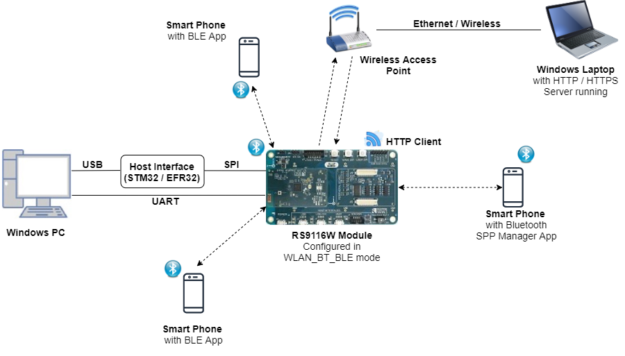

# WLAN Throughput BT SPP BLE Dual Role 

## 1. Purpose / Scope

This example demonstrates throughput measurements of WLAN/BT/BLE in individual or with protocol combinations in the RS9116W EVK.  

The application can measure throughput ranges for TCP/UDP/SSL TX/RX to and from remote servers, while BT/BLE data transfers are in progress. It has provision to control other protocol activities while measuring WLAN/BLE throughputs. 

The Application can be configured for the individual protocol throughput measurement as well the combination of protocols throughputs (WiFi+BT, WiFi+BLE, BT+BLE).

## 2. Prerequisites / Setup Requirements

Before running the application, the user will need the following things to setup.

### 2.1 Hardware Requirements

- Windows PC with Host interface (UART / SPI).
- Silicon Labs [RS9116 Wi-Fi Evaluation Kit](https://www.silabs.com/development-tools/wireless/wi-fi/rs9116x-sb-evk-development-kit)
- Host MCU Eval Kit. This example has been tested with:
  - Silicon Labs [WSTK + EFR32MG21](https://www.silabs.com/development-tools/wireless/efr32xg21-bluetooth-starter-kit)
  - Silicon Labs [WSTK + EFM32GG11](https://www.silabs.com/development-tools/mcu/32-bit/efm32gg11-starter-kit)
  - [STM32F411 Nucleo](https://st.com/)
- Wireless Access Point
- Smart phone/tablet with BT Application (Ex: Bluetooth SPP Manager App)
- Smart phone/tablet with BLE Application (Ex: Light Blue / BLE Connect App)
- Windows PC with iperf and openssl applications.

 


### 2.2 Software Requirements

- [WiSeConnect SDK](https://github.com/SiliconLabs/wiseconnect-wifi-bt-sdk/)
    
- Embedded Development Environment
  
  - For STM32, use licensed [Keil IDE](https://www.keil.com/demo/eval/arm.htm)

  - For Silicon Labs EFx32, use the latest version of [Simplicity Studio](https://www.silabs.com/developers/simplicity-studio)
   
  - Download and install iperf from this link [Iperf Application](https://iperf.fr/iperf-download.php).

  - Download and install OpenSSL from this link [OpenSSL](http://ufpr.dl.sourceforge.net/project/gnuwin32/openssl/0.9.8h-1/openssl-0.9.8h-1-bin.zip) to download openssl in remote PC.

- Download and install the Silicon Labs [EFR Connect App](https://www.silabs.com/developers/efr-connect-mobile-app) in the android smart phones for testing the BLE applications. 

- Download and install the Silicon Labs [Bluetooth SPP manager](https://play.google.com/store/apps/details?id=at.rtcmanager&hl=en_IN) in the android smart phones for testing the BT applications. 

## 3. Application Build Environment

### 3.1 Platform

The Application can be built and executed on below Host platforms
* [STM32F411 Nucleo](https://st.com/)
* [WSTK + EFR32MG21](https://www.silabs.com/development-tools/wireless/efr32xg21-bluetooth-starter-kit)
* Silicon Labs [WSTK + EFM32GG11](https://www.silabs.com/development-tools/mcu/32-bit/efm32gg11-starter-kit)

### 3.2 Host Interface

* By default, the application is configured to use the SPI bus for interfacing between Host platforms(STM32F411 Nucleo / EFR32MG21) and the RS9116W EVK.
* This application is also configured to use the SDIO bus for interfacing between Host platforms(EFM32GG11) and the RS9116W EVK.

### 3.3 Project Configuration

The Application is provided with the project folder containing Keil and Simplicity Studio project files.

To get better throughput, **suggest to run the application under 'O3' optimization**

* Keil Project
  - The Keil project is used to evaluate the application on STM32.
  - Project path: `<SDK>/examples/snippets/wlan_bt_ble/wlan_throughput_bt_spp_ble_dual_role/projects/wlan_throughput_bt_spp_ble_dual_role-nucleo-f411re.uvprojx`
  - Open project in Keil IDE and click on 'Options for Target'
  - Go to 'C/C++' tab and select the Optimization to 'Level 3(-O3)'
  - Click on 'OK' button to save the settings

 


* Simplicity Studio
  - The Simplicity Studio project is used to evaluate the application on EFR32MG21.
  - Project path: 
    - If the Radio Board is **BRD4180A** or **BRD4181A**, then access the path `<SDK>/examples/snippets/wlan_bt_ble/wlan_throughput_bt_spp_ble_dual_role/projects/wlan_throughput_bt_spp_ble_dual_role-brd4180a-mg21.slsproj`
    - If the Radio Board is **BRD4180B** or **BRD4181B**, then access the path `<SDK>/examples/snippets/wlan_bt_ble/wlan_throughput_bt_spp_ble_dual_role/projects/wlan_throughput_bt_spp_ble_dual_role-brd4180b-mg21.slsproj` 
    - User can find the Radio Board version as given below 

 

 - EFM32GG11 platform
    - The Simplicity Studio project is used to evaluate the application on EFM32GG11.
      - Project path:`<SDK>/examples/snippets/wlan/station_ping/projects/station_ping-brd2204a-gg11.slsproj`

  - Open project in Simplicity Studio
  - Right click on the project and choose 'Properties'
  - Go to 'C/C++ Build' → 'Settings' → 'GNU ARM C Compiler' → 'Optimization' and change Optimization level to '-O3'
  - Click on 'Apply' and 'OK' to save the settings.

 


### 3.4 RTOS Support

The Application supports both FreeRTOS. By default, the application project files (Keil and Simplicity studio) are provided with RTOS enabled in the SDK, so the application can be tested/validated under OS environment. 

## 4. Application Configuration Parameters

The application can be configured to suit your requirements and development environment. Read through the following sections and make any changes needed.

### 4.1 WLAN Throughputs

**4.1.1** Open `rsi_common_config.h` file and configure below macros.

This section explains how to configure the application to measure TCP/UDP/SSL unidirectional throughputs in alone or with combination of BT/BLE activities.

Set below macros to 1 to measure **WLAN** alone throughput

```c
#define RSI_ENABLE_WLAN_TEST    1 //Set this to 0 to disable WLAN
#define WLAN_THROUGHPUT_TEST    1 //Set this to 0 while measuring BLE throughput
```
Set below macros to 1 to measure **WLAN** throughput along with specific **BLE** activity.

```c
#define RSI_ENABLE_WLAN_TEST    1 //Set this to 0 to disable WLAN
#define WLAN_THROUGHPUT_TEST    1 //Set this to 0 while measuring BLE throughput
#define RSI_ENABLE_BLE_TEST     1 //Set this to 0 to disable BLE
```

> Note: 
>       
> While measuring WLAN throughput along with BLE activities, ensure 'BLE_THROUGHPUT_TEST' is set to '0'

Set below macros to 1 to measure **WLAN** throughput along with specific **BT** activity.

```c
#define RSI_ENABLE_WLAN_TEST    1 //Set this to 0 to disable WLAN
#define WLAN_THROUGHPUT_TEST    1 //Set this to 0 while measuring BLE throughput
#define RSI_ENABLE_BT_TEST      1 //Set this to 0 to disable BT
```
Set below macros to 1 to measure **WLAN** throughput along with **BT and BLE** activities.

```c
#define RSI_ENABLE_WLAN_TEST    1 //Set this to 0 to disable WLAN
#define WLAN_THROUGHPUT_TEST    1 //Set this to 0 while measuring BLE throughput
#define RSI_ENABLE_BLE_TEST     1 //Set this to 0 to disable BLE
#define RSI_ENABLE_BT_TEST      1 //Set this to 0 to disable BT
```

> Note: 
>   
> While measuring WLAN throughput with BT and BLE activities ensure 'BLE_THROUGHPUT_TEST' is set to '0'
  

If BT/BLE is enabled, configure specific activity of BT/BLE using below macros.

 - **BLE operations**: Set any one of below macros to choose desired BLE activity 

```c
#define BLE_INIT_DONE                       0           //! make it 1 for BLE init only
#define BLE_CONNECTED                       0           //! make it 1 for BLE connection only
#define BLE_DATA_TRANSFER_START             1           //! make it 1 for BLE data transfer
```

 - **BT SPP operations:** Set any of one of below 3 macros to choose desired BT SPP activity 

```c
#define BT_SPP_INIT_DONE                    0           //! make it 1 for BT init only
#define BT_SPP_CONNECT_ONLY                 0           //! make it 1 for BT SPP connection only
#define BT_DATA_TRANSFER_START              1           //! make it 1 for BT SPP data transfer
```

By default, BT_DATA_TRANSFER_START and BLE_DATA_TRANSFER_START are set to '1', that means WLAN measurement will start after BT SPP and BLE Gatt data transfers choose the required **operational mode** of RS9116W EVK.

```c
#define RSI_COEX_MODE           9
```

Valid Configurations are:

- 0  - WLAN alone mode
- 5  - BT alone mode
- 9  - WLAN + BT + BLE  mode
- 13 - BLE alone mode 

> Note: 
>   
> By default, opermode is set to WLAN+BT+BLE


**4.1.2** Select WLAN configurations in `rsi_wlan_config.h` file 

Enter the AP Connectivity essentials configs as the value to SSID, SECURITY_TYPE and PSK

```c
#define     SSID                       "SILABS_AP"
#define     SECURITY_TYPE              RSI_WPA2
#define     PSK                        "12345678"
```

Channel no in which device should scan choose

```c
#define     CHANNEL_NO                 0       //! 0 - scan all channels
```
   
Port number of remote server

```c
#define     SERVER_PORT                5001
```
   
While verifying SSL RX throughput, port number of remote server should be configured below

```c
#define     SSL_RX_SERVER_PORT         5002
```
   
IP address of remote server

```c
#define     SERVER_IP_ADDRESS          "192.168.0.102"
```
   
Port number of module

```c
#define     DEVICE_PORT                5001
```
   
To select the ip, configure below macros

```c
#define     DHCP_MODE                  1           // 0 enable or disable
#if !DHCP_MODE                                     // Need to configure manually if DHCP is disabled     
  #define     DEVICE_IP                  0x6500A8C0  // 192.168.0.101
  #define     GATEWAY                    0x0100A8C0  // 192.168.0.1
  #define     NETMASK                    0x00FFFFFF  // 255.255.255.0
#endif 
```

Choose the throughput type by configuring below macro

```c
#define     THROUGHPUT_TYPE            TCP_TX 
```

   Valid Configurations of THROUGHPUT_TYPE:

   - UDP_TX → UDP transmit
   - UDP_RX → UDP receive
   - TCP_TX → TCP transmit
   - TCP_RX → TCP receive
   - SSL_TX → SSL transmit
   - SSL_RX → SSL receive

Average time required to measure UDP_TX/TCP_TX throughputs

```c
#define     THROUGHPUT_AVG_TIME        60000    //60sec of throughput numbers average
```
   
Maximum no. of packets required to measure UDP_RX

```c
#define     MAX_TX_PKTS                10000
```

Configure below macro to choose throughput measurement type . This option is valid while measuring WLAN alone throughputs

```c
#define     CONTINUOUS_THROUGHPUT      0
```

If **CONTINUOUS_THROUGHPUT** is set to '1', then application measures throughput for every interval of 'THROUGHPUT_AVG_TIME' independent of throughput type. If **CONTINUOUS_THROUGHPUT** is set to '0', then throughput is calculated only once for interval of 'THROUGHPUT_AVG_TIME' in case of UDP/TCP TX , for MAX_TX_PKTS in case of UDP RX/ SSL TX and for default interval provided by server in case of TCP RX/SSL RX.

> Note:
> 1. By default, 'CONTINUOUS_THROUGHPUT' is set to '0' 
> 2. If CONTINUOUS_THROUGHPUT is set to '1', then ensure that client/server should run with interval atleast greater than THROUGHPUT_AVG_TIME

**4.1.3** Open `rsi_ble_config.h` file 

BLE Advertise name

```c
#define     RSI_BLE_APP_GATT_TEST       (void *)"SI_COEX_MAX_DEMO" 
```

Configure BLE advertising interval

```c
#define     RSI_BLE_ADV_INT_MIN         0x06a8 //! 1065ms
#define     RSI_BLE_ADV_INT_MAX         0x06a8 //! 1065ms
```

Configure below macros to set connection interval, connection latency and connection supervision timeout

```c
#define     CONN_INTERVAL_M1            1600    // connection interval:2s
#define     CONN_LATENCY_M1             0       // latency : 0
#define     CONN_SUPERVISION_TIMEOUT_M1 1600   
```

**4.1.4** Select BT configurations in `rsi_bt_config.h` file 

Enter the remote BT device address as the value to RSI_BT_REMOTE_BD_ADDR

```c
#define     RSI_BT_REMOTE_BD_ADDR       (void *)"B8:D5:0B:9B:D6:B2"
```
   
SPP_MODE refers to type of Module Mode, whether its MASTER/SLAVE

```c
#define     SPP_MODE                    SPP_SLAVE
```
   
PIN_CODE refers 4 bytes string required for pairing process

```c
#define     PIN_CODE                    "0000"
```
   
RSI_BT_LOCAL_NAME refers to name of Silicon Labs Module to appear during scanning by remote device

```c
#define     RSI_BT_LOCAL_NAME           "SPP_SLAVE"
```   

### 4.2 BLE throughputs:

This section explains user how to configure the application for measuring BLE Tx/Rx throughputs using sniffer in alone or with combination of WLAN/BT.

**4.2.1** Open `rsi_common_config.h` file 

Set below macro to 1 to measure **BLE** alone throughput

```c
#define     RSI_ENABLE_BLE_TEST        1 //Set this to 0 to disable BLE
#define     BLE_THROUGHPUT_TEST        1 //Set this to 0 for normal BLE operation
```
Set below macros to 1 to measure **BLE** throughput along with specific **WLAN** activity.

```c
#define     RSI_ENABLE_BLE_TEST        1 //Set this to 0 to disable BLE
#define     BLE_THROUGHPUT_TEST        1 //Set this to 0 for normal BLE operation
#define     RSI_ENABLE_WLAN_TEST       1 //Set this to 0 to disable WLAN
```

> Note: 
> While measuring BLE throughput with WLAN activities, ensure 'WLAN_THROUGHPUT_TEST' is set to '0'

Set below macros to 1 to measure **BLE** throughput along with specific **BT** activity.

```c
#define     RSI_ENABLE_BLE_TEST        1 //Set this to 0 to disable BLE
#define     BLE_THROUGHPUT_TEST        1 //Set this to 0 for normal BLE operation
#define     RSI_ENABLE_BT_TEST         1 //Set this to 0 to enable BT
```
Set below macros to 1 to measure **BLE** throughput along with **BT** and **WLAN** activities.

```c
#define     RSI_ENABLE_BLE_TEST        1 //Set this to 0 to disable BLE
#define     BLE_THROUGHPUT_TEST        1 //Set this to 0 for normal BLE operation
#define     RSI_ENABLE_WLAN_TEST       1 //Set this to 0 to disable WLAN
#define     RSI_ENABLE_BT_TEST         1 //Set this to 0 to enable BT
```

> Note: 
> While measuring BLE throughput with WLAN and BT activities ensure 'WLAN_THROUGHPUT_TEST' is set to '0'.

If WLAN/BT is enabled, configure specific activity of WLAN/BT using below macros.

**WLAN operations:** set any one of below macros to choose desired **BLE** activity

```c
#define     WLAN_SCAN_ONLY             0           //! make it 1 for WLAN scan only
#define     WLAN_CONNECT_ONLY          0           //! make it 1 for WLAN connection only
#define     WLAN_DATATRANSFER          1           //! make it 1 for WLAN TCP TX
```

**BT SPP operations:** set any of one of below 3 macros to choose desired BT SPP activity

```c
#define     BT_SPP_INIT_DONE           0           //! make it 1 for BT init only
#define     BT_SPP_CONNECT_ONLY        0           //! make it 1 for BT SPP connection only
#define     BT_DATA_TRANSFER_START     1           //! make it 1 for BT SPP data transfer
```

> NOTE:
> By default, BT_DATA_TRANSFER_START and WLAN_DATATRANSFER are set to '1'  

Choose the required **operational mode** of RS9116 

```c
#define     RSI_COEX_MODE              9
```

   Valid Configurations are:

   - 0  - WLAN alone mode
   - 5  - BT alone mode
   - 9  - WLAN + BT + BLE  mode
   - 13 - BLE alone mode   


**4.2.2** Open `rsi_ble_config.h` file 

BLE Advertise name

```c
#define     RSI_BLE_APP_GATT_TEST       (void *)"SI_COEX_MAX_DEMO"
```
   
Configure BLE advertising interval

```c
#define     RSI_BLE_ADV_INT_MIN         0x06a8 //! 1065ms
#define     RSI_BLE_ADV_INT_MAX         0x06a8 //! 1065ms
```

Configure below macros to set connection interval, connection latency and connection supervision timeout

```c
#define     CONN_INTERVAL_M1            9   // connection interval:1.125ms
#define     CONN_LATENCY_M1             0   // latency : 0
#define     CONN_SUPERVISION_TIMEOUT_M1 1600   
```

Configure below macros to enable/disable data length extension mode

```c
#define     DLE_ON_M1                   1   // 1- DLE ON, 0- DLE OFF 
```
   
Configure BLE data transfer type

```c
#define     RX_NOTIFICATIONS_FROM_M1    0  //! set below macro to receive 'gatt notifications' from remote device
#define     RX_INDICATIONS_FROM_M1      0  //! set below macro to receive 'gatt indications' from remote device
#define     TX_NOTIFICATIONS_TO_M1      1  //! set below macro to Transmit 'gatt notifications' to remote device
#define     TX_WRITES_TO_M1             0  //! set below macro to Transmit 'gatt write with response' to remote device
#define     TX_WRITES_NO_RESP_TO_M1     0  //! set below macro to Transmit 'gatt write without response' to remote device
#define     TX_INDICATIONS_TO_M1        0  //! set below macro to Transmit 'gatt indications' to remote device
```

> Note: 
> By default, all BLE configurations are choosen to get high BLE throughput.

**4.2.3** Select WLAN configurations in `rsi_wlan_config.h` 

Enter the AP Connectivity essentials configs as the value to SSID, SECURITY_TYPE and PSK

```c
#define     SSID                        "SILABS_AP"
#define     SECURITY_TYPE               RSI_WPA2
#define     PSK                         "12345678"
```

Channel no in which device should scan choose

```c
#define     CHANNEL_NO                  0       //! 0 - scan all channels
```
   
Configure throughput type as TCP_TX

```c
#define     THROUGHPUT_TYPE          TCP_TX 
```

**4.2.4** Select BT SPP configurations in `rsi_bt_config.h` 

Enter the remote BT device address as the value to RSI_BT_REMOTE_BD_ADDR

```c
#define     RSI_BT_REMOTE_BD_ADDR       (void *)"B8:D5:0B:9B:D6:B2"
```
   
SPP_MODE refers to type of Module Mode, whether its MASTER/SLAVE

```c
#define     SPP_MODE                    SPP_SLAVE
```

PIN_CODE refers 4 bytes string required for pairing process

```c
#define     PIN_CODE                    "0000"
```

RSI_BT_LOCAL_NAME refers to name of Silicon Labs Module to appear during scanning by remote device

```c
#define     RSI_BT_LOCAL_NAME           "SPP_SLAVE"
```

## 5. Testing the Application

Follow the below steps for the successful execution of the application.

### 5.1 Loading the RS9116W firmware

Refer [Getting started with PC ](https://docs.silabs.com/rs9116/latest/wiseconnect-getting-started) to load the firmware into RS9116W EVK. The firmware binary is located in `<SDK>/firmware/`

### 5.2 Building the Application on the Host Platform

### 5.2.1 Using STM32

Refer [STM32 Getting Started](https://docs.silabs.com/rs9116-wiseconnect/latest/wifibt-wc-getting-started-with-efx32/)  

- Open the project `<SDK>/examples/snippets/wlan_bt_ble/wlan_throughput_bt_spp_ble_dual_role/projects/wlan_throughput_bt_spp_ble_dual_role-nucleo-f411re.uvprojx` in Keil IDE.
- Build and Debug the project
- Check for the RESET pin:
  - If RESET pin is connected from STM32 to RS9116W EVK, then user need not press the RESET button on RS9116W EVK before free run.
  - If RESET pin is not connected from STM32 to RS9116W EVK, then user need to press the RESET button on RS9116W EVK before free run.
- Free run the project
- Then continue the common steps from **Section 5.3**


### 5.2.2 Using EFX32

Refer [EFx32 Getting Started](https://docs.silabs.com/rs9116-wiseconnect/latest/wifibt-wc-getting-started-with-efx32/), for settin-up EFR & EFM host platforms

- Import the project from `<SDK>/examples/snippets/wlan_bt_ble/wlan_throughput_bt_spp_ble_dual_role/projects`
- Select the appropriate .slsproj as per Radio Board type mentioned in **Section 3.3**
- Compile and flash the project in to Host MCU
- Debug the project
- Check for the RESET pin:
  - If RESET pin is connected from STM32 to RS9116W EVK, then user need not press the RESET button on RS9116W EVK before free run
  - If RESET pin is not connected from STM32 to RS9116W EVK, then user need to press the RESET button on RS9116W EVK before free run
- Free run the project
- Then continue the common steps from **Section 5.3**

### 5.3 Common Steps

### 5.3.1 WLAN throughputs: UDP/TCP/SSL unidirectional:

1. Compile the project and flash the binary onto STM32

2. To measure **WLAN throughput** , run the below iperf commands or ssl scripts

  - To measure **UDP Tx** throughput, configure module as UDP client and open UDP server in remote port using below command

  ```sh
           iperf.exe -s -u -p <SERVER_PORT> -i 1
  ```

  ex: iperf.exe -s -u -p 5001 -i 1

  -  To measure **UDP Rx** througput, configure module as UDP server and open UDP client in remote port using below command

  ```sh
           iperf.exe -c <Module_IP> -u -p <DEVICE_PORT> -i 1 -b<Bandwidth> -t <duration in sec>
  ```
  
  ex: iperf.exe -c 192.168.0.1 -u -p 5001 -i 1 -b50M -t 100

  - To measure **TCP Tx** throughput, configure module as TCP client and open TCP server in remote port using below command

  ```sh
           iperf.exe -s -p <SERVER_PORT> -i 1
  ```
  
  ex: iperf.exe -s -p 5001 -i 1

  - To measure **TCP Rx** througput, configure module as TCP server and open TCP client in remote port using below command

  ```sh
           iperf.exe -c <Module_IP> -p <DEVICE_PORT> -i 1 -t <duration in sec>
  ```

  ex: iperf.exe -c 192.168.0.1 -p 5001 -i 1 -t 100

  - To measure **SSL Tx** throughput, configure module in SSL client and follow below steps to run SSL server in windows

     - Copy SSL_Server_throughput_d.py from release/resources/scripts/ to release/resources/certificates/

     - Open command prompt in folder release/resources/certificates/ and run below command

  ```sh
           python SSL_Server_throughput_d.py
  ```

  -  To measure **SSL Rx** throughput, configure module in SSL client and follow below steps to run SSL server in windows

     - Copy SSL_tx_throughput.py from release/resources/scripts/ to release/resources/certificate
     
     - Change port no. from "5001" to the value configured in "SSL_RX_SERVER_PORT"
     
     - Open command prompt in folder release/resources/certificates/ and run below command
     
  ```sh
           python SSL_tx_throughput.py
   ```
   
3. After the program gets executed, Module scans for the configured Access point, connects to it.

4. Acquires the ip address and waits for bt/ble activities to complete if configured.

5. If BT SPP is configured, open "Bluetooth SPP Manager"(android app) from mobile, scan for 'RSI_BT_LOCAL_NAME' and initiate connection if found.

6. Scan for BLE advertise name (RSI_BLE_APP_GATT_TEST) using nRF connect (Android app)/ BLE dongles and initiate ble connection if found.

7. For BLE data transfer, enable Gatt notifications of Module on service characteristic RSI_BLE_ATTRIBUTE_1_UUID (0x1AA1) using nRF connect. 

8. If Gatt Notification are enabled, module continuously transmits notifications per connection interval of size 20/232 bytes.

9. For BT data transfer, open Bluetooth SPP Manager app and send the data.

10. Module receives the data transmitted by app and retransmits the same to BT SPP manager app.

11. Once above activities are completed, Module transmits/receives packets based on the configuration selected and measures the WLAN throughput


> Note: 
> Verify that all connections are stable and throughput is as expected.
   
**Note:** In this release, due to low SPI frequency in EFR, wlan throughputs are less compared to STM. Work is in progress to support the high frequency.

### 5.3.2 BLE throughputs:

1. Compile the project and flash the binary onto STM32

2. If WLAN is configured, run the below iperf command (Note: Ensure module is configured as TCP client)
   
   ```sh
     iperf.exe -s -p <SERVER_PORT> -i 1
   ```
   
   ex: iperf.exe -s -p 5001 -i 1
   
3. After the program gets executed, Module scans for the configured Accesspoint, connects to it and acquires the ip address

4. After acquiring ip address, connects to remote server and starts tcp download

5. If **BT SPP is configured**, then open "Bluetooth SPP Manager"(android app) from mobile, scan for 'RSI_BT_LOCAL_NAME' and initiate connection if found.

6. After successfull connection, transmit the data using same android app to module.

7. Module receives the data transmitted by app and retransmits the same to BT SPP manager app.

8. After completion of WLAN and BT activites , scan for BLE advertise name (RSI_BLE_APP_GATT_TEST) using nRF connect (Android app)/ BLE dongles and initiate ble connection if found.

9. After successfull connection, enable Gatt notifications of Module on service characteristic RSI_BLE_ATTRIBUTE_1_UUID (0x1AA1) using nRF connect. 

10. If Gatt Notification are enabled, module continuously transmits notifications per connection interval of size 232 bytes.

11. While transmitting, measure the throughput using BLE sniffer

> Note: 
> Verify that all connections are stable and throughput is as expected.

## Compressed Debug Logging

To enable the compressed debug logging feature please refer to [Logging User Guide](https://docs.silabs.com/rs9116-wiseconnect/latest/wifibt-wc-sapi-reference/logging-user-guide)