# DMM 15.4 Sensor + BLE Remote Display

## Table of Contents

* [Introduction](#Introduction)
* [Hardware Prerequisites](#HardwarePrerequisites)
* [Software Prerequisites](#SoftwarePrerequisites)
* [Dynamic Multi-protocol Manager](#DynamicMultiprotocolManager)
* [Usage](#Usage)
  * [BLE Services Overview](#Services)
  * [BLE Multi-Connections](#BLEMultiConnections)
  * [Using the Common User Interface](#CUI)
  * [Provisioning The 15.4 Sensor To A Network](#ProvisioningSensorToNetwork)
  * [Provisioned 15.4 Sensor](#Provisioned15.4Sensor)
  * [DMM 15.4 Security Manager (SM) Commissioning](#DMM15.4SecurityManager)
  * [Block Mode Test](#BlockModeTest)
  * [Disabling Common User Interface](#DisableCUI)
* [DMM Sensor Reboot and Reset](#15.4SensorRebootAndReset)
* [DMM Limitations](#DmmLimitations)

## <a name="Introduction"></a>Introduction

The dmm_154sensor_remote_display project showcases a dynamic multi-protocol example which
enables concurrent proprietary IEEE 802.15.4g frequency hoping (WiSUN FAN) and BLE5. This example implements
an IEEE 802.15.4g Sub1Ghz Wireless Network with a BLE Remote Display, using TI's DMM (Dynamic
Multi-protocol Manager) to enable the multi-protocol and dual band features of
the CC1352.

The BLE remote display allows a SmartPhone App to commission the IEEE 802.15.4g sensor and
to see data on the IEEE 802.15.4g Sub1G Wireless Network.

This project has the following app configurations available:

|App Build Configuration         | Description                                                       |
|--------------------------------|-------------------------------------------------------------------|
|FlashROM_Release (default)      | All TI-RTOS debug features disabled but application-logging to UART remains enabled. <br> The application uses the config file `ble_release.cfg` and the defines are in `<app name>_FlashROM_Release.opt`.|

All application configurations use the stack library configuration,
FlashROM_Library. This build configuration will yield additional flash
footprint optimizations by the linker since the application and stack can share
contiguous flash pages. This configuration is further discussed in the Stack
Library Configuration section of the [BLE5-Stack User's
Guide](../../../../../docs/ble5stack/ble_user_guide/ble5stack-users-guide.html) provided in
the SDK.

This document discusses the procedure for using the DMM IEEE 802.15.4g Sensor Remote Display
application when the FlashROM_Release configuration is used.

>Note: There is a [Launchpad SensorTag](http://www.ti.com/tool/LPSTK-CC1352R) (LPSTK) variant of this example located in `/examples/rtos/CC1352R1_LAUNCHXL`. The LPSTK variant is nearly identical to the base example. The only difference is that the sensor sends additional sensor values to the collector. This includes the LPSTK's light, hall effect and accelerometer sensor readings. The LPSTK variant should be flashed to the [LPSTK](http://www.ti.com/tool/LPSTK-CC1352R) board to read the additional sensor values. The collector by default will not know how to read the additional sensor readings. Adding the `LPSTK` define to the project is enough to get the collector ready for the new sensor readings.

## <a name="HardwarePrerequisites"></a>Hardware Prerequisites

The default Simple Peripheral configuration uses the
[LAUNCHXL-CC1352R1](http://www.ti.com/tool/LAUNCHXL-CC1352R1). This hardware
configuration is shown in the below image:


For custom hardware, see the Running the SDK on Custom Boards section of the
[BLE5-Stack User's
Guide](../../../../../docs/ble5stack/ble_user_guide/ble5stack-users-guide.html).

## <a name="SoftwarePrerequisites"></a>Software Prerequisites

For information on what versions of Code Composer Studio and IAR Embedded
Workbench to use, see the dependencies section of the Release Notes located
in the root folder of the SDK.

For information on how to import this project into your IDE workspace and
build/run, please refer to the device's Platform section in the [BLE5-Stack
Quick Start
Guide](../../../../../docs/simplelink_mcu_sdk/html/quickstart-guide/ble5-quick-start.html).

>Note: If you are running an OAD example, be sure to first build and flash a BIM project located in `/examples/nortos/<BOARD>/bim`. For more instructions on how to do this, please refer to the [BLE5-Stack
Quick Start
Guide](../../../../../docs/simplelink_mcu_sdk/html/quickstart-guide/ble5-quick-start.html).

## <a name="DynamicMultiprotocolManager"></a>Dynamic Multi-protocol Manager

The DMM uses 2 main components to dynamically arbitrate the RF resource.

- A Policy Manager
- A Scheduler

TI CC1352 devices are capable of dual band operation, the CC1352 Launchpad (TI
development platform) has a dual band antenna which performs well in the
868/916MHz band as well as the 2.4GHz band. Using the DMM on a CC1352 device
enables not only multi protocol, but also dual band. The below diagram shows
how the DMM allows 2 stacks to run on the same device, which was previously
only possible on 2 devices. In the diagram the Stack 1 is shown functioning
along side Stack 2, this could be a BLE stack and a proprietary Sub1G stack
(called Wireless Sensor Network) or a 15.4 Stack. The Stacks used are defined
by the developer.

Single mode setup:


DMM Setup:


The DMM makes scheduling decisions based on **Application Level information**,
**Stack Level information**, and the **Global Priority Table (GPT)**.

The Stack Level information is embedded in each RF command and it includes:
Start Type, Start Time, AllowDelay, Priority, Activity, etc.

The Global Priority Table (GPT) defines relative priorities of the two stacks
based on the activity and priority of RF commands.  For details of the GPT,
refer to `<SDK_DIR>\source\ti\common\dmm\dmm_priority_ble_154sensor.c/h`.

The Application Level information is the user defined information via the policy
table and inludes: Application State Name, Weight, AppliedActivity, Pause, etc;
the policy table can have multiple policies. A policy defines a specific state
of the DMM application where the user wants to apply different priority based on
an action.  A simplified policy table is shown below, it defines the behavior
when Stack 1 is performing an OAD and does not take into account the specific
state of the stack 2 (i.e. any state). It specifies that when Stack 1 is in an
OAD state, the priority of the `BLE_CONNECTION`, in this case, is increased by
25. If any RF scheduling conflicts happen during the OAD, they will be resolved
by taking into account the modified priority defined in the policy.


|Stack 1 State Name   | Stack 2 State Name     |  Weight   | Applied Activity  |  Description
|-------------|----------------|-------------|-------------|---------------------------------
|OAD      | Any            |   25         |   CONNECTION        | Increase the priority of CONNECTION activity of Stack 1 by 25 during OAD operation


The policy used in this example is more complex than the illustration above. For
details of the actual policy used refer to
`<SDK_DIR>\source\ti\common\dmm\policy.h` and `ti_dmm_application_policy.c/h` as
generated by  the SysConfig tool.

The DMM also supports pausing/resuming stacks based on a policy change. This is
achieved by an application callback, which is called from the DMM policy manager
when a policy change requiring a stack to pause operation is entire. An example
of pausing the Zigbee stack during a BLE_OAD is provided in the DMM Zigbee
Coordinator Switch + BLE OAD example.

See the DMM chapter in your protocol stack user's guide for more information
about DMM.

## <a name="Usage"></a>Usage

This example should be used in conjunction with the 15.4 Stack Collector.

>Note: The 15.4 Collector must be built with the same 15.4 mode setting, as configured with the SysConfig tool.

This application uses the UART peripheral to provide an
interface for the application.

This document will use PuTTY to serve as the display for the output of the
CC1352 LaunchPad. The LightBlue smartphone application will act
as the BLE Central device that will connect to the Remote Display service in
this example. The LightBlue smartphone application is available on the App Store
and Google Play. Note that any other serial terminal and smartphone BLE
scanner application may be used. The following default parameters are used for the UART
peripheral for display:

  |UART Param     |Default Values |
  |-------------- |---------------|
  |Baud Rate      |115200         |
  |Data length    |8 bits         |
  |Parity         |None           |
  |Stop bits      |1 bit          |
  |Flow Control   |None           |

> Note: If you are using a smartphone as the BLE central device and the same
CC1352 LaunchPad was used previously with a different DMM or BLE example then
you may need to forget the device in the smartphone BLE settings, then disable
and enable BLE. Not doing this could result in the smartphone application
displaying incorrect services and characteristics.

Once the 15.4 Sensor Remote Display application starts, the output to the terminal
will report its BLE address and the fact that it is advertising which is enabled
by default upon startup, as shown below:

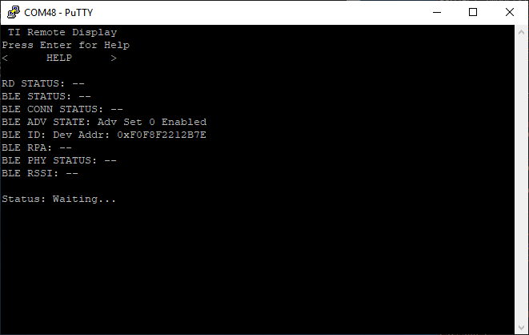

The Collector should be showing:

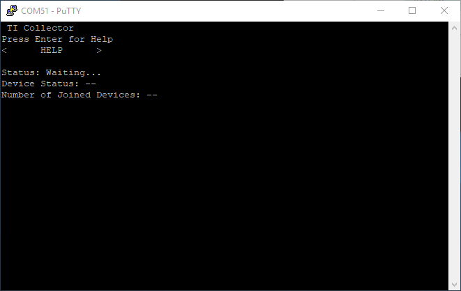

## <a name="Services"></a>BLE Services Overview

This project contains 2 service:
-  Provisioning Service used to configure the device for connecting to an IEEE 802.15.4g network.
-  Remote Display Service used to display sensor reading and configure the sensor reporting interval

The characteristic UUID is a 128b, with 16b that are used to specify the characteristic. The below shows the format of the 128b UUID:

    0x00, 0x00, 0x00, 0x00, 0x00, 0x00, 0x00, 0xB0, 0x00, 0x40, 0x51, 0x04, LOW BYTE OF UUID, HIGH  BYTE OF UUID, 0x00, 0xF0

###  <a name="Provisioning Service/Profile Table"></a>Provisioning Service/Profile Table

The provisioning profile is defined in `software_stacks/ble_stack/profiles/provisioning_gatt_profile.c`

The Characteristics and properties are shown below.

|Characteristic             | UUID | Format          | Properties       |
|---------------------------|------|-----------------|------------------|
|Network PAN ID             | 1191 | 2 Byte Integer  | Auth Read/Write  |
|Network Channel Mask       | 1194 | 17 Byte Integer | Auth Read/Write  |
|Default Network Key        | 1196 | 16 Byte Integer | Auth Read/Write  |
|Start Network Provisioning | 1197 | 1 Byte Integer  | Auth Read/Write  |
|Network Provisioning State | 1198 | 1 Byte Integer  | Auth Read        |

###  <a name="Sensor Service/Profile Table"></a>Sensor Service/Profile Table

The provisioning profile is defined in `software_stacks/ble_stack/profiles/remote_display_gatt_profile.c`

The Characteristics and properties are shown below.

|Characteristic             | UUID | Format          | Properties       |
|---------------------------|------|-----------------|------------------|
|Sensor Data                | 1181 | 2 Byte Integer  | Read/Notify      |
|Sensor Report Interval     | 1182 | 4 Byte Integer  | Read/Write       |
|Collector LED Identify        | 1183 | 1 Byte Integer  | Read/Write    |

## <a name="BLEMultiConnections"></a>BLE Multi-Connections

This project is configured by default to make use of Multiple (4) BLE
Connections. This means that the DMM project will be able to support 4 BLE
connections on top of the secondary stack network.

### <a name="Changing Multi-Conn Setting"></a>Updating Multi-Connection Settings

The Multi-Connection Settings can easily be changed via the Sysconfig tool. No
application changes are required by the user to go from 1 connection to 4
connections.


As always, with network configuration changes, it's important to recognize that
the update could change the bandwidth requirements by the stack. When
moving from the default settings to something new, you as the developer should
take time to consider how this will effect your network requirements.

## <a name="CUI"></a>Using the Common User Interface

> Note: The screenshots in this section were taken from the DMM 15.4 Collector +
BLE project. There will be slight differences in the UART terminal
depending on which project you are working with.

The Common User Interface (CUI) controls the access to User Interface
resources. On a LaunchPad device, these resources are made up of Buttons, LEDs
and UART I/O.

Using a UART terminal with the configuration described above, use the arrow
keys to navigate the menu. Upon startup, pressing the *ENTER* key will display
the **HELP** menu, as shown below:


To demonstrate the use of the CUI, let us change the BLE PHY. First, use the
arrow keys to select the `TI Remote Display` menu. Pressing the *ENTER* key
will take us to the `TI Remote Display` menu. Next, we see the option to
`CONFIGURE` or go `BACK` to the previous menu. Make sure `CONFIGURE` is
selected and hit the *ENTER* key to enter the `CONFIGURE` menu. Here, we have
the option to `SET PHY`. After pressing *ENTER* once more, we can select a
PHY. Chose the 2M PHY. You should see confirmation of this on the UART
display, as shown below.


> Note: When using the CUI, the buttons on the LaunchPad should not be used
to navigate the CUI menu. These buttons perform other actions as described
in the following section.

## <a name="ProvisioningSensorToNetwork"></a>Provisioning the 15.4 Sensor to the Network

Before the user can connect the sensor to the 15.4 network, the network must
be formed and opened on the 15.4 Collector.

The user has 2 choices regarding the provisioning the sensor to a 15.4 Network:

- Press the LEFT button on the sensor to make the sensor search and join a
network with the default provisioning settings as configured with the SysConfig
tool.
- Use a BLE central device (such as the LightBLue Smartphone Application)
to configure the provisioning settings and make the sensor search and join a
network with those settings.
- Use the Common User Interface (CUI) configure the
provisioning settings and make the sensor search and join a network with those
settings.

> Note: The UART terminal output will be similar regardless of which method is
used to provision the network and control the connected sensors.

### <a name="Provisioning154NetworkBLE"></a>Provisioning the 15.4 Network via BLE

To provision the device using BLE use LightBlue to scan for the
device, you should see a device with the name of "DMM 15.4 Sensor RD" (note that
the navigation might be slightly different depending on your mobile
application):

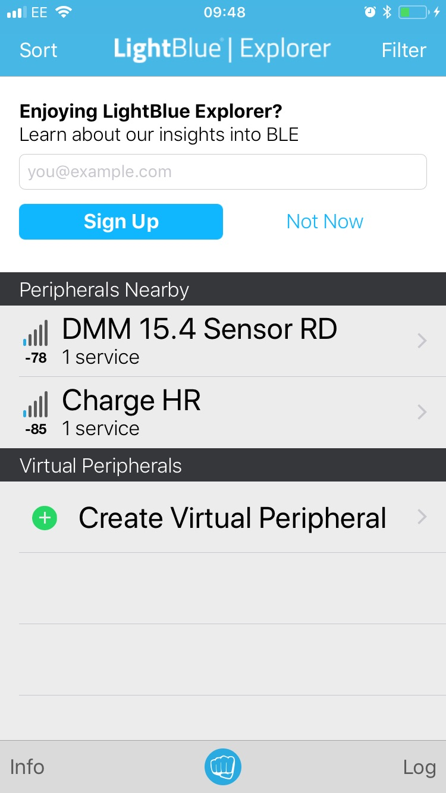

If there is more than 1 device called Node Remote Display, the RSSI value under
the strength bars on the left can be used to find which device you are trying
to connect to. Press the "connect" button to connect to the device. When
prompted enter the pairing code "123456".

Once connected, the terminal window will show the address of the connected
device (smartphone):

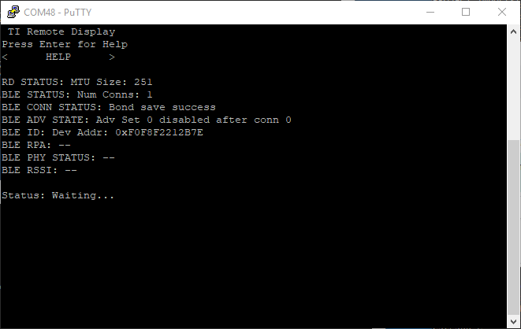

In LightBlue, you should be able to see various information about the Node
Remote Display device:

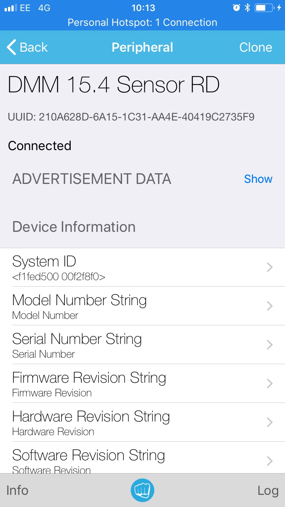

You should see the provisioning service, which is labeled as "UUID: F0001190-0451-B000-000000000000" (this may be
slightly different for other smartphone applications). Under this service there should be the following characteristics shown:

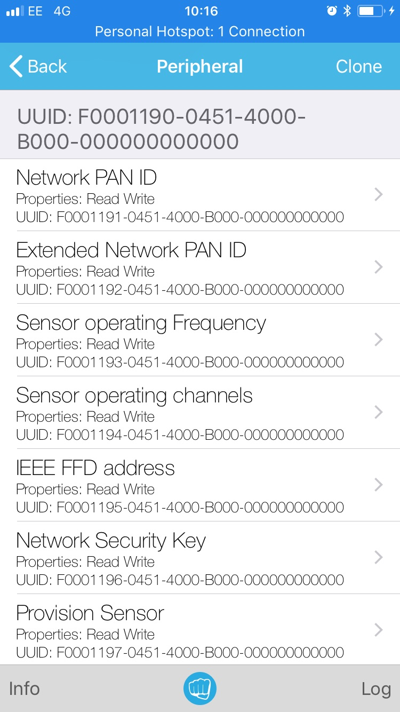

The following sections detail the functions and operations of each of the characteristics.


#### <a name="NetworkPANID"></a>Network PAN ID Characteristic (UUID: 1191)

This characteristic sets PAN ID that the 15.4 sensor will join. This is the same as setting CONFIG_PAN_ID in the sensor config.h file.

Setting CONFIG_PAN_ID or Node Data Characteristic to 0xFFFF (the default) on the Sensor allows it to join any network, setting it to a specific valeue forces it to only join a network with that PAN ID.  Setting CONFIG_PAN_ID in config.h to 0xFFFF on the Collector allows it to form a network with a random PAN ID, setting it to a specific value forces it to form a network with that specific PAN ID.

#### <a name="SensorOperatingChannels"></a>Sensor Operating Channels Characteristic (UUID: 1194)

This characteristic sets Channel mask that the 15.4 sensor will use to find a network. This is the same as setting CONFIG_CHANNEL_MASK, CONFIG_FH_CHANNEL_MASK and FH_ASYNC_CHANNEL_MASK in the sensor config.h file.

To successfully discover and join a network the same setting must be used on the Sensor and Collector.

#### <a name="NetworkSecurityKey"></a>Network Security Key Characteristic (UUID: 1196)

This characteristic sets security key that the 15.4 sensor will use encrypt and decrypt 15.4 packet data payload. This is the same as setting KEY_TABLE_DEFAULT_KEY in the sensor config.h file.

To successfully communicate with the Collector the Network Security Key Characteristic must be set the same as the Collector KEY_TABLE_DEFAULT_KEY in config.h.

#### <a name="ProvisionSensor"></a>Provision Sensor Characteristic (UUID: 1197)

This characteristic is used to make the sensor search for and associate to an IEEE 802.15.4g network or disassociate from the network.

Writing the value 0xAA to this characteristic to start the Joining processes and the sensor will search for and join the IEEE 802.15.4g network using the provisioning settings.

Writing 0xDD to this characteristic while the sensor is connected to a IEEE 802.15.4g network will cause the sensor to disassociate from the network. The sensor can then be re-provisioned and made to join the same network again, or a new network depending on the provisioning settings.

> Note: All the above provisioning characteristics default to those configured
with the SysConfig Tool. The characteristics only need to be written to if the
user requires to change them from the defaults.

> Note: In FH mode, the BLE connection may drop while the sensor associates to
the IEEE 802.15.4g network. The BLE connection can be resumed once the 15.4
Sensor is associated to a 15.4 network, and full concurrent IEEE 802.15.4g
Frequency Hopping and BLE advertisements or connection can be demonstrated.

#### <a name="SensorProvisioingState"></a>Sensor Provisioning State (UUID: 1198)

This characteristic is used to read the sensors 802.15.4g network state. The following states will be observed:

- Sensor Provisioning State 0: Waiting to be initialized
- Sensor Provisioning State 1: Joining a network
- Sensor Provisioning State 2: Restoring a network
- Sensor Provisioning State 3: Joined a network
- Sensor Provisioning State 4: Restored a network
- Sensor Provisioning State 5: Orphaned from a network

### <a name="Provisioning154NetworkCUI"></a>Provisioning the 15.4 Network via CUI

To provision the device using the CUI, navigate to the `TI SENSOR` menu and
press the *ENTER* key to enter this menu.

Then, navigate to the `NETWORK ACTIONS` tab and press the *ENTER* key to enter
this submenu.

Next, navigate to `ASSOCIATE` and press the *ENTER* key.

The DMM 15.4 sensor will now search and join a 15.4
network with the default provisioning settings as configured with the SysConfig
tool.

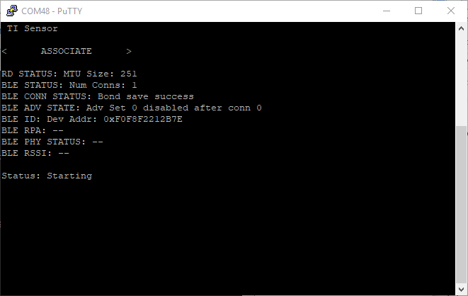

> Note 1: The above screenshot was taken after a BLE connection was
established between the LaunchPad and a smartphone.

> Note 2: The screenshots shown in this example do not reflect default network
settings.

Finally, use the CUI on the collector project to form and open the 15.4 Network,
allowing the sensor to join.

Once connected, the following UART output should be displayed:


For more details regarding the use of CUI for 15.4 network configuration,
refer to the sensor project's README.html file, located here: `<SDK
DIR>\examples\rtos\CC1352R1_LAUNCHXL\ti154stack\sensor\README.html`

## <a name="Provisioned15.4Sensor"></a>Provisioned 15.4 Sensor

The 15.4 Sensor data that is sent to the Collector is also mirrored in a BLE characteristic. The rate at which the sensor wakes and sends data can also be set using a BLE characteristic.

You should see the remote display service, which is labeled as "UUID: F0001180-0451-B000-000000000000" (this may be
slightly different for other smartphone applications). Under this service there should be the following characteristics shown:

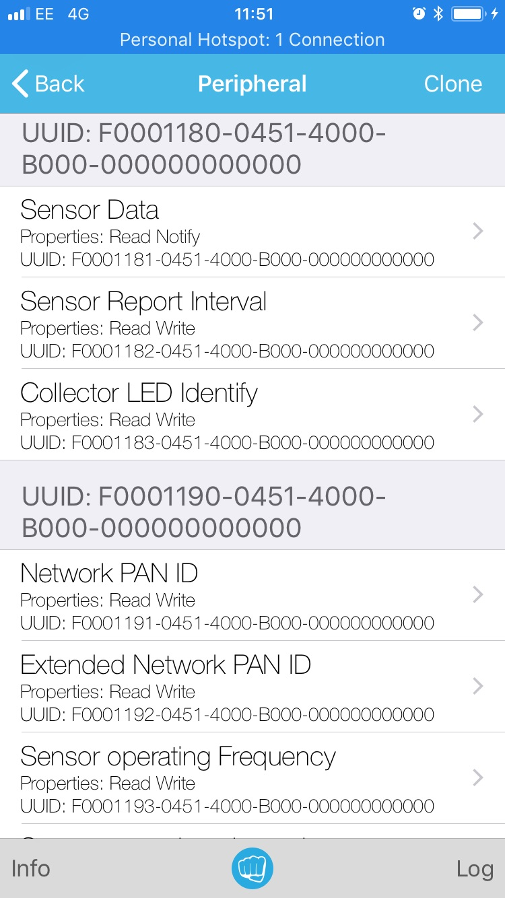

#### <a name="SensorData"></a>Sensor Data Characteristic (UUID: 1181)

This characteristic supports read only and notify properties, and it contains
a 2-byte-long value indicating the sensor data. In LightBlue the notifications
can be enabled by clicking on the Sensor Data characteristic and then clicking
on "Listen for notifications", notice that the value is updating every 5s by default.
Click on the "Read again" item read the characteristic.

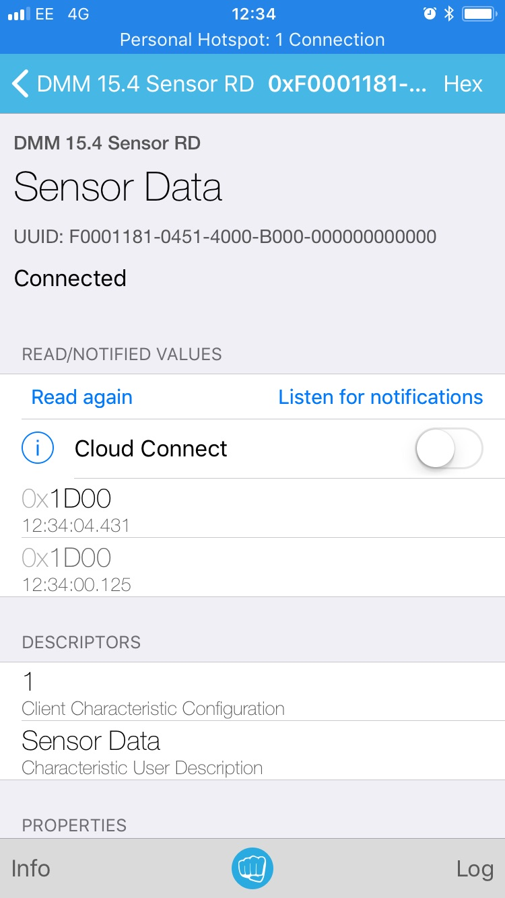

If you disable notifications then make sure you re-enable them as this will be
useful when changing the report interval later.

#### <a name="SensorReportIntervalCharacteristic"></a>Sensor Report Interval Characteristic (UUID: 1182)

This characteristic supports read and write properties, it contains
a 4-byte-long value indicating the sensor report interval in ms. By default
this is set to 5s, you will notice that both the Sensor Data on the Collector
and the Sensor Data BLE Characteristic is updated every 5s. This 5s update can
also be seen on the LightBlue app when notifications are enabled. In the LightBlue
application select the Sensor Report Interval characteristic. From here you
can read and write the report interval. When a value is written the rate at
which node data is updated changes to reflect the new value.

> Note: In LightBlue you must write to the characteristic in hex, using the correct number of digits,
or the length will be incorrect and the Remote Display profile will reject the write. To set the
report interval to 1s write an value of 000003E8.

#### <a name="CollectorLEDIdentify"></a>Collector LED Identify (UUID: 1183)

This characteristic supports read and write properties, it contains
a 1-byte-long value used to make the Sub1GHz 802.15.4 Collector Blink its LED. The value represents
the duration in seconds to blink. This characteristic can be used to identify the collector that the sensor is connected to.

## <a name="DMM15.4SecurityManager"></a>DMM 15.4 Security Manager (SM) Commissioning

If using either a `dmm_154sensor_sm_remote_display_app` or `dmm_154collector_sm_remote_display_app` project, these will support secure commissioning of a SM Sensor to a SM Collector. This DMM project will enable remote control and monitoring of the secure commissioning service via a BLE phone application connected to a DMM device. Once the phone is connected to the DMM device, the user will be able to select the Authentication Mode via the BLE phone application. If the user selects the "Passkey" mode, then the user will be able to enter the passkey via the app. This passkey will be passed to the BLE Remote Display application and then passed to the SM Sensor application. This passkey will then be used to begin commissioning of the Sensor to the Collector network. Throughout the commissioning process status updates will be sent to the BLE phone application.


### Using DMM SM Commissioning Example

The `SimpleLink Starter` mobile application is the easiest way to get started using the DMM SM feature. The steps below outline the how to use the app:

1. Open the `SimpleLink Starter` mobile application, scan and connect to the `DMM 15.4 SM Collec`. Once the services load, select the `DMM Provisioning Service`.

2. Click `Form Network` to form a new 15.4 network.

3. Once the network has formed, click `Open Network` to allow devices to connect to the network.

4. Once the DMM SM Collector network has been setup, disconnect the mobile app from the device.

5. Scan and connect the `DMM 15.4 SM Sensor` device. Wait for all the services to load and select the `DMM Provisioning Service`.

    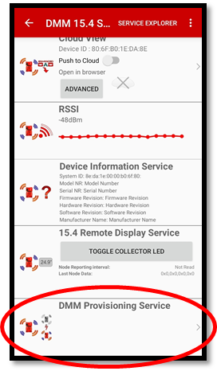

6. Once connected, the app will read and display the current SM State in the `TI15.4 Security Manager` section. Tap the `Auth Mode Selection` drop down menu to select one of the three desired authentication modes (Passkey, Default Code, Just Allow). If nothing is selected, the "Default Code" mode will be used during the commissioning process.

    

7. In the `TI DMM Provisioning Interface` section, click the `START PROVISIONING (CONNECT)` button.

    

8. Once the SM Sensor associates to the open SM Collector, the SM Commissioning process will start. If "Default Mode" or "Just Allow" was selected the commissioning process will be automatic and the commissioning state will eventually update to `SM Success` if the commissioning process was successful. If the commissioning process fails, it will be re-attempted two more times. If all attempts fail, the Sensor will decommission from the Collector's network.

    

9. If "Passkey" was selected as the authentication mode, the app will eventually pop-up a module for the user to enter a custom 6-digit passkey.

    

10. After the passkey has been entered on the DMM SM Sensor device, disconnect the mobile app from the DMM SM Sensor and connect to the `DMM 15.4 SM Collec` device.

11. Once the services load, select the `DMM Provisioning Service`.

    

12. The app will eventually pop-up a module for the user to enter the same custom 6-digit passkey entered on the DMM SM Sensor.

    

13. After the passkey has been entered, the commissioning process will complete and the commissioning state will eventually update to `SM Success` if the commissioning process was successful. If the commissioning process fails, it will be re-attempted two more times. On each re-attempt, the user will have the ability to re-enter a custom passkey on each device. If all attempts fail, the Sensor will decommission from the Collector's network.

    

14. If desired, after commissioning, the user may disconnect from the DMM SM Collector and connect to the DMM SM Sensor via the `SimpleLink Starter` app to view the current SM Commissioning State of the sensor.

By default, the DMM examples can support connecting up to 4 BLE centrals devices at a time. Due to the secure nature of the SM Commissioning Profile, it is important to only allow a single device being able to read/write to the SM Auth Mode and Passkey characteristics at a time. This will limit the ability for an attacker to interfere with the SM commissioning process. This will be accomplished by only allowing the first device that has an authenticated BLE bond and is trying to access an SM characteristic. Once this first device disconnects, the next device that aligns with the same criteria will be allowed to read/write the characteristics.

### SM Commissioning BLE Service

A separate BLE profile `sm_commisioning_gatt_profile` is enabled to control and track all SM related activities. The `sm_commisioning_gatt_profile` has the following characeristics and permissions.

Service UUID: 0xf000baaa-0451-4000-b000-000000000000

Below summarizes the characteristics that comprise the SM Service:

* [SMCOMMISSIONING_PROFILE_STATECHAR_UUID](#SMCOMMISSIONING_PROFILE_STATECHAR_UUID)
* [SMCOMMISSIONING_PROFILE_SETAUTHMODECHAR_UUID](#SMCOMMISSIONING_PROFILE_SETAUTHMODECHAR_UUID)
* [SMCOMMISSIONING_PROFILE_SETPASSKEYCHAR_UUID](#SMCOMMISSIONING_PROFILE_SETPASSKEYCHAR_UUID)

#### <a name="SMCOMMISSIONING_PROFILE_STATECHAR_UUID"></a>SMCOMMISSIONING_PROFILE_STATECHAR_UUID

* **Description**: BLE characteristic used to define state of the sensor as it is commissioning to a SM Collector.
* **UUID**: 0xf000baab-0451-4000-b000-000000000000
* **Len**: 1
* **GATT Properties**: GATT_PROP_READ, GATT_PROP_NOTIFY
* **GATT Val Permissions**: GATT_PERMIT_AUTHEN_READ
* **Valid Values**:

```
0x0000: SM Idle
0x0001: SM Starting
0x0002: SM Request Passkey
0x0003: SM Passkey Timeout
0x0004: SM Commissioning
0x0005: SM Success
0x0006: SM Error
Otherwise: Error
```

The software flowchart below describes the different scenarios for the SMCOMMISSIONING_PROFILE_STATECHAR_UUID to be updated. Updates to the SMCOMMISSIONING_PROFILE_STATECHAR_UUID characteristic are illustrated by the green circle objects.


#### <a name="SMCOMMISSIONING_PROFILE_SETAUTHMODECHAR_UUID"></a>SMCOMMISSIONING_PROFILE_SETAUTHMODECHAR_UUID

* **Description**: BLE characteristic used to define the Authentication Mode used by the TI154Stack SM commissioning process.
* **UUID**: 0xf000baac-0451-4000-b000-000000000000
* **Len**: 1
* **GATT Properties**: GATT_PROP_READ, GATT_PROP_WRITE
* **GATT Val Permissions**: GATT_PERMIT_AUTHEN_READ, GATT_PERMIT_AUTHEN_WRITE
* **Valid Values**:

```
0x0001: Passkey
0x0002: Default Code
0x0004: Just Allow
```

#### <a name="SMCOMMISSIONING_PROFILE_SETPASSKEYCHAR_UUID"></a>SMCOMMISSIONING_PROFILE_SETPASSKEYCHAR_UUID

* **Description**: BLE characteristic used to define the Passkey entered by a user during the TI154Stack SM Passkey based commissioning process.
* **UUID**: 0xf000baad-0451-4000-b000-000000000000
* **Len**: 4
* **GATT Properties**: GATT_PROP_WRITE
* **GATT Val Permissions**: GATT_PERMIT_AUTHEN_WRITE
* **Valid Values**: Any

## <a name="BlockModeTest"></a>Block Mode Test

Block Mode is demonstrated in DMM example applications via the Block Mode Test feature. This feature allows a user via the serial interface to enable/disable a periodic timer that toggles DMM Block Mode on and off at user defined periods.

This feature is enabled by declaring the `BLOCK_MODE_TEST` pre-compile variable in the DMM project `.opts` file.

### User Interface

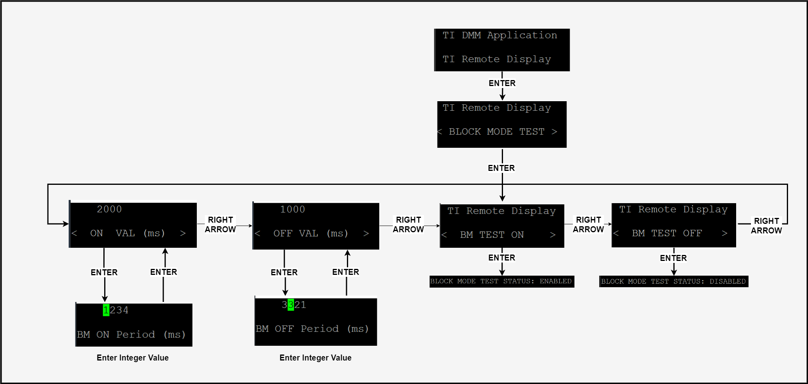

Using the serial user interface, the user can configure the following Block Mode Test parameters at runtime:

* Block Mode Test On
* Block Mode Test Off
* Block Mode On Period (ms)
* Block Mode Off Period (ms)

The instructions below cover the Block Mode Test configuration for the BLE remote_display application, but also apply to the secondary stack application.

1. Using the Left or Right arrow keys on your keyboard, navigate to the `TI Remote Display` menu and press the Enter key.

2. Using the Left or Right arrow keys on your keyboard, navigate to the `BLOCK MODE TEST` menu and press the Enter key.

3. To turn on the Block Mode Test, use the Left or Right arrow keys on your keyboard, navigate to the `BM TEST ON` menu and press the Enter key. You will see the `BLOCK MODE TEST STATUS` line change to `Enabled`.

4. To turn off the Block Mode Test, use the Left or Right arrow keys on your keyboard, navigate to the `BM TEST OFF` menu and press the Enter key. You will see the `BLOCK MODE TEST STATUS` line change to `Disabled`.

5. To change the Block Mode On Period, use the Left or Right arrow keys on your keyboard, navigate to the `ON VAL (ms)` menu and press the Enter key. You will then be able to enter a 4 digit decimal value representing the period of time for which Block Mode will be enabled for BLE in milliseconds. Press the Enter key to submit you changes.

6. To change the Block Mode Off Period, use the Left or Right arrow keys on your keyboard, navigate to the `OFF VAL (ms)` menu and press the Enter key. You will then be able to enter a 4 digit decimal value representing the period of time for which Block Mode will be disabled for BLE in milliseconds. Press the Enter key to submit you changes.

### Block Mode Test Activity

The diagram below represents the stack activity when you enabled and disable the Block Mode Test.

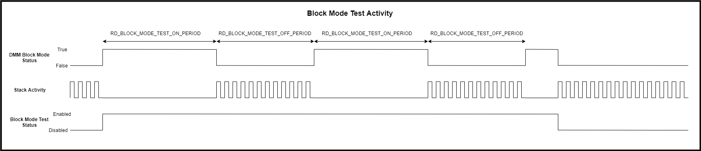

On the Block Mode Clock event, the DMM Block Mode Status will be toggled and the Block Mode Test Period will be updated. If the current DMM Block Mode Status is "True", the DMM Block Mode status will be set "Off" (DMM Block Mode Status will be set to "False") and the Block Mode Test Clock will be updated to a timeout value of RD_BLOCK_MODE_OFF_PERIOD.  If the current DMM Block Mode Status is "False", the DMM Block Mode status will be set "On" (DMM Block Mode Status will be set to "True") and the Block Mode Test Clock will be updated to a timeout value of RD_BLOCK_MODE_ON_PERIOD.

## <a name="DisableCUI"></a>Disabling Common User Interface

The common user interface (CUI) is a UART based interface that allows users to control and receive updates regarding the application. For various reasons, including reducing the memory footprint, the user is able to disable the common user interface (CUI). To disable the CUI, the following variable must be defined in the `dmm_154sensor_remote_display_app.opts`:

```
-DCUI_DISABLE
```

> Please Note: particular features that are dependednt on the CUI wil be unavailable when this feature is enabled.

## <a name="15.4SensorRebootAndReset"></a>DMM Sensor Reboot and Reset

By default the DMM 15.4 Sensor RD is configured to store network parameters
in Non-Volatile memory and will be allow the sensor to rejoin the network on
power cycle or reset. To disable this feature you need to change:

    -DNV_RESTORE

to

    -DxNV_RESTORE

in the
`Tools/dmm_154sensor_remote_display_cc13x2r1lp_app_FlashROM_Release.opt`
file.

Once this feature is disabled the sensor will not store its connected
collector information in NV. The connected sensor will not rejoin the network when
it is reset or power cycled.

> By default, the DMM Sensor will not rejoin the 15.4 network on its own
on reset. It must be done manually using the steps above with either the GPIO
buttons, the CUI, or BLE.

To clear the NV, perform a device reset while holding the **RIGHT** button.

> Note: Once booted the **RIGHT** button is used to turn Disassociate from the
network. Be careful not to hold the Right button down for to long.

## <a name="DmmLimitations"></a>DMM Limitations

The initial implementation of 15.4 + BLE DMM has only been tested with this policy.

The following limitations exist in the DMM implementation:

- Connection intervals lower than 60ms will result in high sub1G packet loss when
BLE is connected.
- When connecting to a central device Sub-1G packet loss may be experienced until
the update parameters are sent 1s after connection. This will be dependent on the
initial connection interval of the BLE central devices.
