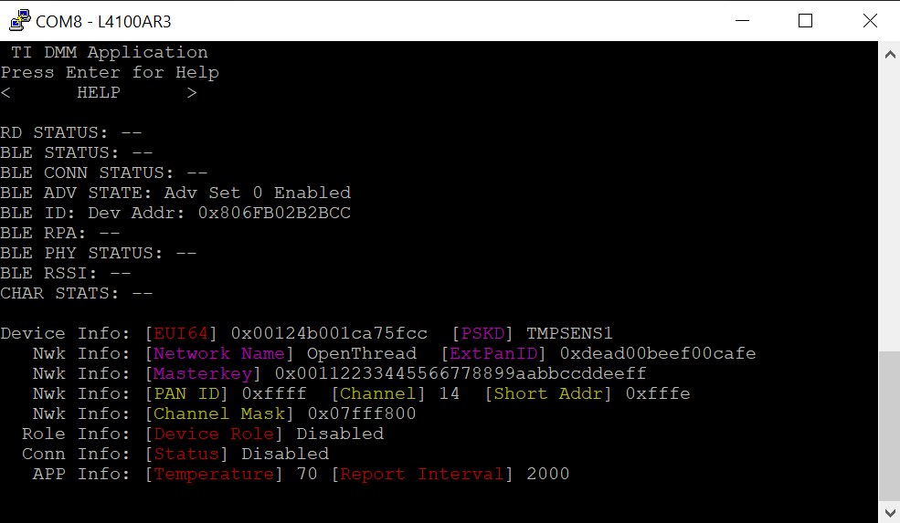
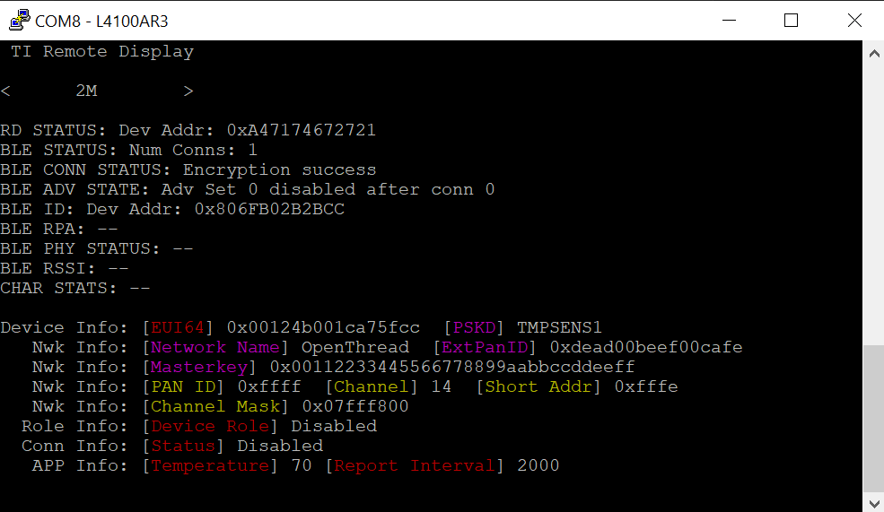
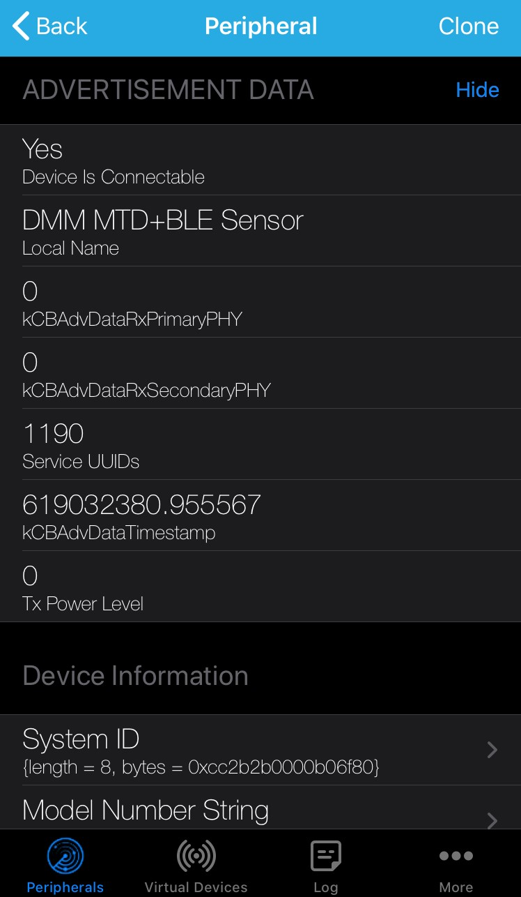
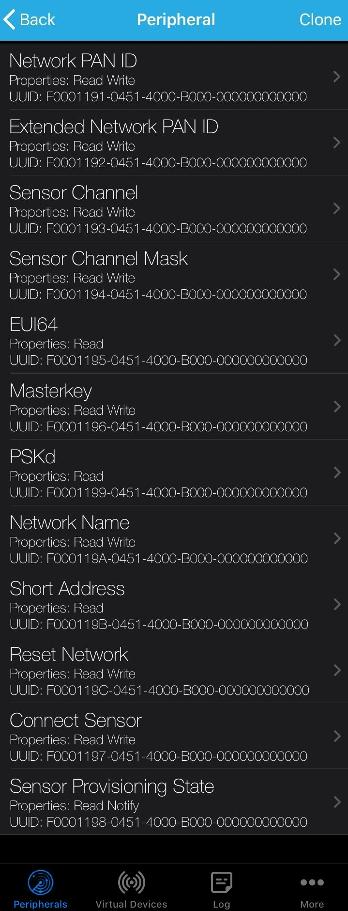
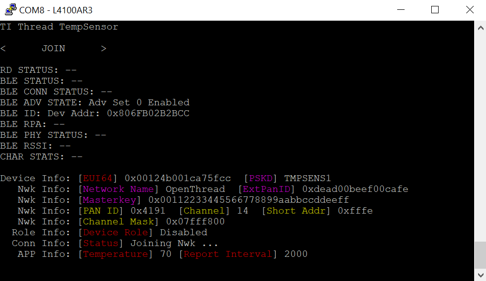
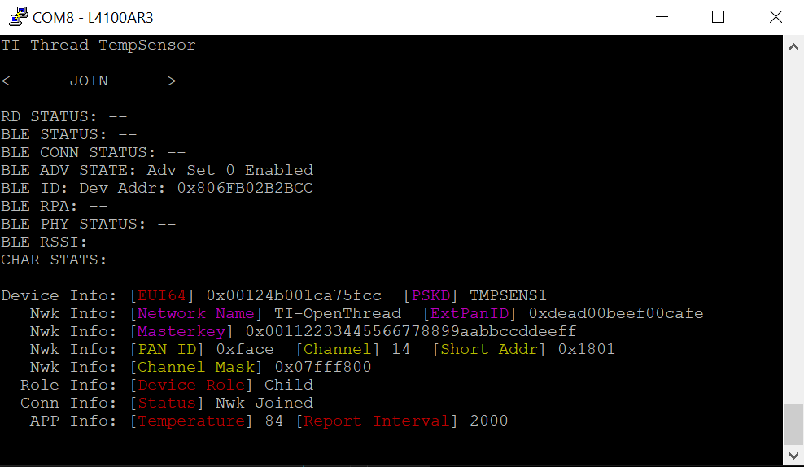
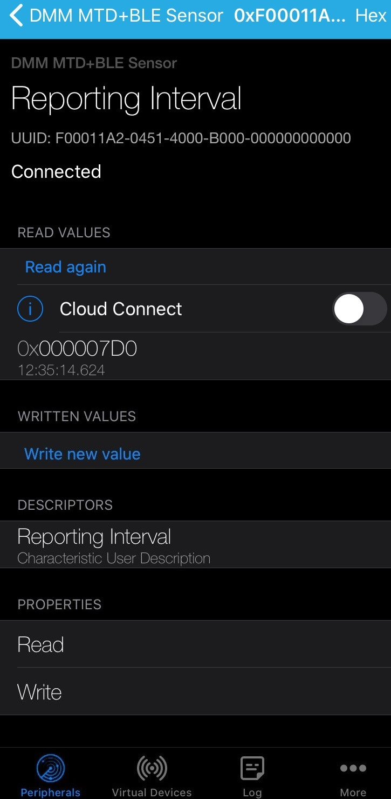

# DMM Thread MTD + BLE Remote Display

## Table of Contents

* [Introduction](#Introduction)
* [Hardware Prerequisites](#HardwarePrerequisites)
* [Software Prerequisites](#SoftwarePrerequisites)
* [Dynamic Multi-protocol Manager](#DynamicMultiprotocolManager)
* [Usage](#Usage)
	* [BLE Services Overview](#Services)
	* [Using the Common User Interface](#CUI)
	* [Provisioning The Thread Temperature Sensor To A Network](#ProvisioningThreadTSToNetwork)
  * [Provisioning via BLE](#ProvisioningMTDviaBLE)
  * [Provisioning via CUI](#ProvisioningMTDviaCUI)
    * [Provisioning: CUI Join](#ProvisioningThreadTSCUIJoin)
    *  [Provisioning: CUI Attach](#ProvisioningThreadTSCUIAttach)
  * [Provisioned Thread Temperature Sensor](#ProvisionedThreadTS)

## Introduction

The dmm_thread_ts_remote_display project showcases a dynamic multi-protocol example which
enables concurrent MTD (Minimal Thread Device) and BLE5. This example implements
an MTD with a BLE Remote Display, using TI's DMM (Dynamic
Multi-protocol Manager) to enable the multi-protocol features of
the CC13x2 and CC26x2 devices.

The BLE remote display allows a SmartPhone App to commission the MTD to a Thread network and
act as a temperature sensor that can be accessed through Thread via the CoAP Server

This project has the following app configurations available:

|App Build Configuration         | Description                                                       |
|--------------------------------|-------------------------------------------------------------------|
|Release (default)      | All TI-RTOS debug features disabled but application-logging to UART remains enabled.   The application uses the config file `ble_release.cfg` and the defines are in `<app name>_FlashROM_Release.opt`.|

All application configurations use the stack library configuration,
FlashROM_Library. This build configuration will yield additional flash
footprint optimizations by the linker since the application and stack can share
contiguous flash pages. This configuration is further discussed in the Stack
Library Configuration section of the [BLE5-Stack User's
Guide](../../../../../docs/ble5stack/ble_user_guide/ble5stack-users-guide.html) provided in
the SDK.

This document discusses the procedure for using the DMM Thread Temperature Sensor Remote Display
application.

## Hardware Prerequisites

The default Simple Peripheral configuration uses the
[LAUNCHXL-CC1352R](http://www.ti.com/tool/launchxl-cc1352r1) or the [LAUNCHXL-CC26X2R](http://www.ti.com/tool/LAUNCHXL-CC26X2R1).

 >Note: The SDK requires CC13x2/CC26x2 PG2.1 Silicon

The hardware configuration is shown in the below image:

For custom hardware, see the Running the SDK on Custom Boards section of the
[BLE5-Stack User's
Guide](../../../../../docs/ble5stack/ble_user_guide/ble5stack-users-guide.html).

## Software Prerequisites

For information on what versions of Code Composer Studio and IAR Embedded
Workbench to use, see the dependencies section of the Release Notes located
in the root folder of the SDK.

For information on how to import this project into your IDE workspace and
build/run, please refer to the device's Platform section in the [BLE5-Stack
Quick Start
Guide](../../../../../docs/simplelink_mcu_sdk/html/quickstart-guide/ble5-quick-start.html).

## Dynamic Multi-protocol Manager

The DMM uses 2 main components to dynamically arbitrate the RF resource.

- A Policy Manager
- A Scheduler

TI CC1352 devices are capable of dual band operation, the CC1352 Launchpad (TI
development platform) has a dual band antenna which performs well in the
868/916MHz band as well as the 2.4GHz band. Using the DMM on CC1352 devices
enables not only multi protocol, but also dual band. The below diagram shows
how the DMM allows 2 stacks to run on the same device, which was previously
only possible on 2 devices. In the diagram the Stack 1 is shown functioning
along side Stack 2, this could be a BLE stack and a proprietary Sub1G stack
(called Wireless Sensor Network) or a 15.4 Stack. The Stacks used are defined
by the developer.

Single mode setup:

DMM Setup:

The DMM makes scheduling decisions based on **Application Level information**,
**Stack Level information**, and the **Global Priority Table (GPT)**.

The Stack Level information is embedded in each RF command and it includes:
Start Type, Start Time, AllowDelay, Priority, Activity, etc.

The Global Priority Table (GPT) defines relative priorities of the two stacks
based on the activity and priority of RF commands.  For details of the GPT,
refer to `<SDK_DIR>\source\ti\common\dmm\dmm_priority_ble_154.c/h`.

The Application Level information is the user defined information via the policy
table and inludes: Application State Name, Weight, AppliedActivity, Pause, etc;
the policy table can have multiple policies. A policy defines a specific state
of the DMM application where the user wants to apply different priority based on
an action.  A simplified policy table is shown below, it defines the behavior
when Stack 1 is performing an OAD and does not take into account the specific
state of the stack 2 (i.e. any state). It specifies that when Stack 1 is in an
OAD state, the priority of the `BLE_CONNECTION`, in this case, is increased by
25. If any RF scheduling conflicts happen during the OAD, they will be resolved
by taking into account the modified priority defined in the policy.

|Stack 1 State Name   | Stack 2 State Name     |  Weight   | Applied Activity  |  Description
|-------------|----------------|-------------|-------------|---------------------------------
|OAD      | Any            |   25         |   CONNECTION        | Increase the priority of CONNECTION activity of Stack 1 by 25 during OAD operation

The policy used in this example is more complex than the illustration above. For
details of the actual policy used refer to
`<SDK_DIR>\source\ti\common\dmm\policy.h` and `ti_dmm_application_policy.c/h` as
generated by  the SysConfig tool.

The DMM also supports pausing/resuming stacks based on a policy change. This is
achieved by an application callback, which is called from the DMM policy manager
when a policy change requiring a stack to pause operation is entire. 

See the DMM chapter in your protocol stack user's guide for more information
about DMM.

## Usage

This example should be used in conjunction with the TIOP CLI FTD.

This application uses the UART peripheral to provide a user
interface for the application.

This document will use Putty to serve as the display for the output of the
CC1352 LaunchPad. The LightBlue smartphone application will act
as the BLE Central device that will connect to the Remote Display service in
this example. The LightBlue smartphone application is available on App Store
and Google Play. Note that any other serial terminal and smart phone BLE
scanner application can be used. The following default parameters are used for the UART
peripheral for display:

  |UART Param     |Default Values |
  |-------------- |---------------|
  |Baud Rate      |115200         |
  |Data length    |8 bits         |
  |Parity         |None           |
  |Stop bits      |1 bit          |
  |Flow Control   |None           |

> Note: If you are using a smartphone as the BLE central device and the same
CC1352 LaunchPad was used previously with a different DMM or BLE example then
you may need to forget the device in the smartphone BLE settings, then disable
and enable BLE. Not doing this could result in the smartphone application
displaying incorrect services and characteristics

Once the Thread Temperature Sensor application and the TIOP CLI FTD example start, the UI will wait for user input, unless the temperature sensor was previously provisioned to the FTD. If so, it will automatically join, once thread is started on the FTD. Otherwise, the output to the terminal will report its BLE address and the fact that it is advertising, which is enabled by default upon startup as shown below:

## BLE Services Overview

This project contains 2 service:
-  Provisioning Service used to configure the device for connecting to a Thread network.
-  Sensor Service used to view the temperature sensor reading and configure the reporting interval

The characteristic UUID is a 128b, with 16b that are used to specify the characteristic. The below shows the format of the 128b UUID:

    0x00, 0x00, 0x00, 0x00, 0x00, 0x00, 0x00, 0xB0, 0x00, 0x40, 0x51, 0x04, LOW BYTE OF UUID, HIGH  BYTE OF UUID, 0x00, 0xF0

###  Provisioning Service/Profile Table

The provisioning profile is defined in `software_stacks/ble_stack/profiles/provisioning_gatt_profile.c` The Characteristics and properties are shown below.

|Characteristic             | UUID | Format          | Properties       |State after Provisioned*|
|---------------------------|------|-----------------|------------------|------------------------|
|Network PAN ID             | 1191 | 2 Byte Integer  | Auth Read/Write  |Locked                  |
|Extended PAN ID            | 1192 | 8 Byte Integer  | Auth Read/Write  |Locked                  |
|Network Channel            | 1193 | 1 Byte Integer  | Auth Read/Write  |Locked                  |
|Network Channel Mask       | 1194 | 4 Byte Integer  | Auth Read/Write  |Locked                  |
|Device EUI64               | 1195 | 8 Byte Integer  | Auth Read        |N/A                     |
|Network Masterkey          | 1196 | 16 Byte Integer | Auth Read/Write  |Locked                  |
|Connect Sensor             | 1197 | 1 Byte Integer  | Auth Read/Write  |Unlocked                |
|Provisioning State         | 1198 | 1 Byte Integer  | Auth Read/Notify        |N/A                     |
|Pre-Shared Key of Device   | 1199 | 8 Byte Integer  | Auth Read        |N/A                     |
|Network Name               | 119A | 16 Byte String  | Auth Read/Write  |Locked                  |
|Network Short Address      | 119B | 2 Byte Integer  | Auth Read        |N/A                     |
|Network Reset              | 119C | 1 Byte Integer  | Auth Read/Write  |Unlocked                |

>Note: As network changes can be done and happen even after provisioning, most writable characteristics are locked from being written to after the device has connected. Only connect sensor, which in the future will have a proper detach option, and network reset, which resets the device with or without resetting network parameters are unlocked throughout execution.
###  Sensor Service/Profile Table

The sensor profile is defined in `software_stacks/ble_stack/profiles/sensor_gatt_profile.c` The Characteristics and properties are shown below.

|Characteristic             | UUID | Format          | Properties       |
|---------------------------|------|-----------------|------------------|
|Temperature                | 11A1 | 2 Byte Integer  | Read/Notify      |
|Report Interval            | 11A2 | 4 Byte Integer  | Read/Write       |

## Using the Common User Interface

>Note: The screenshots in this section were taken from the DMM Thread Temperature Sensor + BLE project. There will be slight differences in the UART terminal depending on which project you are working with.

The Common User Interface (CUI) controls the access to User Interface
resources. On a LaunchPad device, these resources are made up of Buttons, LEDs
and UART I/O.

Using a UART terminal with the configuration described above, use the arrow
keys to navigate the menu. Upon startup, pressing the *ENTER* key will display
the **HELP** menu, as shown below:

To demonstrate the use of the CUI, let us change the BLE PHY. First, use the
arrow keys to select the `TI Remote Display` menu. Pressing the *ENTER* key
will take us to the `TI Remote Display` menu. Next, we see the option to
`CONFIGURE` or go `BACK` to the previous menu. Make sure `CONFIGURE` is
selected and hit the *ENTER* key to enter the `CONFIGURE` menu. Here, we have
the option to `SET PHY`. After pressing *ENTER* once more, we can select a
PHY. Chose the 2M PHY. You should see confirmation of this on the UART
display, as shown below.

> Note: When using the CUI, the buttons on the LaunchPad should not be used
to navigate the CUI menu. These buttons perform other actions as described
in the following section.

## Provisioning the Thread Temperature Sensor to the Network

The user has 3 choices regarding the provisioning the device to a Thread Network:

-Use after boot, button 2 to make the Thread Temperature Sensor start the joining process with default settings, as configured with the SysConfig tool.
- Use a BLE central device (such as the LightBLue Smartphone Application) to configure the provisioning settings and make the Thread Temperature Sensor search for and join a network with those settings.
- Use the Common User Interface to configure and commission the device

> Note: Before the Thread Temperature Sensor can join the Thread Network the the network must be opened on the commissioning device and a joiner added with the matching EUI64 and PSKd.

> Note: Specific to the TIOP FTD CLI example, if an asterisk is used in place of the EUI64, any device with the matching PSKd an connect.

### Provisioning the MTD via BLE

To provision the device using BLE use LightBlue to scan for the
device, you should see a device with the name of "DMM MTD+BLE Sensor" (note that
the navigation might be slightly different depending on your mobile
application):

If there is more than 1 device called DMM MTD+BLE Sensor, the RSSI value under
the strength bars on the left can be used to find which device you are trying
to connect to. Press the "connect" button to connect to the device. When
prompted enter the pairing code "123456".

In LightBlue, you should be able to see various information about the Thread Temperature Sensor:

You should see the provisioning service, which is labeled as "UUID: F0001190-0451-B000-000000000000" (this may be
slightly different for other smartphone applications). Under this service there should be the following characteristics shown:

The following sections detail the functions and operations of each of the characteristics.

#### PAN ID (UUID: 1191)
A 2 byte code (stored as uint8[2]) which represents the current network Pan ID. 
PAN (Personal Area Network) ID is one of the three unique identifiers of thread networks, It is used in provisioning, specifically in the attach process. This attribute must match the that of the parent for a successful attach, and is the same throughout all devices on the network.

This is the same as setting PAN ID in the UI configuration menu.

>The default value is 0xFFFF

>Note that this default value will not be accepted if attaching is attempted with it, and it will automatically be set to a random number (though the attach process will fail initially, the next attempt will cause it to perpetually search for a network with the same PAN ID and must be reset by hand if in such a state).

#### ExtPANID (UUID: 1192)
A 8 byte code (stored as uint8[8]) which represents the current Extended Pan ID
The ExtPanID is a unique value associated with each network, and is used for 16-bit conflict resolution. If an FTD creates a network with an already existing one, it will attempt to attach to that network. In the Join process it is automatically set to that of the parent once authentication of the PSKd and EUI64 passed in is confirmed. It can be written to pre-provisioning by the Remote Display only as standalone thread did not have a CUI feature to edit it. It can be read by both at any time.
>The default value is 0xDEAD00BEEF00CAFE

#### Channel (UUID: 1193)
A 1 byte number (stored as uint8) which represents the current network channel. It is listed in the Provisioning Profile as "Sensor Frequency Characteristic"
It is the RF Channel this device will broadcast beacon requests on while searching for an existing network to join or attach to. In the join process, after authentication it is automatically set to that of the parent.

This is the same as setting CHANNEL in the UI configuration menu.

>The default value is 0x0E

#### Channel Mask (UUID: 1194)
A 4 byte bitmask (stored as uint8[4]) which represents the current supported channel mask. It is listed in the Provisioning Profile as "Sensor Channel Characteristic"
It is used during the discover process to set what channels are actively scanned, as well as what channels will be followed on a network channel change by the device. Since we use 2.4G O-QPSK, which is legal world-wide, blacking out RF channels generally isn't necessary, and thus this feature is not a feature of standalone thread examples, but it is a configurable option through the Remote Display for possible future use nonetheless.
>The default value is 0x07FFF800

#### EUI64 (UUID: 1195)
An 8 byte code (stored as uint8[8]) containing the device's IEEE FFD Address (which is referred to as EUI64 and Extended Address in OpenThread).
It is used in provisioning, specifically for the Join process to add a specific device to the network. It is set at compile time and cannot be changed afterwards, and is unique to each device. It can only be read.
>The default value is device-dependent.

#### Masterkey (UUID: 1196)
A 16 byte code (stored as uint8[16]) which represents the current network Masterkey. It is listed in the Provisioning Profile as the "Network Security Key"
Each device on the mesh is required to have the current master key in order to attach to the network.
As the join process involves direct interfacing with the commissioner and input of the joiner's PSKd, the master key does not need to be synchronized for this case.
After the device is provisioned, the current master key (which is updated in the case of commissioning) is updated.
>The default value is 0x00112233445566778899AABBCCDDEEFF

#### Connect Sensor (UUID: 1197)
A 1 byte number (stored as uint8) for which the value is used to connect the sensor in one of two ways. It is listed in the Provisioning Profile as the "Provision Sensor Characteristic"

>To connect the sensor via attach, use 0xAA.

>To connect the sensor via join, use 0xBB.

A detach feature was implemented but subsequently removed, due to the undesirable immediate reconnecting behavior observed with this functionality.
>Note that for the attach function, due to the nature of attaching (discussed in design document) if an attach is attempted with incorrect parameters, a device reset will be necessary. The join process will fail with incorrect parameters, and another join or attach can be attempted.
Also note that the join process will occasionally take longer, with no currently known cause. This behavior can be observed in the standalone thread example, and thus debugging it was outside the scope of this project.

>The default value is 0x00

#### Provisioning State (UUID: 1198)
A 1 byte number (stored as uint8) which represents the Provisioning state/ role of the device on the network.
It is set by OpenThread stack callbacks when the provisioning state changes, and is read only.
0 is for the Disabled status, which means the thread stack is disabled and/or it is not currently seeking a network.
1 is for the Detached status, which means the thread stack is enabled and/or it is currently seeking a network or in the middle of provisioning
2 is for the Child status, which means the device has been successfully provisioned and is a child in the network.
Other states are irrelevant to the current project, however they can be found in thread.h within the enum declaration for otDeviceRole.
>The default value is 0x00

#### PSKd (UUID: 1199)
An 8 byte code (stored as uint8[8]) containing the Pre-Shared Key of the device.
It is used in provisioning, specifically for the Join process to add devices with the specific PSKd. It is set at compile time and cannot be changed afterwards, and is not guaranteed to be unique per device. Devices with common PSKds and different EUI64s can be both provisioned to the network if "*" is used in place of the device-specific EUI64 when adding the joiner in the commissioner. This attribute can only be read.
>The default value is "TMPSENS1"

#### Network Name (UUID: 119A)
A 16 byte utf-8 string (stored as uint8[4]) which represents the current network name. 
It is mainly meant to easily identify the device in human language, though the name need not be unique. The name is automatically synchronized with that of the network in both the Attach and Join processes. It can be modified by both the CUI and Remote Display prior to being provisioned, however it is write-locked while connected to the network to prevent unaccounted behavior. 
>The default value is "OpenThread"

#### Short Address (UUID: 119B)
A 2 byte code (stored as uint8[2]) which represents the current device's Short Address on the network.
It is used as a unique identifier for the joining node assigned upon successful provisioning, and is composed of the high bits of the parent and low bits of their address. This allows other devices in the network to route their messages to it based on the parent information within the short address.
>The default value is 0xFFFE

#### Network Reset (UUID: 119C)
A 1 byte number (stored as uint8) for which the value is used to reset the sensor in one of two levels.
This characteristic can be both read and written to by the Remote Display. Both options are available in the CUI as an option in the menu. 
To reset the device as well as it's non-volatile storage network information, use 0x01.
To reset the device without resetting network parameters, use 0x02. Note that choosing this option will result in the end device automatically reconnecting to the network one boot.
>Note: If the device is being run from the debugger (even if detached), resetting can cause the device to freeze, and is a feature set by the boot flag set while running in the debugger.

>The default value is 0x00

### Provisioning the Thread Temperature Sensor via CUI

To provision the device using the CUI, navigate to the `TI Thread TempSensor` menu and
press the *ENTER* key to enter this menu.

Then, navigate to the `NWK` tab and press the *ENTER* key.

Now you can select between the two provisioning options `JOIN` and `ATTACH`.

#### Provisioning the Thread Temperature Sensor via CUI with Join

Upon pressing the *ENTER* key on the `JOIN` option, the Thread Temperature Sensor will start a joiner with the device's EUI64 and PSKd. The PSKd can be configured with the SysConfig tool, while the EUI64 is the thread name for the IEEE FFD Address.

In the **Conn Info** line, the state should change to **Joining Nwk ...** as shown below.

 >Note: Unless a joiner with the same credentials has not been added on the commissioning device (such as an FTD), it will time out to `JOIN FAILURE` whereafter another provisioning attempt can be made.

#### Provisioning the Thread Temperature Sensor via CUI with Attach

Upon pressing the *ENTER* key on the `ATTACH` option, the Thread Temperature Sensor will attempt to start a network with the target network's Channel, ExtPAN ID, Masterkey, and PAN ID. If a preexisting network with matching parameters is found, it will make itself a child of the network.

In the **Conn Info** line, the state should change to **Joining Nwk ...** as shown below.

 >Note: If the Channel, ExtPAN ID, Masterkey, PAN ID do not match the target network values exactly, as currently there is no attach timeout, it will indefinitely search for a network with the matching parameters. When this happens, you will need to reset your device (which can be done via the reset network characteristic).

Once connected, the following UART output should be displayed:

For more details regarding the use of CUI for Thread temperature sensor,
refer to the project's README.html file, located here: `<SDK
DIR>\examples\rtos\CC1352R1_LAUNCHXL\thread\temp_sensor\README.html>`

## Provisioned Thread Temperature Sensor
Once provisioned the Temperature Sensor will begin actively taking measurements of the current temperature through the AON battery monitor temperature retrieval function, at a frequency on the reporting interval parameter. To access the current temperature via CoAP get, use the command 

`coap get <childip> tempsensor/temperature`

The `<childip>` parameter can be retrieved from the CLI FTD using the command `childip`.

You should see the Thread temperature sensor's Sensor service, which is labeled as "UUID: F00011A0-0451-4000-B000-000000000000" (this may be
slightly different for other smartphone applications). Under this service there should be the following characteristics shown:

#### Temperature (UUID: 11A1)
A two ascii character representation of the current temperature in degrees fahrenheit. It is two characters as that is how it is used by the standalone example and in thread network coap communication of the temperature.
The cached value is changed whenever a new temperature can be measured (determined using AONBatMonNewTempMeasureReady()), while it is updated using a timer set to report on the Report Interval. It cannot be modified by the CUI or the Remote Display. A new timer is started every time the temperature reporting callback is executed and the old one is terminated if it was not complete.
>The default value is 70.

#### Report Interval (UUID: 11A2)
A 32 bit uint (stored as uint8[4]) which represents the current reporting interval in milliseconds.
It is used by the timer code to determine when the next temperature reading should be taken, and can be modified by both the CUI and Remote Display. Whenever the Report Interval is written to, the current timer is terminated, the current temperature is updated, and a new timer with the new time is started.
>The default value is 2000ms.

