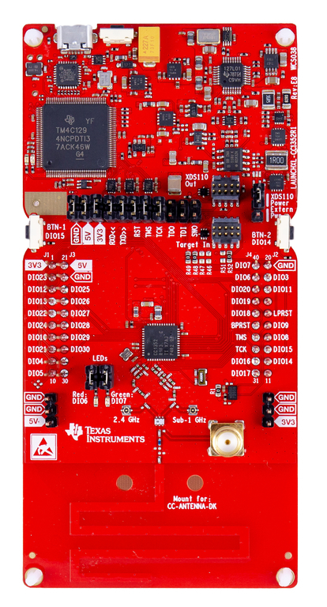
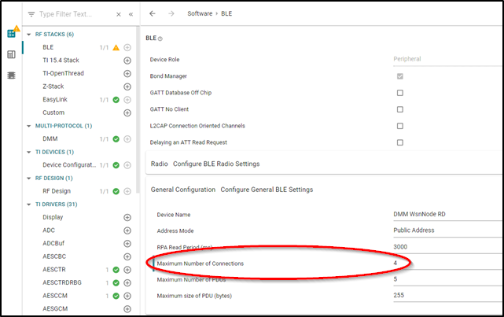

# DMM Wsn Node + BLE Simple Peripheral

## Table of Contents

* [Introduction](#Introduction)
* [Hardware Prerequisites](#HardwarePrerequisites)
* [Software Prerequisites](#SoftwarePrerequisites)
* [Dynamic Multi-protocol Manager](#DynamicMultiprotocolManager)
* [Usage](#Usage)
  * [BLE Multi-Connections](#BLEMultiConnections)
* [DMM Limitations](#DmmLimitations)

## Introduction

The dmm_wsnnode_ble_sp project showcases a dynamic multi-protocol example which
enables concurrent proprietary Sub-1G and BLE5. This example uses the tasks from
the Wireless Sensor Network Node example and the BLE simple\_peripheral example
along with TI's DMM (Dynamic Multi-protocol Manager) to demonstrate the multi-protocol and
dual band features of the CC1352R.

This baseline example is provided so customers can familiarize themselves with
existing single mode examples that where released for previous TI connectivity
devices and see how the DMM is used to enable these example to be run
concurrently on a CC13x2.

## Hardware Prerequisites

The default Simple Peripheral configuration uses the
[LAUNCHXL-CC1352R](http://www.ti.com/tool/launchxl-cc1352r1). This hardware
configuration is shown in the below image:

## Software Prerequisites

For information on what versions of Code Composer Studio and IAR Embedded
Workbench to use, see the dependencies section of the Release Notes located in
root folder of the SDK.

For information on how to import this project into your IDE workspace and
build/run, please refer to the device's Platform section in the [BLE5-Stack
Quick Start
Guide](../../../../../docs/simplelink_mcu_sdk/html/quickstart-guide/ble5-quick-start.html).

>Note: If you are running an OAD example, be sure to first build and flash a BIM project located in `/examples/nortos/<BOARD>/bim`. For more instructions on how to do this, please refer to the [BLE5-Stack
Quick Start
Guide](../../../../../docs/simplelink_mcu_sdk/html/quickstart-guide/ble5-quick-start.html).

## Dynamic Multi-protocol Manager
The DMM uses 2 main components to dynamically arbitrate the RF resource.

- A Policy Manager
- A Scheduler

TI CC1352 devices are capable of dual band operation, the CC1352 LaunchPad (TI
development platform) has a dual band antenna which performs well in the
868/916MHz band as well as the 2.4GHz band. Using the DMM on a CC1352 device
enables not only multi-protocol, but also dual band. The below diagram shows
how the DMM allows 2 stacks to run on the same device, which was previously
only possible on 2 devices. For illustration purposes we will assume the
stacks are a proprietary Sub-1G stack (called Wireless Sensor Network) and a
BLE Stack. However this is defined by the developer for the stacks being used.

Single mode setup:

DMM Setup:

The DMM makes scheduling decisions based on **Application Level information**,
**Stack Level information**, and the **Global Priority Table (GPT)**.

The Stack Level information is embedded in each RF command and it includes:
Start Type, Start Time, AllowDelay, Priority, Activity, etc.

The Global Priority Table (GPT) defines relative priorities of the two stacks
based on the activity and priority of RF commands.  For details of the GPT,
refer to `<SDK_DIR>\source\ti\common\dmm\dmm_priority_ble_wsn.c/h`.

The Application Level information is the user defined information via the policy
table and inludes: Application State Name, Weight, AppliedActivity, Pause, etc;
the policy table can have multiple policies. A policy defines a specific state
of the DMM application where the user wants to apply different priority based on
an action.  A simplified policy table is shown below, it defines the behavior
when Stack 1 is performing an OAD and does not take into account the specific
state of the stack 2 (i.e. any state). It specifies that when Stack 1 is in an
OAD state, the priority of the `BLE_CONNECTION`, in this case, is increased by
25. If any RF scheduling conflicts happen during the OAD, they will be resolved
by taking into account the modified priority defined in the policy.

|Stack 1 State Name   | Stack 2 State Name     |  Weight   | Applied Activity  |  Description
|-------------|----------------|-------------|-------------|---------------------------------
|OAD      | Any            |   25         |   CONNECTION        | Increase the priority of CONNECTION activity of Stack 1 by 25 during OAD operation

The policy used in this example is more complex than the illustration above. For
details of the actual policy used refer to
`<SDK_DIR>\source\ti\common\dmm\policy.h` and `ti_dmm_application_policy.c/h` as
generated by  the SysConfig tool.

The DMM also supports pausing/resuming stacks based on a policy change. This is
achieved by an application callback, which is called from the DMM policy manager
when a policy change requiring a stack to pause operation is entire. An example
of pausing the Zigbee stack during a BLE_OAD is provided in the DMM Zigbee
Coordinator Switch + BLE OAD example.

See the DMM chapter in your protocol stack user's guide for more information
about DMM.

## Usage

The idea behind this base line DMM example is that both Sub-1G application and
BLE application behave the same as their single mode version while running concurrently
on the same device.

For more information on the WSN Node usage and behavior refer to the User Guide for the
single mode example [here](../../../../../examples/rtos/CC1352R1_LAUNCHXL/easylink/rfWsnNode/README.html).

For more information on the BLE Simple Peripheral usage and behavior refer to the User
Guide for the Single mode example [here](../../../../../examples/rtos/CC1352R1_LAUNCHXL/ble5stack/simple_peripheral/README.html).

> Note: If you are using a smartphone as the BLE central device and the same
CC1352 LaunchPad was used previously with a different DMM or BLE example then
you may need to forget the device in the smartphone BLE settings, then disable
and enable BLE. Not doing this could result in the smartphone application
displaying incorrect services and characteristics

## BLE Multi-Connections

This project is configured by default to make use of Multiple (4) BLE
Connections. This means that the DMM project will be able to support 4 BLE
connections on top of the secondary stack network.

### Updating Multi-Connection Settings

The Multi-Connection Settings can easily be changed via the Sysconfig tool. No
application changes are required by the user to go from 1 connection to 4
connections.

As always, with network configuration changes, it's important to recognize that
the update will change the maximum bandwidth required by the BLE Stack. When
moving from the default settings to something new, you as the developer should
take time to consider how this will effect your network requirements.

## DMM Limitations

The initial implementation of DMM has only been tested with this policy. It is
important that the BLE policy is not changed as this could result in issue
within the BLE stack. The following limitations exist in the initial DMM
implementation:

- Sub-1G SLR Phy not supported.
- Connection intervals lower than 60ms will result in high Sub-1G packet loss when
BLE is connected.
- When connecting to a central device Sub-1G packet loss may be experienced until
the update parameters are sent 1s after connection. This will be dependent on the
initial connection interval of the BLE central devices.
