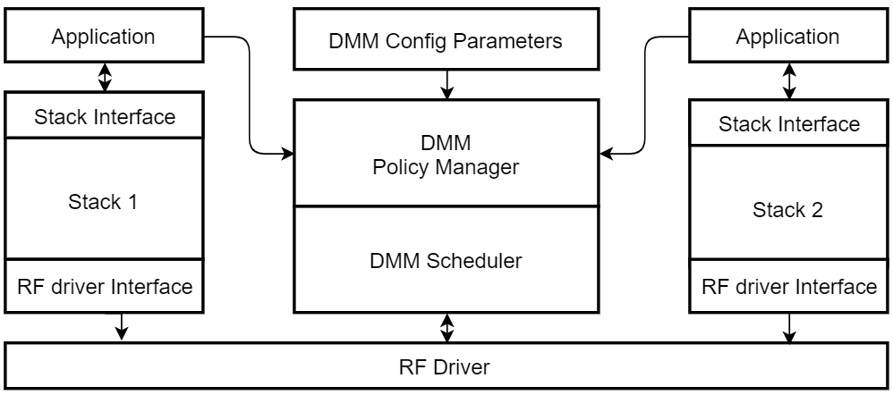
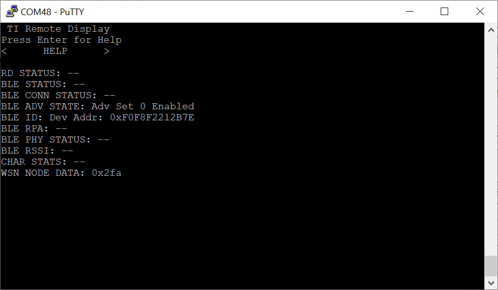
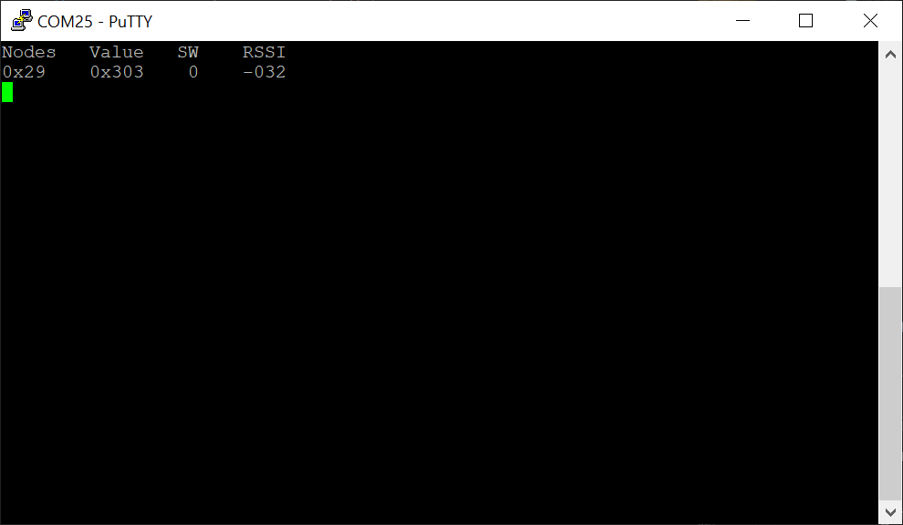
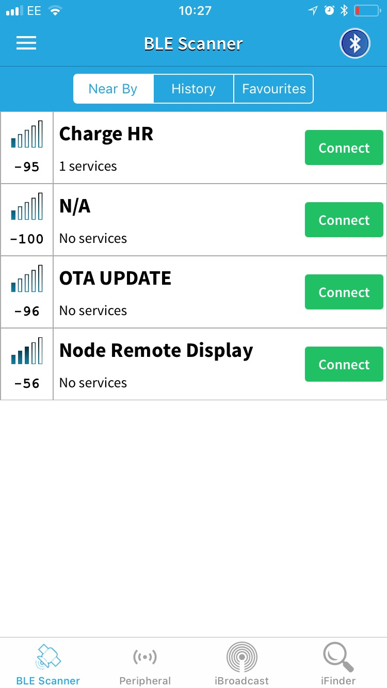
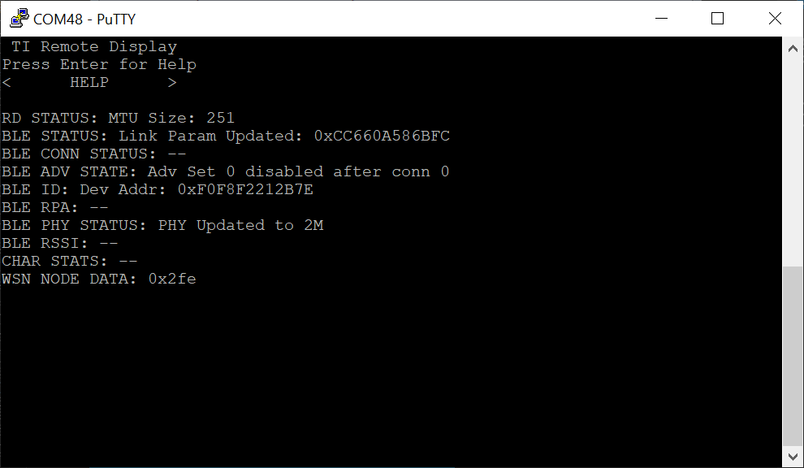
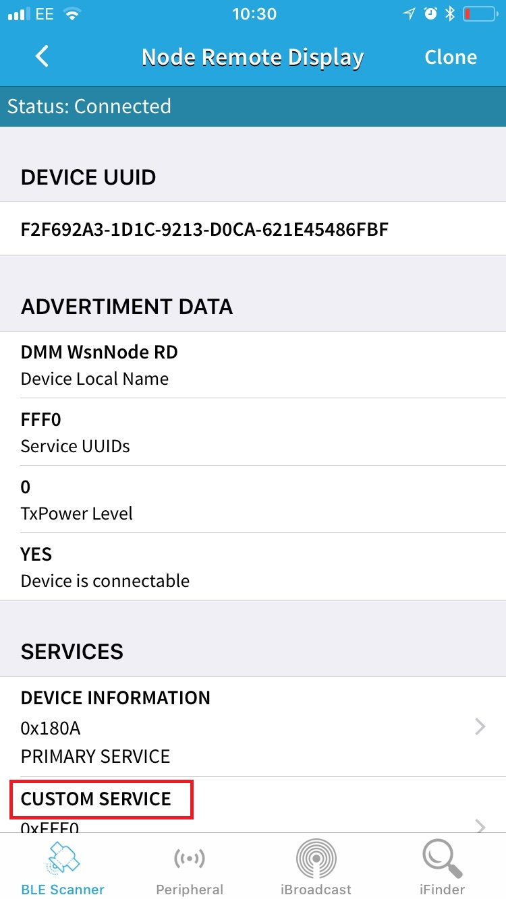
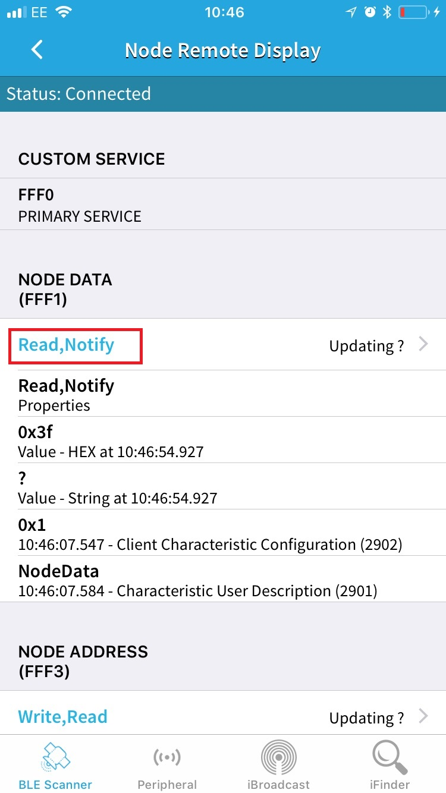
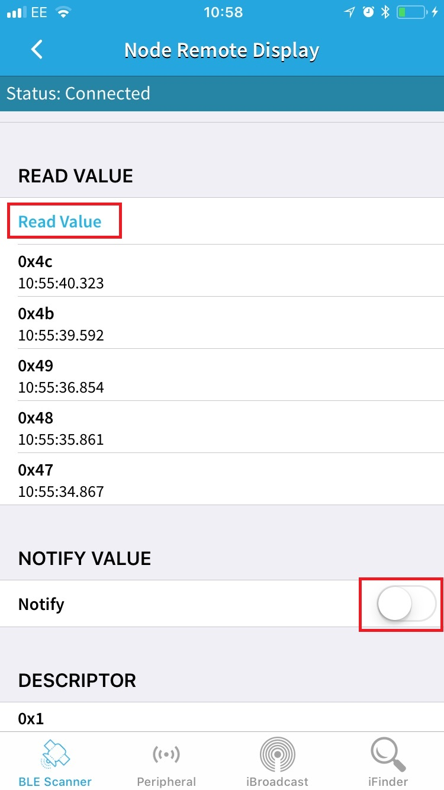

# DMM Wsn Node + BLE Remote Display

## Table of Contents

* [Introduction](#Introduction)
* [Hardware Prerequisites](#HardwarePrerequisites)
* [Software Prerequisites](#SoftwarePrerequisites)
* [Dynamic Multi-protocol Manager](#DynamicMultiprotocolManager)
* [Usage](#Usage)
    * [Node Data Characteristic (UUID: 1181)](#NodeDataCharacteristic)
    * [Node Report Interval (UUID: 1182)](#NodeReportIntervalCharacteristic)
    * [Concetrator LED Identify (UUID: 1183)](#ConcetratorLEDIdentify)
    * [Node Address (UUID: 1184)](#NodeAddress)
    * [Disabling Common User Interface](#DisableCUI)
* [Switching to SLR mode](#SwitchingtoSLRmode)
* [BLE Multi-Connections](#BLEMultiConnections)
* [DMM Limitations](#DmmLimitations)

## <a name="Introduction"></a>Introduction

The dmm_wsnnode_remote_display project showcases a dynamic multi-protocol example which
enables concurrent proprietary Sub-1G and BLE5. This example implements a Sub-1G
Wireless Sensor Network Node with a BLE Remote Display, using TI's DMM (Dynamic
Multi-protocol Manager) to enable the multi-protocol and dual band features of
the CC1352.

The BLE remote display allows a SmartPhone App to provision the Sub-1G node and
to see data on the Sub-1G network.

This project has the following app configurations available:

|App Build Configuration         | Description                                                       |
|--------------------------------|-------------------------------------------------------------------|
|FlashROM_Release (default)      | All TI-RTOS debug features disabled but application-logging to UART remains enabled. <br> The application uses the config file `ble_release.cfg` and the defines are in `<app name>_FlashROM_Release.opt`.|

All application configurations use the stack library configuration,
FlashROM_Library. This build configuration will yield additional flash
footprint optimizations by the linker since the application and stack can share
contiguous flash pages. This configuration is further discussed in the Stack
Library Configuration section of the [BLE5-Stack User's
Guide](../../../../../docs/ble5stack/ble_user_guide/ble5stack-users-guide.html) provided in
the SDK.

This document discusses the procedure for using the Wsn Node Remote Display
application when the FlashROM_Release configuration is used.

## <a name="HardwarePrerequisites"></a>Hardware Prerequisites

The default Simple Peripheral configuration uses the
[LAUNCHXL-CC1352R](http://www.ti.com/tool/launchxl-cc1352r1). This hardware
configuration is shown in the below image:


For custom hardware, see the Running the SDK on Custom Boards section of the
[BLE5-Stack User's
Guide](../../../../../docs/ble5stack/ble_user_guide/ble5stack-users-guide.html).

## <a name="SoftwarePrerequisites"></a>Software Prerequisites

For information on what versions of Code Composer Studio and IAR Embedded
Workbench to use, see the dependencies section of the Release Notes located
in the root folder of the SDK.

For information on how to import this project into your IDE workspace and
build/run, please refer to the device's Platform section in the [BLE5-Stack
Quick Start
Guide](../../../../../docs/simplelink_mcu_sdk/html/quickstart-guide/ble5-quick-start.html).

>Note: If you are running an OAD example, be sure to first build and flash a BIM project located in `/examples/nortos/<BOARD>/bim`. For more instructions on how to do this, please refer to the [BLE5-Stack
Quick Start
Guide](../../../../../docs/simplelink_mcu_sdk/html/quickstart-guide/ble5-quick-start.html).

## <a name="Service/Profile Table"></a>Service/Profile Table

This project contains 1 service, which has 5 characteristics.

Note that BLE Scanner may report 128 bit UUIDs, but the project is generating
16 bit UUIDs.


Characteristic       | UUID | Format         | Properties       | Profile Source
---------------------|------|----------------|------------------|---------------------------------------
Node Data            | 1181 | 1 Byte Integer | Read/Notify      | peripheral.c/remote_display_gatt_profile.c
Node Report Interval | 1182 | 1 Byte Integer | Read/Write       | peripheral.c/remote_display_gatt_profile.c
Conc LED Identify    | 1183 | 1 Byte Integer | Read/Write       | peripheral.c/remote_display_gatt_profile.c
Node Address         | 1184 | 1 Byte Integer | Auth Read/Write  | peripheral.c/remote_display_gatt_profile.c

## <a name="DynamicMultiprotocolManager"></a>Dynamic Multi-protocol Manager

The DMM uses 2 main components to dynamically arbitrate the RF resource.

- A Policy Manager
- A Scheduler

TI CC1352 devices are capable of dual band operation, the CC1352 Launchpad (TI
development platform) has a dual band antenna which performs well in the
868/916MHz band as well as the 2.4GHz band. Using the DMM on a CC1352 device
enables not only multi protocol, but also dual band. The below diagram shows
how the DMM allows 2 stacks to run on the same device, which was previously
only possible on 2 devices. In the diagram the Stack 1 is shown functioning
along side Stack 2, this could be a BLE stack and a proprietary Sub1G stack
(called Wireless Sensor Network) or a 15.4 Stack. The Stacks used are defined
by the developer.

Single mode setup:


DMM Setup:



The DMM makes scheduling decisions based on **Application Level information**,
**Stack Level information**, and the **Global Priority Table (GPT)**.

The Stack Level information is embedded in each RF command and it includes:
Start Type, Start Time, AllowDelay, Priority, Activity, etc.

The Global Priority Table (GPT) defines relative priorities of the two stacks
based on the activity and priority of RF commands.  For details of the GPT,
refer to `<SDK_DIR>\source\ti\common\dmm\dmm_priority_ble_wsn.c/h`.

The Application Level information is the user defined information via the policy
table and inludes: Application State Name, Weight, AppliedActivity, Pause, etc;
the policy table can have multiple policies. A policy defines a specific state
of the DMM application where the user wants to apply different priority based on
an action.  A simplified policy table is shown below, it defines the behavior
when Stack 1 is performing an OAD and does not take into account the specific
state of the stack 2 (i.e. any state). It specifies that when Stack 1 is in an
OAD state, the priority of the `BLE_CONNECTION`, in this case, is increased by
25. If any RF scheduling conflicts happen during the OAD, they will be resolved
by taking into account the modified priority defined in the policy.


|Stack 1 State Name   | Stack 2 State Name     |  Weight   | Applied Activity  |  Description
|-------------|----------------|-------------|-------------|---------------------------------
|OAD      | Any            |   25         |   CONNECTION        | Increase the priority of CONNECTION activity of Stack 1 by 25 during OAD operation


The policy used in this example is more complex than the illustration above. For
details of the actual policy used refer to
`<SDK_DIR>\source\ti\common\dmm\policy.h` and `ti_dmm_application_policy.c/h` as
generated by  the SysConfig tool.

The DMM also supports pausing/resuming stacks based on a policy change. This is
achieved by an application callback, which is called from the DMM policy manager
when a policy change requiring a stack to pause operation is entire. An example
of pausing the Zigbee stack during a BLE_OAD is provided in the DMM Zigbee
Coordinator Switch + BLE OAD example.

See the DMM chapter in your protocol stack user's guide for more information
about DMM.

## <a name="Usage"></a>Usage

This example should be used in conjunction with the EasyLink rfWsnConcentrator.
It is advised that you use the LAUNCHXL_CC1352R1 rfWsnConcentrator located at
../easylink/rfWsnConcentrator. Alternatively a different CC13x2 concentrator
can be used, however some features may not be available.

This application uses the UART peripheral to provide an
interface for the application. The UART is only used for display
messages.

This document will use Teraterm to serve as the display for the output of the
CC1352 LaunchPad. The BLE Scanner smartphone application will act
as the BLE Central device that will connect to the Remote Display service in
this example. The BLE Scanner smartphone application is available on App Store
and Google Play. Note that any other serial terminal and smart phone BLE
application can be used. The following default parameters are used for the UART
peripheral for display:

  UART Param     |Default Values
  -------------- |----------------
  Baud Rate      |115200
  Data length    |8 bits
  Parity         |None
  Stop bits      |1 bit
  Flow Control   |None

> Note: If you are using a smartphone as the BLE central device and the same
CC1352 LaunchPad was used previously with a different DMM or BLE example then
you may need to forget the device in the smartphone BLE settings, then disable
and enable BLE. Not doing this could result in the smartphone application
displaying incorrect services and characteristics

Once the Wsn Node Remote Display application starts, the output to the terminal
will report its address and the fact that it is advertising, as shown below:



The WsnConcentrator should be outputting the Sub-1G sensor as shown below:



The default reporting interval is 1s.

Advertising is enabled by default upon startup, so there is no need to
physically press a button to start advertising. Using BLE Scanner to scan for the
device, you should see a device with the name of Node Remote Display (note that
the navigation might be slightly different depending on your mobile
application):



If there is more than 1 device called Node Remote Display, the RSSI value under
the strength bars on the left can be used to find which device you are trying
to connect to. Press the "connect" button to connect to the device. When
prompted enter the pairing code "123456".

Once connected, the terminal window will show the address of the connected
device (smartphone):



In BLE Scanner, you should be able to see various information about the Node
Remote Display device:



You should see 1 service, which is labeled as "CUSTOM SERVICE" (this may be
slightly different for other smartphone applications). It will also provide
its UUID. Clicking on this service will display the 3 characteristics that it
contains, with information about each characteristic:



Scrolling down should show all 3 characteristics. The following sections detail
the functions and operations of each of the characteristics.

### <a name="NodeDataCharacteristic"></a>Node Data Characteristic (UUID: 1181)

This characteristic demonstrates read only and notify properties, and it contains
a 1-byte-long value indicating the Sub-1G node data. By default the BLE Scanner
application enables the notifications (this may be different with other apps or
versions of this app), notice that the value is updating every 1s. Click on the
"Read, Notify" item to see more information about the characteristic. From here
you can disable the notifications and read the characteristic manually.



> If you disable notifications then make sure you re-enable them as this will be
useful when changing the report interval later.

### <a name="NodeReportIntervalCharacteristic"></a>Node Report Interval Characteristic (UUID: 1182)

This characteristic demonstrates read and write properties, it contains
a 1-byte-long value indicating the Sub-1G report interval in seconds.

This application consists of an Sensor Controller Engine, SCE, Task which
samples the ADC. On initialization the CM3 application sets the minimum report
interval and the minimum change value which is used by the SCE task to wake up
the CM3. The ADC task on the SCE checks the ADC value once per second. If the ADC value
has changed by the minimum change amount since the last time it notified the CM3,
it wakes it up again. If the change is less than the masked value, then it
does not wake up the CM3 unless the minimum report interval time has expired.
This 1s update can also be seen on the BLE Scanner app when notifications are enabled.
In the BLE Scanner application scroll down to the second characteristic of the "CUSTOM
SERVICE", then Click on the "Read, Write" item of the Node Report Interval
characteristic to see more information about the characteristic. From here you
can read and write the report interval. When a value is written the rate at
which node data is updated changes to reflect the new value.

### <a name="ConcetratorLEDIdentify"></a>Concetrator LED Identify (UUID: 1183)

This characteristic demonstrates read and write properties, it contains
a 1-byte-long value used to make the Sub1GHz Wireless Sensor Network Concentrator
blink its LED. Writing 1 to this characteristic will cause the Node Remote Display
device to send a message over the Sub1GHz network to the network Concentrator
instructing it to blink its LED. The network concentrator LED will blink 5 time
when this message is received. The Characteristics value will reset back to 0
when the Concentrator acknowledges it has received the message. In the BLE Scanner
application scroll down to the 3rd characteristic of the CUSTOM SERVICE, then
click on the "Read, Write" item of the Concentrator LED Identify characteristic
to see more information about the characteristic. From here you can write 01 to
send a concentrator identify message.

### <a name="NodeAddressCharacteristic"></a>Node Address Characteristic 3 (UUID: 1184)

This characteristic has read and write properties. Reading the chracteristic
shows the node address reported by the concentrator. Writing to the
characteristics will cause a new node with that address to appear on the
concentrator's display.

## <a name="DisableCUI"></a>Disabling Common User Interface

The common user interface (CUI) is a UART based interface that allows users to control and receive updates regarding the application. For various reasons, including reducing the memory footprint, the user is able to disable the common user interface (CUI). To disable the CUI, the following variable must be defined in the `dmm_wsnnode_remote_display_app.opts`:

```
-DCUI_DISABLE
```

> Please Note: particular features that are dependednt on the CUI wil be unavailable when this feature is enabled.

## <a name="SwitchingtoSLRmode"></a>Switching to SLR Mode

The following steps will allow you to use the easylink network on a SLR (Simplelink Long Range) PHY.

Change the PHY for the Node Application:
Modify the RADIO_EASYLINK_MODULATION in RadioProtocol.h. Use `EasyLink_PHY_5KBPSSLLR` instead of `EasyLink_PHY_Custom`.

Change the PHY for the Concentrator Application:
Modify the RADIO_EASYLINK_MODULATION in RadioProtocol.h. Use `EasyLink_PHY_5KBPSSLLR` instead of `EasyLink_PHY_Custom`.
Modify the NORERADIO_ACK_TIMEOUT_TIME_MS in ConcentratorRadioTask.c. Use '500' instead of '160'

Rebuild both the DMM Application and the Concentrator Application with these changes.

## <a name="BLEMultiConnections"></a>BLE Multi-Connections

This project is configured by default to make use of Multiple (4) BLE
Connections. This means that the DMM project will be able to support 4 BLE
connections on top of the secondary stack network.

### <a name="Changing Multi-Conn Setting"></a>Updating Multi-Connection Settings

The Multi-Connection Settings can easily be changed via the Sysconfig tool. No
application changes are required by the user to go from 1 connection to 4
connections.


As always, with network configuration changes, it's important to recognize that
the update will change the maximum bandwidth required by the BLE Stack. When
moving from the default settings to something new, you as the developer should
take time to consider how this will effect your network requirements.

## <a name="DmmLimitations"></a>DMM Limitations

The following limitations exist in the DMM implementation:

- Sub-1G SLR Phy not supported.
- Connection intervals lower than 60ms will result in high sub1G packet loss when
BLE is connected.
- When connecting to a central device Sub-1G packet loss may be experienced until
the update parameters are sent 1s after connection. This will be dependent on the
initial connection interval of the BLE central devices.
- Only 1 BLE connection is supported. The number of concurrent BLE connections is set in the application .opt file, located in the project workspace under the TOOLS folder.
