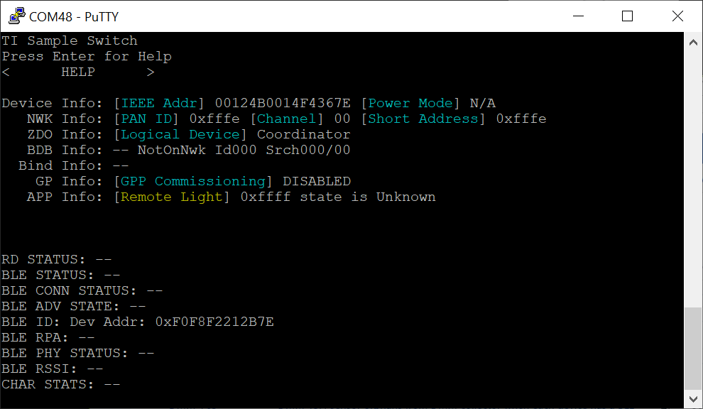
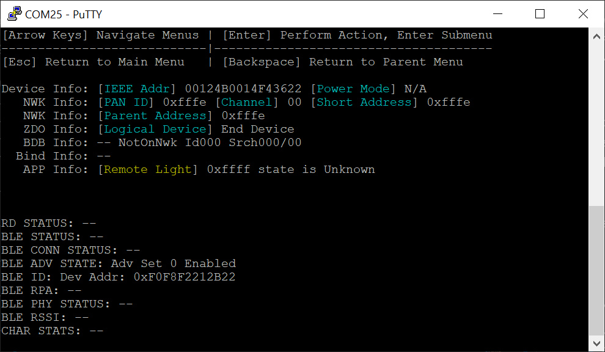
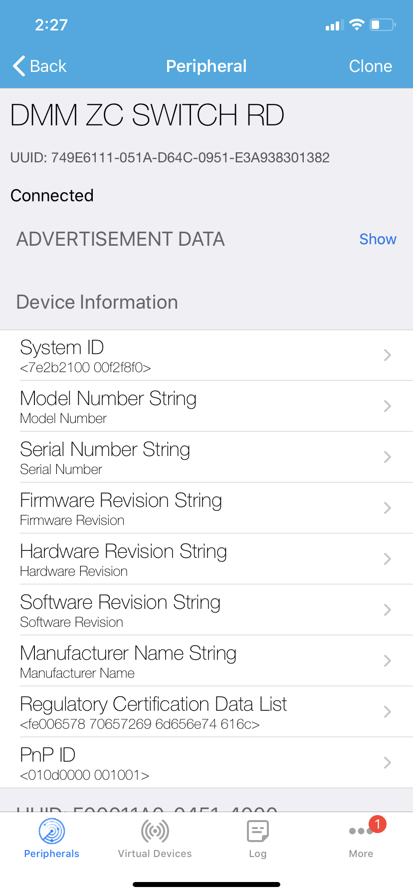
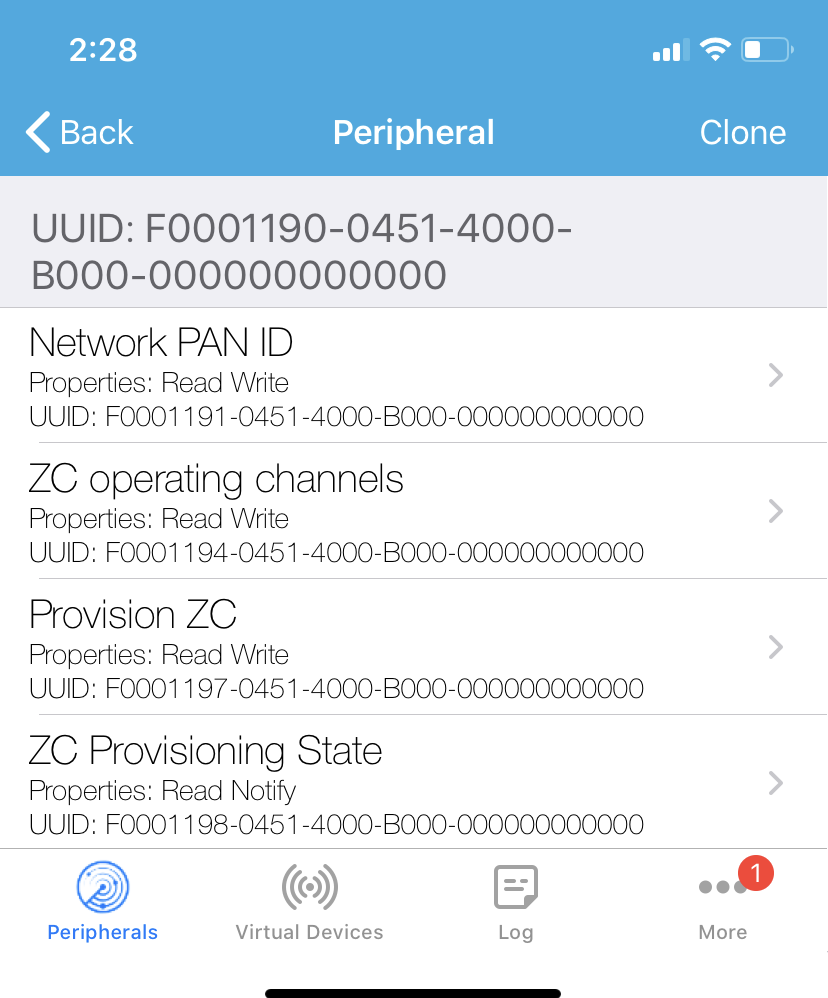
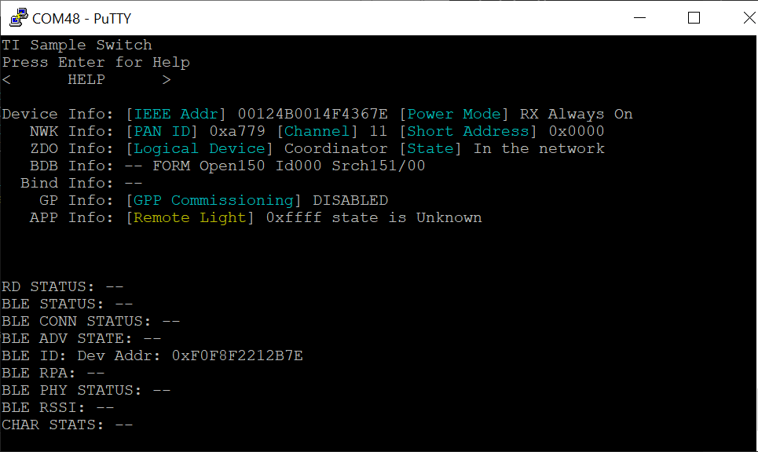
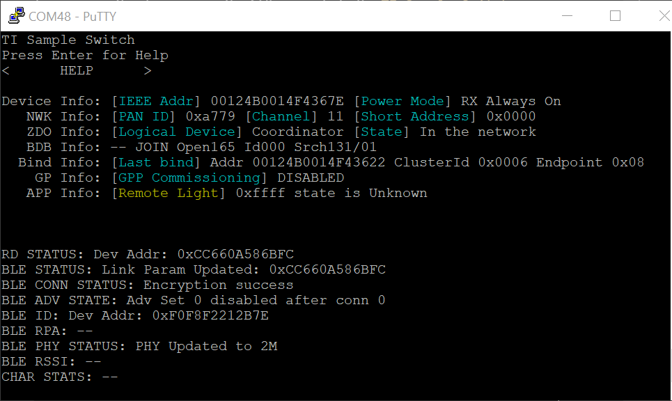
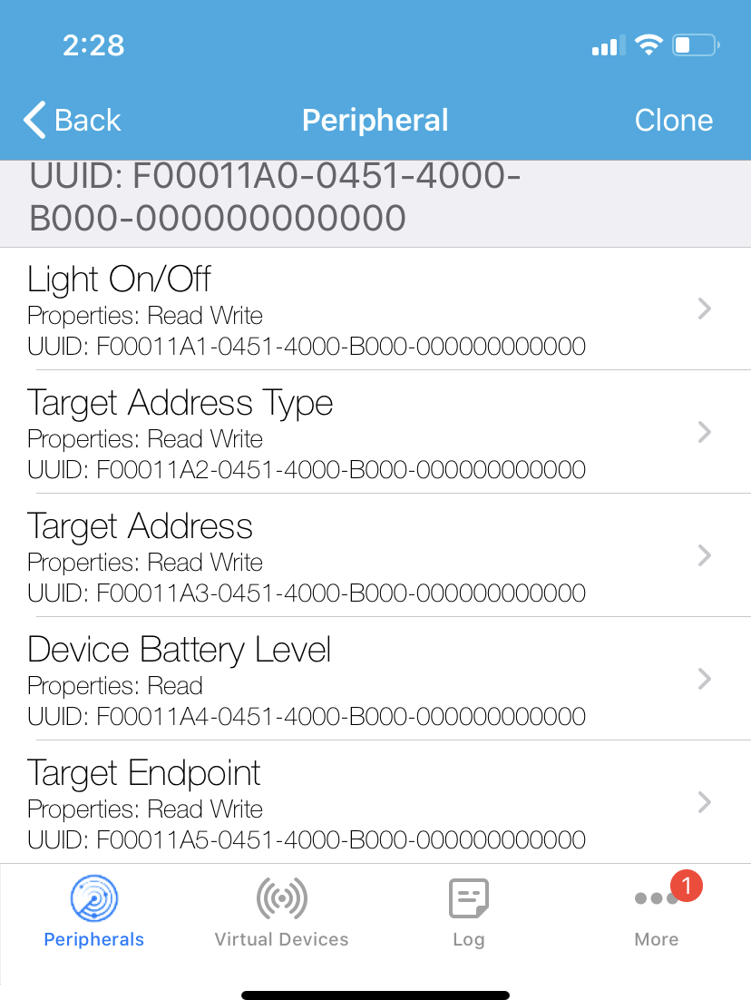
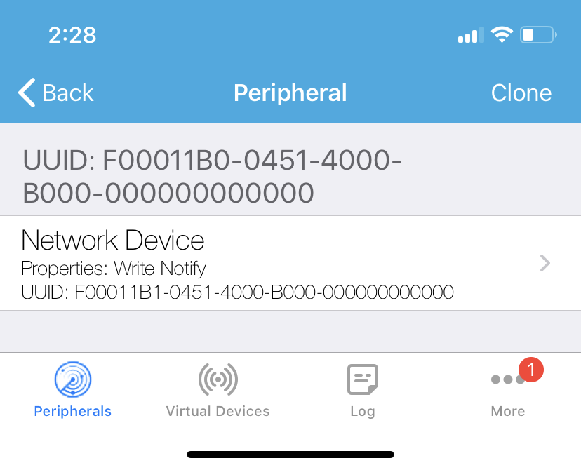
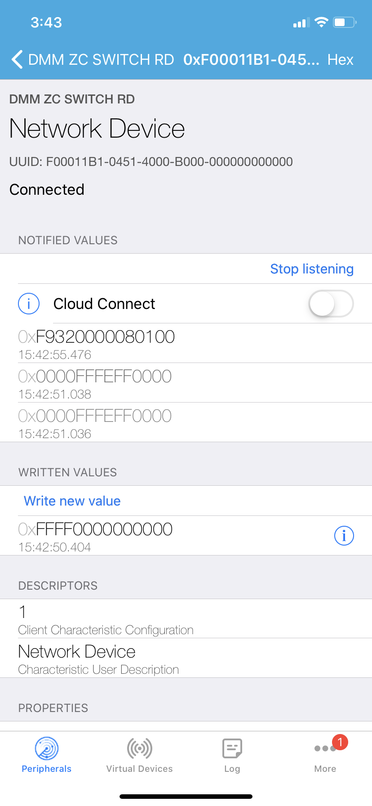

# DMM Zigbee Coordinator + BLE Remote Display

## Table of Contents

* [Introduction](#Introduction)
* [Hardware Prerequisites](#HardwarePrerequisites)
* [Software Prerequisites](#SoftwarePrerequisites)
* [Dynamic Multi-protocol Manager](#DynamicMultiprotocolManager)
* [Usage](#Usage)
  * [BLE Services Overview](#Services)
  * [Using the Common User Interface](#CUI)
  * [Starting the Zigbee Coordinator's Network](#startingCoordsNetwork)
  * [Provisioned Zigbee Coordinator](#ProvisionedZcSwitch)
  * [Zigbee Network Device Discovery via BLE](#NetworkDeviceDiscoveryService)
  * [Disabling Common User Interface](#DisableCUI)

## <a name="Introduction"></a>Introduction

The dmm_zc_switch_remote_display project showcases a dynamic multi-protocol
example which enables a concurrent zigbee coordinator device and BLE5. This
example implements a Zigbee Coordinator with a BLE Remote Display, using TI's
DMM (Dynamic Multi-protocol Manager) to enable the multi-protocol features of
the CC13x2 and CC26x2 devices.

The BLE remote display allows a SmartPhone App to start the Zigbee network and
begin commissioning other devices onto the network.

This project has the following app configurations available:

|App Build Configuration         | Description                                                       |
|--------------------------------|-------------------------------------------------------------------|
|Release (default)      | All TI-RTOS debug features disabled but application-logging to UART remains enabled. <br> The application uses the config file `ble_release.cfg` and the defines are in `<app name>_FlashROM_Release.opt`.|

All application configurations use the stack library configuration,
FlashROM_Library. This build configuration will yield additional flash
footprint optimizations by the linker since the application and stack can share
contiguous flash pages. This configuration is further discussed in the Stack
Library Configuration section of the [BLE5-Stack User's
Guide](../../../../../docs/ble5stack/ble_user_guide/ble5stack-users-guide.html) provided in
the SDK.

This document discusses the procedure for using the DMM Zigbee Switch Remote Display
application.

## <a name="HardwarePrerequisites"></a>Hardware Prerequisites

The default Simple Peripheral configuration uses the
[LAUNCHXL-CC1352](http://www.ti.com/tool/launchxl-cc1352) or the [LAUNCHXL-CC2652](http://www.ti.com/tool/launchxl-cc1352).

 >Note: The SDK requires CC13x2/CC26x2 PG2.1 Silicon

The hardware configuration is shown in the below image:


For custom hardware, see the Running the SDK on Custom Boards section of the
[BLE5-Stack User's
Guide](../../../../../docs/ble5stack/ble_user_guide/ble5stack-users-guide.html).

## <a name="SoftwarePrerequisites"></a>Software Prerequisites

For information on what versions of Code Composer Studio and IAR Embedded
Workbench to use, see the dependencies section of the Release Notes located
in the root folder of the SDK.

For information on how to import this project into your IDE workspace and
build/run, please refer to the device's Platform section in the [BLE5-Stack
Quick Start
Guide](../../../../../docs/simplelink_mcu_sdk/html/quickstart-guide/ble5-quick-start.html).

>Note: If you are running an OAD example, be sure to first build and flash a BIM project located in `/examples/nortos/<BOARD>/bim`. For more instructions on how to do this, please refer to the [BLE5-Stack
Quick Start
Guide](../../../../../docs/simplelink_mcu_sdk/html/quickstart-guide/ble5-quick-start.html).

## <a name="DynamicMultiprotocolManager"></a>Dynamic Multi-protocol Manager

The DMM uses 2 main components to dynamically arbitrate the RF resource.

- A Policy Manager
- A Scheduler

TI CC1352 devices are capable of dual band operation, the CC1352 Launchpad (TI
development platform) has a dual band antenna which performs well in the
868/916MHz band as well as the 2.4GHz band. Using the DMM on CC1352 devices
enables not only multi protocol, but also dual band. The below diagram shows
how the DMM allows 2 stacks to run on the same device, which was previously
only possible on 2 devices. In the diagram the Stack 1 is shown functioning
along side Stack 2, this could be a BLE stack and a proprietary Sub1G stack
(called Wireless Sensor Network) or a 15.4 Stack. The Stacks used are defined
by the developer.

Single mode setup:


DMM Setup:


The DMM makes scheduling decisions based on **Application Level information**,
**Stack Level information**, and the **Global Priority Table (GPT)**.

The Stack Level information is embedded in each RF command and it includes:
Start Type, Start Time, AllowDelay, Priority, Activity, etc.

The Global Priority Table (GPT) defines relative priorities of the two stacks
based on the activity and priority of RF commands.  For details of the GPT,
refer to `<SDK_DIR>\source\ti\common\dmm\dmm_priority_ble_zigbee_zc.c/h`.

The Application Level information is the user defined information via the policy
table and inludes: Application State Name, Weight, AppliedActivity, Pause, etc;
the policy table can have multiple policies. A policy defines a specific state
of the DMM application where the user wants to apply different priority based on
an action.  A simplified policy table is shown below, it defines the behavior
when Stack 1 is performing an OAD and does not take into account the specific
state of the stack 2 (i.e. any state). It specifies that when Stack 1 is in an
OAD state, the priority of the `BLE_CONNECTION`, in this case, is increased by
25. If any RF scheduling conflicts happen during the OAD, they will be resolved
by taking into account the modified priority defined in the policy.


|Stack 1 State Name   | Stack 2 State Name     |  Weight   | Applied Activity  |  Description
|-------------|----------------|-------------|-------------|---------------------------------
|OAD      | Any            |   25         |   CONNECTION        | Increase the priority of CONNECTION activity of Stack 1 by 25 during OAD operation


The policy used in this example is more complex than the illustration above. For
details of the actual policy used refer to
`<SDK_DIR>\source\ti\common\dmm\policy.h` and `ti_dmm_application_policy.c/h` as
generated by  the SysConfig tool.

The DMM also supports pausing/resuming stacks based on a policy change. This is
achieved by an application callback, which is called from the DMM policy manager
when a policy change requiring a stack to pause operation is entire. An example
of pausing the Zigbee stack during a BLE_OAD is provided in the DMM Zigbee
Coordinator Switch + BLE OAD example.

See the DMM chapter in your protocol stack user's guide for more information
about DMM.

## <a name="Usage"></a>Usage

This example should be used in conjunction with a Zigbee router light or Zigbee
end device.

This application uses the UART peripheral to provide a user
interface for the application.

This document will use Putty to serve as the display for the output of the
CC1352 LaunchPad. The LightBlue smartphone application will act as the BLE
Central device that will connect to the Remote Display service in this example.
The LightBlue smartphone application is available on App Store and Google Play.
Note that any other serial terminal and smart phone BLE scanner application can
be used. The following default parameters are used for the UART peripheral for
display:

  |UART Param     |Default Values |
  |-------------- |---------------|
  |Baud Rate      |115200         |
  |Data length    |8 bits         |
  |Parity         |None           |
  |Stop bits      |1 bit          |
  |Flow Control   |None           |

> Note: If you are using a smartphone as the BLE central device and the same
CC1352 LaunchPad was used previously with a different DMM or BLE example then
you may need to forget the device in the smartphone BLE settings, then disable
and enable BLE. Not doing this could result in the smartphone application
displaying incorrect services and characteristics

Once the Zigbee Switch Coordinator Remote Display application and the Zigbee
Router Light starts, the UI will wait for user input. The output to the terminal
will also report its BLE address and the fact that it is advertising which is
enabled by default upon startup, as shown below:



## <a name="Services"></a>BLE Services Overview

This project contains 3 services:

- Provisioning Service used to configure the device for connecting to a Zigbee
network.
- Light Switch Service used to control a Light on the Zigbee Network
- Network Discovery Service used to display the list of devices connected to the
Zigbee Network

The characteristic UUID is a 128b, with 16b that are used to specify the characteristic. The below shows the format of the 128b UUID:

    0x00, 0x00, 0x00, 0x00, 0x00, 0x00, 0x00, 0xB0, 0x00, 0x40, 0x51, 0x04, LOW BYTE OF UUID, HIGH  BYTE OF UUID, 0x00, 0xF0

###  <a name="Provisioning Service/Profile Table"></a>Provisioning Service/Profile Table

The provisioning profile is defined in `software_stacks/ble_stack/profiles/provisioning_gatt_profile.c`

The characteristics and properties are shown below.

|Characteristic             | UUID | Format          | Properties       |
|---------------------------|------|-----------------|------------------|
|Network PAN ID             | 1191 | 2 Byte Integer  | Auth Read/Write  |
|ZC operating channels       | 1194 | 4 Byte Integer | Auth Read/Write  |
|Provision ZC | 1197 | 1 Byte Integer  | Auth Read/Write  |
|ZC Provisioning State | 1198 | 1 Byte Integer  | Auth Read/Notify        |

###  <a name="Light Switch Service/Profile Table"></a>Light Switch Service/Profile Table

The light profile is defined in `software_stacks/ble_stack/profiles/light_gatt_profile.c`

The characteristics and properties are shown below.

|Characteristic             | UUID | Format          | Properties       |
|---------------------------|------|-----------------|------------------|
|Light On/Off State         | 11A1 | 1 Byte Integer  | Read/Notify      |
|Target Address Type        | 11A2 | 1 Byte Integer  | Read/Write       |
|Target Address             | 11A3 | 2 Byte Integer  | Read/Write       |
| Device Battery Level              | 11A4 | 1 Byte Integer  | Read             |
| Target Endpoint              | 11A5 | 1 Byte Integer  | Read/Write             |

###  <a name="Network Device Service/Profile Table"></a>Network Device Service/Profile Table

The network device service profile is defined in `software_stacks/ble_stack/profiles/network_device_gatt_profile.c`

The characteristics and properties are shown below.

|Characteristic             | UUID | Format          | Properties       |
|---------------------------|------|-----------------|------------------|
|Network Device             | 11B1 | 7 Byte Integer  | Write/Notify     |

## <a name="CUI"></a>Using the Common User Interface

>Note: The screenshots in this section were taken from the DMM ZED switch + BLE
project. There will be slight differences in the UART terminal depending on
which project you are working with.

The Common User Interface (CUI) controls the access to User Interface
resources. On a LaunchPad device, these resources are made up of Buttons, LEDs
and UART I/O.

Using a UART terminal with the configuration described above, use the arrow
keys to navigate the menu. Upon startup, pressing the *ENTER* key will display
the **HELP** menu, as shown below:



To demonstrate the use of the CUI, let us change the BLE PHY. First, use the
arrow keys to select the `TI Remote Display` menu. Pressing the *ENTER* key
will take us to the `TI Remote Display` menu. Next, we see the option to
`CONFIGURE` or go `BACK` to the previous menu. Make sure `CONFIGURE` is
selected and hit the *ENTER* key to enter the `CONFIGURE` menu. Here, we have
the option to `SET PHY`. After pressing *ENTER* once more, we can select a
PHY. Chose the 2M PHY. You should see confirmation of this on the UART
display, as shown below.


> Note: When using the CUI, the buttons on the LaunchPad should not be used
to navigate the CUI menu. These buttons perform other actions as described
in the following section.

## <a name="startingCoordsNetwork"></a>Starting the Coordinator's Network

The user has 3 choices to start the Zigbee network:

- Use the LEFT button to start the network using the default network settings as
  configured by the SysConfig tool.
- Use a BLE central device (such as the LightBlue Smartphone Application) to
  configure the network settings and start the network.
- Use the Common User Interface (CUI) to configure and start the network

### <a name="Provisioning154NetworkBLE"></a>Provisioning the Zigbee Network via BLE

To provision the device using BLE, use LightBlue to scan for the
device. You should see a device with the name of "DMM ZC SWITCH RD" (note that
the navigation might be slightly different depending on your mobile
application):


If there is more than 1 device called DMM ZC SWITCH RD, the RSSI value under
the strength bars on the left can be used to find which device you are trying
to connect to. Press the "connect" button to connect to the device. When
prompted enter the pairing code "123456".

In LightBlue, you should be able to see various information about the Zigbee
Coordinator Switch device:



You should see the provisioning service, which is labeled as "UUID: F0001190-0451-4000-B000-000000000000" (this may be
slightly different for other smartphone applications).

Under each service there should be the following characteristics shown:



The following sections detail the functions and operations of each of the characteristics.

#### <a name="NetworkPANID"></a>Network PAN ID Characteristic (UUID: 1191)

This characteristic sets the PAN ID that the Zigbee Switch will use. This is the
same as setting PAN_ID in the UI configuration menu.

Setting PAN_ID in UI to 0xFFFF on the Coordinator allows it to form a network
with a random PAN ID, setting it to a specific value forces the Zigbee Switch
Coordinator to form a network with that specific PAN ID. Setting PAN_ID in the
UI or Network PAN ID Characteristic to 0xFFFF (the default) on the Zigbee Light
allows it to join any network, setting it to a specific value forces it to only
join a network with that PAN ID.

#### <a name="ZcSwitchOperatingChannels"></a>Zigbee Switch Operating Channels Characteristic (UUID: 1194)

This characteristic sets the Channel Mask that the Zigbee Switch will use to
form a network. This is the same as setting Primary Channel in the UI.

>Note: The operating channels attribute when read, will return the any
previously formed network's channel mask and will update once network formation
is accomplished.

#### <a name="ProvisionZcCoordinator"></a>Provision Zigbee Coordinator Characteristic (UUID: 1197)

This characteristic is used to make the Zigbee Coordinator form a network using
the provisioning characteristics. The value of 0xAA must be written to this
characteristic to start the formation process.

>Note: All the above provisioning characteristics default to those set using the
SysConfig tool. The characteristics only need to be written to if the user
requires to change them from the defaults.

#### <a name="ZcSwitchProvisioingState"></a>Zigbee Coordinator Provisioning State (UUID: 1198)

This characteristic is used to read the Zigbee Switch's network state. The
following states will be observed:

- Zigbee Switch Provisioning State 0: Waiting to be Initialized
- Zigbee Switch Provisioning State 1: Device Initialized
- Zigbee Switch Provisioning State 2: Discovering PAN's to Join
- Zigbee Switch Provisioning State 3: Joining Network
- Zigbee Switch Provisioning State 4: Re-Joining Network
- Zigbee Switch Provisioning State 5: Joined but not Authenticated
- Zigbee Switch Provisioning State 6: Joined Network as End Device
- Zigbee Switch Provisioning State 7: Joined Network as Router
- Zigbee Switch Provisioning State 8: Starting as Zigbee Coordinator
- Zigbee Switch Provisioning State 9: Started as Zigbee Coordinator
- Zigbee Switch Provisioning State 10: Orphaned from Network
- Zigbee Switch Provisioning State 11: Sending KeepAlive Message
- Zigbee Switch Provisioning State 12: Device waiting before trying to rejoin network
- Zigbee Switch Provisioning State 13: Re-Joining Network in Secure Mode Scanning All Channels
- Zigbee Switch Provisioning State 14: Re-Joining Network in Trust Center Mode Scanning Current Channel
- Zigbee Switch Provisioning State 15: Re-Joining Network in Trust Center Mode Scanning All Channels

### <a name="ProvisioningZigbeeDeviceCUI"></a>Provisioning the Zigbee Device via CUI

To provision the device using the CUI, navigate to the `TI Sample Switch` menu
and press the *ENTER* key to enter this menu.

Then, navigate to the `COMMISSION` tab and press the *ENTER* key.

The ZED switch will form the network with the default settings as configured
with the SysConfig tool. In the **ZDO Info** line, the state should change to
**In the network** as shown below.



Once connected, the following UART output should be displayed:



> Note: The above screenshot was taken after a BLE connection was
established between the LaunchPad and a smartphone.

For more details regarding the use of CUI for Zigbee End Device Switch,
refer to the project's README.html file, located here: `<SDK
DIR>\examples\rtos\CC1352R1_LAUNCHXL\zstack\zc_sw\README.html>`

## <a name="ProvisionedZcSwitch"></a>Provisioned Zigbee Coordinator

Once provisioned (commissioned in Zigbee terminology) the ZC Switch can setup
and route traffic on the Zigbee network. If the binding was successful during
commissioning then the default setting then the light's Light Service will
control the Light on/off state of all the light(s) in the binding.

You should see the Light service, which is labeled as "UUID:
F00011A0-0451-4000-B000-000000000000" (this may be slightly different for other
smartphone applications). Under this service there should be the following
characteristics shown:



#### <a name="Light On/Off"></a>Light On/Off Characteristic (UUID: 11A1)

This characteristic supports  read and write properties, and it contains a
1-byte-long value indicating the on/off state. Writing a 1 to this will send an
Zigbee ZCL On message. Writing 0 will send a Zigbee ZCL Off message.

#### <a name="TargetAddressTypeCharacteristic"></a>Target Address Type Characteristic (UUID: 11A2)

This characteristic supports read and write properties, it contains a
1-byte-long value indicating the target address type. Currently only 2 values
are supported:

- 0x0: Send to the Binding Table
- 0x2: Send to the 16b address specified in the Target Address Characteristic

#### <a name="TargetAddressCharacteristic"></a>Target Address Characteristic (UUID: 11A3)

This characteristic supports read and write properties, it contains a
2-byte-long value that is used for as the Destination Address of the Zigbee ZCL
On/Off message. This is only used if the Target Address Type Characteristic is
set to 0x02.

>Note: The endpoint is hard coded to 8, which is the endpoint of the TI Zigbee Light.

#### <a name="BetteryLevelCharacteristic"></a>Battery Level Characteristic (UUID: 11A4)

This characteristic supports read only properties, it contains
a 1-byte-long value that is used to diaplay the battery level.

>Note: In this implementation the Launchpad is USB powerd and this value always reads 100.

#### <a name="TargetEndpointCharacteristic"></a>Target Endpoint Characteristic (UUID: 11A5)

This characteristic supports read and write properties, it contains a
1-byte-long value that is used to set a known target endpoint of the Zigbee ZCL
On/Off message. This is only used if the Target Address Type Characteristic is
set to 0x02. In order to send the toggle command to a device on the network
without the use of the binding table, set the target address and ignore the
target endpoint characteristic. The specific node at the target address will be
queried for support of the ON/OFF cluster and if found the endpoint will
automatically be set.

>Note: The endpoint for the TI Zigbee Light is set to 0x08.

## <a name="NetworkDeviceDiscoveryService"></a>Zigbee Network Device Discovery via BLE

The DMM Zigbee Coordinator Switch example enables the user to discover the
devices connected to its Zigbee network with the Network Device Service which is
labeled as "UUID: F00011B0-0451-4000-B000-000000000000" (this may be slightly
different for other smartphone applications).



#### <a name="Network Device"></a>Network Device Characteristic (UUID: 11B1)

This characteristic supports write and notify properties, and it contains a
7-byte-long value indicating the address of the sensor to retrieve the latest
data from.

Writing the value 0xFFFF0000000000 to this characteristic will start the network
discovery process. The network device discovery process will send a BLE
notification for each device in the network, including itself as the
coordinator.

The Network Device information in the BLE notification will be sent as follows:

|2 Bytes          |     2 Bytes    |    1 Byte                   | 1 Byte |  1 Byte  |
|-----------------|----------------|-----------------------------|--------|----------|
|Device Address   | Parent Address | Light EndPoint (0xFF if n/a)|  RSSI  | Unused   |

The user also has the option to check the status of a single device by writing
the address of the device it would like to receive a notification from. For
example, to receive a BLE notification from a device with address 0x0001,
simply write the value 0x00010000000000 to this characteristic.



The figure above shows notifications for one device connected to the Zigbee
Coordinator.

>Note: Some phones may show an extra notification when this characteristic is
written to.

>In LightBlue, make sure to select the "Listen for notifications" button.

## <a name="DisableCUI"></a>Disabling Common User Interface

The common user interface (CUI) is a UART based interface that allows users to control and receive updates regarding the application. For various reasons, including reducing the memory footprint, the user is able to disable the common user interface (CUI). To disable the CUI, the following variable must be defined in `dmm_zc_switch_remote_display_app.opts`:

```
-DCUI_DISABLE
```

> Please Note: particular features that are dependednt on the CUI wil be unavailable when this feature is enabled.
