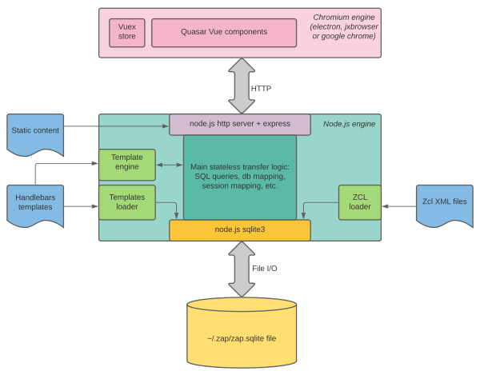
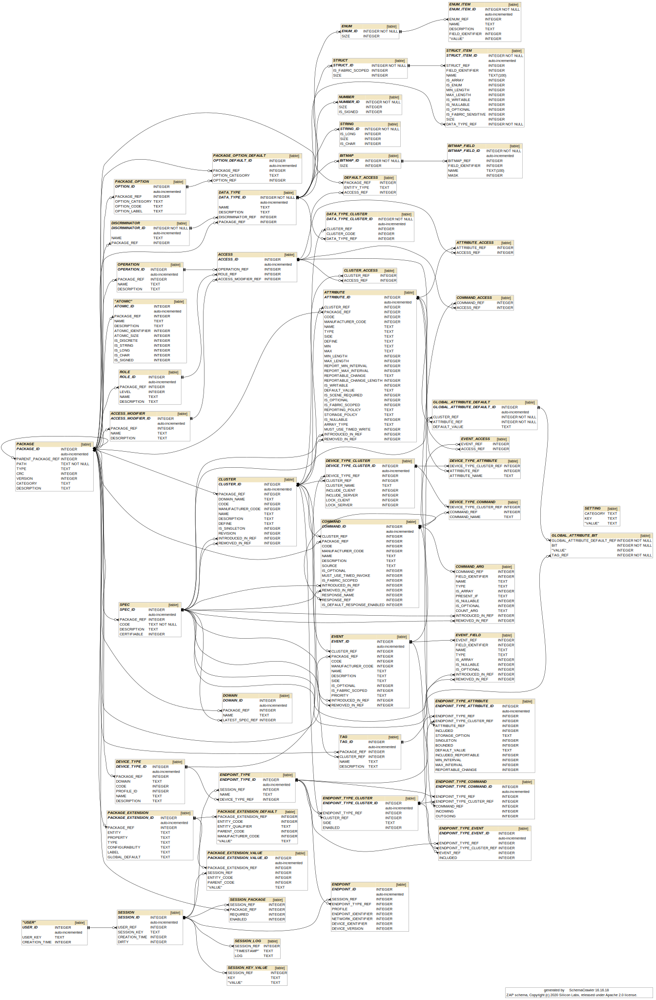

# Zigbee Advanced Platform (ZAP)

ZAP is an application that provides generation and configuration ability for the end-user ZCL application.

- [Zigbee Advanced Platform (ZAP)](#zigbee-advanced-platform-zap)

  - [Use cases](#use-cases)
    - [Standalone electron application](#standalone-electron-application)
    - [Command line regeneration](#command-line-regeneration)
    - [Integration with IDE](#integration-with-ide)
  - [ZAP architecture](#zap-architecture)
    - [Principles](#principles)
    - [Architecture diagram](#architecture-diagram)
  - [Front end](#front-end)
  - [Generator and backend](#generator-and-backend)
  - [Database schema](#database-schema)
    - [Schema design principles](#schema-design-principles)
    - [Schema diagram](#schema-diagram)
  - [Embedded code](#embedded-code)
    - [Database](#database)
    - [Metalayer](#metalayer)
    - [Zap API](#zap-api)
  - [Versioning and backwards compatibility](#versioning-and-backwards-compatibility)
    - [Compatibility considerations](#compatibility-considerations)
    - [Dealing with the generation variant](#dealing-with-the-generation-variant)
    - [Dealing with the XML files](#dealing-with-the-xml-files)
  - [Dealing with multiple zap tool versions](#dealing-with-multiple-zap-tool-versions)
  - [Documentation](#documentation)
  - [Testing](#testing)

## Use cases

This chapter lists the use cases that were envisioned for the ZAP
platform.

### Standalone electron application

In this scenario, the zap application is used standalone. It provides a `zap` executable, which, when launched without any argument shows the full UI, which allows the user to work with an application configuration, load/save configuration files and perform a generation out of the given configuration.

### Command line regeneration

The command-line case features the same `zap` executable, however it will support command line options, which will cause the application to run in a headless mode, and generate all the data out of the configuration without showing the UI.

This will make the application well suited for integration into continuous integration tools, such as Jenkins or similar.

History shows that integration into CI process is critical for adoption of the tools into a wider ecosystem.

### Integration with IDE

A third use case is an integration into IDE. There are 2 integrations currently envisioned:

- Integration with [VSCode](https://code.visualstudio.com/).
- Integration with [Silicon Labs Simplicity Studio](https://www.silabs.com/products/development-tools/software/simplicity-studio).

The integration with IDE has 2 parts:

1. Visual integration, which enables using the UI directly inside a given IDE:
   - VSCode naturally assimilates the web technology, since it is itelf written using electron. So the UI will fit naturally into its extensions model.
   - Simplicity Studio provides jxbrowser for the integration, so it will use a jxbrowser based eclipse editor to show the UI.
2. Generation integration, which enables automatic regeneration of the generated files when the configuration data changes.
   - VSCode will provide an JS-based extension, that will be able to trigger the generation code. There is no plan to move generation code in-process with the VSCode, it will be used as an independent program to execute with the correct arguments.
   - Simplicity Studio adapter pack technology will provide integration with the zap program for the generation.

## ZAP architecture

### Principles

The ZAP architecture follows the standard guidelines for modern application development using node.js for backend and web technologies for frontend, using the well-known and widely adopted electron platform.

The state of the application is stored in the back-end SQL database (initialy a [SQLite](https://www.sqlite.org/index.html) file on a desktop PC).

All the frontend is developed using the [quasar framework](https://quasar.dev/), which is one of the most popular front-end frameworks developed on top of the [Vue.JS platform](https://vuejs.org/).

Between the front-end and the back-end is the REST API, which allows for a clean separation between the two.

The architectural design allows for the front-end user interface to be executed in any browser. The browser can be:

- [standalone chrome browser](https://www.google.com/chrome/), pointing to a specific URL
- [electron](https://www.electronjs.org/) renderer process, containing a chromium engine
- other browser environment, such as [jxbrowser](https://www.teamdev.com/jxbrowser), which is a java-based wrapper around chromium engine, used by some IDEs to embed web-based UIs into its native environment.
- any other browser environment that supports modern JS and is generally compatible with current standards

This approach makes ZAP well suited for a possible future use as a cloud-based service, however the initial use case remains a standalone desktop application.

### Architecture diagram

## Front end

Front-end of the "Zap" platform centers around the UI that provides all the functionality required by users to configure their ZCL application. The following are the architectural guidelines:

- The UI is written using standard HTML5 technologies, using Vue.JS and Quasar as an agreed-on UI framework.
- Metadata that provides the static information for the UI (cluster, attributes, commands and other ZCL entities) is fed from the static files which can be either Silicon Labs XML files, or Zigbee owned XML files.
- The UI backing data are the `*.zap` files where customer data is saved using JSON format.
- The UI must not be tied to either electron or jxbrowser APIs, and should be usable in a plain chrome browser environment, to ensure portability at the UI level,
- The UI uses a common API that ties it to jxbrowser/electron/plain-browser environments via separate JS API layers for each environment, called the "renderer API". This is how native browser "shell" is tied with the JS application inside the chromium DOM.
- The development environment for the the UI does not require any specific IDE, you can natively develop this using any standard webtech IDEs, such as vscode, atom, etc.
- Depending on the integration into some existing IDEs, zap UI may show visually embedded inside another IDE.
- Same UI will also be available for developers for use from command line via a simple "zap <file>" command line execution, which will launch a simple electron-based app showing the fill UI. User will be able to edit file, save changes and then proceed developing the rest of the application using SDK specific tooling.

## REST API layer

Front-end and back-end are connected via a REST API, exposed via an http server on the back-end. REST API follows the standard principles of implementing REST APIs using the HTTP protocol.

The HTTP methods are strictly observed:
|HTTP Method|Purpose|
|-----------|-------|
|GET |Used to retrieve the data, state on the server doesn't change.|
|POST |Used to post a new entity or post additional data to existing entity. State on server changes, method is NOT idempotent.|
|PUT |Used to put a new entity into the database. State on server changes, method IS idempotent.|
|DELETE |Used to delete an entity in the database. State on server changes.|
|PATCH |Used to modify just a part of an entity, a single column in the database.|

## Generator and backend

The Zap back-end is a node.js application. It was originally written in plain JavaScript, using common.js module mechanism, but has been then converted to use TypeScript. The conversion is ongoing. The general design guidelines for the back-end logic are:

- fully embrace and make use of the asynchronous node.js callback model, thus ensuring least-blocking and maximum-performing infrastructure. Use of JS `promises` is a chosen pattern to follow asynchronicity.
- use npm as a package manager.
- distribution is done via an installer for different native platforms, but specific IDEs or ecosystems are free to embedd zap distribution as part of their own installation process.
- Provide unit testing infrastructure, and a CI build that reacts on the code modifications automatically.

Generator is closely tied to the changes in the embedded layers, but here we list mostly integration requirements:

- Input to generator are:

  - ZCL metadata files (either Silicon Labs XML, or Zigbee XML)
  - generation template files with other SDK customizations
  - custom owned `*.zap` file.

- Output from generator are generated files that the embedded code requires and any other possible build files or others, as required by the SDK that the generation is targetting.

- Generator is not tied to the front-end in any way. We could, as a convenience, add a "preview mode" in the front-end UI, just to see what will generate, but the intent is to keep these decoupled and editing of the `*.zap` file in a an editor is a separate process from generating content.

## Database schema

Back-end middle-layer is kept stateless, and all the data is kept in a relational database.

### Schema design principles

Following are the rules for the database schema:

- Columns with the `_ID` postfix, are the primary key columns and should be declared as such in the schema.
- Columns with the `_REF` postfix, are the foreign key columns, and should be constrained as such in the schema.
- We should support `cascade delete` mechanism for tables with foreign keys.
- All the primary keys are considered NON PERMANENT. What this means, is that between two runs of the application, there is no guarantee that these rows will survive, since the application always needs ability to start from a state where there is no database, and it will create one on the fly. This rule implies, that any exports (such as the configuration file saved to a local filesystem) _MUST NOT_ contain any references to the specific primary key values. The only time this might change, is if one day zap becomes a cloud-based service.

### Schema diagram

Following picture shows the schema diagram. Note that the root information for the schema itself, is the [SQL script that creates the schema](src-electron/db/zap-schema.sql) and the picture is generated out of the schema.

_Developer note_: If there are any changes to the SQL script, the picture should be regenerated via the `docs/make-schema-diagram` script.

## Versioning and backwards compatibility

Zap infrastructure needs to be able to deal with the use case, where a user has multiple ZCL data packs installed and at the same time, the user may have multiple projects (either in IDE, or outside of it) opened simultaneously against one or more ZCL data packs.

The tool rules that deal with multiple ZCL data pack versions are as follows...

### Compatibility considerations

Zap tools follows the following strict rules of backwards compatibility:

- Each version of the tool, can read the `*.zap` files created by itself, or by any older version of zap tool.
- It might not be able to read `*.zap` file saved by future versions of the zap tool, but there are no guarantees of future compatibility.
- Each version of the tool, writes out only its own versions of the `*.zap` files. This means that any time you read in a config file, and save it back out, it means it gets upgraded to the latest format.
- Each version of the tool, can generate artifacts for any current or older templates. `*.zap` file will contain information about which templates should be used for generation, but it would be possible to use the same `*.zap` file to change the template information to be used with different sets of template. This way, the same ZCL configuration can easily be moved between different SDKs.

Consequences of these rules:

- Once you have an upgraded version of the zap tool in your desktop environment, you should never downgrade.
- If you have mutiple versions of the zap tool in your desktop environment, you should always execute the latest, and can safely delete all earlier versions.

In short, except in cases of real bugs in the zap codebase, you should _always_ use the latest version.

### Dealing with different templates

Zap tool supports external templates for generation. The templates are part of the SDK that zap is working with, and when zap application is started, the location of the top-level template metafile (`gen-templates.json`) should be passed to zap as a command line argument. There will also be a UI option to switch to a different template package.

Different versions of the SDK might provide different templates. They are identified by an increasing integer number, starting with zero, called the template versions.

- A desired template version for generation is recorded in the `*.zap` file.
- An initial version is populated from the initial template, that is copied into your project from the SDK that you are using.
- Technically, users can always change the variant inside `*.zap` file. - Migrating the `*.zap` file from one SDK to another, where a template version is different, will result in the variant inside `*.zap` file being changed.
- As each version of zap tool, supports current and all older variants, you can always generate older projects from latest version of the tool.

### Dealing with the XML ZCL meta-files

Zap tool needs to be able to read in and parse the XML files from all installed locations on demand, and hash them internally per SDK.

When zap tool is asked to serve UI, or generate, it will require information which set of XML files to use. This information can be provided via a parameter to the tool. The driving entity (IDE?) will be able to pass that information to the zap program. Zap tool itself, will not be aware of a concept of SDK, beyond just keeping track of different directories where the XML files are present, so it can load them in as needed.

## Dealing with multiple zap tool versions

Following rules apply:

- There is ALWAYS only one copy of the zap tool running. There is never a valid reason, nor should be allowed, to execute two versions of the zap tool in any normal flow. Zap tool will create a taskbar icon which will be an interface for the user to interact with the tool globally, without the context of the specific `*.zap` file.
- If the currently running version of the zap tool encounters a generation variant that is higher than the one it supports, or `*.zap` file in a format higher than is supports it shows an error and prompts to upgrade the tool.
- When a zap tool opens a `*.zap` file, it will create a "session" for this `*.zap` file. In case of UI, there will be a cookie on a browser side identifying the session. This way, you can open multiple browser windows against the same zap tool back-end to edit multiple files.
  Each "session" will know the following information:
  - the user data that it is processing (the in-database equivalent of the `*.zap` file).
  - Sessions may be persisted and/or removed from in-database representation due to inactivity. Final specific implementation TBD.

Zap tool will be versioned with 2 tokens of information. These versions will be seen via a --version command line argument and they will be saved into the `*.zap` file. The two tokens are:

- The git commit # of the built version of tool.
- A date of this git commit in a human readable form.

There is no plans to give a zap tool any other version, such as "1.0.0" or "2.4.5" or something like that, since those would essentially just serve as obfuscated aliases to retrieve the two tokens mentioned before. If someone desires to build an 3-digit compliant version of the zap tool version (for example, in case where it needs to be packaged as an eclipse plugin or something, should we decide to distribute it that way), then the 3-digit version would be YEAR.MONTH.DAY of the git commit date.

This might change in the future if there is a need for a clear marketing
version of the product.

## Documentation

There are following aspects to the documentation of this project.

The markdown formatted documents are commited in the repo, since the markdown format is easy to read in github. Following are the markdown formatted pieces of documentation:

- hand-written markdown documents (such as this design document you're reading now)
- generated Javascript API documentation from jsdoc comments in the code.
- generated REST API documentation from jsdoc comments in the code.

Besides the markdown, there is also a process to generate HTML documentation out of jsdoc and md files. The HTML documentation is not intended to be commited to git, but should be generated on the fly by the zap CI process.

## Testing

`Jest` JS package is provided for unit testing of the zap codebase. There is a configured coverage requirement, that will trip the CI if not met.
