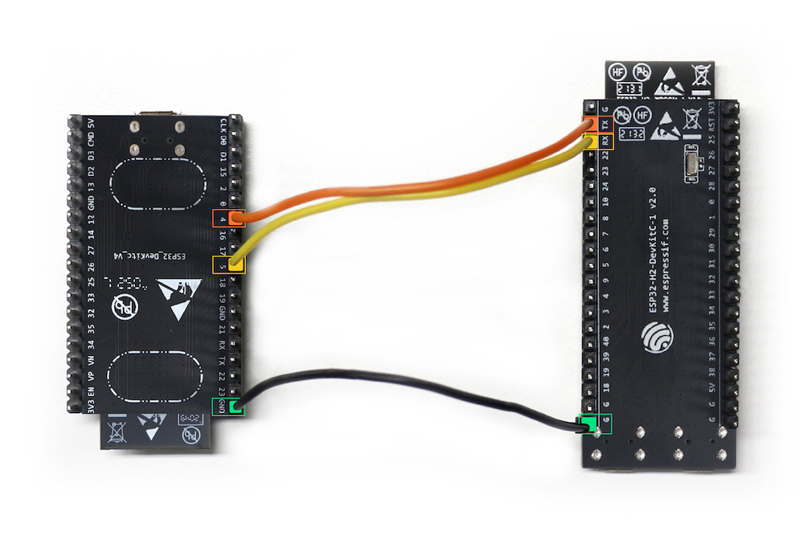

ZigBee Bridge
=============

The Matter Bridge device is composed of two parts: The RCP running on
ESP32-H2 and the bridge app running on ESP32.

1. Additional Environment Setup
-------------------------------

1.1 Hardware connection
~~~~~~~~~~~~~~~~~~~~~~~

Connect the two SoCs via UART, below is an example setup with ESP32
DevKitC and ESP32-H2 DevKitC:

========= ============
ESP32 Pin ESP32-H2 Pin
========= ============
GND       GND
GPIO4     GPIO7
GPIO5     GPIO8
========= ============

1.2 Build and flash the RCP (ESP32-H2)
~~~~~~~~~~~~~~~~~~~~~~~~~~~~~~~~~~~~~~

::

   cd ${IDF_PATH}/examples/zigbee/esp_zigbee_rcp/
   idf.py --preview set-target esp32h2
   idf.py -p <port> build flash

The Matter Bridge will run on the ESP32 and ZigBee network will be
formed.

2. Post Commissioning Setup
---------------------------

2.1 Discovering Zigbee Devices
~~~~~~~~~~~~~~~~~~~~~~~~~~~~~~

You can read the parts list from the Bridge to get the number of the bridged devices.

::

   chip-tool descriptor read parts-list 1 0

If there is no other ZigBee device on the ZigBee Network, you will get
an empty result. Example:

::

   Data = [

   ],

2.2 Setup ZigBee Bulb on ESP32-H2
~~~~~~~~~~~~~~~~~~~~~~~~~~~~~~~~~

Build and run ZigBee Bulb app on another ESP32-H2 board.

::

   cd ${IDF_PATH}/examples/zigbee/light_sample/light_bulb
   idf.py --preview set-target esp32h2
   idf.py -p <port> build flash monitor

The ZigBee Bulb will be added to the ZigBee Network and a dynamic
endpoint will be added on the Bridge device. You can read the parts list
again to get the dynamic endpoint ID.

::

   chip-tool descriptor read parts-list 1 0

The data will now contain the information of the connected ZigBee devices. Example:

::

   Data = [
      1, 
   ],

It means that the ZigBee Bulb is added as Endpoint 1 on the Bridge
device. You can read the cluster servers list on the dynamic endpoint.

::

   chip-tool descriptor read server-list 1 1

This will give the list of supported server clusters. Example:

::

   OnDescriptorServerListListAttributeResponse: 4 entries
     [1]: 6
     [2]: 29
     [3]: 57
     [4]: 64

2.3 Control the bulb with chip-tool
~~~~~~~~~~~~~~~~~~~~~~~~~~~~~~~~~~~

Now you can control the ZigBee bulb using the chip tool.

::

   chip-tool onoff toggle 1 1

3. Device Performance
---------------------

3.1 CPU and Memory usage
~~~~~~~~~~~~~~~~~~~~~~~~

The following is the CPU and Memory Usage.

-  ``Bootup`` == Device just finished booting up. Device is not
   commissionined or connected to wifi yet.
-  ``After Commissioning`` == Device is conneted to wifi and is also
   commissioned and is rebooted.
-  device used: esp32c3_devkit_m
-  tested on: `bd951b8 <https://github.com/espressif/esp-matter/commit/bd951b84993d9d0b5742872be4f51bb6c9ccf15e>`__ (2022-05-05)

======================== =========== ===================
\                        Bootup      After Commissioning
======================== =========== ===================
**Free Internal Memory** 109KB       105KB
**CPU Usage**            \-          \-
======================== =========== ===================

**Flash Usage**: Firmware binary size: 1.26MB

This should give you a good idea about the amount of CPU and free memory
that is available for you to run your application's code.

todo. Update the values.
