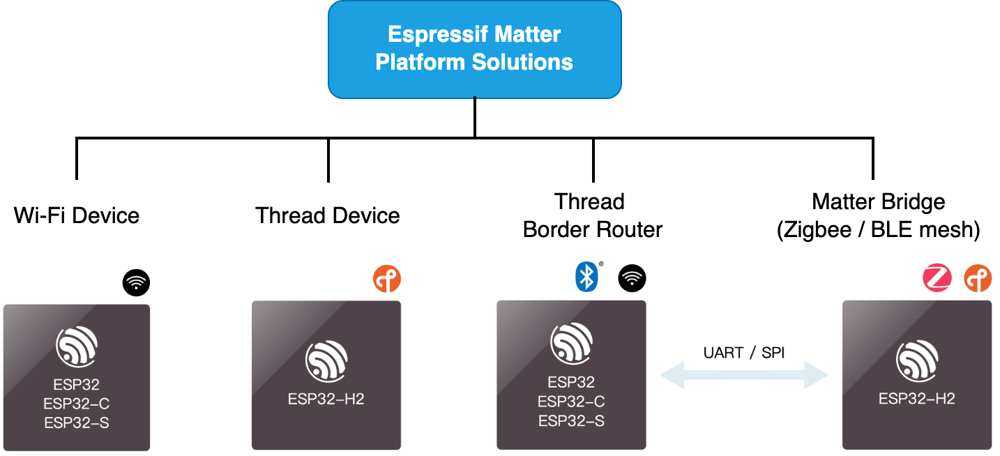

1. Introduction
===============

1.1 Espressif Matter Solutions
------------------------------

Espressif's Matter Solutions consist of:

   - A Full Spectrum of Matter device platforms
   - Production ready ESP Matter SDK
   - Matter and ESP RainMaker integration

1.1.1 Espressif Matter Platforms
~~~~~~~~~~~~~~~~~~~~~~~~~~~~~~~~

Espressif provides a full spectrum Matter device platforms:

- The Wi-Fi-enabled SoCs and modules, such as ESP32, ESP32-C and ESP32-S series can be used to build Matter Wi-Fi devices.
- ESP32-H SoCs and modules integrated with 802.15.4 can be used to build Matter Thread devices.
- By efficiently combining ESP32-H and Espressif's Wi-Fi SoC, a Thread border router can be built to connect the Thread network with the Wi-Fi network to interconnect devices. Espressif provides hardware devkits, reference design and production-ready SDK, which supports the latest Thread 1.3 feature for Matter, and other features like coexistence and OTA (Over-the-Air) updates.
- Espressif also provides Matter-Zigbee and Matter-BLE Mesh bridge solutions that enable non-Matter devices based on Zigbee, Bluetooth LE Mesh and other protocols to connect to the Matter ecosystem. A Matter-Zigbee Bridge uses ESP32-H and another Wi-Fi SoC, while a Matter-BLE Mesh Bridge can be done on single SoC with both Wi-Fi and Bluetooth LE interfaces.

1.1.2 ESP Matter SDK
~~~~~~~~~~~~~~~~~~~~

Espressif's Matter SDK is built on top of `connectedhomeip <https://github.com/project-chip/connectedhomeip/>`__, and integrates ESP Data Model APIs, commonly used peripherals, tools and utilities for security, manufacturing and production accompanied by exhaustive documentation. It is a production ready Matter SDK with rich production references, aimed to simplify the development process of Matter products and enable the users to go to production in the shortest possible time.

.. figure:: ../_static/software_components.png
    :align: center
    :alt: ESP Matter Software Components
    :figclass: align-center

In addition, ESP Matter SDK also integrates `ESP RainMaker <https://rainmaker.espressif.com/>`__ and `ESP Insights <https://github.com/espressif/esp-insights>`__ for cloud services and remote diagnostics.

1.1.3 Matter and ESP RainMaker Integration
~~~~~~~~~~~~~~~~~~~~~~~~~~~~~~~~~~~~~~~~~~

Espressif's AIoT cloud platform `ESP RainMaker <https://rainmaker.espressif.com/>`__ can provide remote control and enable cloud-based device management for Matter devices.

By combining the above-mentioned Matter hardware and software solutions with ESP RainMaker, this one-stop Matter ecosystem solution provides:

   -  Full-fledged Cloud deployment through own private account
   -  Privately deployable cloud applications
   -  Ready-made phone apps supporting all common smart-home scenarios and voice-assistant integrations

Relying on the privatization feature of ESP RainMaker, manufacturers
can even build their own brand of an IoT ecosystem, and provide more value-added services to end customers
through their own cloud services.

1.2 Try it yourself
-------------------

1.2.1 ESP Launchpad
~~~~~~~~~~~~~~~~~~~

This allows you to quickly try out Matter on Espressif devices through a web browser.

ESP Launchpad: https://espressif.github.io/esp-launchpad/.
