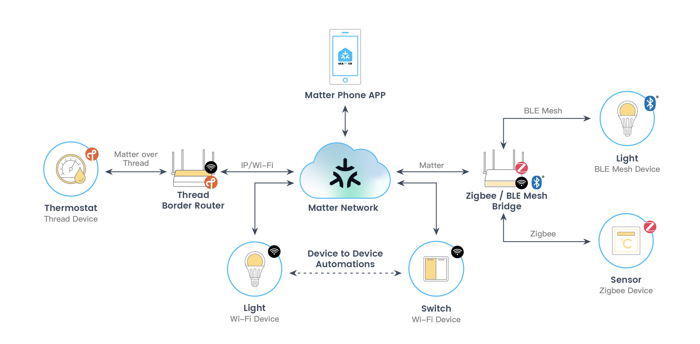
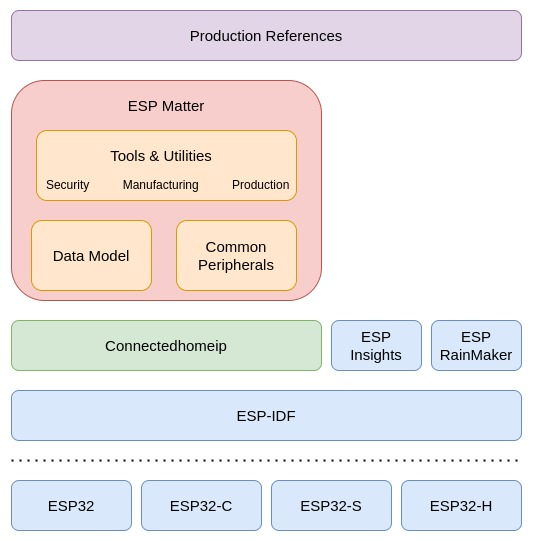

1. Introduction
===============

1.1 Espressif Matter Solutions
------------------------------

Espressif's Matter Solutions consist of:

   - A full spectrum of Matter device platforms
   - Production ready SDK for Matter
   - Matter and ESP RainMaker integration

1.1.1 Espressif Matter Platforms
~~~~~~~~~~~~~~~~~~~~~~~~~~~~~~~~

Espressif platform solutions are as shown below:

- The Wi-Fi-enabled SoCs and modules, such as ESP32, ESP32-C and ESP32-S series can be used to build **Matter Wi-Fi devices**.
- ESP32-H SoCs and modules with 802.15.4 can be used to build **Matter Thread devices**.
- By efficiently combining ESP32-H and our Wi-Fi SoCs, a **Thread Border Router** can be built to connect the Thread network with the Wi-Fi network. We provide hardware devkits, reference designs and production-ready SDK, which supports the latest Thread 1.3 feature for Matter.
- We also provide Matter-Zigbee and Matter-BLE Mesh bridge solutions that enable non-Matter devices based on Zigbee, Bluetooth LE Mesh and other protocols to connect to the Matter ecosystem. A **Matter-Zigbee Bridge** uses ESP32-H and another Wi-Fi SoC, while a **Matter-BLE Mesh Bridge** can be done on a single SoC with both Wi-Fi and Bluetooth LE interfaces.

1.1.2 Espressif's SDK for Matter
~~~~~~~~~~~~~~~~~~~~~~~~~~~~~~~~

Espressif's SDK for Matter is built on top of the `open source Matter SDK <https://github.com/project-chip/connectedhomeip/>`__, and provides simplified APIs, commonly used peripherals, tools and utilities for security, manufacturing and production accompanied by exhaustive documentation. It includes rich production references, aimed to simplify the development process of Matter products and enable the users to go to production in the shortest possible time.

In addition, the SDK also integrates `ESP RainMaker <https://rainmaker.espressif.com/>`__ and `ESP Insights <https://github.com/espressif/esp-insights>`__ for cloud services and remote diagnostics.

1.1.3 Matter and ESP RainMaker Integration
~~~~~~~~~~~~~~~~~~~~~~~~~~~~~~~~~~~~~~~~~~

Espressif's AIoT cloud platform `ESP RainMaker <https://rainmaker.espressif.com/>`__ can provide remote control and enable cloud-based device management for Matter devices.

By combining the above-mentioned Matter hardware and software solutions with ESP RainMaker, this one-stop Matter ecosystem solution provides a full-fledged cloud deployment through your own private account with advanced device management features.

1.2 Try it yourself
-------------------

If you want to test Matter on Espressif devices without any additional setup:

|Try it with Launchpad|_

.. _Try it with Launchpad: https://espressif.github.io/esp-launchpad/?flashConfigURL=https://espressif.github.io/esp-matter/launchpad.toml
