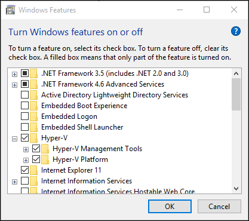
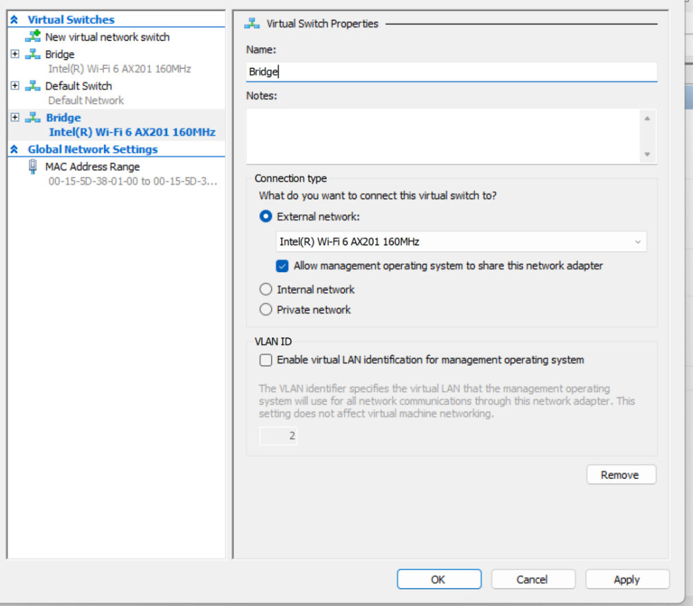
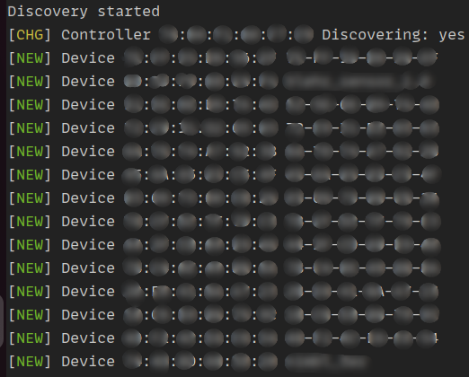

1. Working with the CHIP Tool in WSL2
=====================================

The CHIP Tool (chip-tool) is a Matter controller implementation that allows to commission a Matter device into the network and to communicate with it using Matter messages, which may encode Data Model actions, such as cluster commands.

The tool also provides other utilities specific to Matter, such as parsing of the setup payload or performing discovery actions.

The CHIP Tool requires access to the local network and bluetooth.

1.1 Requirements
----------------

- Windows 11 64-Bit Pro/Enterprise/Education [for Hyper-V Manager]

1.2 Providing access to local network
-------------------------------------

WSL2 does not share an IP address with your computer. Because WSL2 was implemented with Hyper-V, it runs with a virtualized ethernet adapter. Your computer hides WSL2 behind a NAT where WSL2 has its own unique IP.

To provide an IP address from the local network,  WSL2 instance needs to be connected to a virtual Bridge through Hyper-V Manager.

1.2.1 Enabling Hyper-V for use on Windows 10
~~~~~~~~~~~~~~~~~~~~~~~~~~~~~~~~~~~~~~~~~~~~

1.2.1.1 Enable Hardware Virtualization in BIOS
^^^^^^^^^^^^^^^^^^^^^^^^^^^^^^^^^^^^^^^^^^^^^^

- In the Startup Menu, enter the BIOS setup.
- In the BIOS Setup Utility,open the Configuration or Security tab.
- Enable the Virtualization Technology option

1.2.1.2 Setting Up Hyper-V
^^^^^^^^^^^^^^^^^^^^^^^^^^

Ensure that hardware virtualization support is turned on in the BIOS settings
Save the BIOS settings and boot up the machine normally.

- Right click on the Windows button and select ‘Apps and Features’.

- Select Programs and Features on the right under related settings.

- Select Turn Windows Features on or off.

- Select Hyper-V and click OK.

1.2.2 Configure Hyper-V for Bridge Network
~~~~~~~~~~~~~~~~~~~~~~~~~~~~~~~~~~~~~~~~~~

- Open Hyper-V Manager.

- From the Actions pane, select Virtual Switch Manager.

- Choose the type of virtual switch as **External**, then select Create Virtual Switch.

- Enter a name for the virtual switch as **Bridge**.

- Choose the wifi network adapter (NIC) that you want to use, then select OK.

You'll be prompted with a warning that the change may disrupt your network connectivity; select Yes if you're happy to continue.

Create .wslconfig file on C:/Users/user-name/ and add the following lines to connect to configured virtual Bridge Network.

.. code-block:: ini

    [wsl2]
    networkingMode = bridged
    vmSwitch = Bridge
    ipv6 = true

1.2.2.1 Checking the configuration
^^^^^^^^^^^^^^^^^^^^^^^^^^^^^^^^^^

.. code-block:: ini

    ifconfig

The IPv4 Address assigned to the eth0 will be from the local network and IPv6 Address will also be assigned to it.

.. code-block:: ini

    avahi-browse _matter._tcp -r

If the configuration was done correctly, all the matter operational nodes performing mDns advertisement on the local network will be shown.

1.2.2.2 Troubleshoot
^^^^^^^^^^^^^^^^^^^^

**If no IP address assigned to WSL or same IP address as host,  uspipd fails with tcp connect error, not able to ping external network.**

1) Run  `wsl --shutdown` and wait for WSL instance to close.
2) Run Hyper-V Manager and open Virtual Switch Manager from Actions Pane.
3) Disconnect and Reconnect to Wi-Fi.
4) Start WSL instance.
5) If still no IP is assigned, run `sudo dhclient`

1.3 Providing access to bluetooth
---------------------------------

Bluetooth support is missing in default WSL kernel. To add support for bluetooth, WSL kernel needs to be recompiled with right drivers.

1.3.1 Building custom kernel for bluetooth access in WSL2
~~~~~~~~~~~~~~~~~~~~~~~~~~~~~~~~~~~~~~~~~~~~~~~~~~~~~~~~~

.. code-block:: ini

    git clone --depth 1 --branch linux-msft-wsl-6.1.21.2 https://github.com/microsoft/WSL2-Linux-Kernel.git

Replace branch with the latest available WSL-Linux-Kernel tag.

.. code-block:: ini

    cd WSL2-Linux-Kernel
    git checkout linux-msft-wsl-6.1.21.2
    cp /proc/config.gz config.gz
    gunzip config.gz
    mv config .config
    sudo make menuconfig

**Select the features to be enabled in the kernel:**

1) Enable Networking support ->Bluetooth subsystem support.

2) Enable Networking Support ->Bluetooth Subsystem Support ->Bluetooth device drivers -> HCI USB driver.

3) Save the config file.

.. code-block:: ini

    sudo make -j$(getconf _NPROCESSORS_ONLN) && sudo make modules_install -j$(getconf _NPROCESSORS_ONLN) && sudo make install -j$(getconf _NPROCESSORS_ONLN)

The new kernel image will be built.

**Copy the new kernel**

.. code-block:: ini

    cp arch/x86/boot/bzImage /mnt/path/to/kernel/bluetooth-bzImage

1.3.2 Configure WSL to use new custom kernel image
~~~~~~~~~~~~~~~~~~~~~~~~~~~~~~~~~~~~~~~~~~~~~~~~~~~

Add the following line to the created `.wslconfig` file.

.. code-block:: ini

    [wsl2]
    kernel=c:\\users\\<user>\\bluetooth-bzImage

Replace the path with the path of new custom kernel built.

1.3.3 Attaching Bluetooth module to WSL2
~~~~~~~~~~~~~~~~~~~~~~~~~~~~~~~~~~~~~~~~

Get the BUSID of the bluetooth module. [`Tested using usbipd-win 4.0.0`]

.. code-block:: ini

    usbipd list

Attach the bluetooth module to WSL2 instance using usbipd.

.. code-block:: ini

    usbipd attach --wsl --busid=<BUSID>

.. code-block:: ini

    $ lsusb
    Bus 002 Device 001: ID 1d6b:0003 Linux Foundation 3.0 root hub
    Bus 001 Device 003: ID 8087:0029 Intel Corp. AX201 Bluetooth
    Bus 001 Device 001: ID 1d6b:0002 Linux Foundation 2.0 root hub

The bluetooth module should be available to WSL.

1.3.4 Testing Bluetooth
~~~~~~~~~~~~~~~~~~~~~~~

Install bluez library and scan for bluetooth devices.

.. code-block:: ini

    sudo apt install bluez

Start scanning for available Bluetooth devices.

.. code-block:: ini

    bluetoothctl scan on

The bluetooth discovery should start.

**Tested Bluetooth modules:**

- Intel AX201 series and above
- Marvell AVASTAR Bluetooth Radio Adapter.

1.4 Final .wslconfig file
-------------------------

.. code-block:: ini

    [wsl2]
    kernel = D:\\custom-kernel\\bluetooth-bzImage
    networkingMode = bridged
    vmSwitch = Bridge
    ipv6 = true

Replace the kernel path appropriately.