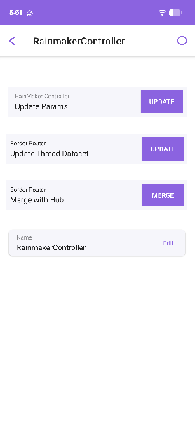
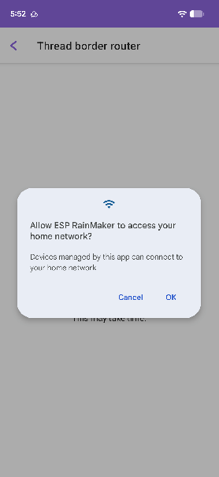

# Rainmaker Bridge

This example demonstrates a Matter-Rainmaker Bridge that bridges Rainmaker devices to the Matter fabric.

The Matter Bridge device runs on ESP32-S3.

See the [docs](https://docs.espressif.com/projects/esp-matter/en/latest/esp32/developing.html) for more information about building and flashing the firmware.

💡 Important:  `create_bridge_devices` callback can be used to add data model elements (e.g., attributes, commands, etc.) to the bridge endpoint.

## 1. Additional Environment Setup

### 1.1 Hardware connection

This example runs on ESP32-S3 devkit by default.

### 1.2 Build and flash the Bridge (ESP32-S3)

For Standalone DevKit boards without Thread Border Router:

```
cd ${ESP_MATTER_PATH}/examples/bridge_apps/esp_rainmaker_bridge
idf.py set-target esp32s3
idf.py -p <port> build flash
```

For ***ESP Thread Border Router/Zigbee Gateway Board*** with Thread Border Router:

```
cd ${ESP_MATTER_PATH}/examples/bridge_apps/esp_rainmaker_bridge
idf.py -D SDKCONFIG_DEFAULTS="sdkconfig.defaults;sdkconfig.defaults.otbr" set-target esp32s3
idf.py -p <port> build flash
```

## 2. Commissioning Setup

### 2.1 Set up Rainmaker Bridge using Rainmaker App

#### 2.1.1 Pair the bridge using Rainmaker App

Use the Rainmaker App to scan the QR code printed in the device log to pair the bridge.

```
I (16104) NimBLE: GAP procedure initiated: advertise;
I (16104) NimBLE: disc_mode=2
I (16114) NimBLE:  adv_channel_map=0 own_addr_type=0 adv_filter_policy=0 adv_itvl_min=256 adv_itvl_max=256
I (16124) NimBLE:

I (16104) network_prov_mgr: Provisioning started with service name : PROV_54a900
I (16134) app_wifi: Provisioning started
I (16134) app_network: Scan this QR code from the ESP RainMaker phone app for Provisioning.
I (16144) QRCODE: Encoding below text with ECC LVL 0 & QR Code Version 5
I (16144) QRCODE: {"ver":"v1","name":"PROV_54a900","pop":"47d4fb71","transport":"ble"}

  █▀▀▀▀▀█ █  ▄▄█ ▀▀  ▄█  ▀▄ █▀▀▀▀▀█
  █ ███ █ ██▄ █▄ ▄▀▀▄ ▀▀▄██ █ ███ █
  █ ▀▀▀ █ ▄██ ▀▀█▀█▄▀▄ ▀▀▀▀ █ ▀▀▀ █
  ▀▀▀▀▀▀▀ ▀ █▄▀ ▀ ▀▄▀▄█▄▀▄█ ▀▀▀▀▀▀▀
  ██ ▄█▀▀▄▄ ▀ ▀ ▀█▄▀▄▀▄▀▄▄▄▄ █ ▀█▀▀
   ▄▀█▀█▀▀ █▀ ▄▀ ██▄  ▄██▀██▀▄██▀█
  ▄█▀█▄▀▀▀▄ ▄▀▄▄█▄█▀▀▀▄▀▄▀ ▄▀▄▀ ▄▄▀
   ▀█ ▀▄▀▄█▀██▀▀ ▀▄▄█▄ ██▀▄█ ▀ █▀▀▄
  ▀█▀▄█▀▀██▀  ▀▄▄▄█▀▀▀█▀   █▀▄▀▀  ▀
  ▄█▄▀▀▀▀ ▄██ ▄▀ ▀▀█▄▄ ▄█▀█ ▄█▄█▀▀▄
  ███ █▀▀█▀  ▀▄ ▄█▄▀█ ▄█ ▀▀▀▀ ▀ ▄█▀
      █▀▀ ▀▄▄█▀ ▀█▄▄ ▄ █▄▀  █▀▀▀▀▄▄
  ▀▀▀▀ ▀▀▀█ █ ▀▄▄▄▄██▀█▀ ▄█▀▀▀██▄▀
  █▀▀▀▀▀█ ▄▀▀ ▄ █▀██▀  ▄█▀█ ▀ ██▀▀
  █ ███ █ ▀▀▄▀█▄█▄█▀█▀ ▀█ ███▀█▀▄▄█
  █ ▀▀▀ █ ▄▄███▀ █▀▄ ▄███▀  ▀█▀▄ ▀
  ▀▀▀▀▀▀▀ ▀ ▀▀    ▀▀  ▀▀▀▀▀▀      ▀


I (16344) app_network: If QR code is not visible, copy paste the below URL in a browser.
https://rainmaker.espressif.com/qrcode.html?data={"ver":"v1","name":"PROV_54a900","pop":"47d4fb71","transport":"ble"}
I (16364) app_network: Provisioning will auto stop after 30 minute(s).

```

#### 2.1.2 Update Rainmaker Controller Params

After successful Bridge pairing, it is necessary to use the parameter update function to grant the Bridge the Rainmaker controller permission. This enables the Bridge to have the authority to control other Rainmaker devices.



#### 2.1.3 Update Thread Dataset

If you need to bridge a Rainmaker over Thread device, you must update the Thread Border Router dataset after the Bridge is successfully paired.

  

### 2.2 Pair Rainmaker end devices using Rainmaker App

Follow this [guide](https://github.com/espressif/esp-rainmaker/blob/master/README.md) to set up a Rainmaker device.

### 2.3 Pair the bridge using chip-tool through onnetwork method

Use the command below to pair the bridge.

```
./chip-tool pairing onnetwork 0x1234 20202021
```

### 2.4 Control the bulb with chip-tool

Now you can control the Rainmaker device using chip-tool.

```
./chip-tool onoff toggle 0x1234 0x2
```

## 3. Device Performance

### 3.1 Memory usage

**Config: Enable SPIRAM(2MB), 8MB flash, enable Thread Border Router**

The following is the Memory and Flash Usage.

-   `Bootup` == Device just finished booting up. Device is not
    commissioned or connected to wifi yet.
-   `After Commissioning` == Device is connected to wifi and is also
    commissioned and is rebooted.
-   `After Adding a Bridged device` == A Rainmaker Color Light is added
    on the Bridge.
-   device used: ESP32-S3-DevKitC-1
-   tested on:
    [d0faa92c](https://github.com/espressif/esp-matter/commit/d0faa92c9336205de21a4b325c956893736c4d64)
    (2025-12-11)
-   IDF: v5.4.1 [4c2820d3](https://github.com/espressif/esp-idf/tree/v5.4.1)

|                         | Bootup | After Rainmaker Commissioning | After Matter Commissioning | After Adding a Bridged device |
|:-                       |:-:     |:-:                            |:-:                         |:-:                            |
|**Free Internal Memory** |165KB   |168KB                          |170KB                       |170KB                          |
|**Free SPIRAM Memory** |1886KB   |1823KB                          |1858KB                       |1853KB                          |

**Flash Usage**: Firmware binary size: 1.98MB

This should give you a good idea about the amount of free memory that is
available for you to run your application's code.
