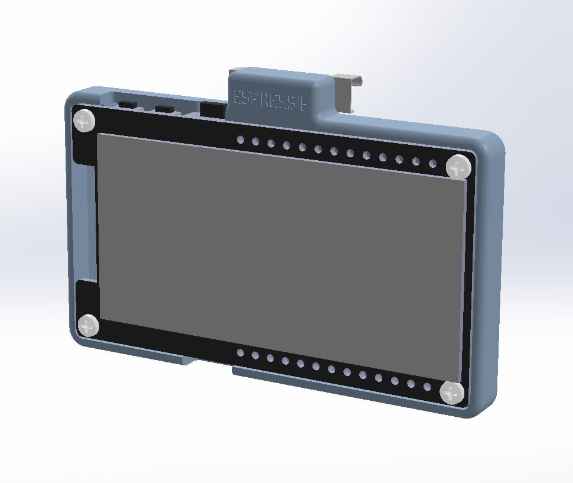
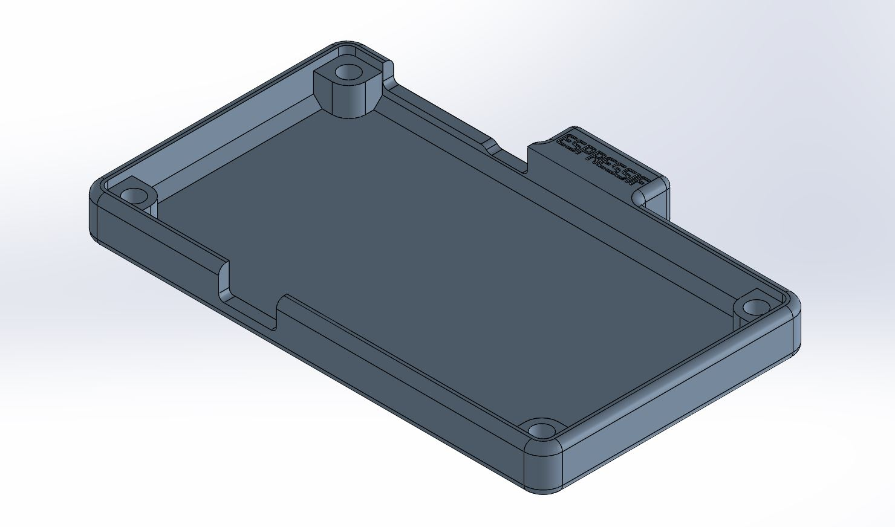
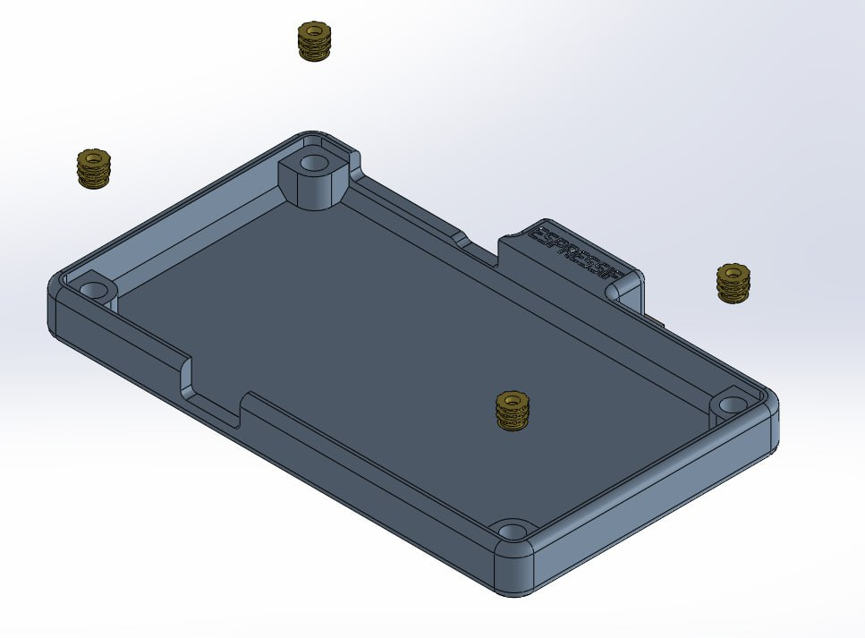
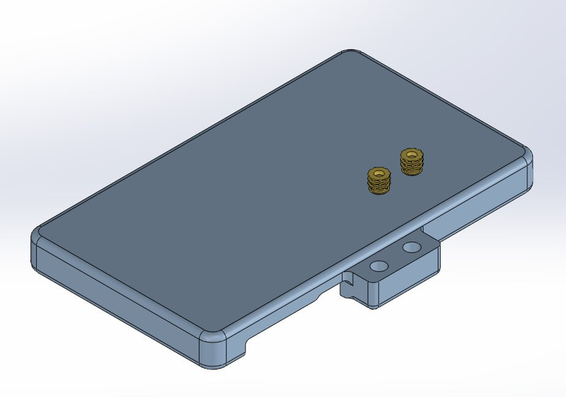
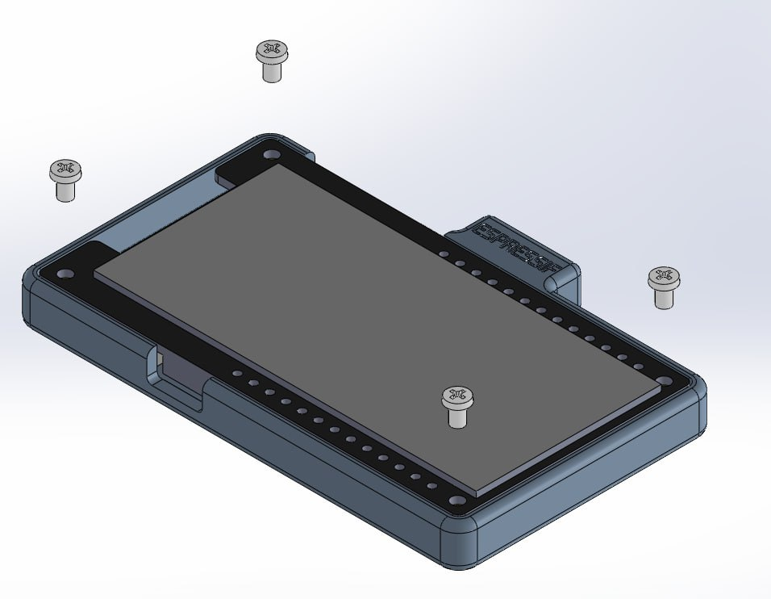
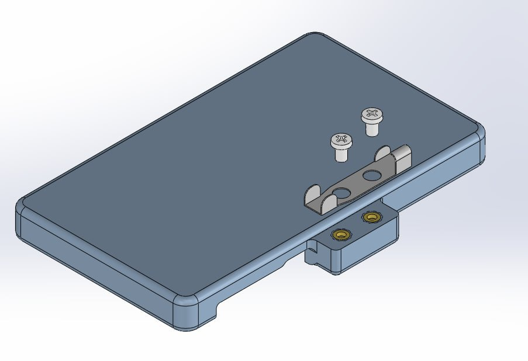
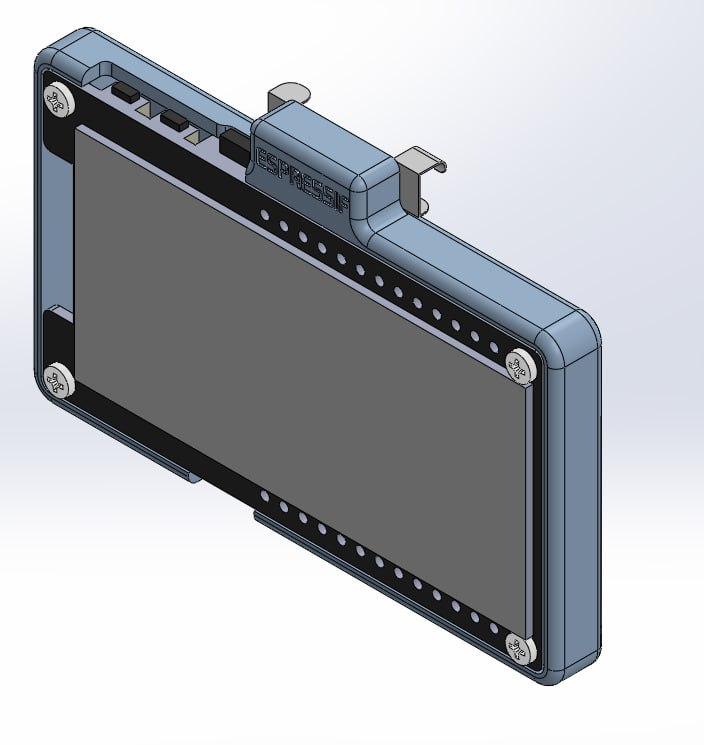

# ESP32 Name Badge

---
 ESP32 Name Badge is a e-ink Name badge, designed for -event- on -date-. ESP32 Name Badge displays user-customed text via a phone app, and pinned onto your clothing, suitable for events. It is a brooch-type name badge based on DFROBOT's 2.13" e-ink Display Module for ESP32 (SKU:DFR0676). This repository will include all the instructions to replicate an ESP32 Name Badge yourself.

---

## Materials and Equipment
1. DFROBOT's 2.13" e-ink Display Module for ESP32
2. 3D Printer
3. M2 brass insert nut, 3.2mm outer diameter (qty: 6)
4. M2 Phillips head screw (qty: 6)
5. brooch pin, 20mm

> **Note**  
3D Printer used in this guide is a DLP 3D Printer. Your results may vary with different 3D Printers, such as FDM 3D printer. For users without 3D printers, do consider reaching out to 3D Printing services locally or online.

## Instructions
1. Download the STL file, and send for 3D printing.

2. Force fit the 6 x brass insert nut.

3. Assemble DFROBOT's 2.13" e-ink Display Module for ESP32 
onto the case, using 4 x screws.

4. Assemble brooch pin onto the case, using 2 x screws.

5. Flash the firmware onto module via micro-USB.

6. You have completed building the ESP32 Name Badge.

## Other Notes
* Brass insert tolerance may be an issue with different sources. Do take note of this issue and troubleshoot accordingly.
* Pin brooch used in this build is a 20mm version, with 2 x 2mm diameter hole, 7mm centre to centre distance.
* More information about DFROBOT's 2.13" e-ink Display Module for ESP32 can be found in the following link: https://www.dfrobot.com/product-2101.html
