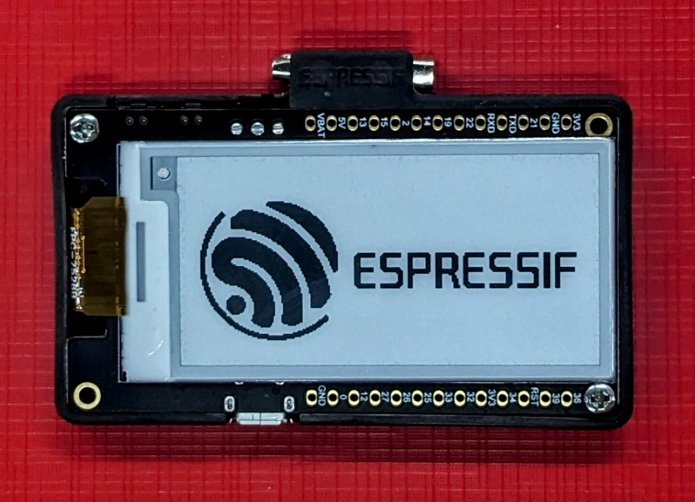
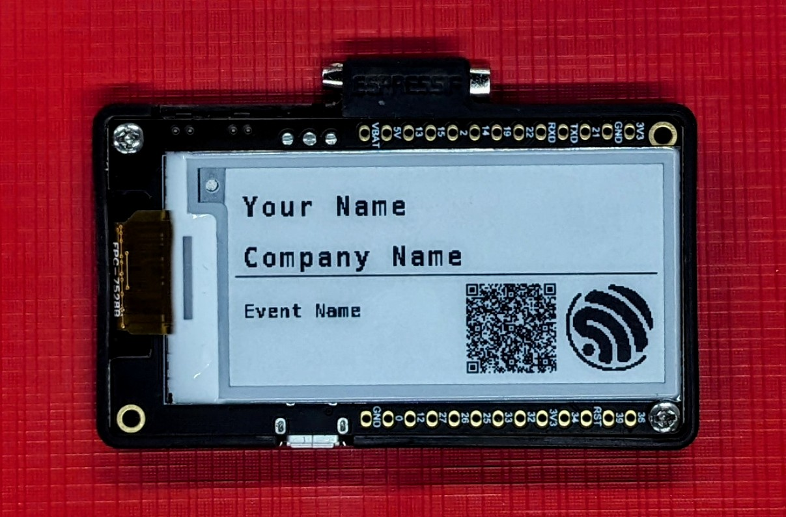
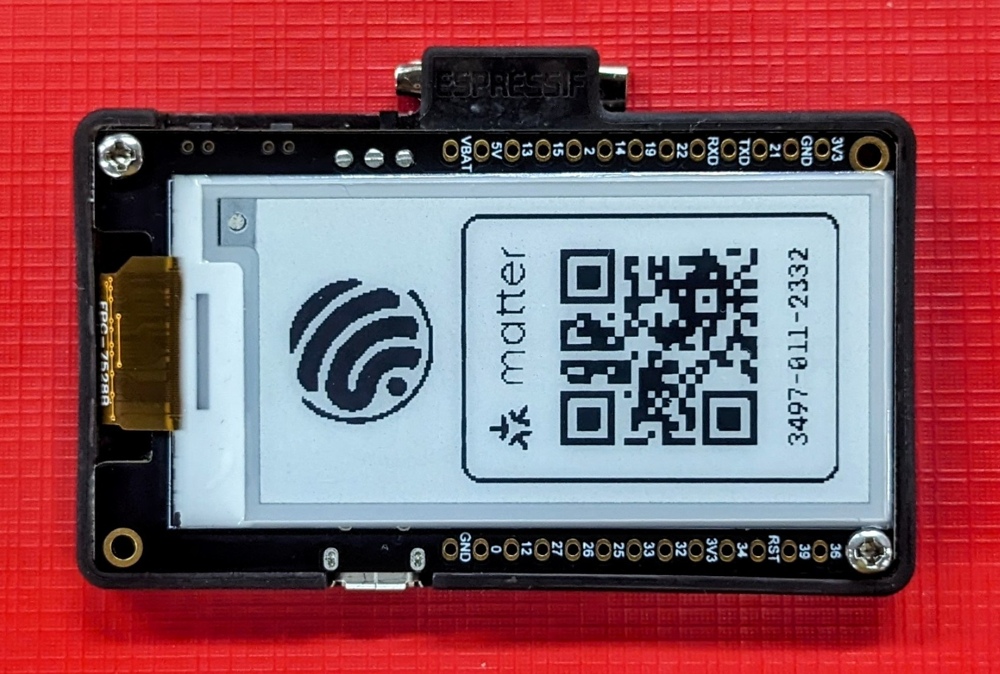
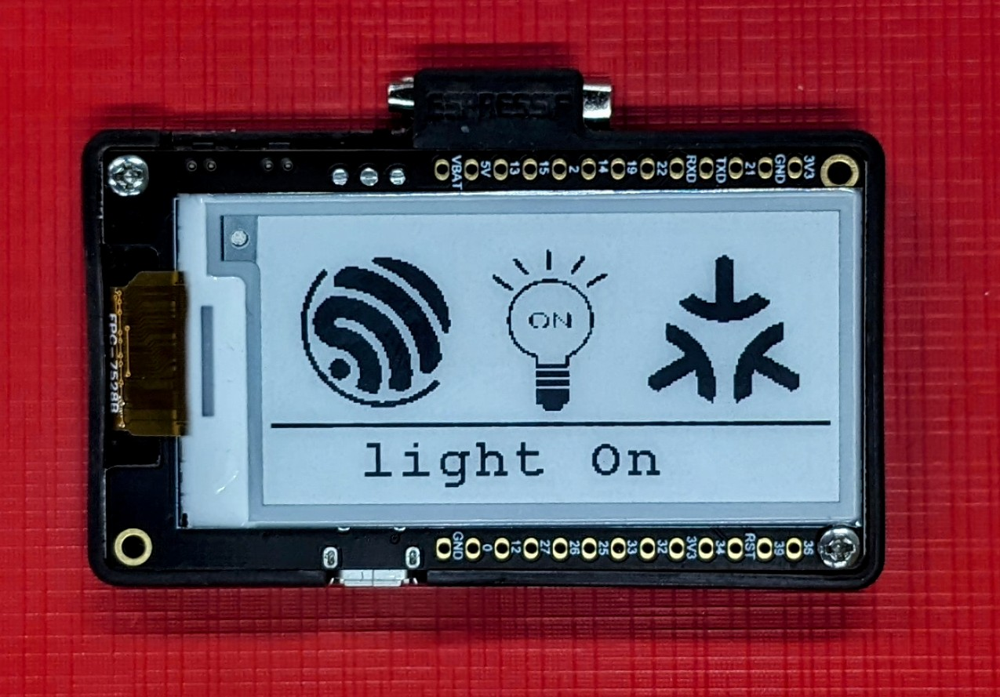
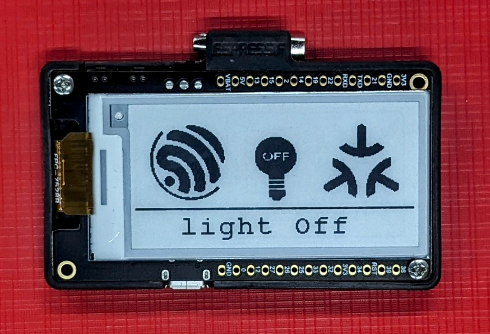

# Badge

|  |  |
| -------- | ------- |

# Table of Contents
- [Badge](#badge)
- [Espressif Digital Badge](#espressif-digital-badge)
  - [File Structure](#file-structure)
  - [Features](#features)
  - [How to use](#how-to-use)
  - [Commands](#commands)
    - [Set the attribute](#set-the-attribute)
      - [Console](#console)
      - [CHIP-TOOL](#chip-tool)
  - [3D Design](#3d-design)
  - [Creating the custom fonts](#creating-the-custom-fonts)
  - [Acknowledgement](#acknowledgement)

# Espressif Digital Badge

The Espressif Digital Badge serves as an intelligent e-ink display name badge, integrating a vCard QR code for effortless contact information sharing. This badge showcases user-customized attributes via a Matter application and can be easily affixed to clothing, making it ideal for various events. As a Matter-compatible accessory, it can be configured using any Matter-enabled phone application to personalize attributes. Crafted in the form of a brooch, it utilizes [DFROBOT's 2.13" e-ink Display Module for ESP32](https://wiki.dfrobot.com/e-Ink_Display_Module_for_ESP32_SKU_DFR0676). This repository comprehensively outlines all necessary instructions for replicating the badge independently.

The implementation involves the establishment of a custom cluster (`cluster_id: 0x131BFC03`) within the `Root Node`. This cluster encompasses five distinct custom attributes, each serving a specific purpose:

| Property | Attribute Id |
|----------|----------|
| Name | 0x0000 |
| Company Name | 0x0001 |
| Email | 0x0002 |
| Contact | 0x0003 |
| Event Name | 0x0004 |

*(Note: The maximum size of each attributes mentioned above is 32 bytes i.e. the maximum supported character length is 32)*

The Badge cluster also features a `command` at id 0x0000, to set all the aforementioned attributes in one go.

## File Structure
```
.
├── 3D_design_files         # Contains 3D design files for the badge
├── CMakeLists.txt
├── components
│   ├── epaper              # Epaper Display Library
│   └── qrcode              # QRcode Library for vcard
├── Demonstration_result    # Demonstration Results
├── main
│   ├── app_driver.cpp      # Contains all the driver related function calls
│   ├── app_main.cpp        # Contains all the matter handling function calls
│   ├── app_priv.h          # Contains the shared private variables of app_driver.cpp and app_main.cpp
│   ├── CMakeLists.txt
│   └── idf_component.yml
├── partitions.csv          # Flash partition structure
├── README.md
└── sdkconfig.defaults      # Required configuration to build the project

```

## Features

* The application generates a QR code representation of the vCard containing the aforementioned attributes and displays it on the E-Ink display. This QR code serves as a convenient means for storing and retrieving data by simply scanning the code.

* If uncommissioned, badge displays commission QR Code and manual pairing code as shown below.


*Badge Commissioning Window*

* In the absence of custom attribute configurations, the digital badge seamlessly functions as a matter on/off light, as demonstrated below.

|  |  |
| -------- | ------- |
| Badge Light On | Badge Light Off |

* For setting just name and company name, `NodeLabel` can be set in the format as "{Name}/{Company Name}"

## How to use
Espressif Badge currently only supports esp32 based targets.

* Build the badge firmware:

```sh
idf.p build
```

* flash and monitor:

```sh
idf.py -p <PORT> flash monitor
```

## Commands

### Set the attribute

In this illustration, the Matter console has been activated, offering a streamlined interface for both configuring and retrieving attribute values. Alternatively, the chip-tool presents a secondary method for achieving the same objectives.

#### Console

* To set a specific attribute, utilize the following command (refer to the [Espressif Digital Badge](#espressif-digital-badge) for attribute details).

```sh
matter esp attribute set 0x0 0x131BFC03 <attribute_id> <attribute value>
```
for example to change the Name on the badge, it requires to write the attribute `0x0000`, so the command will be:

```sh
matter esp attribute set 0x0 0x131BFC03 0x0000 "Espressif Systems"
```

* A custom console command `change_name` has also been added to display the name, company_name etc.. without commissioning with the matter:

```sh
matter esp change_name "{name}/{company_name}/{email}/{contact}/{event_name}"
```
Example:
```sh
matter esp change_name "John Doe/Company Name/john.doe@espressif.com/123456789/Special Events"
```

#### CHIP-TOOL

* Make sure to export the environment variables of ESP-MATTER to use the chip-tool

* Commission the device:
```sh
chip-tool pairing code-wifi 0x7289 <wifi-ssid> <wifi-password> MT:Y.K9042C00KA0648G00
```

* After commissioning, individual custom attributes can be updated using the following command:
```sh
chip-tool any write-by-id 0x131BFC03 <attribute_id> '"<attribute_value>"' <destination_id> 0x0
```

* To simultaneously update all attributes, one can employ the custom `command` at id 0x0000 as follows:

```sh
chip-tool any command-by-id 0x131BFC03 0x0 '{"0":"<Name>","1":"<Company Name>","2":"<EMAIL>","3":"<Contact>","4":"<Event Name>"}' <destination_id> 0x0
```


## 3D Design

The design files for the badge can be found [here](./3D_design_files/) along with the [instructions](./3D_design_files/3D_Model_instructions.md).

<details>

<summary>Generate and Add Custom Fonts</summary>

## Creating the custom fonts

* You can refer [this](https://www.cnx-software.com/2020/06/19/fontedit-font-editor-targets-embedded-systems-with-led-lcd-or-e-paper-displays) website to develop your own fonts or convert existing fonts to the c source code as required by this project.
* Then copy the c source code of the font from the `FontEdit` app and paste it in [epaper_fonts.c](./components/epaper/epaper_font.c)
* Create a `epaper_font_t` variable and add the height and width (refer it from FontEdit)

</details>

## Acknowledgement
* A special thanks to [Richard Moore](https://github.com/ricmoo) for the QRCode library.
* Shout out to `DFROBOT` for their excellent hardware design for the badge.

