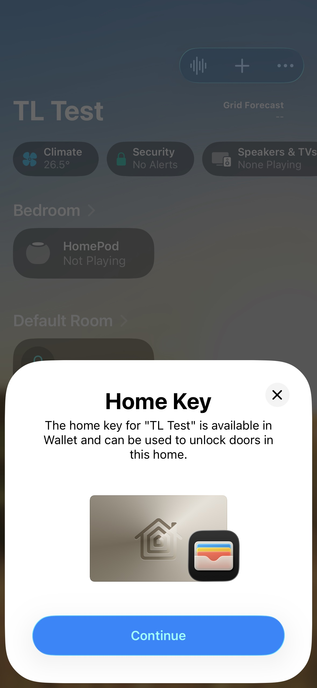
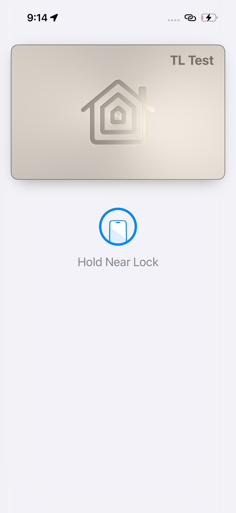

# Doorlock

This example creates a Doorlock device using the ESP Matter data model. It also demonstrates integration with Aliro over NFC feature.

See the [docs](https://docs.espressif.com/projects/esp-matter/en/latest/esp32/developing.html) for more information about building and flashing the firmware.

## 1. Additional Environment Setup

No additional setup is required.

## 2. Post Commissioning Setup

No additional setup is required.

## 3. Aliro over NFC Feature

### Hardware Required

- [M5Stack NanoC6](https://docs.m5stack.com/en/core/M5NanoC6) or [M5Stack NanoH2](https://docs.m5stack.com/en/core/NanoH2)
- [M5Unit-NFC](https://docs.m5stack.com/en/unit/Unit_NFC)

### Build

```
idf.py -D SDKCONFIG_DEFAULTS="sdkconfig.esp32h2.aliro" set-target esp32h2 build
```
or
```
idf.py -D SDKCONFIG_DEFAULTS="sdkconfig.esp32c6.aliro" set-target esp32c6 build
```

### Test with Apple Home

After commissioning with Apple Home app, the Home app will automatically add a Key to the Apple Wallet, which can be used for unlocking the door.
 
