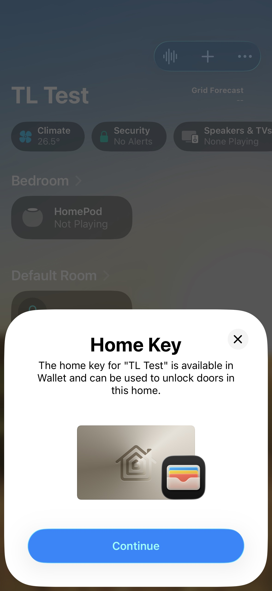
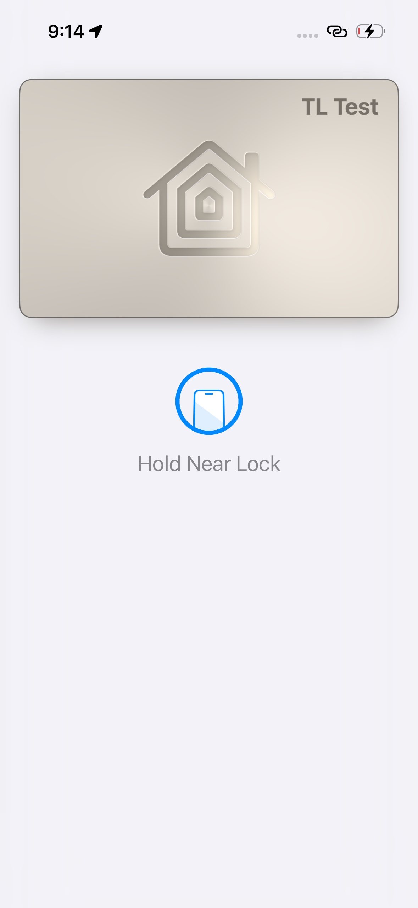

# Doorlock

This example creates a Doorlock device using the ESP Matter data model. It also demonstrates integration with the Aliro over NFC feature, and with classic NFC-tag (RFID) credentials.

See the [docs](https://docs.espressif.com/projects/esp-matter/en/latest/esp32/developing.html) for more information about building and flashing the firmware.

## 1. Additional Environment Setup

No additional setup is required.

## 2. Post Commissioning Setup

No additional setup is required.

## 3. Aliro over NFC Feature

### Hardware Required

- [M5Stack NanoC6](https://docs.m5stack.com/en/core/M5NanoC6) or [M5Stack NanoH2](https://docs.m5stack.com/en/core/NanoH2)
- [M5Unit-NFC](https://docs.m5stack.com/en/unit/Unit_NFC)

### Build

```
idf.py -D SDKCONFIG_DEFAULTS="sdkconfig.defaults.nanoh2_aliro_nfc" set-target esp32h2 build
```

or

```
idf.py -D SDKCONFIG_DEFAULTS="sdkconfig.defaults.nanoc6_aliro_nfc" set-target esp32c6 build
```

### Test with Apple Home

After commissioning with the Apple Home app, the Home app automatically adds a key to Apple Wallet, which can be used to unlock the door.

|                                     Add Home Key                                     |                                     Unlock the door                                     |
| :----------------------------------------------------------------------------------: | :-------------------------------------------------------------------------------------: |
|  |  |

## 4. RFID/NFC-Tag Credential Feature

Reads classic NFC tags (ISO14443A/B, FeliCa, ISO15693) with the same M5Unit-NFC
(ST25R3916) hardware used by the Aliro feature above, but without Aliro: a
tag's UID is matched against `CredentialType = RFID` credentials provisioned
via the Door Lock cluster's `SetCredential` command, and a match unlocks the
door. This is mutually exclusive with Aliro over NFC (`CONFIG_ENABLE_RFID_NFC`
and `CONFIG_ENABLE_ALIRO_OVER_NFC` cannot both be enabled), since both
features would otherwise contend for the same NFC front-end.

### Hardware Required

- [M5Stack NanoC6](https://docs.m5stack.com/en/core/M5NanoC6) or [M5Stack NanoH2](https://docs.m5stack.com/en/core/NanoH2)
- [M5Unit-NFC](https://docs.m5stack.com/en/unit/Unit_NFC)

### Build

```
idf.py -D SDKCONFIG_DEFAULTS="sdkconfig.defaults.nanoh2_rfid_nfc" set-target esp32h2 build
```

or

```
idf.py -D SDKCONFIG_DEFAULTS="sdkconfig.defaults.nanoc6_rfid_nfc" set-target esp32c6 build
```

### Provisioning and Test

After commissioning, provision an RFID credential with a Matter controller:
create or update a user, then send `SetCredential` with `CredentialType = RFID`
and `CredentialData` set to the tag's raw UID bytes (as read by, e.g., a phone
NFC-reader app or the `matter esp dl status`/console tooling below). Tapping
the provisioned tag on the M5Unit-NFC then unlocks the door and emits a
`LockOperation` event with `OperationSource = RFID` and the matching
`CredentialIndex`.

## 5. Local Controls and Status

Press the boot button (front button on M5Stack Nano) to toggle the lock state. The RGB LED indicates the current state:

- Red: locked
- Green: unlocked or unlatched
- Amber: locking or unlocking
- Off: unknown state

## 6. Diagnostic Console

The door-lock debug command is available under `matter esp dl`:

```text
matter esp dl status
matter esp dl users
matter esp dl pin-unlock <PIN>
matter esp dl rfid-unlock <hex-uid>
```

- `status` prints aggregate user and credential capacity.
- `users` prints user-to-credential relationships without credential data.
- `pin-unlock` validates that the PIN belongs to an enabled user and requests a local keypad unlock.
- `rfid-unlock` validates that the tag UID (as hex, e.g. `04A1B2C3`) belongs to
  an enabled user's RFID credential and requests a local unlock -- useful for
  bench testing without a physical tag or a Matter controller. Only available
  when `CONFIG_ENABLE_RFID_NFC` is enabled.
