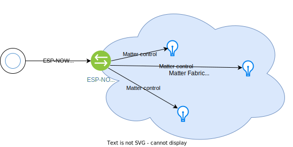
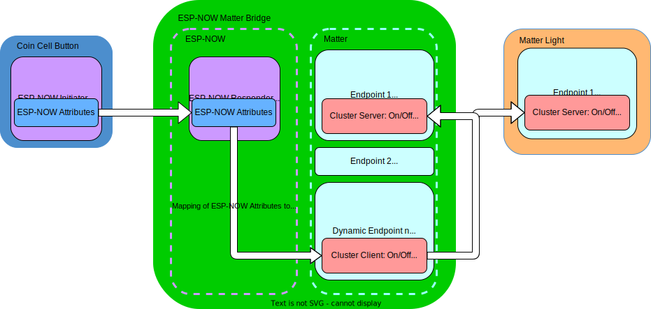
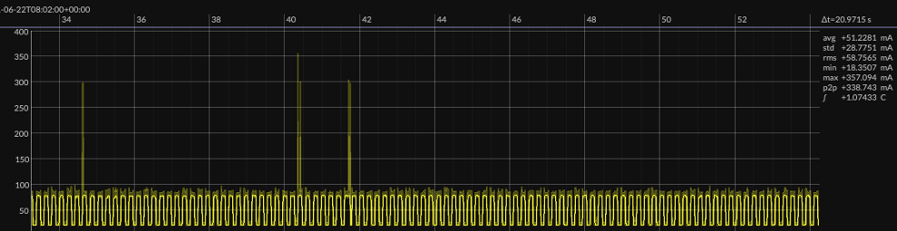

# ESP-NOW Matter Bridge Working with Coin Cell Button

## Overview

This document outlines the application of controlling the ESP-NOW Matter bridge through the use of ESP-NOW coin cell button. Please refer to this [Application Note](https://github.com/espressif/esp-now/tree/master/examples/coin_cell_demo/switch/docs/button_in_matter_bridging.md) for the coin cell button part of the application note. For general ESP-NOW bridge application description, please refer to the [README](../README.md).

## Data Models

The diagram below gives an overview of the interactions between various devices in this application.

This diagram gives a simplistic view of the data models involved in the interaction.

The coin cell button binds to the ESP-NOW Matter bridge so that it is able to send ESP-NOW controls to the bridge, then the bridge controls the Matter light through ONOFF Cluster.

## Power Saving

Power saving is critical to battery powered devices; it could also be a requirement for mains powered devices. For example California Title 20 requirement for LED lights states that in standby mode, the light can consume maximum 0.2 Watt power, which translates to max 60 mA current at 3.3V.

To save power for a Wi-Fi device, modem sleep needs to be enabled so that a device turns off its RF following AP's DTIM interval. This is by default after the device is connected to an AP, unless `esp_wifi_set_ps(WIFI_PS_NONE)` is explicitly called to disable modem sleep.

In addition, ESP-NOW, being a connectionless technology on top of Wi-Fi, has its own [power saving mechanism](https://docs.espressif.com/projects/esp-idf/en/latest/esp32c3/api-guides/wifi.html#connectionless-module-power-save). This mechanism should also be enabled, otherwise the Wi-Fi device won't be able to enter sleep mode even if modem sleep is activated.

### ESP-NOW Power Saving API
ESP-NOW supports power saving from IDF v5.0 onwards. Refer to [API Documentation](https://docs.espressif.com/projects/esp-idf/en/latest/esp32c3/api-reference/network/esp_now.html#config-esp-now-power-saving-parameter) for details.

Two APIs need to be used:

* esp_now_set_wake_window
* esp_wifi_connectionless_module_set_wake_interval

These APIs should be called after ESP-NOW init.

Although the documentation mentions the sleep mechanism is for connectionless power saving, it also applies to connected state.

Without calling these APIs, by default

* The wake window is maximum. So even if Wi-Fi PS is modem sleep, the device Wi-Fi won’t sleep. The Wi-Fi PS and ESP-NOW power saving are two independent power saving mechanisms.
* The default interval is ESP_WIFI_CONNECTIONLESS_INTERVAL_DEFAULT_MODE, which is 0. This default value is recommended to have stable performance at coexistence mode (Wi-Fi + BT).

### Working with ESP-NOW Coin Cell Button

To save power on the bridge, it is desired to maximize wake interval and minimize wake window. So the bridge will only wake according to DTIM most of the time. However to be able to receive controls from ESP-NOW coin cell button reliably, it is desired to maximize wake window inside the wake interval. And we don't want to have too many retransmissions on the coin cell button. This not only consumes valuable power on the coin cell button, but also gives a poor user experience. So we need to get a balance of the sleep and wakeup time.

When both Wi-Fi modem sleep and ESP-NOW power saving are enabled, the bridge device wakes up according to the DTIM interval and ESP-NOW wake window. The rest of the time it will go to sleep mode. On the other hand, the coin cell button is powered off most of the time, so it won't be able to know when the bridge is awake and able to respond to its command. In order to have the two work together:

1. Retransmission mechanism is required on the button.
2. The time gap between two retransmissions should be less than the window time.
3. Maximum total retransmission time should be larger than the sleep interval.

On the bridge side, the configurations used for ESP-NOW power saving are:

* Wake interval: 200ms
* Wake window: 110ms

On the button side, the configurations affecting retransmissions are:

* `CONFIG_ESPNOW_LIGHT_SLEEP_DURATION`: 30ms
* `CONFIG_ESPNOW_CONTROL_WAIT_ACK_DURATION`: 20ms
* `CONFIG_ESPNOW_CONTROL_RETRANSMISSION_TIMES`: 2

So the above requirements are translated as:

* $T_{tx-gap} = T_{light-sleep} + T_{ack-wait}$,
* $T_{tx-gap} < T_{wake-window}$,
* $N_{retransmission} \times T_{tx-gap} > T_{wake-interval} - T_{wake-window}$.

With the above configurations:
* $T_{tx-gap} = 50ms$,
* $T_{tx-gap} < T_{wake-window}(50ms < 110ms)$,
* $N_{retransmission} \times T_{tx-gap} > T_{wake-interval} - T_{wake-window}(100ms > 90ms)$.

The figure below shows the idle power consumption of the bridge with the above configurations. The average current is about 51mA. The measurement is done on an ESP32-C3-DevKitM-1.

### Reliability

The power saving and retransmission parameters configured as above ensure reliable reception and response of ESP-NOW controls by the bridge. In the testing, the response is reliable even during Matter OTA, where a relatively large amount of data is transmitted over Wi-Fi.

## References

* [California Title 20: Appliance Efficiency Regulations](https://www.energy.ca.gov/rules-and-regulations/appliance-efficiency-regulations-title-20)