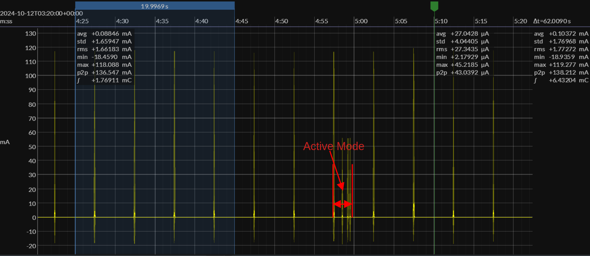
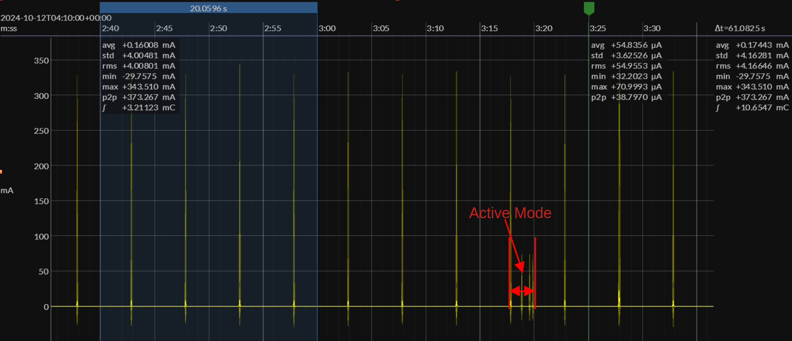
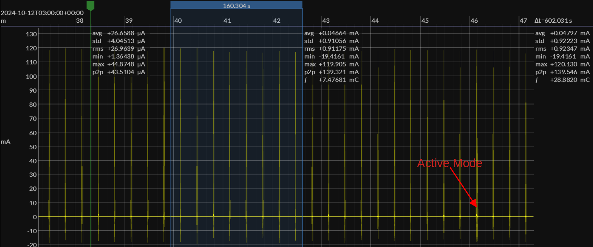
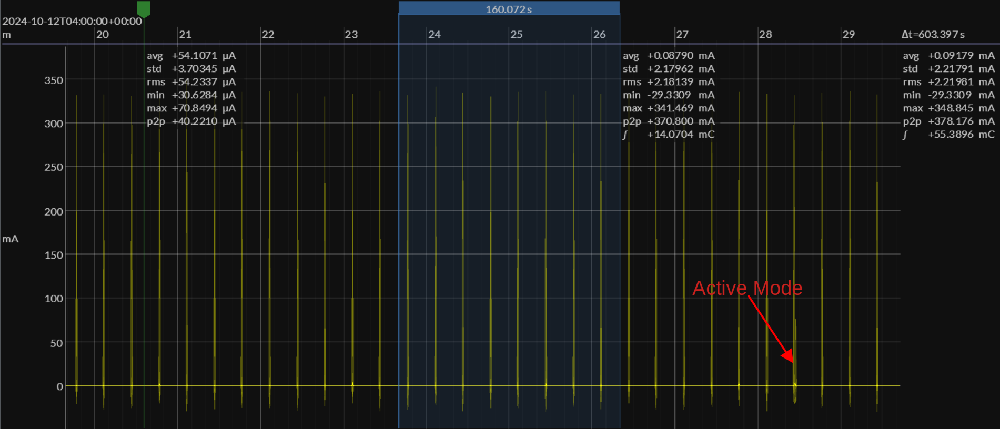

# Intermittently Connected Device (ICD)

This example creates a Matter ICD device using the ESP Matter data model. Currently it is available for ESP32-H2 and ESP32-C6.

See the [docs](https://docs.espressif.com/projects/esp-matter/en/latest/esp32/developing.html) for more information about building and flashing the firmware.

**Note**: Please use IDF v5.2.2 or later for this example.

## 1. Additional Environment Setup

No additional setup is required.

## 2. Post Commissioning Setup

No additional setup is required.

## 3. ICD configuration options

The device is configured as a Short Idle Time(SIT) ICD with the following parameters by the default sdkconfig files.

| Parameter                 | Value  |
|---------------------------|--------|
| ICD Fast Polling Interval | 500ms  |
| ICD Slow Polling Interval | 5000ms |
| ICD Active Mode Duration  | 1000ms |
| ICD Idle Mode Duration    | 60s    |
| ICD Active Mode Threshold | 1000ms |

It can also be configured as a Long Idle Time(LIT) ICD with the following parameters by the sdkconfig files `sdkconfig.defaults.esp32h2.lit` or `sdkconfig.defaults.esp32c6.lit`.

| Parameter                 | Value   |
|---------------------------|---------|
| ICD Fast Polling Interval | 500ms   |
| ICD Slow Polling Interval | 20000ms |
| ICD Active Mode Duration  | 1000ms  |
| ICD Idle Mode Duration    | 600s    |
| ICD Active Mode Threshold | 5000ms  |

- ESP32-H2:
```
idf.py -D SDKCONFIG_DEFAULTS="sdkconfig.defaults.esp32h2.lit" set-target esp32h2 build
```
- ESP32-C6:
```
idf.py -D SDKCONFIG_DEFAULTS="sdkconfig.defaults.esp32c6.lit" set-target esp32c6 build
```

**Note**: According to the Matter 1.4 specification, "A LIT ICD SHALL operate as a SIT ICD if it doesn’t have at least one registration with any client on any fabric in the ICD Management cluster." In such case, a LIT ICD shall not set its Slow Polling Interval higher than the maximum allowed for a SIT ICD.

## 4. Power usage

The power usage will be various for different configuration parameters of ICD server.

Below are example current wave figures for ESP32-H2 Devkit-C and ESP32-C6 Devkit-C under the default SIT or LIT configurations. The ICD configurations are listed in the two tables above.

Note that all the current wave figures are measured with 20dBm radio TX power.

Current Wave Figure for ESP32-H2(SIT):


Current Wave Figure for ESP32-C6(SIT):


Current Wave Figure for ESP32-H2(LIT):


Current Wave Figure for ESP32-C6(LIT):

