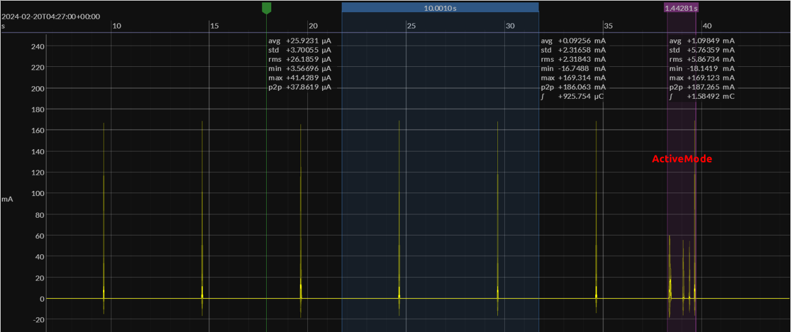
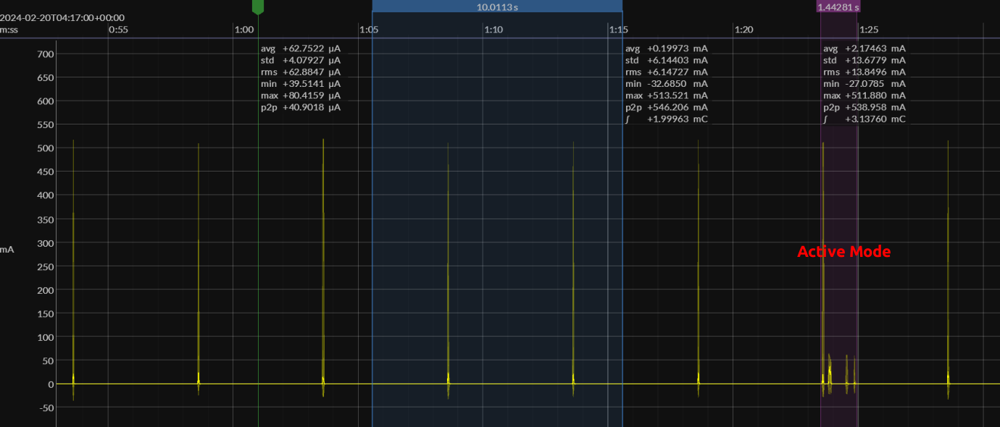

# Intermittently Connected Device (ICD)

This example creates a Matter ICD device using the ESP Matter data model. Currently it is available for ESP32-H2 and ESP32-C6.

See the [docs](https://docs.espressif.com/projects/esp-matter/en/latest/esp32/developing.html) for more information about building and flashing the firmware.

## 1. Additional Environment Setup

No additional setup is required.

## 2. Post Commissioning Setup

No additional setup is required.

## 3. ICD configuration options

The ICD configuration parameters can be configured in menuconfig.

```
# Enable ICD server
CONFIG_ENABLE_ICD_SERVER=y
# ICD Active mode interval(ms)
CONFIG_ICD_ACTIVE_MODE_INTERVAL_MS=1000
# ICD Active mode threshold(ms)
CONFIG_ICD_ACTIVE_MODE_THRESHOLD_MS=1000
# ICD Idle mode interval(s)
CONFIG_ICD_IDLE_MODE_INTERVAL_SEC=60
# ICD Fast Poll interval(ms)
CONFIG_ICD_FAST_POLL_INTERVAL_MS=500
# ICD Slow Poll interval(ms)
CONFIG_ICD_SLOW_POLL_INTERVAL_MS=5000
```

## 4. Power usage

The power usage will be various for different configuration parameters of ICD server.

Below are example current wave figures for ESP32-H2 Devkit-C and ESP32-C6 Devkit-C. The ICD configurations and radio TX power are list in the table.

| Parameter                 | Value  |
|---------------------------|--------|
| ICD Fast Polling Interval | 500ms  |
| ICD Slow Polling Interval | 5000ms |
| ICD Active Mode Duration  | 1000ms |
| ICD Idle Mode Duration    | 60s    |
| Radio TX Power            | 20dBm  |

Current Wave Figure for ESP32-H2:


Current Wave Figure for ESP32-C6:


**Note**: For ESP32-C6, please use ESP-IDF on branch `release/v5.1` with the commit id [931eaf7320](https://github.com/espressif/esp-idf/tree/931eaf7320b6c0b9acc9711ba4774f4f1bd3dae7).
