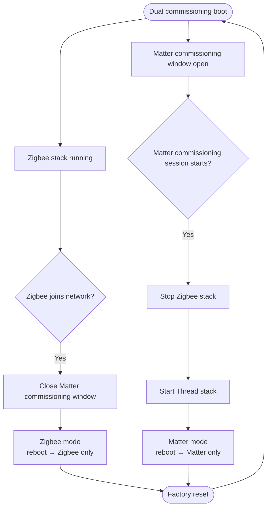

# Matter Zigbee Light

This example demonstrates **Matter-over-Thread** and **Zigbee** on a single SoC
with one physical light. It combines the [Matter extended color light](../light)
example and the
[Zigbee color dimmable light](https://github.com/espressif/esp-zigbee-sdk/tree/main/examples/home_automation_devices/color_dimmable_light)
example.

Both stacks share one LED driver. Because they share the **802.15.4 radio**,
only one of Zigbee or Thread may run at a time. The device boots into **dual
commissioning** (Matter and Zigbee both available), locks into **Matter mode**
or **Zigbee mode** once the user commissions on one path, and returns to dual
commissioning only after a **factory reset**.

## Operating modes

| Mode | When | Matter | Zigbee |
|------|------|--------|-------------------|
| **Dual commissioning** | First boot; after factory reset | Commissioning window open | Stack running, network steering |
| **Zigbee mode** | Zigbee joined, no Matter fabric | Commissioning window closed | Stack running |
| **Matter mode** | Matter fabric stored | Operational over Thread | Stack stopped |

The Runtime transitions:



## Build and flash

> **Note:** This example requires ESP-IDF **later than**
> [`73b55e8`](https://github.com/espressif/esp-idf/commit/73b55e893ffb9761f8cae911ccb05f186f03d22b).
> Use a newer IDF release or checkout a commit after that point.

Target **ESP32-H2**:

```bash
cd examples/matter_zigbee_light
idf.py set-target esp32h2
idf.py build
idf.py -p PORT flash monitor
```

See the [ESP Matter docs](https://docs.espressif.com/projects/esp-matter/en/latest/esp32h2/developing.html) for environment setup.

## Usage scenarios

### Scenario A — Commission over Zigbee

1. Flash and boot (**dual commissioning**).
2. Open the Zigbee network from your coordinator/gateway.
3. Device joins → Matter commissioning window closes.
4. Control the light from your Zigbee network.
5. Reboot → device stays in **Zigbee mode**.

### Scenario B — Commission over Matter

1. Flash and boot (**dual commissioning**).
2. Commission with a Matter controller (e.g. chip-tool, Apple Home).
3. When the commissioning session starts, Zigbee stops and Thread starts.
4. Complete commissioning; control the light over Matter/Thread.
5. Reboot → device stays in **Matter mode**.

### Scenario C — Factory reset (back to dual commissioning)

1. Long-press boot button 5 s, then release (from Matter or Zigbee mode).
2. Device erases credentials and reboots into **dual commissioning**.
3. Commission again on either path.
