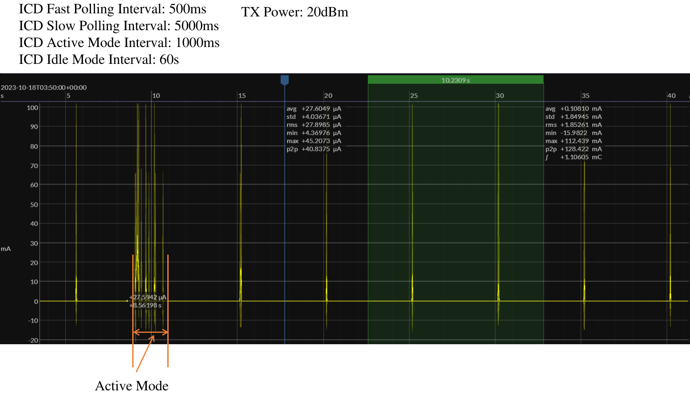

# Sleepy device

This example creates a Sleepy device using the ESP Matter
data model. Currently it can be only available for ESP32-H2.

See the [docs](https://docs.espressif.com/projects/esp-matter/en/latest/esp32/developing.html) for more information about building and flashing the firmware.

## 1. Additional Environment Setup

No additional setup is required.

## 2. Post Commissioning Setup

No additional setup is required.

## 3. ICD configuration options

The ICD configuration parameters can be configured in menuconfig.

```
# Enable ICD server
CONFIG_ENABLE_ICD_SERVER=y
# ICD Active mode interval(ms)
CONFIG_ICD_ACTIVE_MODE_INTERVAL_MS=1000
# ICD Active mode threshold(ms)
CONFIG_ICD_ACTIVE_MODE_THRESHOLD_MS=1000
# ICD Idle mode interval(s)
CONFIG_ICD_IDLE_MODE_INTERVAL_SEC=60
# ICD Fast Poll interval(ms)
CONFIG_ICD_FAST_POLL_INTERVAL_MS=500
# ICD Slow Poll interval(ms)
CONFIG_ICD_SLOW_POLL_INTERVAL_MS=5000
```

## 4. Power usage

The power usage will be various for different configuration parameters of ICD server. Below is an example current wave figure for ESP32-H2 Devkit-C. The ICD configurations and radio TX power are also on the picture.


